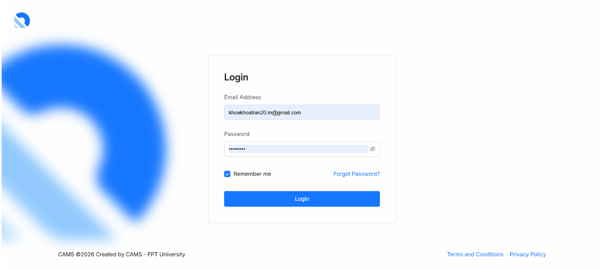
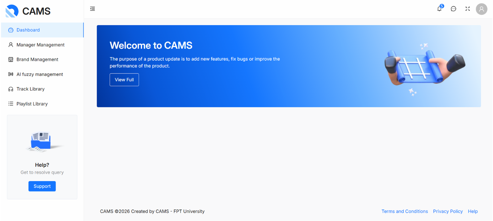
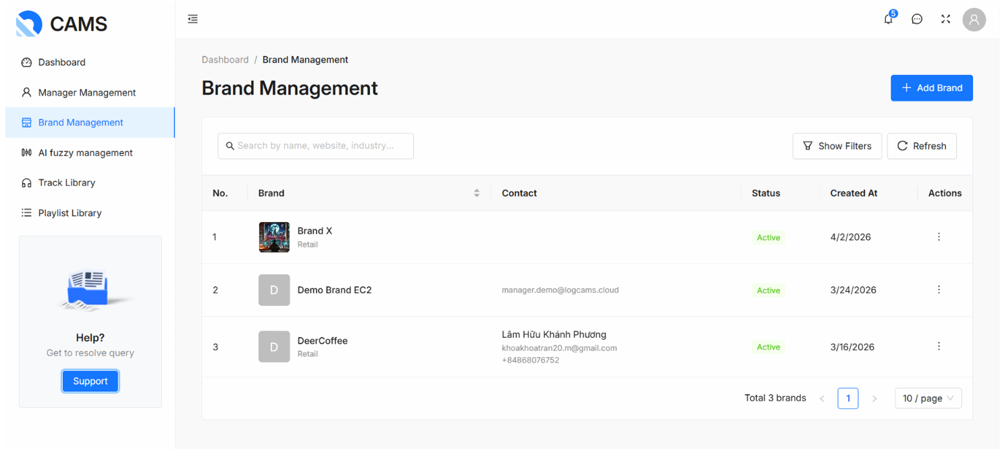
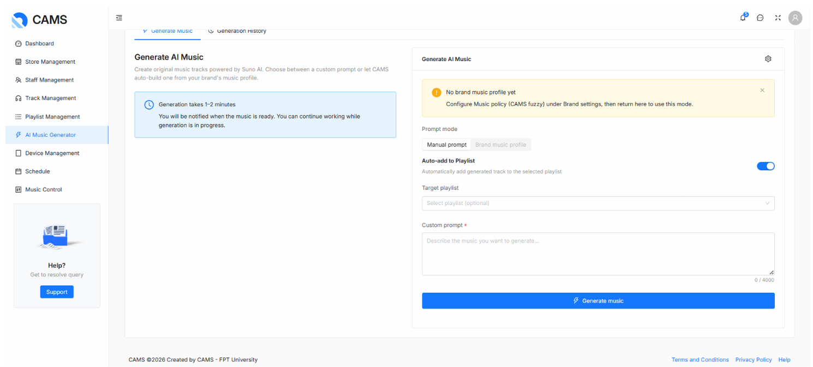
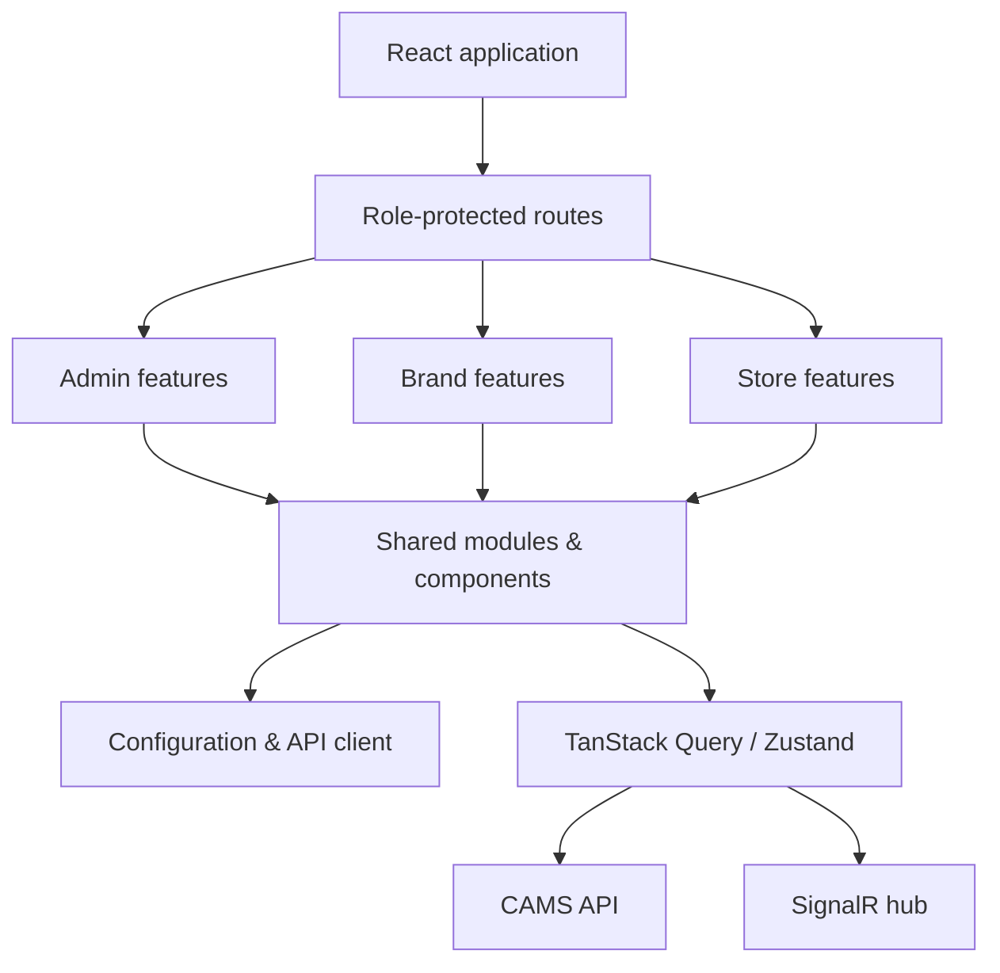

# CAMS — Context-Aware AI Music System

> A web dashboard for managing adaptive in-store music across retail brands, stores, and listening spaces.

CAMS helps retail teams shape a consistent, context-aware music experience. Through role-based dashboards, users can manage brands, stores, spaces, tracks, playlists, schedules, music policies, and AI-assisted music generation. The application consumes a separate CAMS API and presents real-time operational controls in a responsive interface.

## Screenshots

<p align="center">
  
</p>

<p align="center">
  
</p>

<p align="center">
  
</p>

<p align="center">
  
</p>

## Key capabilities

- **Role-based workspaces** for System Administrators, Brand Managers, and Store Managers.
- **Brand, store, staff, space, and device management** for multi-location operations.
- **Music library management** including tracks, playlists, metadata, HLS playback, and copyright-clearance status.
- **Scheduling and playback control** for playlists and individual spaces.
- **Context-aware music policies** using configurable fuzzy-profile settings at brand, store, and space levels.
- **AI music generation** workflows with generation history and optional automatic playlist placement.
- **Operational visibility** through dashboards, notification updates, and SignalR-based real-time events.
- **Billing and token tools** for AI-generation usage and package management.

## Technology stack

| Area                    | Technologies                                     |
| ----------------------- | ------------------------------------------------ |
| UI                      | React 19, TypeScript, Ant Design, Tailwind CSS   |
| Build tooling           | Vite 7, ESLint, Prettier, Husky, lint-staged     |
| Routing & data          | React Router 7, TanStack Query, Axios            |
| Client state            | Zustand                                          |
| Audio & visualization   | hls.js, WaveSurfer.js, AntV G2/G2Plot            |
| Realtime & integrations | Microsoft SignalR, FullCalendar, Leaflet, QRCode |

## Architecture

The frontend follows a feature-oriented, layered design. Role-specific features compose reusable domain modules and shared UI/utilities; lower layers do not depend on higher layers.



### Source layout

```text
src/
├── features/        # Role-specific pages, routes, hooks, services, and validation
│   ├── admin/       # System administration
│   ├── brand/       # Brand-level operations and AI music generation
│   ├── store/       # Store and space operations
│   ├── auth/        # Authentication
│   └── errors/      # Error pages
├── shared/          # Reusable components, domain modules, hooks, types, and utilities
├── layouts/         # Dashboard layouts for each role
├── providers/       # Authentication, theme, and query providers
├── config/          # Environment, API, UI, HLS, and query-key configuration
└── routes/          # Application-level route composition
```

For the detailed dependency rules and implementation patterns, see [ARCHITECTURE.md](ARCHITECTURE.md). API, testing, and backend-engine documentation are available under [docs/](docs/).

## Getting started

### Prerequisites

- Node.js 20 or later
- npm 10 or later
- A reachable CAMS API instance

### Installation

```bash
git clone <repository-url>
cd cams
npm install
```

### Environment configuration

Copy the example environment file and set the API URL for your environment:

```bash
cp .env.example .env.local
```

```dotenv
VITE_API_BASE_URL=http://localhost:<api-port>
VITE_APP_NAME=CAMS
VITE_APP_VERSION=1.0.0
```

Do not commit `.env.local`; it may contain environment-specific settings.

### Run locally

```bash
npm run dev
```

The Vite development server starts at `http://127.0.0.1:5173`.

For local HTTPS (for example, when testing redirect URLs), run:

```bash
npm run dev:https
```

## Available scripts

| Command              | Description                                                              |
| -------------------- | ------------------------------------------------------------------------ |
| `npm run dev`        | Start the local development server over HTTP.                            |
| `npm run dev:https`  | Start the local development server with a self-signed HTTPS certificate. |
| `npm run build`      | Type-check and create a production build.                                |
| `npm run preview`    | Preview the production build locally.                                    |
| `npm run type-check` | Run TypeScript type checking without emitting files.                     |
| `npm run lint`       | Run ESLint with zero warnings allowed.                                   |
| `npm run lint:fix`   | Automatically fix ESLint issues where possible.                          |
| `npm run format`     | Format source files with Prettier.                                       |

## User roles

| Role                 | Primary responsibilities                                                                                  |
| -------------------- | --------------------------------------------------------------------------------------------------------- |
| System Administrator | Manage accounts, brands, global configuration, shared media, billing packages, and IoT oversight.         |
| Brand Manager        | Manage brand stores and staff, music libraries, schedules, policies, token usage, and AI-generated music. |
| Store Manager        | Manage store spaces, local playlists and tracks, schedules, playback, and store-level configuration.      |

## Documentation

- [Frontend architecture guide](ARCHITECTURE.md)
- [CAMS system design and API notes](docs/cams/SDD_CAMS.md)
- [CAMS API reference](docs/cams/API_CAMS.md)
- [CAMS engine documentation](docs/cams-engine/README.md)
- [Track-service design](docs/tracks/SDD_Tracks.md)

## License

This project is licensed under the [MIT License](LICENSE).
