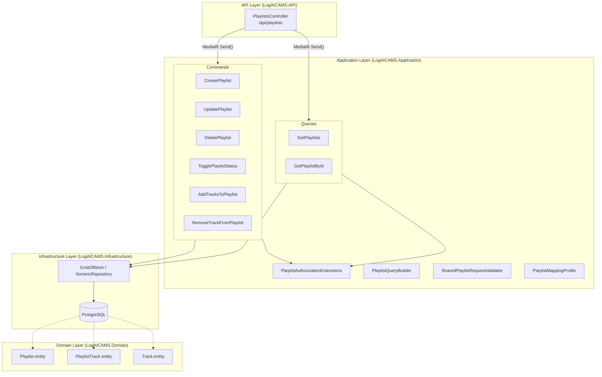
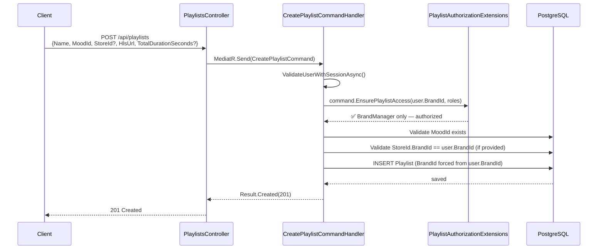
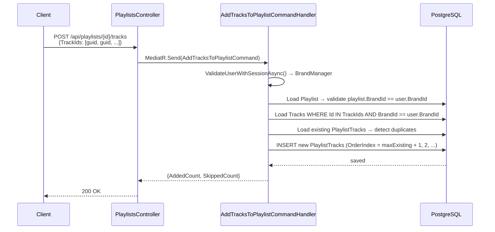
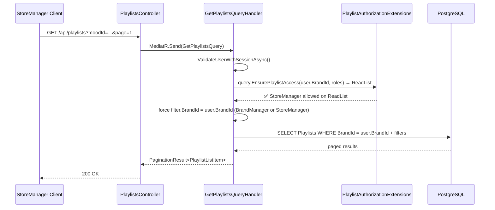

# DEV PLAN 01 — Playlist Management API

> Pattern reference: Track module (`Features/Tracks/`, `TrackAuthorizationExtensions`, `TrackQueryBuilder`).

---

## System Architecture



---

## Data Flow — Create Playlist



---

## Data Flow — Add Tracks to Playlist



---

## Data Flow — GetPlaylists (StoreManager scoped)



---

## Files to Create

### DTOs — `src/LogAICAMS.Application/Common/DTOs/Playlist/`

| File | Fields |
|------|--------|
| `PlaylistRequest.cs` | `Name`, `MoodId?`, `StoreId?`, `Description?`, `IsDynamic?`, `IsDefault?`, `HlsUrl`, `TotalDurationSeconds?` |
| `PlaylistFilter.cs` | extends `BasePaginationFilter` — `BrandId?`, `StoreId?`, `MoodId?`, `IsDynamic?`, `IsDefault?`, `SortBy` |
| `PlaylistListItem.cs` | `Id`, `Name`, `MoodName`, `StoreName?`, `HlsUrl`, `TotalDurationSeconds`, `IsDynamic`, `IsDefault`, `TrackCount`, `Status` |
| `PlaylistDetailResponse.cs` | all fields above + `List<PlaylistTrackItem> Tracks` |
| `PlaylistTrackItem.cs` | `TrackId`, `Title`, `Artist`, `DurationSec`, `OrderIndex`, `CoverImageUrl` |
| `AddTracksToPlaylistRequest.cs` | `List<Guid> TrackIds` |

### Application Extensions & Helpers

| File | Path | Copy pattern from |
|------|------|-------------------|
| `IPlaylistRequest.cs` | `Common/Interfaces/` | `ITrackRequest.cs` |
| `PlaylistAuthorizationExtensions.cs` | `Common/Extensions/` | `TrackAuthorizationExtensions.cs` |
| `PlaylistQueryBuilder.cs` | `Common/QueryBuilders/` | `TrackQueryBuilder.cs` |
| `SharedPlaylistRequestValidator.cs` | `Common/Validators/` | `SharedTrackRequestValidator.cs` |
| `PlaylistMappingProfile.cs` | `Common/Mappings/` | `TrackMappingProfile.cs` |

### Commands — `src/LogAICAMS.Application/Features/Playlists/Commands/`

| Folder | Files |
|--------|-------|
| `CreatePlaylist/` | `CreatePlaylistCommand.cs`, `CreatePlaylistCommandHandler.cs`, `CreatePlaylistCommandValidator.cs` |
| `UpdatePlaylist/` | `UpdatePlaylistCommand.cs`, `UpdatePlaylistCommandHandler.cs`, `UpdatePlaylistCommandValidator.cs` |
| `DeletePlaylist/` | `DeletePlaylistCommand.cs`, `DeletePlaylistCommandHandler.cs` |
| `TogglePlaylistStatus/` | `TogglePlaylistStatusCommand.cs`, `TogglePlaylistStatusCommandHandler.cs` |
| `AddTracksToPlaylist/` | `AddTracksToPlaylistCommand.cs`, `AddTracksToPlaylistCommandHandler.cs` |
| `RemoveTrackFromPlaylist/` | `RemoveTrackFromPlaylistCommand.cs`, `RemoveTrackFromPlaylistCommandHandler.cs` |

### Queries — `src/LogAICAMS.Application/Features/Playlists/Queries/`

| Folder | Files |
|--------|-------|
| `GetPlaylists/` | `GetPlaylistsQuery.cs`, `GetPlaylistsQueryHandler.cs` |
| `GetPlaylistById/` | `GetPlaylistByIdQuery.cs`, `GetPlaylistByIdQueryHandler.cs` |

### Controller

`src/LogAICAMS.API/Controllers/Cms/PlaylistsController.cs`

---

## Authorization Matrix

| Endpoint | SystemAdmin | BrandManager | StoreManager |
|----------|:-----------:|:------------:|:------------:|
| GET /api/playlists | ✅ all brands | ✅ own brand | ✅ own brand |
| GET /api/playlists/{id} | ✅ | ✅ own brand | ✅ own brand |
| POST /api/playlists | ❌ | ✅ | ❌ |
| PUT /api/playlists/{id} | ❌ | ✅ own brand | ❌ |
| DELETE /api/playlists/{id} | ❌ | ✅ own brand | ❌ |
| PATCH /api/playlists/{id}/toggle-status | ❌ | ✅ own brand | ❌ |
| POST /api/playlists/{id}/tracks | ❌ | ✅ own brand | ❌ |
| DELETE /api/playlists/{id}/tracks/{trackId} | ❌ | ✅ own brand | ❌ |

> **Rule:** `BrandId` always forced from `user.BrandId` inside handler — never trusted from request body. StoreManager gets read-only to support override selection UI (DEV-PLAN-02).

---

## Business Rules

1. **`HlsUrl` validation** — must end with `.m3u8` (same check as `HlsPlaylistInfo.IsValidHlsUrl`)
2. **`TotalDurationSeconds`** — required for `PlaylistTransitionJob` lifecycle timer; log warning if null
3. **`DeletePlaylist` guard** — throw `BusinessRuleViolationException` if `SpaceMusicState.CurrentPlaylistId == playlist.Id` (playlist is actively streaming)
4. **`PlaylistTrack.OrderIndex`** — auto-assigned: `maxExistingOrderIndex + 1` per track added
5. **`BrandId`** — always overridden from `user.BrandId` on Create; ownership checked on Update/Delete
6. **Deduplication** — `AddTracksToPlaylist` skips tracks already in playlist (return `SkippedCount`)

---

## Resx Localization Additions

### `ValidationMessages.resx` / `.vi.resx`
| Key | EN | VI |
|-----|----|----|
| `Field_Playlist_Name` | Name | Tên playlist |
| `Field_Playlist_MoodId` | Mood | Tâm trạng |
| `Field_Playlist_HlsUrl` | HLS URL | Đường dẫn HLS |
| `Field_Playlist_TotalDurationSeconds` | Total Duration (seconds) | Tổng thời lượng (giây) |
| `Playlist_HlsUrl_MustEndWithM3u8` | HLS URL must end with .m3u8 | Đường dẫn HLS phải kết thúc bằng .m3u8 |

### `ErrorMessages.resx` / `.vi.resx`
| Key | EN | VI |
|-----|----|----|
| `Exception_Playlist_Delete_ActiveInSpace` | Cannot delete a playlist that is currently streaming in a space | Không thể xóa playlist đang được phát trong không gian |

---

## Verification Steps

```powershell
# 1. Build
dotnet build src/LogAICAMS.API/LogAICAMS.API.csproj -v minimal | Select-String "error CS|succeeded"

# 2. Swagger: POST /api/playlists as BrandManager → 201 Created
# 3. Swagger: GET /api/playlists as StoreManager → only own brand playlists
# 4. Swagger: POST /api/playlists/{id}/tracks → check PlaylistTracks rows in DB
# 5. Swagger: DELETE playlist that is active in SpaceMusicState → expect 409 Conflict
```
