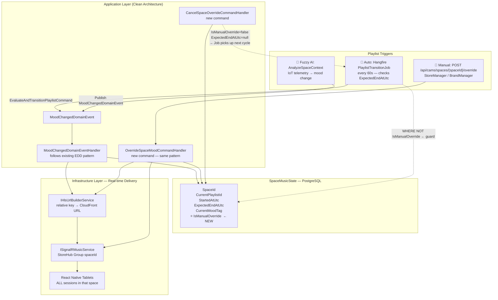
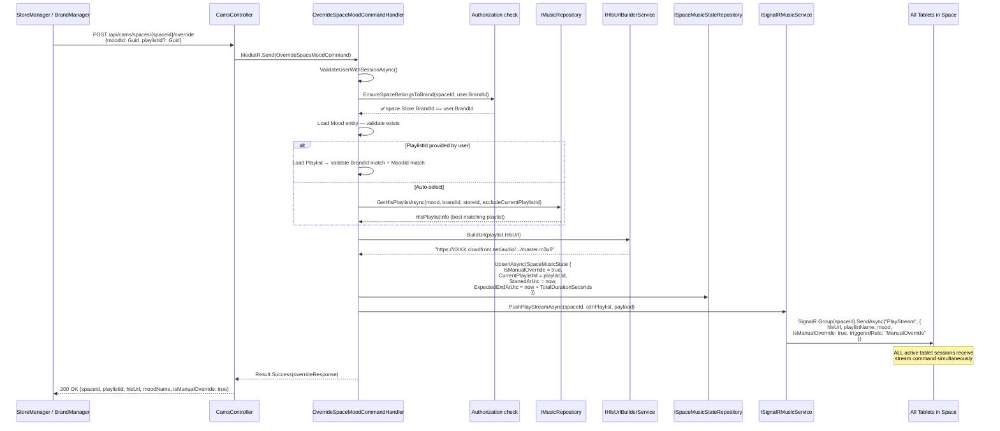
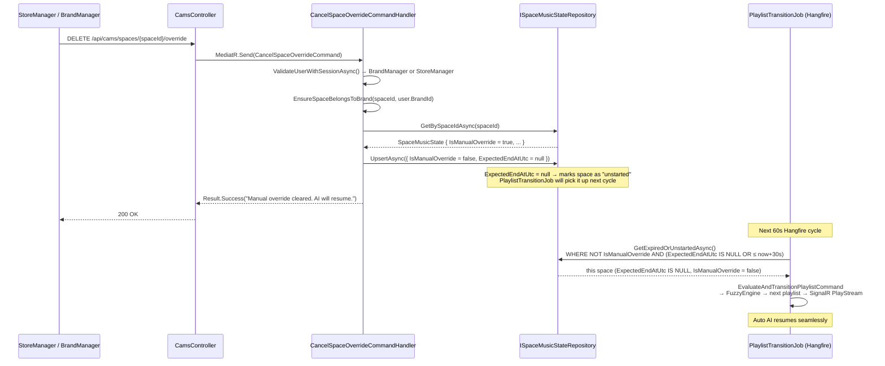
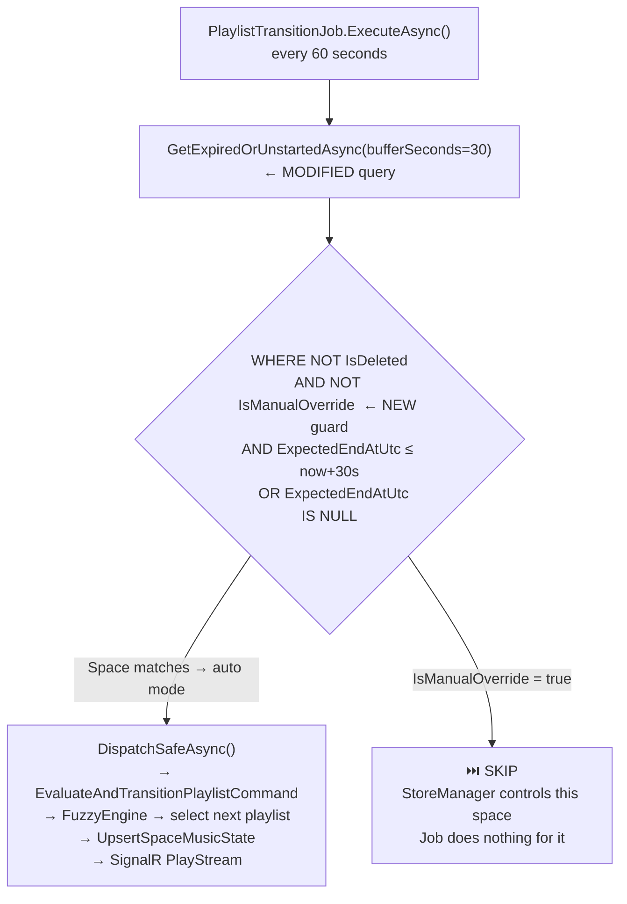

# DEV PLAN 02 — StoreManager Manual Override

> Allows BrandManager / StoreManager to manually force a mood + playlist for a specific Space,
> bypassing the Fuzzy AI engine. `IsManualOverride = true` on `SpaceMusicState` blocks
> `PlaylistTransitionJob` from auto-selecting the next playlist until override is cleared.

---

## System Architecture — Override vs Auto Pipeline



---

## Sequence — StoreManager Override



---

## Sequence — Cancel Override (Resume AI)



---

## PlaylistTransitionJob — Override Guard Logic



---

## Domain Change — `SpaceMusicState`

```csharp
// src/LogAICAMS.Domain/Entities/SpaceMusicState.cs
// ADD one field:
public bool IsManualOverride { get; set; } = false;
```

**EF Core Migration (run once):**
```powershell
cd d:\MyLearning\Ky9\SEP\Log.AI-CAMS\Log.AI-CAMS-v2

dotnet ef migrations add AddIsManualOverrideToSpaceMusicState `
  -p src/LogAICAMS.Infrastructure `
  -s src/LogAICAMS.API

dotnet ef database update -s src/LogAICAMS.API
```

---

## Files to Create

### New Command Files

| Folder | File |
|--------|------|
| `Features/CAMS/Commands/OverrideSpaceMood/` | `OverrideSpaceMoodCommand.cs` |
| `Features/CAMS/Commands/OverrideSpaceMood/` | `OverrideSpaceMoodCommandHandler.cs` |
| `Features/CAMS/Commands/OverrideSpaceMood/` | `OverrideSpaceMoodCommandValidator.cs` |
| `Features/CAMS/Commands/CancelSpaceOverride/` | `CancelSpaceOverrideCommand.cs` |
| `Features/CAMS/Commands/CancelSpaceOverride/` | `CancelSpaceOverrideCommandHandler.cs` |

### New DTO

| File | Path | Fields |
|------|------|--------|
| `SpaceOverrideResponse.cs` | `Common/DTOs/CAMS/` | `SpaceId`, `PlaylistId`, `PlaylistName`, `HlsUrl`, `MoodName`, `IsManualOverride`, `StartedAtUtc`, `ExpectedEndAtUtc` |
| `OverrideSpaceMoodRequest.cs` | `Common/DTOs/CAMS/` | `MoodId: Guid`, `PlaylistId?: Guid` |

---

## Files to Modify

| File | Change |
|------|--------|
| `SpaceMusicState.cs` | + `bool IsManualOverride { get; set; } = false;` |
| `SpaceMusicStateRepository.cs` | `GetExpiredOrUnstartedAsync()`: add `&& !s.IsManualOverride`; `UpsertAsync()`: copy `IsManualOverride` field |
| `CamsController.cs` | + `POST /spaces/{spaceId}/override`, + `DELETE /spaces/{spaceId}/override` |
| `ISignalRMusicService.cs` | + overload `PushPlayStreamAsync(Guid spaceId, HlsPlaylistInfo, string triggeredRule, string reason, CancellationToken)` for override path (no domain event) |
| `SignalRMusicService.cs` | implement new overload |

---

## New CamsController Endpoints

```
POST   /api/cams/spaces/{spaceId}/override   [BrandManager, StoreManager]
Body:  { "moodId": "guid", "playlistId": "guid (optional)" }
→ Returns SpaceOverrideResponse

DELETE /api/cams/spaces/{spaceId}/override   [BrandManager, StoreManager]
→ Returns Result.Success message
```

---

## SignalR Payload — Override vs Auto (tablet receives same event name)

```json
{
  "spaceId": "3fa85f64-...",
  "hlsUrl": "https://dXXX.cloudfront.net/audio/brand-a/chill/master.m3u8",
  "playlistName": "Chill Morning",
  "mood": "Calm",
  "bpmMin": 60,
  "bpmMax": 90,
  "isManualOverride": true,
  "triggeredRule": "ManualOverride",
  "reason": "StoreManager selected mood manually",
  "occurredAtUtc": "2026-03-05T08:00:00Z"
}
```

> Tablet nhận event `"PlayStream"` — cùng tên với auto push. Field `isManualOverride` để tablet UI hiển thị badge "Manual Mode" nếu cần.

---

## SpaceMusicStateRepository — UpsertAsync change

```csharp
// Existing UpsertAsync — ADD this line when copying fields to existing row:
existing.IsManualOverride = state.IsManualOverride;
```

## GetExpiredOrUnstartedAsync — WHERE clause change

```csharp
// BEFORE:
.Where(s => !s.IsDeleted && (s.ExpectedEndAtUtc == null || s.ExpectedEndAtUtc <= cutoff))

// AFTER:
.Where(s => !s.IsDeleted
         && !s.IsManualOverride          // ← NEW: skip spaces under manual control
         && (s.ExpectedEndAtUtc == null || s.ExpectedEndAtUtc <= cutoff))
```

---

## Verification Steps

```powershell
# 1. Create migration
dotnet ef migrations add AddIsManualOverrideToSpaceMusicState -p src/LogAICAMS.Infrastructure -s src/LogAICAMS.API

# 2. Build
dotnet build src/LogAICAMS.API/LogAICAMS.API.csproj -v minimal | Select-String "error CS|succeeded"

# 3. docker-compose up --build -d

# 4. POST /api/cams/spaces/{spaceId}/override → expect 200 + SignalR push
# 5. Check SpaceMusicStates table: IsManualOverride = true
# 6. Wait 60+ seconds → confirm PlaylistTransitionJob does NOT change the space
# 7. DELETE /api/cams/spaces/{spaceId}/override → IsManualOverride = false
# 8. Wait 60s → confirm Hangfire resumes auto AI selection
```
