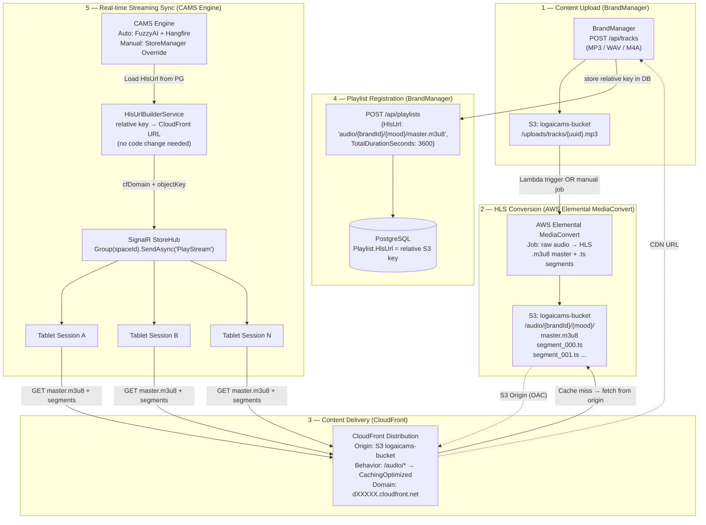
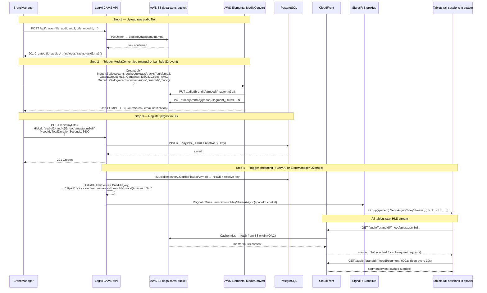
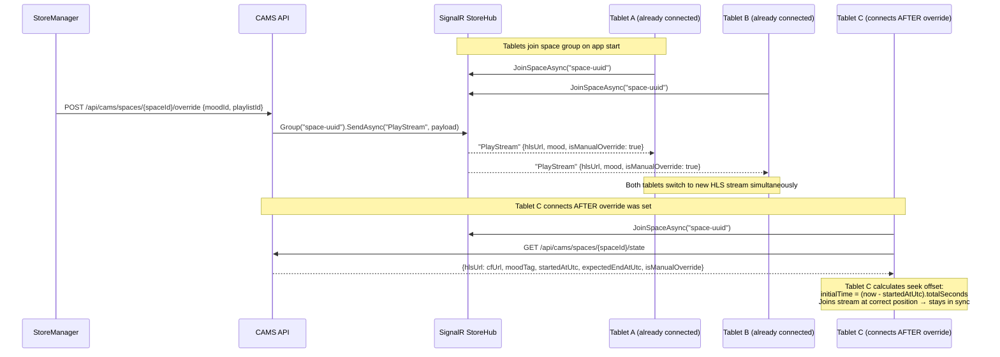
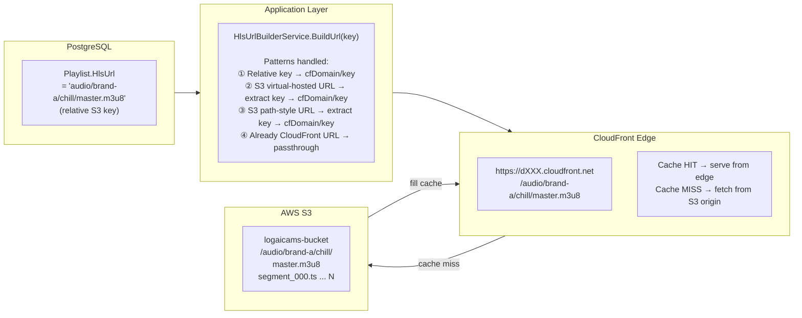

# DEV PLAN 03 — HLS Streaming: CloudFront + MediaConvert + Session Sync

> Pipeline hoàn chỉnh: upload audio thô → AWS Elemental MediaConvert → HLS segments trên S3
> → CloudFront CDN phân phối → SignalR đồng bộ realtime tới tất cả tablet session của store.
> Không cần thay đổi code `HlsUrlBuilderService` — chỉ cần cập nhật `.env` với domain CloudFront thật.

---

## System Architecture Overview



---

## Sequence — Full End-to-End: Upload → Register → Stream



---

## Session Synchronization — All Tablets Stay in Sync



---

## HLS Streaming — Data Flow Diagram



---

## AWS MediaConvert — Job Configuration Reference

### Input / Output Mapping

```
Input:   s3://logaicams-bucket/uploads/tracks/{uuid}.mp3
Output:  s3://logaicams-bucket/audio/{brandId}/{moodSlug}/
         ├── master.m3u8           ← HLS master playlist (stored in DB)
         ├── segment_000.ts        ← 10s audio chunk
         ├── segment_001.ts
         └── ... (N segments)
```

### Key Job Settings

| Parameter | Value | Notes |
|-----------|-------|-------|
| Output Group Type | `HLS_GROUP_SETTINGS` | |
| Segment Length | `10` seconds | Standard for audio streaming |
| Playlist Type | `VOD` | Not LIVE — full file |
| Container | `M3U8` | HLS container |
| Audio Codec | `AAC` | Universal tablet compatibility |
| Audio Bitrate | `128000` bps | Quality vs bandwidth balance |
| Output Region | `ap-southeast-1` | Same as S3 bucket |
| Storage Class | `STANDARD` | Or INTELLIGENT_TIERING for cost |

### MediaConvert IAM Role

```json
{
  "Version": "2012-10-17",
  "Statement": [
    {
      "Effect": "Allow",
      "Action": ["s3:GetObject"],
      "Resource": "arn:aws:s3:::logaicams-bucket/uploads/*"
    },
    {
      "Effect": "Allow",
      "Action": ["s3:PutObject"],
      "Resource": "arn:aws:s3:::logaicams-bucket/audio/*"
    }
  ]
}
```

---

## CloudFront Distribution Setup

### `.env` — Update after receiving domain from teammate

```env
AwsCdn__CloudFrontDomain=https://dXXXXXXXXXXXX.cloudfront.net   # ← replace with real domain
AwsCdn__S3BucketName=logaicams-bucket
AwsCdn__S3Region=ap-southeast-1
```

### CloudFront Cache Behaviors

| Path Pattern | Cache Policy | Notes |
|-------------|--------------|-------|
| `/audio/*` | `Managed-CachingOptimized` | HLS segments + manifests cached at edge |
| `Default (*)` | `Managed-CachingDisabled` | Private uploads — never cache |

### S3 Bucket Policy — OAC (Origin Access Control, recommended)

```json
{
  "Version": "2012-10-17",
  "Statement": [{
    "Sid": "AllowCloudFrontOAC",
    "Effect": "Allow",
    "Principal": {
      "Service": "cloudfront.amazonaws.com"
    },
    "Action": "s3:GetObject",
    "Resource": "arn:aws:s3:::logaicams-bucket/audio/*",
    "Condition": {
      "StringEquals": {
        "AWS:SourceArn": "arn:aws:cloudfront::{ACCOUNT_ID}:distribution/{DISTRIBUTION_ID}"
      }
    }
  }]
}
```

> **OAC vs Public Bucket:** OAC = CloudFront là gateway duy nhất vào S3. Tablet không thể bypass CDN để truy cập S3 trực tiếp. Đây là cách bảo mật chuẩn — không cần public bucket.

---

## HlsUrlBuilderService — Không cần thay đổi code

Service hiện tại đã xử lý đầy đủ 4 format URL:

```
① "audio/brand-a/chill/master.m3u8"                              → cfDomain/audio/brand-a/chill/master.m3u8  ✅
② "https://bucket.s3.region.amazonaws.com/audio/path/master.m3u8" → cfDomain/audio/path/master.m3u8           ✅
③ "https://s3.region.amazonaws.com/bucket/audio/path/master.m3u8" → cfDomain/audio/path/master.m3u8           ✅
④ "https://dXXX.cloudfront.net/audio/path/master.m3u8"            → passthrough unchanged                     ✅
```

**Action:** Chỉ cần cập nhật `AwsCdn__CloudFrontDomain` trong `.env` với domain thật từ teammate.

---

## Tablet Catch-up Logic — New REST Endpoint

Khi tablet kết nối sau khi stream đã đang chạy, nó cần biết:
1. HLS URL hiện tại
2. Thời điểm bắt đầu (`startedAtUtc`) → tính `initialTime` để seek đúng vị trí

### Endpoint mới (thêm vào `CamsController`)

```
GET /api/cams/spaces/{spaceId}/state

Response:
{
  "spaceId": "...",
  "currentPlaylistId": "...",
  "hlsUrl": "https://dXXX.cloudfront.net/audio/.../master.m3u8",
  "moodTag": "Chill",
  "startedAtUtc": "2026-03-05T08:00:00Z",
  "expectedEndAtUtc": "2026-03-05T09:00:00Z",
  "isManualOverride": false
}
```

### Tablet seek calculation (React Native)

```typescript
const seekOffset = (Date.now() - new Date(state.startedAtUtc).getTime()) / 1000;
await TrackPlayer.seekTo(seekOffset);
```

---

## End-to-End Verification

```powershell
# 1. Confirm HLS files on S3 after MediaConvert
aws s3 ls s3://logaicams-bucket/audio/ --recursive --region ap-southeast-1

# 2. Test CloudFront serves the manifest
curl -I "https://dXXX.cloudfront.net/audio/{brandId}/{mood}/master.m3u8"
# Expected: HTTP/2 200, content-type: application/vnd.apple.mpegurl

# 3. Test cache behavior (second request should be x-cache: Hit)
curl -I "https://dXXX.cloudfront.net/audio/{brandId}/{mood}/master.m3u8"
# Expected: x-cache: Hit from cloudfront

# 4. Register playlist via API
# POST /api/playlists {HlsUrl: "audio/{brandId}/{mood}/master.m3u8", ...}

# 5. Trigger override
# POST /api/cams/spaces/{spaceId}/override {moodId, playlistId}

# 6. Verify SignalR push (browser devtools Console on a connected client)
# connection.on("PlayStream", data => console.log(data.hlsUrl));
# Expected: "https://dXXX.cloudfront.net/audio/.../master.m3u8"

# 7. Open master.m3u8 URL in VLC or browser HLS player → audio should play
```

---

## Implementation Order (Cross-plan dependencies)

```mermaid
gantt
    title Implementation Order
    dateFormat  D
    axisFormat  Day %d

    section DEV-PLAN-01 (Playlists)
    DTOs + Interfaces          :a1, 1, 1d
    Auth Extensions + QB       :a2, after a1, 1d
    Commands (CRUD)            :a3, after a2, 2d
    Queries (Get list/byId)    :a4, after a3, 1d
    PlaylistsController        :a5, after a4, 1d
    Add/Remove Tracks          :a6, after a5, 1d

    section DEV-PLAN-02 (Override)
    SpaceMusicState migration  :b1, after a1, 1d
    Repo changes (guard)       :b2, after b1, 1d
    OverrideSpaceMood command  :b3, after b2, 1d
    CancelSpaceOverride cmd    :b4, after b3, 1d
    CamsController endpoints   :b5, after b4, 1d

    section DEV-PLAN-03 (AWS)
    MediaConvert job setup     :c1, 1, 2d
    S3 + CloudFront OAC policy :c2, after c1, 1d
    Update .env CloudFront URL :c3, after c2, 1d
    GET /spaces/{id}/state     :c4, after b5, 1d
    E2E verification           :c5, after c4, 1d
```


