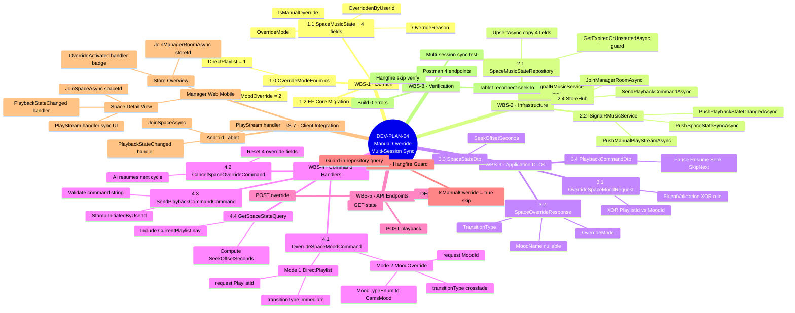
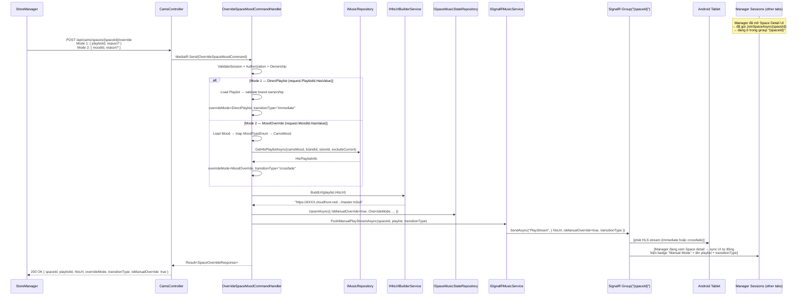
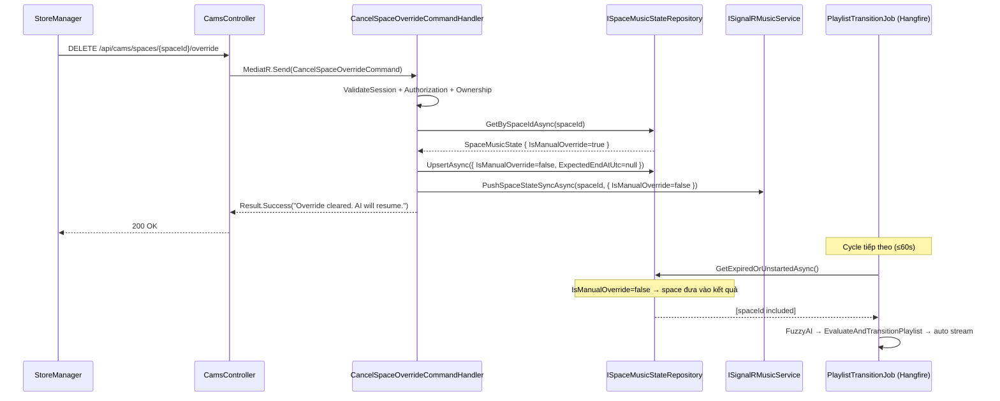
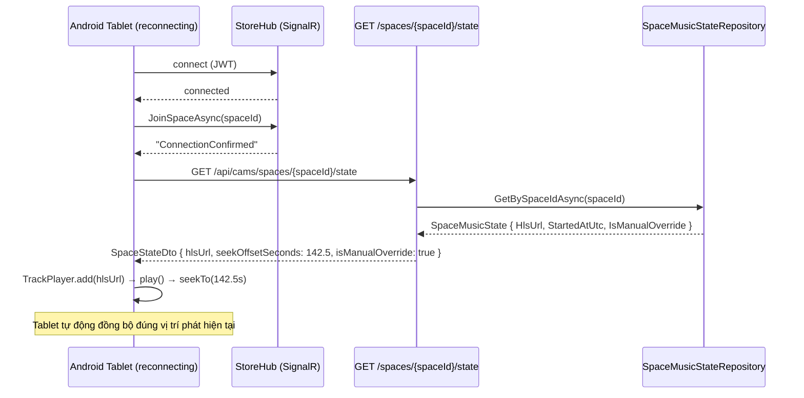

# DEV PLAN 04 — Manual Streaming Override & Multi-Session Sync

> Cho phép BrandManager / StoreManager chủ động chọn mood hoặc playlist cho từng Space,
> phát stream qua CloudFront (HLS). Mọi session đang đăng nhập (tablet Android + manager web/mobile)
> đồng bộ trạng thái real-time qua SignalR. **Đơn vị phát nhỏ nhất là Space** — mỗi Space có
> một thiết bị Android riêng, join vào SignalR group `{spaceId}`.

---

## 1. Tổng quan kiến trúc (Top-Down)

```
BrandManager / StoreManager
        │
        ▼  REST API (POST / DELETE / PATCH)
   CamsController ── MediatR ──► Command Handlers (Application layer)
                                        │
                          ┌─────────────┼──────────────────┐
                          ▼             ▼                   ▼
                 SpaceMusicState   IMusicRepository   ISignalRMusicService
                 (PostgreSQL)      (Playlist lookup)  (SignalR push)
                          │                                  │
                          │                                  ▼
                          │                       StoreHub (WebSocket)
                          │                        Group("{spaceId}")
                          │                                  │
                          └──── PlaylistTransitionJob ───── ▼
                               (Hangfire, skip if          Android Tablet
                                IsManualOverride = true)   (ONE per Space)
```

### Luồng đồng bộ nhiều session

```
[Manager mở Space Detail UI]
StoreManager Browser Tab 1 ──┐
StoreManager Browser Tab 2 ──┼── JoinSpaceAsync("{spaceId}") → join group "{spaceId}"
StoreManager Mobile App ─────┘   (cùng group với Tablet của Space đó)
                              │
                              │   POST /api/cams/spaces/{spaceId}/override
                              ▼
                   OverrideSpaceMoodCommandHandler
                              │
                ┌─────────────┴──────────────────────────┐
                ▼                                         ▼
     SpaceMusicState.IsManualOverride=true     SignalR Group("{spaceId}")
     SpaceMusicState.CurrentPlaylistId=X              │
                                          ┌────────────┼───────────────┐
                                          ▼            ▼               ▼
                                      Android     Manager Tab 1   Manager Tab 2
                                      Tablet      (sync UI)       (sync UI)
                                      (phát HLS)  (đang xem      (đang xem
                                                   Space detail)  Space detail)
```

> **Lưu ý:** Manager chỉ nhận `PlayStream` khi đang **trong màn hình Space detail** (đã gọi `JoinSpaceAsync`). Nếu chỉ ở danh sách Store → họ join `mgr-{storeId}` via `JoinManagerRoomAsync` và chỉ nhận `OverrideActivated` / `PlaybackStateChanged`.

---

## 2. SignalR Event Reference (Server → Client)

| Event | Nhận bởi | Payload chính |
|-------|----------|---------------|
| `"PlayStream"` | Tablet + Manager *(đang xem Space detail)* | `hlsUrl, playlistName, mood, isManualOverride, seekOffsetSeconds, triggeredRule, transitionType` |
| `"PlaybackStateChanged"` | Tablet + Manager | `command, seekPositionSeconds, initiatedByUserId` |
| `"OverrideActivated"` | Manager | `spaceId, playlistId, moodName, overriddenBy` |
| `"OverrideCleared"` | Manager | `spaceId` |
| `"SpaceStateSync"` | Tablet (reconnect) | `SpaceStateDto` (full state + seekOffsetSeconds) |
| `"StopPlayback"` | Tablet | `spaceId, reason` |

---

## 3. WBS Chi Tiết

### Sơ đồ WBS tổng quan



---

### WBS-1 · Domain Changes

#### WBS-1.0 — `OverrideModeEnum.cs` (file mới)

File: `src/LogAICAMS.Domain/Enums/OverrideModeEnum.cs`

```csharp
public enum OverrideModeEnum
{
    DirectPlaylist = 1,   // Manager chọn thẳng PlaylistId → phát ngay (transitionType: "immediate")
    MoodOverride   = 2,   // Manager chọn MoodId → hệ thống chọn playlist theo mood (transitionType: "crossfade")
}
```

#### WBS-1.1 — Thêm fields vào `SpaceMusicState`

File: `src/LogAICAMS.Domain/Entities/SpaceMusicState.cs`

```csharp
/// <summary>true khi StoreManager/BrandManager đã chủ động override.</summary>
public bool IsManualOverride { get; set; } = false;

/// <summary>Mode override: DirectPlaylist (1) hoặc MoodOverride (2).</summary>
public OverrideModeEnum? OverrideMode { get; set; }

/// <summary>Lý do override (tuỳ chọn). Dùng cho audit/UX hiển thị.</summary>
public string? OverrideReason { get; set; }

/// <summary>UserId của người thực hiện override (audit trail).</summary>
public Guid? OverriddenByUserId { get; set; }
```

#### WBS-1.2 — EF Core Migration

```powershell
cd d:\MyLearning\Ky9\SEP\Log.AI-CAMS\Log.AI-CAMS-v2
.\scripts\migrations\migrate.ps1 -Action add -Name "AddIsManualOverrideToSpaceMusicState" -Context main
```

---

### WBS-2 · Infrastructure — Repository & SignalR

#### WBS-2.1 — `SpaceMusicStateRepository.cs`

**`UpsertAsync`** — copy 4 fields mới:

```csharp
existing.IsManualOverride   = state.IsManualOverride;
existing.OverrideMode       = state.OverrideMode;
existing.OverrideReason     = state.OverrideReason;
existing.OverriddenByUserId = state.OverriddenByUserId;
```

**`GetExpiredOrUnstartedAsync`** — guard Hangfire job:

```csharp
// BEFORE:
.Where(s => !s.IsDeleted && (s.ExpectedEndAtUtc == null || s.ExpectedEndAtUtc <= cutoff))

// AFTER:
.Where(s => !s.IsDeleted
         && !s.IsManualOverride   // ← skip spaces under manual control
         && (s.ExpectedEndAtUtc == null || s.ExpectedEndAtUtc <= cutoff))
```

#### WBS-2.2 — `ISignalRMusicService.cs` — thêm overloads

```csharp
// Override path — không cần MoodChangedDomainEvent
Task PushPlayStreamAsync(
    Guid spaceId,
    HlsPlaylistInfo playlist,
    string triggeredRule,
    string reason,
    bool isManualOverride,
    CancellationToken ct = default);

// Notify tất cả manager session của store về state thay đổi
Task PushSpaceStateSyncAsync(Guid spaceId, SpaceStateDto state, CancellationToken ct = default);

// Relay lệnh pause/resume/seek từ manager → tablet + manager sessions còn lại
Task PushPlaybackStateChangedAsync(Guid spaceId, PlaybackCommandDto dto, CancellationToken ct = default);
```

#### WBS-2.3 — `SignalRMusicService.cs` — implement 3 overloads trên

```csharp
// PushPlayStreamAsync (override path)
var payload = new {
    SpaceId          = spaceId,
    HlsUrl           = playlist.HlsUrl,
    PlaylistName     = playlist.Name,
    Mood             = playlist.Mood.ToString(),
    BpmMin           = playlist.BpmMin,
    BpmMax           = playlist.BpmMax,
    TriggeredRule    = triggeredRule,
    Reason           = reason,
    IsManualOverride = isManualOverride,
    OccurredAtUtc    = DateTime.UtcNow
};
await _hubContext.Clients.Group(spaceId.ToString()).SendAsync("PlayStream", payload, ct);

// PushSpaceStateSyncAsync
await _hubContext.Clients.Group(spaceId.ToString()).SendAsync("SpaceStateSync", state, ct);

// PushPlaybackStateChangedAsync
await _hubContext.Clients.Group(spaceId.ToString()).SendAsync("PlaybackStateChanged", dto, ct);
```

#### WBS-2.4 — `StoreHub.cs` — thêm methods

```csharp
/// <summary>Manager join để nhận state sync của store (group: "mgr-{storeId}").</summary>
public async Task JoinManagerRoomAsync(string storeId) { ... }

/// <summary>Manager gửi lệnh điều khiển playback — server relay về group space.</summary>
public async Task SendPlaybackCommandAsync(PlaybackCommandDto command) { ... }
```

---

### WBS-3 · Application — DTOs

#### WBS-3.1 — `OverrideSpaceMoodRequest.cs`

File: `src/LogAICAMS.Application/Common/DTOs/CAMS/OverrideSpaceMoodRequest.cs`

> **XOR rule:** phải gửi đúng 1 trong 2 field — `PlaylistId` (Mode 1) hoặc `MoodId` (Mode 2). Gửi cả 2 hoặc không gửi gì đều bị validator reject.

```csharp
public class OverrideSpaceMoodRequest
{
    /// <summary>Mode 1 — DirectPlaylist: manager chọn thẳng playlist.</summary>
    public Guid? PlaylistId { get; set; }

    /// <summary>Mode 2 — MoodOverride: manager chọn target mood, hệ thống auto-select playlist.</summary>
    public Guid? MoodId { get; set; }

    public string? Reason { get; set; }   // ghi chú của manager
}
```

**Validator (FluentValidation) — XOR rule:**
```csharp
// Exactly one of PlaylistId / MoodId must be provided
RuleFor(x => x).Must(x => x.PlaylistId.HasValue ^ x.MoodId.HasValue)
    .WithMessage("Provide exactly one of PlaylistId (Mode 1) or MoodId (Mode 2).");
```

#### WBS-3.2 — `SpaceOverrideResponse.cs`

File: `src/LogAICAMS.Application/Common/DTOs/CAMS/SpaceOverrideResponse.cs`

```csharp
public class SpaceOverrideResponse
{
    public Guid SpaceId { get; set; }
    public Guid PlaylistId { get; set; }
    public string PlaylistName { get; set; } = string.Empty;
    public string HlsUrl { get; set; } = string.Empty;
    public string? MoodName { get; set; }          // null với Mode 1 nếu playlist không gắn mood
    public OverrideModeEnum OverrideMode { get; set; }  // DirectPlaylist | MoodOverride
    public bool IsManualOverride { get; set; }
    public DateTime StartedAtUtc { get; set; }
    public DateTime? ExpectedEndAtUtc { get; set; }
    /// <summary>"immediate" (Mode 1) hoặc "crossfade" (Mode 2) — client dùng để chọn transition effect.</summary>
    public string TransitionType { get; set; } = string.Empty;
}
```

#### WBS-3.3 — `SpaceStateDto.cs` (catch-up sync khi tablet / manager reconnect)

File: `src/LogAICAMS.Application/Common/DTOs/CAMS/SpaceStateDto.cs`

```csharp
public class SpaceStateDto
{
    public Guid SpaceId { get; set; }
    public Guid? CurrentPlaylistId { get; set; }
    public string? CurrentPlaylistName { get; set; }
    public string? HlsUrl { get; set; }
    public string? MoodName { get; set; }
    public bool IsManualOverride { get; set; }
    public DateTime? StartedAtUtc { get; set; }
    public DateTime? ExpectedEndAtUtc { get; set; }
    /// <summary>(now - StartedAtUtc).TotalSeconds — tablet dùng để seekTo đúng vị trí.</summary>
    public double? SeekOffsetSeconds { get; set; }
}
```

#### WBS-3.4 — `PlaybackCommandDto.cs` (pause / resume / seek relay)

File: `src/LogAICAMS.Application/Common/DTOs/CAMS/PlaybackCommandDto.cs`

```csharp
public class PlaybackCommandDto
{
    public Guid SpaceId { get; set; }
    /// <summary>"Pause" | "Resume" | "Seek" | "SkipNext"</summary>
    public string Command { get; set; } = string.Empty;
    public double? SeekPositionSeconds { get; set; }
    public Guid? InitiatedByUserId { get; set; }
}
```

---

### WBS-4 · Application — Command Handlers

#### WBS-4.1 — `OverrideSpaceMoodCommand` + Handler + Validator

```
src/LogAICAMS.Application/Features/CAMS/Commands/OverrideSpaceMood/
├── OverrideSpaceMoodCommand.cs
├── OverrideSpaceMoodCommandHandler.cs
└── OverrideSpaceMoodCommandValidator.cs
```

**Hai kiểu override (XOR):**

| | **Mode 1 — DirectPlaylist** | **Mode 2 — MoodOverride** |
|---|---|---|
| Request field | `PlaylistId` (Guid) | `MoodId` (Guid) |
| Playlist chọn bởi | Manager | Hệ thống (AI) |
| Transition | `"immediate"` | `"crossfade"` (sliding window) |
| `OverrideMode` | `DirectPlaylist = 1` | `MoodOverride = 2` |

**Handler steps (chung):**

```
1. ValidateUserWithSessionAsync()
2. Auth check roles [BrandManager | StoreManager]
3. Load Space + include Store → ownership check
   BrandManager: space.Store.BrandId == user.BrandId
   StoreManager: space.StoreId       == user.StoreId
```

**Mode 1 — DirectPlaylist (`request.PlaylistId.HasValue`):**

```
4a. Load Playlist by PlaylistId → validate exists + brand ownership
5a. IHlsUrlBuilderService.BuildUrl(playlist.HlsUrl) → cdnUrl
6a. overrideMode   = OverrideModeEnum.DirectPlaylist
    transitionType = "immediate"
    moodName       = null (không yêu cầu mood)
```

**Mode 2 — MoodOverride (`request.MoodId.HasValue`):**

```
4b. Load Mood entity by MoodId → validate exists
5b. Map MoodTypeEnum → CamsMood:
        Calm      → CamsMood.Chill
        Focus     → CamsMood.Focus
        Energetic → CamsMood.Energetic
        Social / Romantic / Uplifting → InvalidInput (không có mapping)
6b. IMusicRepository.GetHlsPlaylistAsync(camsMood, brandId, storeId, excludeCurrentPlaylistId)
7b. IHlsUrlBuilderService.BuildUrl(playlist.HlsUrl) → cdnUrl
8b. overrideMode   = OverrideModeEnum.MoodOverride
    transitionType = "crossfade"
    moodName       = mood.Name
```

**Sau khi phân nhánh (chung):**

```
9. ISpaceMusicStateRepository.UpsertAsync({
       SpaceId              = spaceId,
       IsManualOverride     = true,
       OverrideMode         = overrideMode,
       CurrentPlaylistId    = playlist.Id,
       StartedAtUtc         = DateTime.UtcNow,
       ExpectedEndAtUtc     = DateTime.UtcNow + TimeSpan.FromSeconds(playlist.TotalDurationSeconds ?? 3600),
       CurrentMoodTag       = moodName,
       OverriddenByUserId   = userId,
       OverrideReason       = request.Reason
   })
10. ISignalRMusicService.PushManualPlayStreamAsync(spaceId, hlsInfo,
        triggeredRule: "ManualOverride",
        reason: request.Reason ?? "Manual override",
        isManualOverride: true,
        transitionType: transitionType)
11. Return Result<SpaceOverrideResponse>.Success(response)
    // response includes: OverrideMode, TransitionType, MoodName
```

#### WBS-4.2 — `CancelSpaceOverrideCommand` + Handler

```
src/LogAICAMS.Application/Features/CAMS/Commands/CancelSpaceOverride/
├── CancelSpaceOverrideCommand.cs
└── CancelSpaceOverrideCommandHandler.cs
```

**Handler steps:**

```
1-3. (Auth + ownership giống WBS-4.1)
4. ISpaceMusicStateRepository.GetBySpaceIdAsync(spaceId)
5. if state == null || !state.IsManualOverride → return already-resumed
6. UpsertAsync({
       IsManualOverride    = false,
       ExpectedEndAtUtc    = null,   ← null → PlaylistTransitionJob pick up next cycle
       OverriddenByUserId  = null,
       OverrideReason      = null
   })
7. ISignalRMusicService.PushSpaceStateSyncAsync(spaceId,
       new SpaceStateDto { IsManualOverride = false })
8. Return Result.Success("Override cleared. AI will resume.")
```

#### WBS-4.3 — `SendPlaybackCommandCommand` + Handler

```
src/LogAICAMS.Application/Features/CAMS/Commands/SendPlaybackCommand/
├── SendPlaybackCommandCommand.cs
└── SendPlaybackCommandCommandHandler.cs
```

**Handler steps:**

```
1-3. (Auth + ownership)
4. Validate Command ∈ {"Pause","Resume","Seek","SkipNext"}
5. ISignalRMusicService.PushPlaybackStateChangedAsync(spaceId, dto)
   → tablet dừng/phát; manager sessions khác sync UI
6. if Command == "SkipNext":
       dispatch OverrideSpaceMoodCommand mới (auto-select = giữ nguyên mood, null PlaylistId)
```

#### WBS-4.4 — `GetSpaceStateQuery` + Handler (REST catch-up)

```
src/LogAICAMS.Application/Features/CAMS/Queries/GetSpaceState/
├── GetSpaceStateQuery.cs
└── GetSpaceStateQueryHandler.cs
```

**Handler steps:**

```
1. Auth (BrandManager | StoreManager | Tablet token)
2. Load SpaceMusicState by spaceId (include CurrentPlaylist)
3. IHlsUrlBuilderService.BuildUrl(state.CurrentPlaylist?.HlsUrl)
4. SeekOffsetSeconds = (DateTime.UtcNow - state.StartedAtUtc)?.TotalSeconds
5. Return SpaceStateDto
```

---

### WBS-5 · API — Controller Endpoints

Thêm vào `src/LogAICAMS.API/Controllers/Cms/CamsController.cs`:

| Method | Route | Auth | Command / Query |
|--------|-------|------|----------------|
| `POST` | `/api/cams/spaces/{spaceId}/override` | BrandManager, StoreManager | `OverrideSpaceMoodCommand` |
| `DELETE` | `/api/cams/spaces/{spaceId}/override` | BrandManager, StoreManager | `CancelSpaceOverrideCommand` |
| `POST` | `/api/cams/spaces/{spaceId}/playback` | BrandManager, StoreManager | `SendPlaybackCommandCommand` |
| `GET` | `/api/cams/spaces/{spaceId}/state` | BrandManager, StoreManager | `GetSpaceStateQuery` |

---

### WBS-6 · Hangfire Job Guard

File: `src/LogAICAMS.Infrastructure/Repositories/SpaceMusicStateRepository.cs`

```csharp
// GetExpiredOrUnstartedAsync — thêm 1 điều kiện:
.Where(s => !s.IsDeleted
         && !s.IsManualOverride   // bảo vệ space đang manual
         && (s.ExpectedEndAtUtc == null || s.ExpectedEndAtUtc <= cutoff))
```

> `PlaylistTransitionJob` không cần sửa — guard nằm hoàn toàn ở repository query.

---

### WBS-7 · Android Tablet Integration Logic

```typescript
// 1. Kết nối & join space group
const connection = new HubConnectionBuilder()
    .withUrl("/hubs/store", { accessTokenFactory: () => token })
    .withAutomaticReconnect()
    .build();

await connection.start();
await connection.invoke("JoinSpaceAsync", spaceId);

// 2. Catch-up: GET state hiện tại để seek đúng vị trí
const state = await fetch(`/api/cams/spaces/${spaceId}/state`).then(r => r.json());
if (state.hlsUrl) {
    await TrackPlayer.add({ url: state.hlsUrl, type: TrackType.HLS });
    await TrackPlayer.play();
    if (state.seekOffsetSeconds) await TrackPlayer.seekTo(state.seekOffsetSeconds);
}

// 3. Lắng nghe event từ server
connection.on("PlayStream", async (data) => {
    await TrackPlayer.reset();
    await TrackPlayer.add({ url: data.hlsUrl, type: TrackType.HLS });
    await TrackPlayer.play();
    if (data.seekOffsetSeconds) await TrackPlayer.seekTo(data.seekOffsetSeconds);
    showOverrideBadge(data.isManualOverride);
});

connection.on("PlaybackStateChanged", (cmd) => {
    if (cmd.command === "Pause")  TrackPlayer.pause();
    if (cmd.command === "Resume") TrackPlayer.play();
    if (cmd.command === "Seek")   TrackPlayer.seekTo(cmd.seekPositionSeconds);
});

connection.on("StopPlayback", () => TrackPlayer.stop());
connection.on("SpaceStateSync", (state) => { /* refresh UI */ });
```

**Manager Web/Mobile session:**

```typescript
// ── Khi manager mở Space Detail View ──────────────────────────────────────
// Manager join cùng group {spaceId} với tablet → nhận PlayStream như tablet
await connection.invoke("JoinSpaceAsync", spaceId);

// Catch-up: lấy state hiện tại (giống tablet)
const state = await fetch(`/api/cams/spaces/${spaceId}/state`).then(r => r.json());
updateSpaceDetailUI(state); // hiển thị playlist đang phát, badge manual mode

// Nhận real-time update khi override/playlist thay đổi
connection.on("PlayStream", (data) => {
    updateSpaceDetailUI({
        hlsUrl: data.hlsUrl,
        playlistName: data.playlistName,
        isManualOverride: data.isManualOverride,
        transitionType: data.transitionType, // "immediate" | "crossfade"
    });
    if (data.isManualOverride) showManualOverrideBadge(data.reason);
});

connection.on("PlaybackStateChanged", (cmd) => syncPlaybackUI(cmd));
connection.on("SpaceStateSync",       (s)   => updateSpaceDetailUI(s));

// Khi rời khỏi Space Detail View
await connection.invoke("LeaveSpaceAsync", spaceId);

// ── Khi manager ở Store Overview (danh sách spaces) ───────────────────────
// Chỉ nhận store-level notification (không cần biết chi tiết từng space)
await connection.invoke("JoinManagerRoomAsync", storeId);

connection.on("OverrideActivated", (data) => showOverrideBadgeOnSpaceCard(data.spaceId));
connection.on("OverrideCleared",   (data) => hideOverrideBadgeOnSpaceCard(data.spaceId));
```

---

### WBS-8 · Verification Checklist

```powershell
# 1. Migration
.\scripts\migrations\migrate.ps1 -Action add -Name "AddIsManualOverrideToSpaceMusicState" -Context main

# 2. Build
cd d:\MyLearning\Ky9\SEP\Log.AI-CAMS\Log.AI-CAMS-v2
dotnet build src/LogAICAMS.API/LogAICAMS.API.csproj -v q | Select-String "error CS|succeeded"

# 3. POST /api/cams/spaces/{spaceId}/override {moodId, playlistId?}
#    → Kiểm tra SpaceMusicStates: IsManualOverride = true
#    → Kiểm tra SignalR "PlayStream" nhận trên tablet + manager sessions

# 4. Xác nhận Hangfire skip (chờ 60s → state không thay đổi)

# 5. Test multi-session sync
#    Mở 2 tab manager + 1 tablet simulator đồng thời
#    POST /api/cams/spaces/{spaceId}/playback {"command":"Pause"}
#    → Tất cả 3 connection nhận "PlaybackStateChanged"

# 6. DELETE /api/cams/spaces/{spaceId}/override
#    → IsManualOverride = false, ExpectedEndAtUtc = null
#    → Chờ 60s → Hangfire resume AI auto-select

# 7. Tablet reconnect test
#    Ngắt kết nối tablet → kết nối lại → GET /state → seekTo đúng vị trí
```

---

## 4. Sơ đồ sequence — Override Flow



---

## 5. Sơ đồ sequence — Cancel Override



---

## 6. Sơ đồ sequence — Tablet Reconnect Catch-Up



---

## 7. Thứ tự thực hiện

```
WBS-1  Domain: SpaceMusicState + 3 fields mới
  ↓
WBS-2.1  Repository: UpsertAsync copy fields + GetExpiredOrUnstartedAsync guard
  ↓
WBS-8 step 1  EF Migration: AddIsManualOverrideToSpaceMusicState
  ↓
WBS-3  DTOs: OverrideSpaceMoodRequest, SpaceOverrideResponse, SpaceStateDto, PlaybackCommandDto
  ↓
WBS-2.2–2.4  ISignalRMusicService overloads + SignalRMusicService impl + StoreHub methods
  ↓
WBS-4  Command Handlers: Override, Cancel, SendPlaybackCommand, GetSpaceState
  ↓
WBS-5  CamsController: 4 endpoints mới
  ↓
WBS-6  Hangfire guard (đã covered bởi WBS-2.1)
  ↓
WBS-8 steps 2–7  Build + Test + Verification
  ↓
WBS-7  Tablet/Manager client integration (React Native docs)
```

---

## 8. Files tạo mới

| Layer | File |
|-------|------|
| Domain | `Enums/OverrideModeEnum.cs` *(file mới)* |
| Domain | *(sửa `SpaceMusicState.cs` — thêm 4 fields)* |
| Application/DTOs | `Common/DTOs/CAMS/OverrideSpaceMoodRequest.cs` |
| Application/DTOs | `Common/DTOs/CAMS/SpaceOverrideResponse.cs` |
| Application/DTOs | `Common/DTOs/CAMS/SpaceStateDto.cs` |
| Application/DTOs | `Common/DTOs/CAMS/PlaybackCommandDto.cs` |
| Application/Commands | `Features/CAMS/Commands/OverrideSpaceMood/OverrideSpaceMoodCommand.cs` |
| Application/Commands | `Features/CAMS/Commands/OverrideSpaceMood/OverrideSpaceMoodCommandHandler.cs` |
| Application/Commands | `Features/CAMS/Commands/OverrideSpaceMood/OverrideSpaceMoodCommandValidator.cs` |
| Application/Commands | `Features/CAMS/Commands/CancelSpaceOverride/CancelSpaceOverrideCommand.cs` |
| Application/Commands | `Features/CAMS/Commands/CancelSpaceOverride/CancelSpaceOverrideCommandHandler.cs` |
| Application/Commands | `Features/CAMS/Commands/SendPlaybackCommand/SendPlaybackCommandCommand.cs` |
| Application/Commands | `Features/CAMS/Commands/SendPlaybackCommand/SendPlaybackCommandCommandHandler.cs` |
| Application/Queries | `Features/CAMS/Queries/GetSpaceState/GetSpaceStateQuery.cs` |
| Application/Queries | `Features/CAMS/Queries/GetSpaceState/GetSpaceStateQueryHandler.cs` |

## 9. Files sửa

| File | Thay đổi |
|------|----------|
| `SpaceMusicState.cs` | + `IsManualOverride`, `OverrideMode`, `OverrideReason`, `OverriddenByUserId` |
| `SpaceMusicStateRepository.cs` | `UpsertAsync` copy fields; `GetExpiredOrUnstartedAsync` thêm guard |
| `ISignalRMusicService.cs` | + 3 overloads mới |
| `SignalRMusicService.cs` | implement 3 overloads |
| `StoreHub.cs` | + `JoinManagerRoomAsync`, `SendPlaybackCommandAsync` |
| `CamsController.cs` | + 4 endpoints |
