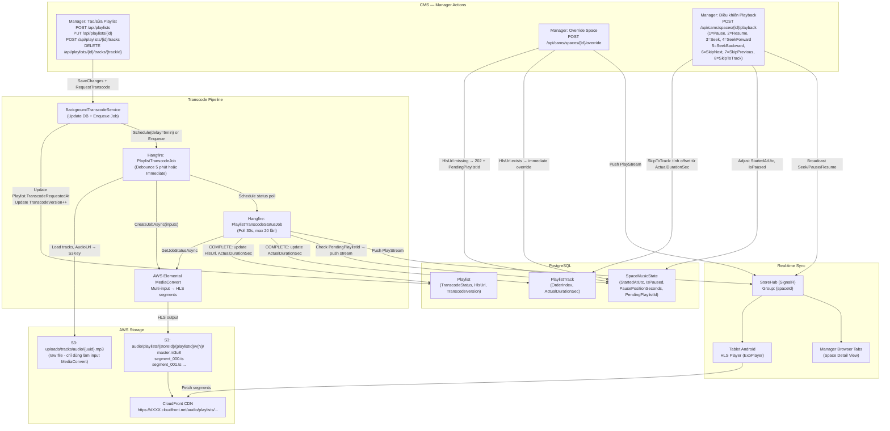
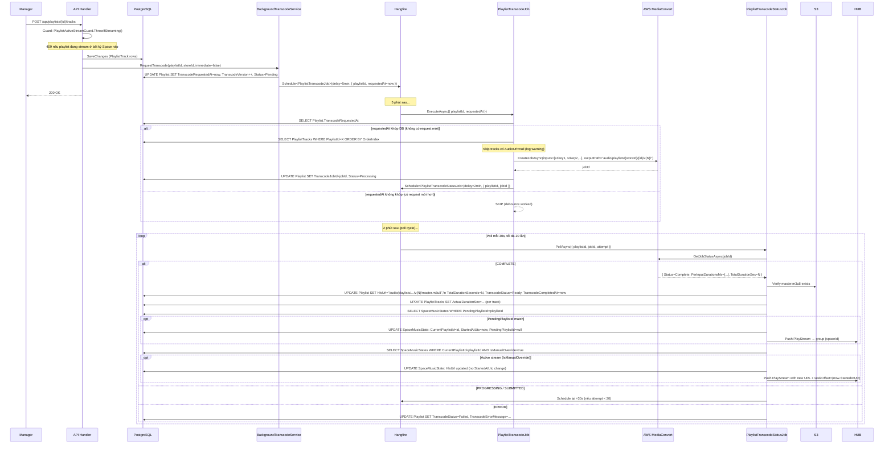
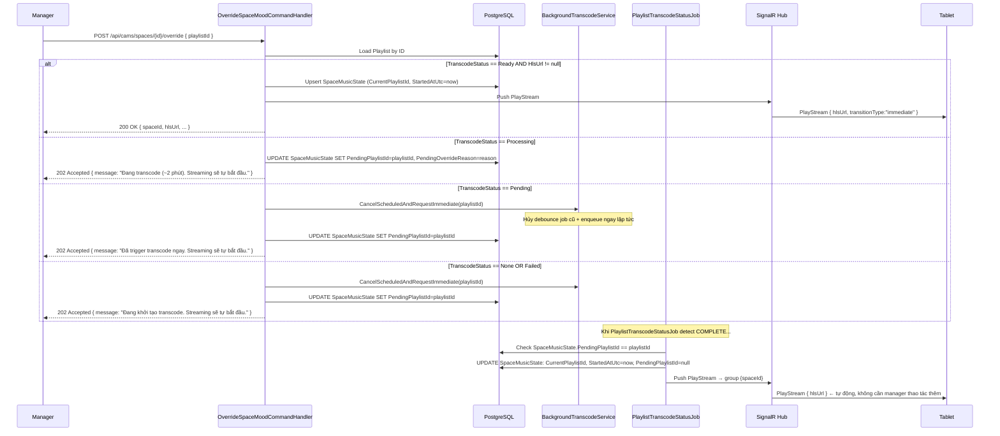
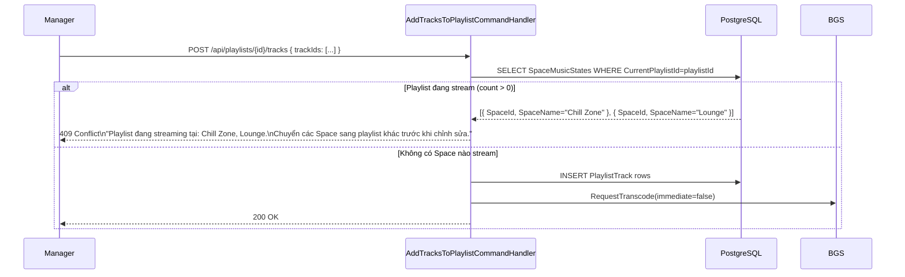
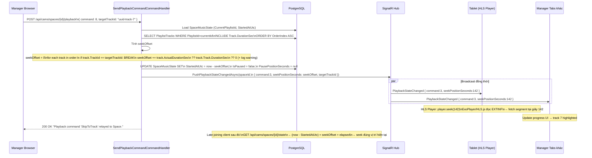
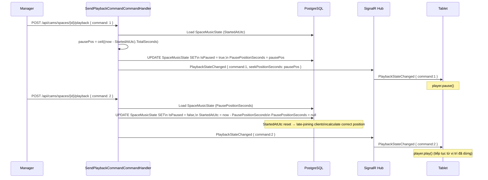
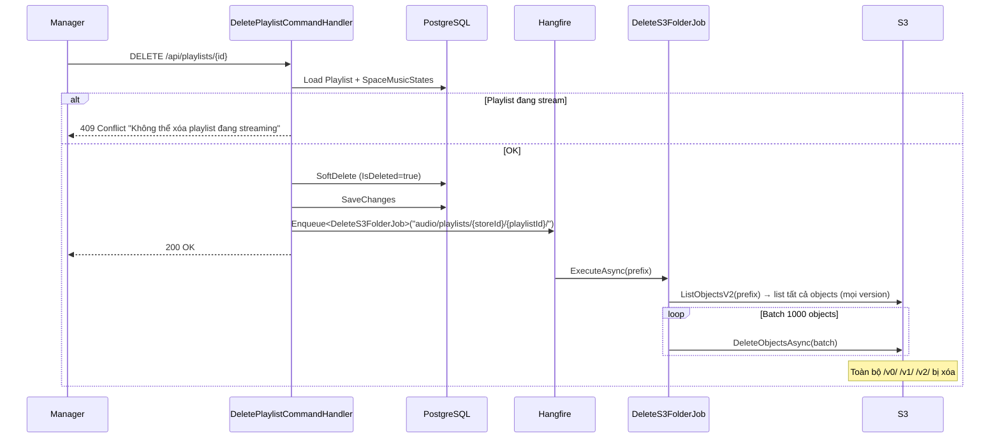
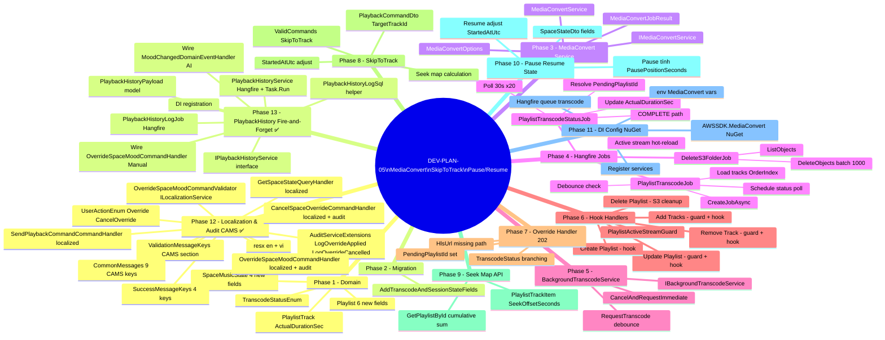

# DEV PLAN 05 — Auto MediaConvert, Playback Commands & Enum Contract

> Tự động trigger AWS MediaConvert khi playlist thay đổi (debounce 5 phút, bypass immediate
> khi override). Lưu `ActualDurationSec` từ MediaConvert vào `PlaylistTrack` để làm seek map.
> Manager điều khiển 8 lệnh playback (Pause/Resume/Seek/SeekForward/SeekBackward/SkipNext/SkipPrevious/SkipToTrack)
> → server tính offset, adjust `StartedAtUtc`, broadcast SignalR → đồng bộ tất cả devices.
> Block modify khi playlist đang streaming. Tất cả enum serialize bằng **số nguyên** (không dùng JsonStringEnumConverter)
> — mapping quy ước trong `docs/ENUM-CONTRACT.md`.

---

## Mục lục

1. [Bối cảnh & Vấn đề cần giải quyết](#1-bối-cảnh--vấn-đề-cần-giải-quyết)
2. [Quyết định thiết kế (ADR)](#2-quyết-định-thiết-kế-adr)
3. [System Architecture Overview](#3-system-architecture-overview)
4. [Data Model Changes](#4-data-model-changes)
5. [Data Flow & Sequence Diagrams](#5-data-flow--sequence-diagrams)
6. [WBS Chi Tiết](#6-wbs-chi-tiết)
7. [File Reference Table](#7-file-reference-table)
8. [Verification Steps](#8-verification-steps)

---

## 1. Bối cảnh & Vấn đề cần giải quyết

### Vấn đề cũ (trước DEV-PLAN-05)

DEV-PLAN-03 mô tả MediaConvert là tool **ngoài hệ thống** — BrandManager dùng AWS Console để convert thủ công, sau đó đăng ký HlsUrl vào DB qua `POST /api/playlists`. Đây là **gap kiến trúc** vì:

- Track entity lưu `AudioUrl` (raw file S3 tại `uploads/tracks/audio/`)
- Playlist entity lưu `HlsUrl` (master `.m3u8` tại `audio/...`) — phải nhập tay
- `PlaylistTrack` (join table) chỉ dùng cho UI quản lý, **không có vai trò trong streaming**
- Tablet stream từ `Playlist.HlsUrl`, không từ `Track.AudioUrl`

### Ba vấn đề mới cần giải quyết

**Vấn đề 1**: Manager tạo/sửa playlist rồi trigger streaming ngay — playlist chưa có HLS thì sao?
```
POST /api/cams/spaces/{id}/override { playlistId }
→ HlsUrl == null → code cũ trả 400 Bad Request → manager bị stuck
```

**Vấn đề 2**: Playlist đang được stream, manager add/remove track → tablets nhận segment corrupt
```
Tablet đang fetch segments của m3u8 cũ
MediaConvert overwrite cùng path → tablet crash stream
```

**Vấn đề 3**: Manager muốn chuyển đến bài cụ thể trong playlist — không chỉ Next/Previous
```
Manager click "Bài số 7" → hệ thống cần biết offset (giây) tương ứng trong HLS
→ Broadcast seek đồng bộ đến tablet + tất cả manager tabs
```

---

## 2. Quyết định thiết kế (ADR)

### ADR-1: HLS convert ở Playlist level (không phải Track level)

| Tiêu chí | Track-level | **Playlist-level (chọn)** |
|----------|-------------|--------------------------|
| Cost | Mỗi track convert 1 lần, playlist chỉ re-stitch manifest | Re-convert toàn playlist khi có thay đổi |
| Complexity | Cao: parse manifest, ghép EXTINF + absolute URLs | Thấp: MediaConvert multi-input xử lý hết |
| Output sync | Discontinuity ở ranh giới giữa track-segments | Một `.m3u8` liên mạch, không seam |
| Fit codebase | Cần thêm nhiều field vào Track | Fit hoàn toàn với `Playlist.HlsUrl` hiện tại |

**Kết luận:** Playlist-level + debounce là tradeoff đúng đắn cho quy mô hiện tại.

### ADR-2: Debounce 5 phút cho transcode

Khi handler save xong → ghi `TranscodeRequestedAt = now` vào DB → enqueue Hangfire delayed job sau **5 phút**.
Job khi chạy so sánh `requestedAt` argument với `Playlist.TranscodeRequestedAt` trong DB:
- Khớp → chạy thật
- Không khớp (có request mới hơn) → **SKIP** (debounce)

Chi phí MediaConvert ≈ $0.0075/phút output. Playlist 20 track × 3 phút ≈ **$0.45/lần convert**.
Debounce giảm số lần convert khi manager add nhiều track liên tiếp.

### ADR-3: Versioned S3 path tránh overwrite

Output path: `audio/playlists/{storeId}/{playlistId}/v{TranscodeVersion}/`

Mỗi lần transcode thành công, `TranscodeVersion++` và path mới được dùng. Segments cũ không bị overwrite → tablet đang stream không bị corrupt. `DeleteS3FolderJob` chạy sau delete playlist xóa toàn bộ prefix.

### ADR-4: Block modify khi playlist đang streaming

Pattern đã có sẵn tại `DeletePlaylistCommandHandler`. Áp dụng tương tự cho Add/Remove/Update tracks:
```
if (spaceStates.Any(s => s.CurrentPlaylistId == playlistId))
    throw BusinessRuleViolationException("Playlist đang streaming tại: [Space A, Space B].")
```

### ADR-5: PendingPlaylistId — "fire-and-forget" override khi transcode chưa xong

Thay 400 bằng **202 Accepted**:
- Set `SpaceMusicState.PendingPlaylistId = playlistId`
- Trigger transcode ngay lập tức (bypass debounce)
- Khi `PlaylistTranscodeStatusJob` detect COMPLETE và `PendingPlaylistId == playlistId` → tự động push `PlayStream` streaming

### ADR-6: HLS player tự seek — server chỉ cần offset giây

HLS.js, ExoPlayer, AVPlayer đọc EXTINF timestamps trong `.m3u8` và xử lý seek hoàn toàn ở client.
Server chỉ cần:
1. Tính `seekOffsetSeconds = Σ(ActualDurationSec các track trước target)`
2. Điều chỉnh `StartedAtUtc = now - offset` (late-joining clients tự tính đúng)
3. Broadcast `{ command: "Seek", seekPositionSeconds: offset }` → **đồng bộ 100%** tất cả devices

### ADR-7: `StartedAtUtc` là nguồn sự thật duy nhất

Mọi lệnh Pause/Resume/SkipToTrack đều điều chỉnh `SpaceMusicState.StartedAtUtc`.
Client reconnect sau đó tính `seekOffset = (now - StartedAtUtc)` → luôn đúng vị trí.

### ADR-8: HLS files tồn tại bao lâu

- **Trong vòng đời playlist**: files không bao giờ bị xóa tự động
- **Khi xóa playlist (soft delete)**: enqueue `DeleteS3FolderJob(prefix)` → xóa background
- **Version cũ**: giữ nguyên `v{N-1}` cho đến khi playlist bị delete (giá S3 thấp, safety > cost)

### ADR-9: Enum serialization thuần số — không dùng `JsonStringEnumConverter`

Các enum trong contract FE ↔ BE (`PlaybackCommandEnum`, `OverrideModeEnum`, `TransitionTypeEnum`) được serialize bằng **giá trị số nguyên** mặc định của System.Text.Json.

| Lựa chọn | Ưu | Nhược |
|---|---|---|
| `JsonStringEnumConverter` (tên chuỗi) | Dễ đọc trong logs/Postman | Khoá chặt string literal → rename enum bể contract; case-sensitive dễ lỗi |
| **Số nguyên (chọn)** | Stable qua rename; nhỏ hơn payload; TypeScript enum map trivial | Cần tài liệu mapping (ENUM-CONTRACT.md) |

**Quy tắc thực thi:**
- Không đặt `[JsonConverter(typeof(JsonStringEnumConverter))]` trên bất kỳ enum nào trong Domain.
- Mọi enum mới thêm vào contract **phải** được ghi vào `docs/ENUM-CONTRACT.md` trước khi merge.
- FE **phải** khai báo enum TypeScript với giá trị tường minh (`Pause = 1`, không dựa vào thứ tự khai báo).
- `TransitionType` trong SignalR payload `PlayStream` cũng gửi số nguyên (đã cập nhật `SignalRMusicService.cs`).

### ADR-10: Localization pattern bắt buộc cho tất cả CAMS handlers & validators ✅

Tất cả CAMS handlers (`OverrideSpaceMood`, `CancelSpaceOverride`, `GetSpaceState`, `SendPlaybackCommand`) và validators (`OverrideSpaceMoodCommandValidator`) **phải** tuân thủ pattern localization đã chuẩn hóa từ `CreateTrackCommandHandler`:

| Loại message | Pattern | Resource file |
|---|---|---|
| Success | `GetSuccessMessage(SuccessMessageKeys.XxxKey)` | `SuccessMessages.resx` |
| Business error (CAMS-specific) | `GetCommonMessage("Cams_Error_XxxKey", arg)` | `CommonMessages.resx` |
| Validation | `localization.GetValidationMessage(ValidationMessageKeys.XxxKey)` | `ValidationMessages.resx` |

**Quy tắc:**
- Không có string literal hardcode trong handler/validator class body.
- CAMS-specific errors **không** dùng `GetErrorMessage()` (overload không tồn tại) — dùng `GetCommonMessage()`.
- Mọi key mới phải thêm vào cả `.resx` (en) lẫn `.vi.resx` (vi).
- `ValidationMessageKeys` constants nằm dưới section `// CAMS-specific` tách biệt.

**Các key đã thêm (session này):**

_SuccessMessages:_ `Success_Override_Applied`, `Success_Override_Pending`, `Success_Override_Cancelled`, `Success_NoPlaybackState`

_CommonMessages:_ `Entity_SpaceMusicState`, `Cams_Error_MoodNotMapped`, `Cams_Error_NoPlaylistForMood`, `Cams_Error_HlsNotConfigured`, `Cams_Error_NoActiveOverride`, `Cams_Info_NoPlaybackState`, `Cams_Playback_SeekRequired`, `Cams_Playback_TargetTrackRequired`, `Cams_Playback_CommandRelayed`

_ValidationMessages:_ `SpaceId`, `PlaylistId`, `Cams_Override_MutualExclusive`, `Cams_Reason_MaxLength`

### ADR-11: Audit logging bắt buộc cho Override / CancelOverride ✅

`OverrideSpaceMoodCommandHandler` và `CancelSpaceOverrideCommandHandler` **phải** ghi audit log qua `IAuditService` (fire-and-forget via Hangfire — không block luồng chính).

Hai extension methods mới trong `AuditServiceExtensions.cs`:

```csharp
// Ghi khi override áp dụng thành công (200 OK)
auditService.LogOverrideApplied(userId, spaceId,
    details: $"Mode={mode}, PlaylistId={playlistId}, PlaylistName={name}, Reason={reason}");

// Ghi khi override được hủy
auditService.LogOverrideCancelled(userId, spaceId,
    details: $"PreviousMode={mode}, PreviousReason={reason}, OriginalOverriddenByUserId={uid}");
```

Enum mới trong `UserActionEnum`: `Override`, `CancelOverride` (thêm sau `Reassign`).

**Lưu ý đặc biệt:**
- Trường hợp **202 Accepted** (pending transcode): audit log **không** ghi ngay — chỉ ghi khi `PlaylistTranscodeStatusJob` confirm COMPLETE và thực sự push PlayStream.
- `CancelSpaceOverride`: capture trạng thái hiện tại (`mode`, `reason`, `overriddenByUserId`) **trước** khi clear để ghi đủ context.

### ADR-12: Ghi lịch sử playback (PlaybackHistory) qua Hangfire — non-blocking ✅

Mỗi lần streaming thực sự bắt đầu (không phải pending), hệ thống ghi một bản ghi vào bảng `playback_histories` thông qua raw SQL + Hangfire (fire-and-forget). Task này **không được block luồng chính**.

**Hai trigger points:**
| Trigger | Handler | `TriggerTypeEnum` |
|---|---|---|
| Manager override (playlist có HLS sẵn sàng) | `OverrideSpaceMoodCommandHandler` | `Manual (0)` |
| AI mood change (MoodChangedDomainEvent) | `MoodChangedDomainEventHandler` | `AI (1)` |

**Cơ chế:**
1. `IPlaybackHistoryService.LogPlaybackStarted()` — `void`, không bao giờ `await`
2. Priority 1: `IBackgroundJobClient.Enqueue<PlaybackHistoryLogJob>()` với `TransactionScope.Suppress` (copy pattern từ `AuditService`)
3. Priority 2: `Task.Run` fallback nếu Hangfire unavailable
4. `PlaybackHistoryLogJob`: execute raw PostgreSQL INSERT vào `playback_histories`, throw on failure (Hangfire retry)

**SQL INSERT:**
```sql
INSERT INTO playback_histories (space_id, playlist_id, started_at, ended_at, duration_ms, trigger_type, timestamp)
VALUES ({0}, {1}, {2}, {3}, {4}, {5}, {6})
```

`trigger_type` cast về `(int)` vì column là `SMALLINT` (`HasConversion<int?>` trong DbContext).

---

## 3. System Architecture Overview



---

## 4. Data Model Changes

### 4.1 `Playlist` entity — thêm 6 fields

```csharp
// src/LogAICAMS.Domain/Entities/Playlist.cs

/// <summary>
/// Trạng thái transcode hiện tại của playlist.
/// None = chưa từng transcoded; Pending = đã queue; Processing = MediaConvert đang chạy;
/// Ready = HlsUrl hợp lệ có thể stream; Failed = lỗi, xem TranscodeErrorMessage.
/// </summary>
public TranscodeStatusEnum TranscodeStatus { get; set; } = TranscodeStatusEnum.None;

/// <summary>AWS MediaConvert Job ID. Dùng để poll trạng thái.</summary>
public string? TranscodeJobId { get; set; }

/// <summary>
/// Thời điểm gần nhất RequestTranscode được gọi.
/// PlaylistTranscodeJob kiểm tra field này để thực hiện debounce:
///   nếu job.requestedAt != DB.TranscodeRequestedAt → skip (đã có request mới hơn).
/// </summary>
public DateTime? TranscodeRequestedAt { get; set; }

/// <summary>Thời điểm transcode hoàn thành thành công gần nhất.</summary>
public DateTime? TranscodeCompletedAt { get; set; }

/// <summary>Error detail nếu TranscodeStatus == Failed.</summary>
public string? TranscodeErrorMessage { get; set; }

/// <summary>
/// Tăng mỗi lần transcode thành công. Dùng để tạo versioned S3 path:
///   audio/playlists/{storeId}/{playlistId}/v{TranscodeVersion}/
/// Tránh overwrite segments cũ khi tablet đang stream.
/// </summary>
public int TranscodeVersion { get; set; } = 0;
```

### 4.2 `PlaylistTrack` entity — thêm 1 field

```csharp
// src/LogAICAMS.Domain/Entities/PlaylistTrack.cs

/// <summary>
/// Thời lượng thực tế (giây) do AWS MediaConvert xác nhận sau khi job COMPLETE.
/// Khác với Track.DurationSec (metadata do user nhập) — đây là giá trị chính xác từ encode.
/// Dùng để tính seek map khi manager thực hiện SkipToTrack.
/// Null = transcode chưa chạy lần nào, dùng Track.DurationSec làm fallback.
/// </summary>
public int? ActualDurationSec { get; set; }
```

### 4.3 `SpaceMusicState` entity — thêm 4 fields

```csharp
// src/LogAICAMS.Domain/Entities/SpaceMusicState.cs

/// <summary>True khi tablet đang bị pause. Reset về false khi Resume/SkipToTrack.</summary>
public bool IsPaused { get; set; } = false;

/// <summary>
/// Vị trí (giây) khi Pause được thực hiện.
/// Dùng để: (1) Resume điều chỉnh StartedAtUtc, (2) late-joining clients seek đến đúng chỗ.
/// Null khi IsPaused = false.
/// </summary>
public int? PausePositionSeconds { get; set; }

/// <summary>
/// PlaylistId đang chờ transcode hoàn tất để streaming.
/// Set khi manager override một playlist chưa có HlsUrl (TranscodeStatus != Ready).
/// PlaylistTranscodeStatusJob detect field này khi COMPLETE → tự động push PlayStream.
/// Reset về null sau khi PlayStream được push.
/// </summary>
public Guid? PendingPlaylistId { get; set; }

/// <summary>Reason của override đang pending (audit).</summary>
public string? PendingOverrideReason { get; set; }
```

### 4.4 `TranscodeStatusEnum` — file mới

```csharp
// src/LogAICAMS.Domain/Enums/TranscodeStatusEnum.cs

namespace LogAICAMS.Domain.Enums;

public enum TranscodeStatusEnum
{
    /// <summary>Playlist chưa từng được transcode. HlsUrl = null.</summary>
    None = 0,

    /// <summary>Job đã được queue vào Hangfire, đang chờ chạy (debounce window).</summary>
    Pending = 1,

    /// <summary>Job đang chạy trên AWS MediaConvert.</summary>
    Processing = 2,

    /// <summary>Transcode hoàn thành. HlsUrl hợp lệ, sẵn sàng stream.</summary>
    Ready = 3,

    /// <summary>Transcode thất bại. Xem Playlist.TranscodeErrorMessage để biết chi tiết.</summary>
    Failed = 4,
}
```

### 4.5 Schema Summary

```
Playlists (bổ sung)
├── TranscodeStatus      SMALLINT NOT NULL DEFAULT 0
├── TranscodeJobId       VARCHAR(200) NULL
├── TranscodeRequestedAt TIMESTAMPTZ NULL
├── TranscodeCompletedAt TIMESTAMPTZ NULL
├── TranscodeErrorMessage TEXT NULL
└── TranscodeVersion     INT NOT NULL DEFAULT 0

PlaylistTracks (bổ sung)
└── ActualDurationSec    INT NULL

SpaceMusicStates (bổ sung)
├── IsPaused             BOOLEAN NOT NULL DEFAULT FALSE
├── PausePositionSeconds INT NULL
├── PendingPlaylistId    UUID NULL
└── PendingOverrideReason TEXT NULL
```

---

## 5. Data Flow & Sequence Diagrams

### 5.1 Flow 1 — Tạo/sửa playlist → Auto Transcode (debounce)



### 5.2 Flow 2 — Override Space khi HLS chưa sẵn sàng (202 Pending)



### 5.3 Flow 3 — Block Modify khi Playlist đang Stream



### 5.4 Flow 4 — SkipToTrack (bài bất kỳ)



### 5.5 Flow 5 — Pause và Resume



### 5.6 Flow 6 — Xóa Playlist → S3 Cleanup



---

## 6. WBS Chi Tiết

### Sơ đồ tổng quan



---

### Phase 1 — Domain Changes

#### 1.1 `Playlist.cs` — thêm 6 fields

File: `src/LogAICAMS.Domain/Entities/Playlist.cs`

```csharp
// ─── Transcode Pipeline ──────────────────────────────────────────────────────
public TranscodeStatusEnum TranscodeStatus { get; set; } = TranscodeStatusEnum.None;
public string? TranscodeJobId { get; set; }
public DateTime? TranscodeRequestedAt { get; set; }
public DateTime? TranscodeCompletedAt { get; set; }
public string? TranscodeErrorMessage { get; set; }
public int TranscodeVersion { get; set; } = 0;
```

#### 1.2 `PlaylistTrack.cs` — thêm 1 field

File: `src/LogAICAMS.Domain/Entities/PlaylistTrack.cs`

```csharp
public int? ActualDurationSec { get; set; }
```

#### 1.3 `SpaceMusicState.cs` — thêm 4 fields

File: `src/LogAICAMS.Domain/Entities/SpaceMusicState.cs`

```csharp
public bool IsPaused { get; set; } = false;
public int? PausePositionSeconds { get; set; }
public Guid? PendingPlaylistId { get; set; }
public string? PendingOverrideReason { get; set; }
```

#### 1.4 `TranscodeStatusEnum.cs` — file mới

File: `src/LogAICAMS.Domain/Enums/TranscodeStatusEnum.cs`

```csharp
namespace LogAICAMS.Domain.Enums;

public enum TranscodeStatusEnum
{
    None = 0,
    Pending = 1,
    Processing = 2,
    Ready = 3,
    Failed = 4,
}
```

---

### Phase 2 — EF Core Migration

```powershell
cd d:\MyLearning\Ky9\SEP\Log.AI-CAMS\Log.AI-CAMS-v2
.\scripts\migrations\migrate.ps1 -Action add -Name "AddTranscodeAndSessionStateFields" -Context main
.\scripts\migrations\migrate.ps1 -Action update -Context main
```

---

### Phase 3 — AWS MediaConvert Service

#### 3.1 `MediaConvertOptions.cs`

File: `src/LogAICAMS.Infrastructure/Configurations/MediaConvertOptions.cs`

```csharp
namespace LogAICAMS.Infrastructure.Configurations;

public sealed class MediaConvertOptions
{
    public const string SectionName = "MediaConvert";

    /// <summary>
    /// MediaConvert regional endpoint.
    /// Find via: aws mediaconvert describe-endpoints --region ap-southeast-1
    /// Example: https://xxxxxx.mediaconvert.ap-southeast-1.amazonaws.com
    /// </summary>
    public string Endpoint { get; set; } = string.Empty;

    /// <summary>
    /// ARN of IAM Role with permissions: s3:GetObject (input bucket), s3:PutObject (output bucket).
    /// Example: arn:aws:iam::123456789012:role/MediaConvertRole
    /// </summary>
    public string RoleArn { get; set; } = string.Empty;

    /// <summary>
    /// ARN of MediaConvert queue. Default queue ARN format:
    /// arn:aws:mediaconvert:ap-southeast-1:ACCOUNT_ID:queues/Default
    /// </summary>
    public string Queue { get; set; } = string.Empty;

    /// <summary>S3 bucket for HLS output. Same bucket as input (logaicams-bucket).</summary>
    public string OutputBucket { get; set; } = string.Empty;
}
```

#### 3.2 `IMediaConvertService.cs`

File: `src/LogAICAMS.Application/Common/Interfaces/IMediaConvertService.cs`

```csharp
namespace LogAICAMS.Application.Common.Interfaces;

public interface IMediaConvertService
{
    /// <summary>
    /// Tạo MediaConvert multi-input concatenation job.
    /// inputs: ordered list of S3 relative keys (Track.AudioUrl), sorted by PlaylistTrack.OrderIndex.
    /// outputPathPrefix: "audio/playlists/{storeId}/{playlistId}/v{version}/"
    /// Returns: AWS MediaConvert Job ID.
    /// </summary>
    Task<string> CreatePlaylistJobAsync(
        List<string> inputS3Keys,
        string outputPathPrefix,
        CancellationToken ct = default);

    /// <summary>
    /// Poll JobId để lấy trạng thái.
    /// PerInputDurationsMs: thời lượng thực tế mỗi input track (milliseconds), index tương ứng inputS3Keys.
    /// </summary>
    Task<MediaConvertJobResult> GetJobStatusAsync(string jobId, CancellationToken ct = default);
}

public sealed record MediaConvertJobResult(
    string Status,                      // "SUBMITTED" | "PROGRESSING" | "COMPLETE" | "ERROR" | "CANCELED"
    int[]? PerInputDurationsMs,         // null nếu chưa COMPLETE
    int? TotalDurationSec,
    string? ErrorMessage
);
```

#### 3.3 `MediaConvertService.cs` (skeleton)

File: `src/LogAICAMS.Infrastructure/Services/MediaConvertService.cs`

```csharp
using Amazon.MediaConvert;
using Amazon.MediaConvert.Model;
using LogAICAMS.Application.Common.Interfaces;
using LogAICAMS.Infrastructure.Configurations;
using Microsoft.Extensions.Logging;
using Microsoft.Extensions.Options;

namespace LogAICAMS.Infrastructure.Services;

public sealed class MediaConvertService : IMediaConvertService
{
    private readonly AmazonMediaConvertClient _client;
    private readonly MediaConvertOptions _opts;
    private readonly FileStorageSettings _s3;
    private readonly ILogger<MediaConvertService> _logger;

    public MediaConvertService(
        IOptions<MediaConvertOptions> opts,
        IOptions<FileStorageSettings> storageOpts,
        ILogger<MediaConvertService> logger)
    {
        _opts   = opts.Value;
        _s3     = storageOpts.Value;
        _logger = logger;

        var config = new AmazonMediaConvertConfig
        {
            ServiceURL = _opts.Endpoint,
            RegionEndpoint = Amazon.RegionEndpoint.APSoutheast1
        };
        _client = new AmazonMediaConvertClient(
            _s3.S3!.AccessKey, _s3.S3.SecretKey, config);
    }

    public async Task<string> CreatePlaylistJobAsync(
        List<string> inputS3Keys,
        string outputPathPrefix,
        CancellationToken ct = default)
    {
        var inputs = inputS3Keys.Select(key => new Input
        {
            FileInput = $"s3://{_s3.S3!.BucketName}/{key}",
            AudioSelectors = new Dictionary<string, AudioSelector>
            {
                ["Audio Selector 1"] = new AudioSelector { DefaultSelection = AudioDefaultSelection.DEFAULT }
            }
        }).ToList();

        var request = new CreateJobRequest
        {
            Role  = _opts.RoleArn,
            Queue = _opts.Queue,
            Settings = new JobSettings
            {
                Inputs = inputs,
                OutputGroups = new List<OutputGroup>
                {
                    new OutputGroup
                    {
                        OutputGroupSettings = new OutputGroupSettings
                        {
                            Type = OutputGroupType.HLS_GROUP_SETTINGS,
                            HlsGroupSettings = new HlsGroupSettings
                            {
                                Destination         = $"s3://{_opts.OutputBucket}/{outputPathPrefix}",
                                SegmentLength       = 10,
                                MinSegmentLength    = 0,
                                DirectoryStructure  = HlsDirectoryStructure.SINGLE_DIRECTORY,
                                ManifestCompression = HlsManifestCompression.NONE,
                            }
                        },
                        Outputs = new List<Output>
                        {
                            new Output
                            {
                                NameModifier = "master",
                                ContainerSettings = new ContainerSettings
                                {
                                    Container = ContainerType.M3U8,
                                    M3u8Settings = new M3u8Settings()
                                },
                                AudioDescriptions = new List<AudioDescription>
                                {
                                    new AudioDescription
                                    {
                                        CodecSettings = new AudioCodecSettings
                                        {
                                            Codec = AudioCodec.AAC,
                                            AacSettings = new AacSettings
                                            {
                                                Bitrate    = 128000,
                                                CodingMode = AacCodingMode.CODING_MODE_2_0,
                                                SampleRate = 44100,
                                            }
                                        }
                                    }
                                }
                            }
                        }
                    }
                }
            }
        };

        var response = await _client.CreateJobAsync(request, ct);
        _logger.LogInformation("[MediaConvert] Job created: {JobId}, inputs: {Count}", response.Job.Id, inputS3Keys.Count);
        return response.Job.Id;
    }

    public async Task<MediaConvertJobResult> GetJobStatusAsync(string jobId, CancellationToken ct = default)
    {
        var response = await _client.GetJobAsync(new GetJobRequest { Id = jobId }, ct);
        var job = response.Job;

        int[]? durations = null;
        int? totalDuration = null;
        string? error = null;

        if (job.Status == JobStatus.COMPLETE && job.OutputGroupDetails?.Count > 0)
        {
            // Parse output details for total duration
            // Note: Per-input duration requires custom tracking via input timestamps
            // Fallback: distribute total proportionally (see implementation notes)
            totalDuration = (int)(job.OutputGroupDetails[0].OutputDetails?
                .FirstOrDefault()?.DurationInMs / 1000.0 ?? 0);
        }

        if (job.Status == JobStatus.ERROR)
            error = job.ErrorMessage;

        return new MediaConvertJobResult(
            Status             : job.Status.Value,
            PerInputDurationsMs: durations,
            TotalDurationSec   : totalDuration,
            ErrorMessage       : error);
    }
}
```

> **Implementation Note:** AWS MediaConvert không trả `PerInputDurationsMs` trực tiếp. Giải pháp: sau khi job COMPLETE, parse file `master.m3u8` từ S3, đọc EXTINF tags → tính cumulative time → map ngược về track indexes. Đây là bước cần implement riêng.

---

### Phase 4 — Hangfire Jobs

#### 4.1 `PlaylistTranscodeJob.cs`

File: `src/LogAICAMS.Infrastructure/Jobs/PlaylistTranscodeJob.cs`

```csharp
using Hangfire;
using LogAICAMS.Application.Common.Interfaces;
using LogAICAMS.Domain.Entities;
using Microsoft.Extensions.DependencyInjection;
using Microsoft.Extensions.Logging;

namespace LogAICAMS.Infrastructure.Jobs;

[Queue("transcode")]
public sealed class PlaylistTranscodeJob
{
    private readonly IServiceProvider _sp;
    private readonly ILogger<PlaylistTranscodeJob> _logger;

    public PlaylistTranscodeJob(IServiceProvider sp, ILogger<PlaylistTranscodeJob> logger)
    {
        _sp     = sp;
        _logger = logger;
    }

    public async Task ExecuteAsync(Guid playlistId, Guid storeId, DateTime requestedAt,
        CancellationToken ct = default)
    {
        await using var scope = _sp.CreateAsyncScope();
        var unitOfWork       = scope.ServiceProvider.GetRequiredService<IUnitOfWork>();
        var mediaConvert     = scope.ServiceProvider.GetRequiredService<IMediaConvertService>();
        var bgJobClient      = scope.ServiceProvider.GetRequiredService<IBackgroundJobClient>();

        // 1. Debounce check
        var playlist = await unitOfWork.Repository<Playlist>()
            .GetFirstOrDefaultAsync(p => p.Id == playlistId, null, ct);

        if (playlist == null || playlist.TranscodeRequestedAt != requestedAt)
        {
            _logger.LogInformation("[Transcode] Debounce skip for Playlist={Id}", playlistId);
            return;
        }

        // 2. Load tracks sorted by OrderIndex, skip null AudioUrl
        var tracks = await unitOfWork.Repository<PlaylistTrack>()
            .GetQueryable()
            .Include(pt => pt.Track)
            .Where(pt => pt.PlaylistId == playlistId && pt.Track.AudioUrl != null)
            .OrderBy(pt => pt.OrderIndex)
            .ToListAsync(ct);

        if (tracks.Count == 0)
        {
            _logger.LogWarning("[Transcode] No valid tracks for Playlist={Id}, skipping.", playlistId);
            return;
        }

        // 3. Tạo versioned output path
        var version      = playlist.TranscodeVersion;
        var outputPrefix = $"audio/playlists/{storeId}/{playlistId}/v{version}/";
        var inputKeys    = tracks.Select(pt => pt.Track.AudioUrl!).ToList();

        // 4. Submit MediaConvert job
        var jobId = await mediaConvert.CreatePlaylistJobAsync(inputKeys, outputPrefix, ct);

        // 5. Update DB
        playlist.TranscodeJobId = jobId;
        playlist.TranscodeStatus = Domain.Enums.TranscodeStatusEnum.Processing;
        unitOfWork.Repository<Playlist>().Update(playlist);
        await unitOfWork.SaveChangesAsync(ct);

        // 6. Schedule status polling
        bgJobClient.Schedule<PlaylistTranscodeStatusJob>(
            j => j.PollAsync(playlistId, jobId, storeId, version, 0, CancellationToken.None),
            TimeSpan.FromMinutes(2));
    }
}
```

#### 4.2 `PlaylistTranscodeStatusJob.cs`

File: `src/LogAICAMS.Infrastructure/Jobs/PlaylistTranscodeStatusJob.cs`

```csharp
[Queue("transcode")]
public sealed class PlaylistTranscodeStatusJob
{
    private const int MaxAttempts = 20;
    private const int RetryDelaySeconds = 30;

    // ... (inject IServiceProvider, IBackgroundJobClient)

    public async Task PollAsync(Guid playlistId, string jobId, Guid storeId, int version,
        int attempt, CancellationToken ct = default)
    {
        await using var scope = _sp.CreateAsyncScope();
        var mediaConvert  = scope.ServiceProvider.GetRequiredService<IMediaConvertService>();
        var unitOfWork    = scope.ServiceProvider.GetRequiredService<IUnitOfWork>();
        var signalR       = scope.ServiceProvider.GetRequiredService<ISignalRMusicService>();
        var hlsBuilder    = scope.ServiceProvider.GetRequiredService<IHlsUrlBuilderService>();

        var result = await mediaConvert.GetJobStatusAsync(jobId, ct);

        if (result.Status is "PROGRESSING" or "SUBMITTED")
        {
            if (attempt < MaxAttempts)
                _bgJobClient.Schedule<PlaylistTranscodeStatusJob>(
                    j => j.PollAsync(playlistId, jobId, storeId, version, attempt + 1, CancellationToken.None),
                    TimeSpan.FromSeconds(RetryDelaySeconds));
            return;
        }

        if (result.Status == "ERROR")
        {
            // Update Playlist.TranscodeStatus = Failed
            return;
        }

        if (result.Status == "COMPLETE")
        {
            var hlsKey = $"audio/playlists/{storeId}/{playlistId}/v{version}/master.m3u8";

            // a. Update Playlist
            var playlist = ...;
            playlist.HlsUrl              = hlsKey;
            playlist.TotalDurationSeconds = result.TotalDurationSec;
            playlist.TranscodeStatus     = TranscodeStatusEnum.Ready;
            playlist.TranscodeCompletedAt = DateTime.UtcNow;

            // b. Update PlaylistTrack.ActualDurationSec từ parsed m3u8 (xem Implementation Note)
            // Parse master.m3u8 từ S3 → tính cumulative EXTINF → map về tracks theo OrderIndex

            await unitOfWork.SaveChangesAsync(ct);

            // c. Resolve PendingPlaylistId → auto-push PlayStream
            var pendingSpaces = await stateRepo.GetByPendingPlaylistIdAsync(playlistId, ct);
            foreach (var space in pendingSpaces)
            {
                var cdnUrl = hlsBuilder.BuildUrl(hlsKey);
                // Upsert SpaceMusicState: CurrentPlaylistId, StartedAtUtc=now, PendingPlaylistId=null
                await signalR.PushManualPlayStreamAsync(space.SpaceId, ..., ct);
            }

            // d. Hot-reload nếu playlist này đang active stream (IsManualOverride + CurrentPlaylistId)
            var activeSpaces = await stateRepo.GetByCurrentPlaylistIdAsync(playlistId, ct);
            foreach (var space in activeSpaces.Where(s => s.IsManualOverride))
            {
                var seekPos = (int)(DateTime.UtcNow - space.StartedAtUtc!.Value).TotalSeconds;
                await signalR.PushPlaybackStateChangedAsync(space.SpaceId,
                    new PlaybackCommandDto { Command = "SeekReload", SeekPositionSeconds = seekPos }, ct);
            }
        }
    }
}
```

#### 4.3 `DeleteS3FolderJob.cs`

File: `src/LogAICAMS.Infrastructure/Jobs/DeleteS3FolderJob.cs`

```csharp
[Queue("file-ops")]
public sealed class DeleteS3FolderJob
{
    // Inject IAmazonS3, FileStorageSettings, ILogger

    public async Task ExecuteAsync(string s3Prefix, CancellationToken ct = default)
    {
        // 1. Paginated list
        string? continuationToken = null;
        do
        {
            var listResp = await _s3.ListObjectsV2Async(new ListObjectsV2Request
            {
                BucketName        = _bucket,
                Prefix            = s3Prefix,
                ContinuationToken = continuationToken
            }, ct);

            if (listResp.S3Objects.Count > 0)
            {
                // 2. Batch delete (max 1000 per request)
                var deleteRequest = new DeleteObjectsRequest
                {
                    BucketName = _bucket,
                    Objects    = listResp.S3Objects
                        .Select(o => new KeyVersion { Key = o.Key })
                        .ToList()
                };
                await _s3.DeleteObjectsAsync(deleteRequest, ct);
                _logger.LogInformation("[S3 Delete] Deleted {Count} objects under {Prefix}",
                    listResp.S3Objects.Count, s3Prefix);
            }

            continuationToken = listResp.IsTruncated ? listResp.NextContinuationToken : null;
        } while (continuationToken != null);
    }
}
```

---

### Phase 5 — BackgroundTranscodeService

#### 5.1 `IBackgroundTranscodeService.cs`

File: `src/LogAICAMS.Application/Common/Interfaces/IBackgroundTranscodeService.cs`

```csharp
namespace LogAICAMS.Application.Common.Interfaces;

public interface IBackgroundTranscodeService
{
    /// <summary>
    /// Queue transcode job với debounce 5 phút.
    /// Update Playlist.TranscodeRequestedAt = now, TranscodeVersion++, Status = Pending.
    /// immediate = true: enqueue ngay (bypass debounce), dùng khi Override cần HLS ngay.
    /// </summary>
    void RequestTranscode(Guid playlistId, Guid storeId, bool immediate = false);

    /// <summary>
    /// Nếu có Hangfire job debounce đang pending → cancel.
    /// Enqueue job mới ngay lập tức (không delay).
    /// </summary>
    void CancelScheduledAndRequestImmediate(Guid playlistId, Guid storeId);
}
```

#### 5.2 `BackgroundTranscodeService.cs` (skeleton)

File: `src/LogAICAMS.Infrastructure/Services/BackgroundTranscodeService.cs`

```csharp
public sealed class BackgroundTranscodeService : IBackgroundTranscodeService
{
    private readonly IBackgroundJobClient _bgClient;
    private readonly IServiceScopeFactory _scopeFactory;
    private readonly ILogger<BackgroundTranscodeService> _logger;

    public void RequestTranscode(Guid playlistId, Guid storeId, bool immediate = false)
    {
        // 1. Update Playlist in DB (separate scope)
        _ = Task.Run(async () =>
        {
            await using var scope = _scopeFactory.CreateAsyncScope();
            var uow = scope.ServiceProvider.GetRequiredService<IUnitOfWork>();
            var repo = uow.Repository<Playlist>();
            var playlist = await repo.GetFirstOrDefaultAsync(p => p.Id == playlistId, null);
            if (playlist == null) return;

            var now = DateTime.UtcNow;
            playlist.TranscodeRequestedAt = now;
            playlist.TranscodeVersion    += 1;  // ← versioned path
            playlist.TranscodeStatus      = TranscodeStatusEnum.Pending;
            repo.Update(playlist);
            await uow.SaveChangesAsync();

            // 2. Enqueue job
            if (immediate)
                _bgClient.Enqueue<PlaylistTranscodeJob>(
                    j => j.ExecuteAsync(playlistId, storeId, now, CancellationToken.None));
            else
                _bgClient.Schedule<PlaylistTranscodeJob>(
                    j => j.ExecuteAsync(playlistId, storeId, now, CancellationToken.None),
                    TimeSpan.FromMinutes(5));
        });
    }

    public void CancelScheduledAndRequestImmediate(Guid playlistId, Guid storeId)
    {
        // Hangfire không có API cancel-by-argument natively.
        // Workaround: debounce timestamp mismatch sẽ tự skip job cũ.
        // Chỉ cần RequestTranscode(immediate=true) → job mới với timestamp mới sẽ thắng.
        RequestTranscode(playlistId, storeId, immediate: true);
    }
}
```

---

### Phase 6 — Hook Playlist Handlers

#### 6.1 `PlaylistActiveStreamGuard.cs` — Guard reusable

File: `src/LogAICAMS.Application/Common/Helpers/PlaylistActiveStreamGuard.cs`

```csharp
using LogAICAMS.Application.Common.Exceptions;
using LogAICAMS.Application.Common.Interfaces;
using LogAICAMS.Domain.Entities;
using Microsoft.EntityFrameworkCore;

namespace LogAICAMS.Application.Common.Helpers;

public static class PlaylistActiveStreamGuard
{
    /// <summary>
    /// Throws BusinessRuleViolationException nếu playlist đang được stream
    /// bởi ít nhất một Space. Call TRƯỚC khi SaveChanges.
    /// </summary>
    public static async Task ThrowIfStreamingAsync(
        Guid playlistId,
        IUnitOfWork unitOfWork,
        ILocalizationService localization,
        CancellationToken ct = default)
    {
        var activeSpaces = await unitOfWork.Repository<SpaceMusicState>()
            .GetQueryable()
            .Include(s => s.Space)
            .Where(s => s.CurrentPlaylistId == playlistId && !s.IsDeleted)
            .Select(s => s.Space.Name)
            .ToListAsync(ct);

        if (activeSpaces.Count > 0)
        {
            var spaceList = string.Join(", ", activeSpaces);
            throw new BusinessRuleViolationException(
                $"Playlist đang streaming tại: {spaceList}. " +
                "Chuyển các Space sang playlist khác trước khi chỉnh sửa.");
        }
    }
}
```

#### 6.2 — Hook vào từng Handler

**`AddTracksToPlaylistCommandHandler`** — sau step 7 (validate tracks), TRƯỚC step 8 (AddRange):
```csharp
await PlaylistActiveStreamGuard.ThrowIfStreamingAsync(command.PlaylistId, _unitOfWork, _localizationService, cancellationToken);
// ... AddRange, SaveChanges ...
_transcodeService.RequestTranscode(command.PlaylistId, playlist.StoreId!.Value, immediate: false);
```

**`RemoveTrackFromPlaylistCommandHandler`** — sau load trackEntry, TRƯỚC DeleteRange:
```csharp
await PlaylistActiveStreamGuard.ThrowIfStreamingAsync(command.PlaylistId, _unitOfWork, _localizationService, cancellationToken);
// ... DeleteRange, SaveChanges ...
_transcodeService.RequestTranscode(command.PlaylistId, playlist.StoreId!.Value, immediate: false);
```

**`UpdatePlaylistCommandHandler`** — khi `needsReindex = true`:
```csharp
await PlaylistActiveStreamGuard.ThrowIfStreamingAsync(command.Id, _unitOfWork, _localizationService, cancellationToken);
// ... SaveChanges ...
if (needsReindex)
    _transcodeService.RequestTranscode(command.Id, playlist.StoreId!.Value, immediate: false);
```

**`CreatePlaylistCommandHandler`** — sau SaveChanges:
```csharp
// Chỉ trigger nếu có tracks ban đầu
if (/* has initial tracks */)
    _transcodeService.RequestTranscode(playlist.Id, storeId, immediate: false);
```

**`DeletePlaylistCommandHandler`** — sau SaveChanges:
```csharp
_bgJobClient.Enqueue<DeleteS3FolderJob>(
    j => j.ExecuteAsync($"audio/playlists/{storeId}/{playlist.Id}/", CancellationToken.None));
```

---

### Phase 7 — Override Handler: 202 Pending Pattern

File: `src/LogAICAMS.Application/Features/CAMS/Commands/OverrideSpaceMood/OverrideSpaceMoodCommandHandler.cs`

Tại Mode 1 (DirectPlaylist), thay guard 400 hiện tại:

```csharp
// BEFORE (code cũ — trả 400 blind):
if (string.IsNullOrWhiteSpace(playlistEntity.HlsUrl))
    return Result.Failure("No HLS URL.", ErrorCodeEnum.InvalidInput);

// AFTER — branching theo TranscodeStatus:
if (playlistEntity.TranscodeStatus == TranscodeStatusEnum.Ready
    && !string.IsNullOrWhiteSpace(playlistEntity.HlsUrl))
{
    // → đi tiếp flow bình thường (Step 5-8)
}
else
{
    // HLS chưa sẵn sàng → set PendingPlaylistId, trigger transcode ngay
    var pendingState = await _stateRepo.GetBySpaceIdAsync(command.SpaceId, ct)
        ?? new SpaceMusicState { SpaceId = command.SpaceId, StoreId = storeId, BrandId = brandId };

    pendingState.PendingPlaylistId    = playlistEntity.Id;
    pendingState.PendingOverrideReason = request.Reason;
    pendingState.IsManualOverride     = true;
    pendingState.OverrideMode         = OverrideModeEnum.DirectPlaylist;
    pendingState.OverriddenByUserId   = userId;
    await _stateRepo.UpsertAsync(pendingState, ct);

    _transcodeService.CancelScheduledAndRequestImmediate(playlistEntity.Id, storeId);

    var statusMsg = playlistEntity.TranscodeStatus switch
    {
        TranscodeStatusEnum.Processing => "Đang transcode (~2 phút).",
        TranscodeStatusEnum.Pending    => "Đã trigger transcode ngay lập tức.",
        _                              => "Đang khởi tạo transcode.",
    };

    return Result<SpaceOverrideResponse>.Accepted(
        $"{statusMsg} Streaming sẽ tự bắt đầu khi hoàn tất.",
        new SpaceOverrideResponse
        {
            SpaceId     = command.SpaceId,
            PlaylistId  = playlistEntity.Id,
            PlaylistName = playlistEntity.Name,
            HlsUrl      = null,  // chưa có
        });
}
```

---

### Phase 8 — Playback Commands (8 lệnh)

#### 8.1 `PlaybackCommandDto.cs` — sử dụng `PlaybackCommandEnum`

> **Đã implement.** Xem `src/LogAICAMS.Application/Common/DTOs/CAMS/PlaybackCommandDto.cs`.

```csharp
using LogAICAMS.Domain.Enums;

public sealed class PlaybackCommandDto
{
    public Guid SpaceId { get; set; }

    /// <summary>
    /// Playback action. Serialize bằng số nguyên:
    ///   1=Pause, 2=Resume, 3=Seek, 4=SeekForward, 5=SeekBackward,
    ///   6=SkipNext, 7=SkipPrevious, 8=SkipToTrack
    /// Xem docs/ENUM-CONTRACT.md
    /// </summary>
    public PlaybackCommandEnum Command { get; set; }

    /// <summary>
    /// Ý nghĩa tùy theo Command:
    ///   Seek         — vị trí tuyệt đối (giây) trong HLS stream.
    ///   SeekForward  — delta tưa tới; server tính absolute rồi relay lại.
    ///   SeekBackward — delta tưa lùi; server tính absolute (min 0) rồi relay lại.
    ///   SkipNext / SkipPrevious / SkipToTrack — server fill với HLS offset tuyệt đối.
    ///   Pause / Resume — không dùng.
    /// </summary>
    public double? SeekPositionSeconds { get; set; }

    /// <summary>
    /// Target track khi Command == SkipToTrack.
    /// Server cũng fill field này cho SkipNext/SkipPrevious để tablet highlight đúng track.
    /// </summary>
    public Guid? TargetTrackId { get; set; }

    public Guid? InitiatedByUserId { get; set; }
}
```

#### 8.2 `StoreHub.cs` — validate bằng `Enum.IsDefined`

> **Đã implement.**

```csharp
// BEFORE (hardcoded string array — đã xóa):
string[] validCommands = { "Pause", "Resume", "Seek", "SkipNext" };
if (!validCommands.Contains(command.Command, StringComparer.OrdinalIgnoreCase)) ...

// AFTER — enum-based validation:
if (!Enum.IsDefined(typeof(PlaybackCommandEnum), command.Command))
    return;  // reject invalid integer values ngay tại Hub
```

#### 8.3 `SendPlaybackCommandCommandHandler.cs` — 8 lệnh, toàn bộ có DB sync

> **Đã implement.** Xử lý toàn bộ được viết lại. Tóm tắt logic:

| Command (số) | Tên | Input | Server DB | Relay `seekPositionSeconds` |
|---|---|---|---|---|
| `1` | Pause | — | `IsPaused=true`, `PausePositionSeconds`=(now−StartedAt) | — |
| `2` | Resume | — | `StartedAtUtc`=now−PausePos, `IsPaused=false` | — |
| `3` | Seek | absolute s | `ApplyPositionToState` (giữ mode) | không đổi |
| `4` | SeekForward | delta s | `currentPos+delta` → `ApplyPositionToState` | **absolute** |
| `5` | SeekBackward | delta s | `max(0, currentPos−delta)` → `ApplyPositionToState` | **absolute** |
| `6` | SkipNext | — | nốí track kế, loop về đầu | absolute offset track kế |
| `7` | SkipPrevious | — | >5s→restart; ngược→track trước | absolute offset |
| `8` | SkipToTrack | `TargetTrackId` | tính offset đến track, `ApplyTrackJump` | absolute offset |

**Helper methods (server-side):**
```csharp
// Vị trí hiện tại (giây): PausePositionSeconds hoặc (now − StartedAtUtc)
private static double GetCurrentPosition(SpaceMusicState state)

// Seek tuyệt đối, giữ pause/play mode:
// paused → PausePositionSeconds = pos; playing → StartedAtUtc = now − pos
private static void ApplyPositionToState(SpaceMusicState state, double pos)

// Track jump: luôn resume (xóa IsPaused), đặt StartedAtUtc = now − offset
private static void ApplyTrackJump(SpaceMusicState state, double offsetSeconds)

// const SkipPreviousRestartThresholdSeconds = 5
```

---

### Phase 9 — Seek Map API

#### 9.1 `PlaylistTrackItem.cs` — thêm field

```csharp
// src/LogAICAMS.Application/Common/DTOs/Playlist/PlaylistTrackItem.cs
public int SeekOffsetSeconds { get; set; }  // cumulative offset từ đầu playlist
public int? ActualDurationSec { get; set; } // confirmed từ MediaConvert (null = chưa transcode)
```

#### 9.2 `GetPlaylistByIdQueryHandler.cs` — tính cumulative

```csharp
// Sau khi load PlaylistTracks, tính cumulative seek offsets:
int cumulative = 0;
var trackItems = playlist.PlaylistTracks
    .OrderBy(pt => pt.OrderIndex)
    .Select(pt =>
    {
        var item = new PlaylistTrackItem
        {
            TrackId           = pt.TrackId,
            Title             = pt.Track?.Title ?? "",
            Artist            = pt.Track?.Artist,
            DurationSec       = pt.Track?.DurationSec,
            ActualDurationSec = pt.ActualDurationSec,
            OrderIndex        = pt.OrderIndex ?? 0,
            SeekOffsetSeconds = cumulative,  // ← offset để jump đến bài này
        };
        // Accumulate cho bài tiếp theo
        cumulative += pt.ActualDurationSec ?? pt.Track?.DurationSec ?? 0;
        return item;
    }).ToList();
```

---

### Phase 10 — Pause/Resume State

> **Đã implement toàn bộ** trong `SendPlaybackCommandCommandHandler.cs` cùng với 6 lệnh khác.
> So sánh dùng `PlaybackCommandEnum` thay vì string literal.

```csharp
// BEFORE (string comparison — đã xóa):
if (dto.Command.Equals("Pause", StringComparison.OrdinalIgnoreCase)) ...
if (dto.Command.Equals("Resume", StringComparison.OrdinalIgnoreCase)) ...

// AFTER — enum switch:
switch (dto.Command)
{
    case PlaybackCommandEnum.Pause:
        var elapsed = GetCurrentPosition(state);
        state.IsPaused             = true;
        state.PausePositionSeconds = elapsed;
        break;

    case PlaybackCommandEnum.Resume:
        var resumePos = state.PausePositionSeconds ?? 0;
        state.IsPaused             = false;
        state.PausePositionSeconds = null;
        state.StartedAtUtc         = DateTime.UtcNow.AddSeconds(-resumePos);
        break;
    // ... các case khác — xem bảng ở Phäse 8
}
```

**`SpaceStateDto`** — các field liên quan đã cập nhật:
```csharp
public bool IsPaused { get; set; }
public int? PausePositionSeconds { get; set; }
public string? TranscodeStatus { get; set; }  // "Ready" | "Processing" | ... (for UI)
```

---

### Phase 11 — DI, Config, NuGet

#### `.env` — thêm 4 biến

```env
# =============================================================================
# AWS Elemental MediaConvert (HLS Transcode Pipeline)
# =============================================================================
MediaConvert__Endpoint=https://YOUR_ACCOUNT.mediaconvert.ap-southeast-1.amazonaws.com
MediaConvert__RoleArn=arn:aws:iam::YOUR_ACCOUNT_ID:role/MediaConvertServiceRole
MediaConvert__Queue=arn:aws:mediaconvert:ap-southeast-1:YOUR_ACCOUNT_ID:queues/Default
MediaConvert__OutputBucket=logaicams-bucket

# Hangfire queues — thêm "transcode"
Hangfire__Queues=notification-system,file-ops,audit,user-ops,cams,transcode
```

#### `LogAICAMS.Infrastructure.csproj` — thêm NuGet

```xml
<PackageReference Include="AWSSDK.MediaConvert" Version="3.7.*" />
```

#### `InfrastructureDependencyInjection.cs` — register

```csharp
services.Configure<MediaConvertOptions>(
    configuration.GetSection(MediaConvertOptions.SectionName));

services.AddSingleton<IMediaConvertService, MediaConvertService>();
services.AddScoped<IBackgroundTranscodeService, BackgroundTranscodeService>();

// Hangfire job registrations (Hangfire auto-discovers via DI)
services.AddScoped<PlaylistTranscodeJob>();
services.AddScoped<PlaylistTranscodeStatusJob>();
services.AddScoped<DeleteS3FolderJob>();
```

---

## 7. File Reference Table

| File | Action | Phase |
|------|--------|-------|
| `src/LogAICAMS.Domain/Entities/Playlist.cs` | Modify — 6 new fields | P1 |
| `src/LogAICAMS.Domain/Entities/PlaylistTrack.cs` | Modify — `ActualDurationSec` | P1 |
| `src/LogAICAMS.Domain/Entities/SpaceMusicState.cs` | Modify — 4 new fields | P1 |
| `src/LogAICAMS.Domain/Enums/TranscodeStatusEnum.cs` | **Create** | P1 |
| `src/LogAICAMS.Domain/Enums/PlaybackCommandEnum.cs` | **Create** — 8 values, numeric serialize | P8 |
| `src/LogAICAMS.Domain/Enums/TransitionTypeEnum.cs` | **Create** — 3 values, numeric serialize | P7 |
| `src/LogAICAMS.Domain/Enums/OverrideModeEnum.cs` | Modify — remove `[JsonConverter]` | P7 |
| `docs/ENUM-CONTRACT.md` | **Create** — FE ↔ BE numeric mapping table | P8 |
| EF Migration | Create via script | P2 |
| `src/LogAICAMS.Infrastructure/Configurations/MediaConvertOptions.cs` | **Create** | P3 |
| `src/LogAICAMS.Application/Common/Interfaces/IMediaConvertService.cs` | **Create** | P3 |
| `src/LogAICAMS.Infrastructure/Services/MediaConvertService.cs` | **Create** | P3 |
| `src/LogAICAMS.Infrastructure/Jobs/PlaylistTranscodeJob.cs` | **Create** | P4 |
| `src/LogAICAMS.Infrastructure/Jobs/PlaylistTranscodeStatusJob.cs` | **Create** | P4 |
| `src/LogAICAMS.Infrastructure/Jobs/DeleteS3FolderJob.cs` | **Create** | P4 |
| `src/LogAICAMS.Application/Common/Interfaces/IBackgroundTranscodeService.cs` | **Create** | P5 |
| `src/LogAICAMS.Infrastructure/Services/BackgroundTranscodeService.cs` | **Create** | P5 |
| `src/LogAICAMS.Application/Common/Helpers/PlaylistActiveStreamGuard.cs` | **Create** | P6 |
| `src/LogAICAMS.Application/Features/Playlists/Commands/AddTracksToPlaylist/AddTracksToPlaylistCommandHandler.cs` | Modify — guard + hook | P6 |
| `src/LogAICAMS.Application/Features/Playlists/Commands/RemoveTrackFromPlaylist/RemoveTrackFromPlaylistCommandHandler.cs` | Modify — guard + hook | P6 |
| `src/LogAICAMS.Application/Features/Playlists/Commands/UpdatePlaylist/UpdatePlaylistCommandHandler.cs` | Modify — guard + hook | P6 |
| `src/LogAICAMS.Application/Features/Playlists/Commands/CreatePlaylist/CreatePlaylistCommandHandler.cs` | Modify — hook | P6 |
| `src/LogAICAMS.Application/Features/Playlists/Commands/DeletePlaylist/DeletePlaylistCommandHandler.cs` | Modify — S3 cleanup | P6 |
| `src/LogAICAMS.Application/Features/CAMS/Commands/OverrideSpaceMood/OverrideSpaceMoodCommandHandler.cs` | Modify — 202 pattern + `TransitionTypeEnum` + localization + audit + `LogPlaybackStarted(TriggerTypeEnum.Manual)` | P7, P12, P13 |
| `src/LogAICAMS.Application/Common/DTOs/CAMS/PlaybackCommandDto.cs` | Modify — `Command`: `string` → `PlaybackCommandEnum` | P8 |
| `src/LogAICAMS.Application/Common/DTOs/CAMS/SpaceOverrideResponse.cs` | Modify — `OverrideMode`: `string` → `OverrideModeEnum?`; `TransitionType`: `string` → `TransitionTypeEnum` | P7 |
| `src/LogAICAMS.Application/Common/DTOs/CAMS/SpaceStateDto.cs` | Modify — `OverrideMode`: `string?` → `OverrideModeEnum?` | P10 |
| `src/LogAICAMS.Application/Common/Interfaces/ISignalRMusicService.cs` | Modify — `PushManualPlayStreamAsync`: `string transitionType` → `TransitionTypeEnum` | P7 |
| `src/LogAICAMS.Infrastructure/Services/SignalRMusicService.cs` | Modify — `(int)transitionType` in payload | P7 |
| `src/LogAICAMS.Infrastructure/Hubs/StoreHub.cs` | Modify — `Enum.IsDefined` thay string array | P8 |
| `src/LogAICAMS.Application/Features/CAMS/Commands/SendPlaybackCommand/SendPlaybackCommandCommandHandler.cs` | **Rewrite** — 8 commands + DB sync toàn bộ + localization | P8, P10, P12 |
| `src/LogAICAMS.Application/Features/CAMS/Queries/GetSpaceState/GetSpaceStateQueryHandler.cs` | Modify — direct enum assign (không `.ToString()`) | P10 |
| `src/LogAICAMS.Application/Common/DTOs/Playlist/PlaylistTrackItem.cs` | Modify — `SeekOffsetSeconds`, `ActualDurationSec` | P9 |
| `src/LogAICAMS.Application/Features/Playlists/Queries/GetPlaylistById/GetPlaylistByIdQueryHandler.cs` | Modify — cumulative seek | P9 |
| `src/LogAICAMS.Infrastructure/InfrastructureDependencyInjection.cs` | Modify — register services + `IPlaybackHistoryService` | P11, P13 |
| `src/LogAICAMS.Infrastructure/LogAICAMS.Infrastructure.csproj` | Modify — NuGet AWSSDK.MediaConvert | P11 |
| `.env` | Modify — MediaConvert vars + transcode queue | P11 |
| `src/LogAICAMS.Domain/Enums/UserActionEnum.cs` | Modify — `Override`, `CancelOverride` values | P12 |
| `src/LogAICAMS.Application/Common/Extensions/AuditServiceExtensions.cs` | Modify — `LogOverrideApplied()`, `LogOverrideCancelled()` | P12 |
| `src/LogAICAMS.Application/Common/Constants/SuccessMessageKeys.cs` | Modify — 4 CAMS success keys | P12 |
| `src/LogAICAMS.Application/Common/Constants/ValidationMessageKeys.cs` | Modify — `CamsOverrideMutualExclusive`, `CamsReasonMaxLength` | P12 |
| `src/LogAICAMS.Application/Resources/SuccessMessages.resx` | Modify — 4 keys (en) | P12 |
| `src/LogAICAMS.Application/Resources/SuccessMessages.vi.resx` | Modify — 4 keys (vi) | P12 |
| `src/LogAICAMS.Application/Resources/CommonMessages.resx` | Modify — 9 CAMS keys (en) | P12 |
| `src/LogAICAMS.Application/Resources/CommonMessages.vi.resx` | Modify — 9 CAMS keys (vi) | P12 |
| `src/LogAICAMS.Application/Resources/ValidationMessages.resx` | Modify — 4 keys (en) | P12 |
| `src/LogAICAMS.Application/Resources/ValidationMessages.vi.resx` | Modify — 4 keys (vi) | P12 |
| `src/LogAICAMS.Application/Features/CAMS/Commands/CancelSpaceOverride/CancelSpaceOverrideCommandHandler.cs` | Modify — `ILocalizationService` + `IAuditService` + audit call | P12 |
| `src/LogAICAMS.Application/Features/CAMS/Queries/GetSpaceState/GetSpaceStateQueryHandler.cs` | Modify — `ILocalizationService` injected | P12 |
| `src/LogAICAMS.Application/Features/CAMS/Commands/OverrideSpaceMood/OverrideSpaceMoodCommandValidator.cs` | Modify — `ILocalizationService` + typed `ValidationMessageKeys` constants | P12 |
| `src/LogAICAMS.Application/Common/Models/PlaybackHistoryPayload.cs` | **Create** — payload model | P13 |
| `src/LogAICAMS.Infrastructure/Helpers/PlaybackHistoryLogSql.cs` | **Create** — raw SQL builder | P13 |
| `src/LogAICAMS.Infrastructure/Jobs/PlaybackHistoryLogJob.cs` | **Create** — Hangfire job `[Queue("default")]` | P13 |
| `src/LogAICAMS.Application/Common/Interfaces/IPlaybackHistoryService.cs` | **Create** — interface | P13 |
| `src/LogAICAMS.Infrastructure/Services/PlaybackHistoryService.cs` | **Create** — Hangfire + Task.Run fallback | P13 |
| `src/LogAICAMS.Application/Features/CAMS/EventHandlers/MoodChangedDomainEventHandler.cs` | Modify — `IPlaybackHistoryService` + `LogPlaybackStarted(TriggerTypeEnum.AI)` | P13 |

---

## 8. Verification Steps

```powershell
# ── Phase 1-2: Build ─────────────────────────────────────────────────────────
dotnet build src/LogAICAMS.API/LogAICAMS.API.csproj | Select-String "error CS|succeeded"

# ── Phase 6: Guard ───────────────────────────────────────────────────────────
# 1. Stream playlist tại Space A
# 2. POST /api/playlists/{id}/tracks khi playlist đang stream
# Expected: 409 Conflict với message "đang streaming tại: Space A"

# ── Phase 4-5: Transcode Trigger ─────────────────────────────────────────────
# 1. POST /api/playlists/{id}/tracks (OK, playlist không stream)
# 2. Kiểm tra Hangfire Dashboard → queue "transcode": job scheduled T+5min
# 3. Chờ 5 phút → job chạy → AWS MediaConvert Console: job submitted
# 4. Sau ~2-5 phút → PlaylistTranscodeStatusJob detect COMPLETE
# 5. SELECT HlsUrl, TotalDurationSeconds, TranscodeStatus FROM Playlists WHERE Id=...
# Expected: HlsUrl có giá trị, Status='Ready'
# 6. SELECT ActualDurationSec FROM PlaylistTracks WHERE PlaylistId=...
# Expected: mỗi track có ActualDurationSec từ MediaConvert

# ── Phase 7: 202 Override ────────────────────────────────────────────────────
# 1. Tạo playlist mới (TranscodeStatus=None)
# 2. POST /api/cams/spaces/{id}/override { playlistId }
# Expected: HTTP 202, SpaceMusicState.PendingPlaylistId = playlistId
# 3. Sau transcode COMPLETE → tablet tự nhận PlayStream (không cần click thêm)

# ── Phase 8: SkipToTrack ─────────────────────────────────────────────────────
# 1. GET /api/playlists/{id} → xem SeekOffsetSeconds của từng track
# 2. POST /api/cams/spaces/{id}/playback { "command": 8, "targetTrackId": "uuid-track-7" }
# Expected: tablet nhận PlaybackStateChanged { command:3, seekPositionSeconds:N }
#           (server relay command=3/Seek với absolute offset)
# 3. SELECT StartedAtUtc FROM SpaceMusicStates WHERE SpaceId=...
# Expected: StartedAtUtc = now - N giây
# 4. Mở browser tab mới → GET /api/cams/spaces/{id}/state
# Expected: seekOffset = (now - StartedAtUtc) ≈ N + elapsed → đúng vị trí

# ── Phase 8: SeekForward/SeekBackward ────────────────────────────────────────
# POST /api/cams/spaces/{id}/playback { "command": 4, "seekPositionSeconds": 15 }
# Expected: tablet nhận { command:4, seekPositionSeconds:<absolute_pos+15> }
# POST /api/cams/spaces/{id}/playback { "command": 5, "seekPositionSeconds": 30 }
# Expected: tablet nhận { command:5, seekPositionSeconds:<max(0,absolute_pos-30)> }

# ── Phase 8: SkipNext/SkipPrevious ───────────────────────────────────────────
# POST /api/cams/spaces/{id}/playback { "command": 6 }
# Expected: tablet nhận { command:6, seekPositionSeconds:<next_track_offset>, targetTrackId:"..." }
# POST /api/cams/spaces/{id}/playback { "command": 7 }
# If > 5s in current track: Expected seek = restart current track (offset=start of current)
# If <= 5s: Expected seek = previous track offset

# ── Phase 10: Pause/Resume ───────────────────────────────────────────────────
# 1. POST /api/cams/spaces/{id}/playback { "command": 1 }
# Expected: SpaceMusicState.IsPaused=true, PausePositionSeconds hợp lệ
# 2. POST /api/cams/spaces/{id}/playback { "command": 2 }
# Expected: IsPaused=false, StartedAtUtc adjusted
# 3. GET /api/cams/spaces/{id}/state sau Resume
# Expected: seekPos = elapsed kể từ Resume, không phải kể từ đầu

# ── Enum Contract ────────────────────────────────────────────────────────────
# Gửi giá trị ngoài range: POST { "command": 99 }
# Expected: StoreHub reject, không relay SignalR
# Gửi đúng giá trị: POST { "command": 1 } → Pause OK

# ── Phase 4: Delete Cleanup ──────────────────────────────────────────────────
# 1. DELETE /api/playlists/{id} (playlist không đang stream)
# 2. Hangfire Dashboard: DeleteS3FolderJob chạy
# 3. aws s3 ls s3://logaicams-bucket/audio/playlists/{storeId}/{playlistId}/
# Expected: No objects listed

# ── Phase 12: Localization & Audit CAMS ──────────────────────────────────────
# 1. Gọi POST /api/cams/spaces/{id}/override với Accept-Language: vi
# Expected: response message là tiếng Việt (từ SuccessMessages.vi.resx)
# 2. Gọi POST /api/cams/spaces/{id}/override với playlist không có HLS
# Expected: vi message "Đang khởi tạo transcode. Streaming sẽ tự bắt đầu khi hoàn tất."
# 3. Gọi DELETE /api/cams/spaces/{id}/override khi không có override active
# Expected: response message từ CommonMessages "Cams_Error_NoActiveOverride"
# 4. Kiểm tra bảng audit_logs sau POST override thành công (200 OK):
# SELECT * FROM audit_logs WHERE action='Override' ORDER BY created_at DESC LIMIT 1;
# Expected: row có entity_type='SpaceMusicState', details bao gồm Mode, PlaylistId, Reason
# 5. Kiểm tra bảng audit_logs sau DELETE /api/cams/spaces/{id}/override:
# SELECT * FROM audit_logs WHERE action='CancelOverride' ORDER BY created_at DESC LIMIT 1;
# Expected: details bao gồm PreviousMode, PreviousReason, OriginalOverriddenByUserId
# 6. Validator: POST override với cả MoodId và PlaylistId (mutual exclusive check)
# Expected: 400 với localized message từ ValidationMessages "Cams_Override_MutualExclusive"

# ── Phase 13: PlaybackHistory Fire-and-Forget ────────────────────────────────
# 1. POST /api/cams/spaces/{id}/override { playlistId } (playlist có HLS sẵn sàng)
# Expected: Hangfire Dashboard → queue "default": PlaybackHistoryLogJob enqueued
# 2. Sau job chạy, kiểm tra DB:
# SELECT * FROM playback_histories ORDER BY timestamp DESC LIMIT 1;
# Expected: space_id, playlist_id hợp lệ, trigger_type=0 (Manual), started_at có giá trị
# 3. AI trigger: để PlaylistTransitionJob tự động đổi mood
# Expected: PlaybackHistoryLogJob enqueued với trigger_type=1 (AI)
# 4. Verify non-blocking: thời gian response của override API không tăng đáng kể
# (PlaybackHistoryService.LogPlaybackStarted là void, không await)
# 5. Kiểm tra fallback: tắt Hangfire worker, gọi override
# Expected: Task.Run fallback insert thành công vào playback_histories
```

---

## Implementation Notes

### Note 1: Parse `ActualDurationSec` từ `master.m3u8`

AWS MediaConvert API (`GetJob`) không trả per-input duration trực tiếp. Giải pháp:

1. Sau khi `COMPLETE`, download `master.m3u8` từ S3
2. Parse tất cả `#EXTINF:N.NNN,` tags
3. Tổng hợp cumulative → map về PlaylistTrack theo OrderIndex (track 1 = segment [0..k1], track 2 = segment [k1+1..k2], ...)

Phương án đơn giản hơn: dùng `Track.DurationSec` (metadata) làm `ActualDurationSec` mặc định, chỉ parse m3u8 nếu cần độ chính xác cao.

### Note 2: SkipToTrack khi transcode chưa xong

Nếu `ActualDurationSec == null` (transcode chưa chạy), fallback về `Track.DurationSec`. Response body nên có:
```json
{
  "seekPositionSeconds": 142,
  "warning": "Seek position is approximate — transcode in progress. Accuracy will improve after transcode completes."
}
```

### Note 3: SkipToTrack Race Condition với PlaylistTransitionJob

`PlaylistTransitionJob` skips Space khi `IsManualOverride = true`. SkipToTrack không thay đổi `IsManualOverride` → không có race condition.

Nếu cần SkipToTrack trong AI-driven mode (không override), guard cần bổ sung: set `IsManualOverride = true` tạm thời hoặc accept race condition (playlist transition sẽ "win" sau ~30s).

### Note 4: `CancelScheduledAndRequestImmediate` — Hangfire limitation

Hangfire không có API cancel-by-argument. Debounce timestamp mismatch sẽ tự skip job cũ khi chạy. Về mặt functional, `CancelScheduledAndRequestImmediate` tương đương `RequestTranscode(immediate=true)` — chỉ khác là không đợi debounce window.

### Note 5: Enum Serialization — Numeric Contract

`PlaybackCommandEnum`, `OverrideModeEnum`, `TransitionTypeEnum` **không** dùng `[JsonConverter(typeof(JsonStringEnumConverter))]`. .NET serialize mặc định bằng số nguyên.

FE cần khai báo TypeScript enum với giá trị tường minh:
```ts
// typescript — PHẢI dùng explicit value
enum PlaybackCommand  { Pause=1, Resume=2, Seek=3, SeekForward=4, SeekBackward=5, SkipNext=6, SkipPrevious=7, SkipToTrack=8 }
enum TransitionType   { Immediate=1, Crossfade=2, Pending=3 }
enum OverrideMode     { DirectPlaylist=1, MoodOverride=2 }
```

Bảng mapping đầy đủ: **[docs/ENUM-CONTRACT.md](./ENUM-CONTRACT.md)**
