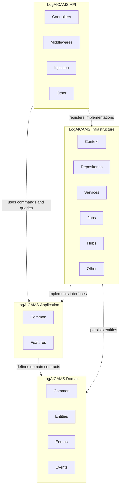
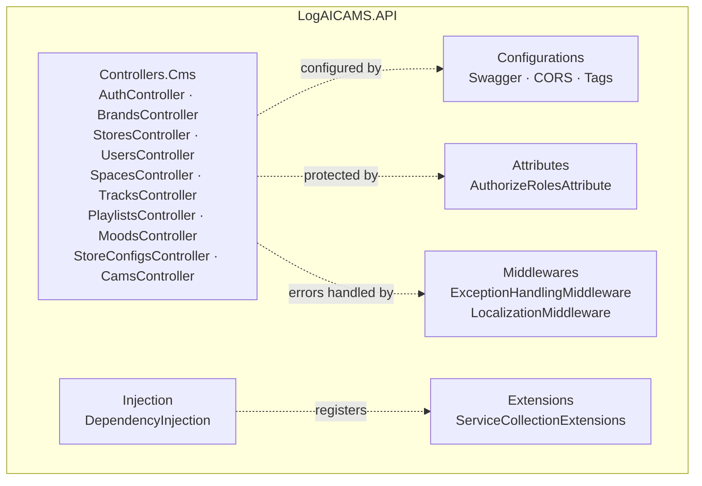
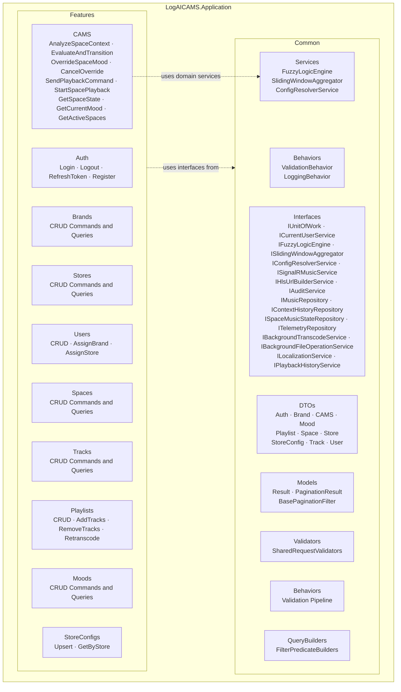
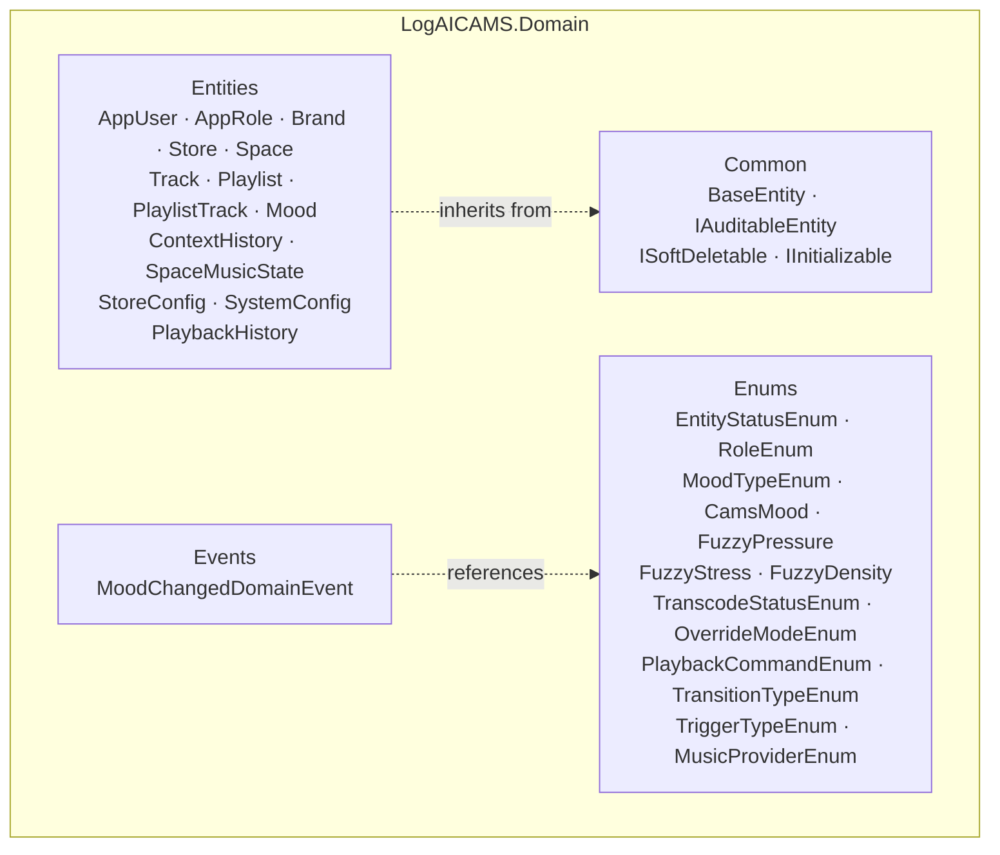
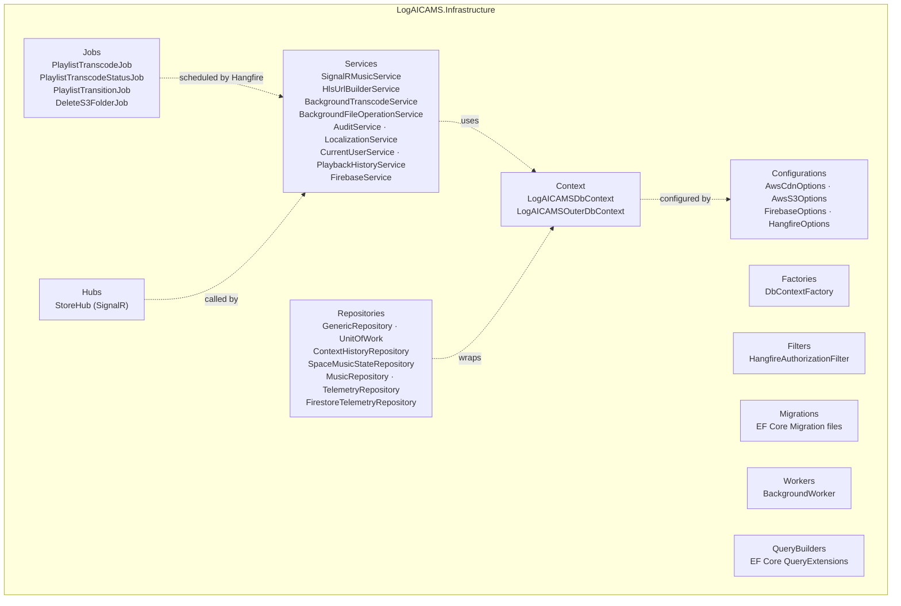

# 1.2 Package Diagram

> The system follows **Clean Architecture** with four assemblies arranged in strict dependency order:  
> `API` → `Application` → `Domain` (innermost, no outward dependency)  
> `Infrastructure` implements contracts defined in `Application` and `Domain`.

---

## 1.2.1 Overall Package Diagram

---

## 1.2.2 LogAICAMS.API — Internal Packages

---

## 1.2.3 LogAICAMS.Application — Internal Packages

---

## 1.2.4 LogAICAMS.Domain — Internal Packages

---

## 1.2.5 LogAICAMS.Infrastructure — Internal Packages

---

## 1.2.6 Package Descriptions

| No  | Package                                       | Description                                                                                                                                                                                                                                                                                                                                                                                                                                                                                                                      |
| --- | --------------------------------------------- | -------------------------------------------------------------------------------------------------------------------------------------------------------------------------------------------------------------------------------------------------------------------------------------------------------------------------------------------------------------------------------------------------------------------------------------------------------------------------------------------------------------------------------- |
| 01  | `LogAICAMS.API`                               | ASP.NET Core Web API entry point. Hosts all HTTP controllers, Swagger configuration, middleware pipeline, dependency injection registration, and authentication/authorization attributes. Depends on Application and registers Infrastructure implementations.                                                                                                                                                                                                                                                                   |
| 02  | `LogAICAMS.API.Controllers.Cms`               | RESTful controller classes for each domain module: Auth, Brands, Stores, Spaces, Users, Tracks, Playlists, Moods, StoreConfigs, and CAMS. Each controller delegates entirely to MediatR commands/queries (thin controller pattern).                                                                                                                                                                                                                                                                                              |
| 03  | `LogAICAMS.API.Attributes`                    | Custom ASP.NET attributes. `AuthorizeRolesAttribute` enforces role-based access control by validating JWT claims against a list of permitted `RoleEnum` values.                                                                                                                                                                                                                                                                                                                                                                  |
| 04  | `LogAICAMS.API.Configurations`                | Swagger/OpenAPI configuration, CORS policy setup, and tag grouping for CMS vs CAMS endpoint categories displayed in the Swagger UI.                                                                                                                                                                                                                                                                                                                                                                                              |
| 05  | `LogAICAMS.API.Middlewares`                   | Cross-cutting pipeline middleware: `ExceptionHandlingMiddleware` catches unhandled exceptions and maps them to structured Problem Details responses; `LocalizationMiddleware` sets the request culture from the Accept-Language header.                                                                                                                                                                                                                                                                                          |
| 06  | `LogAICAMS.API.Injection`                     | Static extension methods that register all layers (Application, Infrastructure) into the ASP.NET Core DI container at startup, keeping `Program.cs` minimal.                                                                                                                                                                                                                                                                                                                                                                     |
| 07  | `LogAICAMS.Application`                       | Application layer following CQRS + MediatR pattern. Contains all use-case orchestration logic. Has no dependency on Infrastructure or ASP.NET Core — only on Domain and its own interfaces.                                                                                                                                                                                                                                                                                                                                      |
| 08  | `LogAICAMS.Application.Common.Interfaces`     | Contracts (interfaces) that the Application layer defines but does not implement. Infrastructure provides the concrete classes. Includes `IUnitOfWork`, `ISignalRMusicService`, `IFuzzyLogicEngine`, `ISlidingWindowAggregator`, `IHlsUrlBuilderService`, `IConfigResolverService`, `IAuditService`, `IMusicRepository`, `IContextHistoryRepository`, `ISpaceMusicStateRepository`, `ITelemetryRepository`, `IBackgroundTranscodeService`, `IBackgroundFileOperationService`, `ILocalizationService`, `IPlaybackHistoryService`. |
| 09  | `LogAICAMS.Application.Common.Services`       | Pure domain services that live in Application (no Infrastructure dependency). Contains `FuzzyLogicEngine` (stateless Fuzzy Logic AI), `SlidingWindowAggregator` (IoT telemetry anti-flapping), and `ConfigResolverService` (hierarchical config: StoreConfig → SystemConfig → default).                                                                                                                                                                                                                                          |
| 10  | `LogAICAMS.Application.Common.Behaviors`      | MediatR pipeline behaviors applied to all requests: `ValidationBehavior` runs FluentValidation before the handler executes; `LoggingBehavior` records request/response timing and errors.                                                                                                                                                                                                                                                                                                                                        |
| 11  | `LogAICAMS.Application.Common.DTOs`           | Data Transfer Objects grouped by domain module (Auth, Brand, CAMS, Mood, Playlist, Space, Store, StoreConfig, Track, User). Separated into request/filter/response types.                                                                                                                                                                                                                                                                                                                                                        |
| 12  | `LogAICAMS.Application.Common.Models`         | Shared result wrappers: `Result<T>`, `PaginationResult<T>`, `BasePaginationFilter`. Provide a uniform envelope for all handler return values.                                                                                                                                                                                                                                                                                                                                                                                    |
| 13  | `LogAICAMS.Application.Common.QueryBuilders`  | Extension methods on `IQueryable<T>` that translate filter DTOs (e.g., `PlaylistFilter`, `TrackFilter`) into EF Core predicates and ordering expressions using `BuildPredicate()` and `BuildOrderBy()`.                                                                                                                                                                                                                                                                                                                          |
| 14  | `LogAICAMS.Application.Features`              | Root namespace containing one sub-namespace per domain module, each following the CQRS structure: `Commands/[CommandName]/` (Command + Handler + Validator) and `Queries/[QueryName]/` (Query + Handler).                                                                                                                                                                                                                                                                                                                        |
| 15  | `LogAICAMS.Application.Features.Auth`         | Authentication use cases: `Login`, `Logout`, `RefreshToken`, `Register`. Integrates with ASP.NET Core Identity via `ICurrentUserService`.                                                                                                                                                                                                                                                                                                                                                                                        |
| 16  | `LogAICAMS.Application.Features.Brands`       | Brand management CRUD: Create, Update, Delete, ToggleStatus, GetBrands, GetBrandById. `BrandManager` write access only for create/update/delete.                                                                                                                                                                                                                                                                                                                                                                                 |
| 17  | `LogAICAMS.Application.Features.Stores`       | Store management CRUD scoped under a Brand. Includes ownership check: `BrandManager` manages stores within their own brand.                                                                                                                                                                                                                                                                                                                                                                                                      |
| 18  | `LogAICAMS.Application.Features.Spaces`       | Physical space management within a store (e.g., a floor, zone, or room). Each space has an `IoTDeviceId` linking it to a Firestore telemetry stream.                                                                                                                                                                                                                                                                                                                                                                             |
| 19  | `LogAICAMS.Application.Features.Users`        | User management CRUD including `AssignUserBrand` and `AssignUserStore` for role assignment. `SystemAdmin` only for create/delete.                                                                                                                                                                                                                                                                                                                                                                                                |
| 20  | `LogAICAMS.Application.Features.Tracks`       | Music track management: upload audio/cover files via `IBackgroundFileOperationService`, duplicate title check per brand, soft-delete blocked when referenced by a playlist.                                                                                                                                                                                                                                                                                                                                                      |
| 21  | `LogAICAMS.Application.Features.Playlists`    | Playlist management: CRUD, `AddTracksToPlaylist`, `RemoveTrackFromPlaylist`, `RetranscodePlaylist`. Integrates with `IBackgroundTranscodeService` for HLS transcode scheduling.                                                                                                                                                                                                                                                                                                                                                  |
| 22  | `LogAICAMS.Application.Features.Moods`        | Mood entity management (Calm, Focus, Energetic, etc.) with BPM range and MoodType. Used as the AI decision output for playlist selection.                                                                                                                                                                                                                                                                                                                                                                                        |
| 23  | `LogAICAMS.Application.Features.StoreConfigs` | Per-store key-value configuration override (e.g., Fuzzy thresholds, sliding window minutes). Consumed by `ConfigResolverService`.                                                                                                                                                                                                                                                                                                                                                                                                |
| 24  | `LogAICAMS.Application.Features.CAMS`         | CAMS AI Engine use cases: `AnalyzeSpaceContext` (full AI cycle), `EvaluateAndTransitionPlaylist` (Hangfire-driven rotation), `OverrideSpaceMood` (manual override), `CancelSpaceOverride`, `SendPlaybackCommand`, `StartSpacePlayback`, `GetSpaceState`, `GetSpaceCurrentMood`, `GetActiveSpacesForCams`.                                                                                                                                                                                                                        |
| 25  | `LogAICAMS.Domain`                            | Innermost layer. Contains enterprise business rules with no external dependencies. Defines entities, enums, base types, and domain events.                                                                                                                                                                                                                                                                                                                                                                                       |
| 26  | `LogAICAMS.Domain.Common`                     | Base classes shared by all entities: `BaseEntity` (Id, CreatedAt, UpdatedAt, IsDeleted), `IAuditableEntity`, `ISoftDeletable`. Provides `InitializeEntity()` and `SoftDeleteEntity()` helper methods.                                                                                                                                                                                                                                                                                                                            |
| 27  | `LogAICAMS.Domain.Entities`                   | All EF Core entity classes: `AppUser`, `Brand`, `Store`, `Space`, `Track`, `Playlist`, `PlaylistTrack`, `Mood`, `ContextHistory`, `SpaceMusicState`, `StoreConfig`, `SystemConfig`, `PlaybackHistory`.                                                                                                                                                                                                                                                                                                                           |
| 28  | `LogAICAMS.Domain.Enums`                      | All enumeration types used across the system: `RoleEnum`, `EntityStatusEnum`, `MoodTypeEnum`, `CamsMood`, `FuzzyPressure`, `FuzzyStress`, `FuzzyDensity`, `TranscodeStatusEnum`, `OverrideModeEnum`, `PlaybackCommandEnum`, `TransitionTypeEnum`, `TriggerTypeEnum`, `MusicProviderEnum`.                                                                                                                                                                                                                                        |
| 29  | `LogAICAMS.Domain.Events`                     | Domain events published via MediatR `INotification`. `MoodChangedDomainEvent` is the core event that drives the EDD playlist-selection and SignalR-push chain.                                                                                                                                                                                                                                                                                                                                                                   |
| 30  | `LogAICAMS.Infrastructure`                    | Outermost layer. Implements all Application interfaces with concrete technology-specific code: EF Core, Hangfire, SignalR, AWS S3, AWS MediaConvert, Firebase/Firestore, CloudFront CDN.                                                                                                                                                                                                                                                                                                                                         |
| 31  | `LogAICAMS.Infrastructure.Context`            | EF Core `DbContext` classes: `LogAICAMSDbContext` (main PostgreSQL schema — entities, config, auth) and `LogAICAMSOuterDbContext` (outer/audit schema). Handles entity configuration, query filters (soft-delete), and relationship mappings via `IEntityTypeConfiguration<T>`.                                                                                                                                                                                                                                                  |
| 32  | `LogAICAMS.Infrastructure.Repositories`       | Concrete repository implementations: `GenericRepository<T>` (paged queries, predicates, includes), `UnitOfWork` (transaction management), `ContextHistoryRepository`, `SpaceMusicStateRepository`, `MusicRepository` (HLS playlist selection with round-robin), `FirestoreTelemetryRepository` (reads IoT telemetry from Google Firestore).                                                                                                                                                                                      |
| 33  | `LogAICAMS.Infrastructure.Services`           | Concrete service implementations: `SignalRMusicService` (wraps `IHubContext<StoreHub>`), `HlsUrlBuilderService` (S3 path → CloudFront URL), `BackgroundTranscodeService` (Hangfire scheduling with 5-min debounce), `BackgroundFileOperationService` (S3 upload/delete), `AuditService` (structured audit logging), `CurrentUserService` (JWT claim extraction), `LocalizationService` (i18n resource loading), `PlaybackHistoryService` (fire-and-forget history), `FirebaseService` (Firebase Admin SDK init).                 |
| 34  | `LogAICAMS.Infrastructure.Hubs`               | SignalR Hub: `StoreHub`. Manages WebSocket connections grouped by `SpaceId`. Tablet and manager clients join the same group to receive real-time music commands (`PlayStream`, `StopPlayback`, `PlaybackStateChanged`, `SpaceStateSync`).                                                                                                                                                                                                                                                                                        |
| 35  | `LogAICAMS.Infrastructure.Jobs`               | Hangfire background jobs: `PlaylistTranscodeJob` (submits AWS MediaConvert job with debounce), `PlaylistTranscodeStatusJob` (polls MediaConvert status and updates DB), `PlaylistTransitionJob` (Hangfire recurring job that checks `ExpectedEndAtUtc` and triggers `EvaluateAndTransitionPlaylist`), `DeleteS3FolderJob` (cleanup HLS transcode outputs from S3).                                                                                                                                                               |
| 36  | `LogAICAMS.Infrastructure.Configurations`     | Strongly-typed options classes mapped from `appsettings.json`: `AwsCdnOptions`, `AwsS3Options`, `AwsMediaConvertOptions`, `FirebaseOptions`, `HangfireOptions`. Bound via `IOptions<T>`.                                                                                                                                                                                                                                                                                                                                         |
| 37  | `LogAICAMS.Infrastructure.Migrations`         | EF Core auto-generated migration files for both `LogAICAMSDbContext` and `LogAICAMSOuterDbContext`. Applied automatically on startup via `MigrationExtensions`.                                                                                                                                                                                                                                                                                                                                                                  |
| 38  | `LogAICAMS.Infrastructure.Factories`          | `DbContextFactory` used by Hangfire jobs and background tasks that need a `DbContext` outside the HTTP request scope (scoped DI boundary).                                                                                                                                                                                                                                                                                                                                                                                       |
| 39  | `LogAICAMS.Infrastructure.Filters`            | Hangfire authorization filter (`HangfireAuthorizationFilter`) that restricts access to the Hangfire Dashboard to `SystemAdmin` role in production.                                                                                                                                                                                                                                                                                                                                                                               |
| 40  | `LogAICAMS.Infrastructure.Workers`            | `IHostedService` background workers started at application startup (e.g., polling workers, warm-up tasks).                                                                                                                                                                                                                                                                                                                                                                                                                       |
| 41  | `LogAICAMS.Infrastructure.QueryBuilders`      | EF Core query extension methods used in repositories for dynamic filtering, ordering, and paging. Keeps `GenericRepository` lean.                                                                                                                                                                                                                                                                                                                                                                                                |
