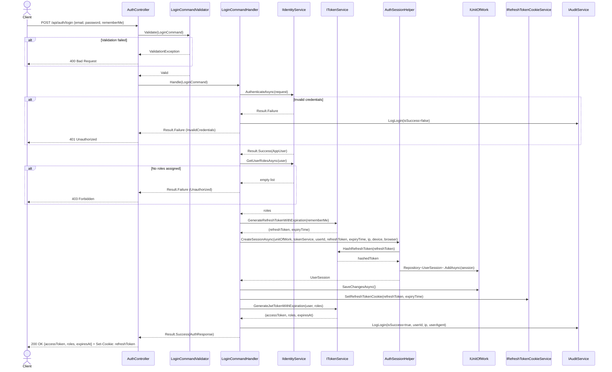
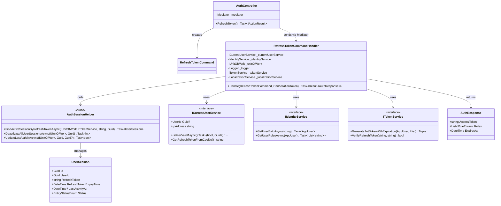
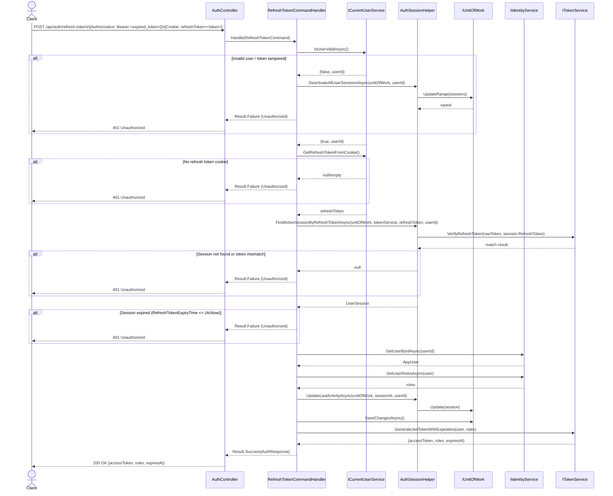
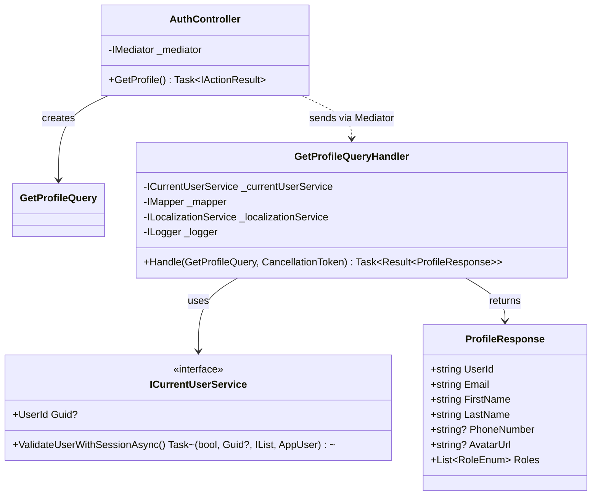
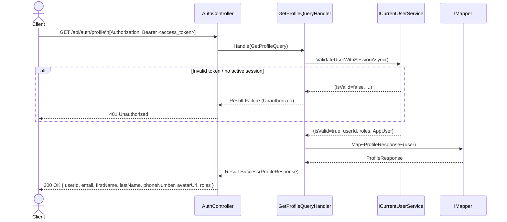
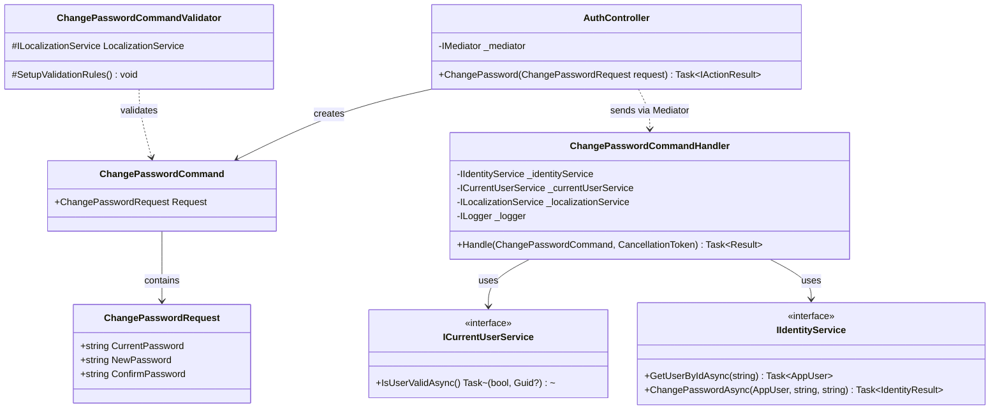
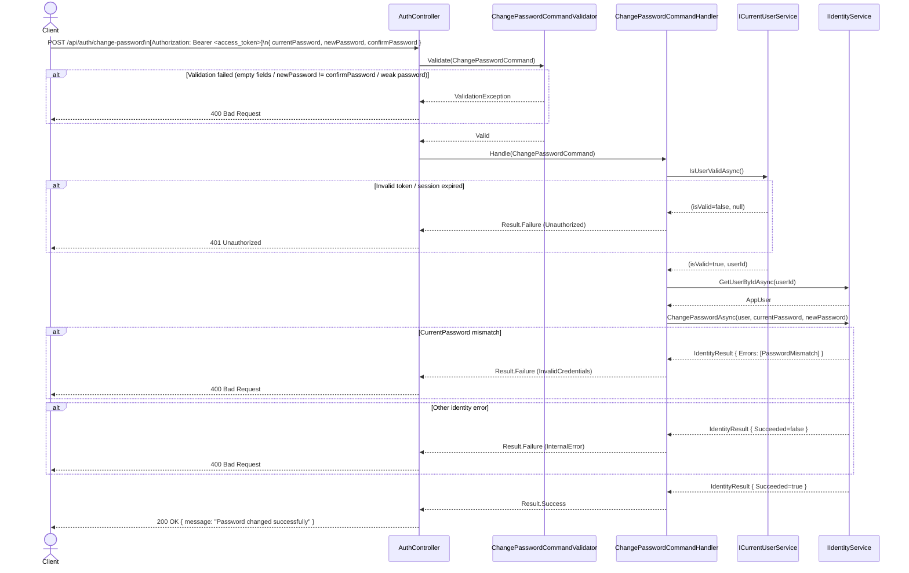

# 3.1 Authentication Feature – Software Design

## 3.1.1 Class Diagram – Login

```mermaid
classDiagram
    class AuthController {
        -IMediator _mediator
        +Login(LoginRequest request) Task~IActionResult~
    }

    class LoginCommand {
        +LoginRequest Request
    }

    class LoginRequest {
        +string Email
        +string Password
        +bool RememberMe
    }

    class LoginCommandValidator {
        #ILocalizationService LocalizationService
        #SetupValidationRules() void
    }

    class LoginCommandHandler {
        -IIdentityService _identityService
        -ITokenService _tokenService
        -IUnitOfWork _unitOfWork
        -ILogger _logger
        -ILocalizationService _localizationService
        -IAuditService _auditService
        -ICurrentUserService _currentUserService
        -IRefreshTokenCookieService _refreshTokenCookieService
        +Handle(LoginCommand, CancellationToken) Task~Result~AuthResponse~~
    }

    class AuthSessionHelper {
        <<static>>
        +CreateSessionAsync(IUnitOfWork, ITokenService, Guid, string, DateTime, string, string, string) Task~UserSession~
        +DeactivateAllUserSessionsAsync(IUnitOfWork, Guid) Task~int~
    }

    class IIdentityService {
        <<interface>>
        +AuthenticateAsync(LoginRequest) Task~Result~AppUser~~
        +GetUserRolesAsync(AppUser) Task~IList~string~~
    }

    class ITokenService {
        <<interface>>
        +GenerateRefreshTokenWithExpiration(bool) Tuple
        +GenerateJwtTokenWithExpiration(AppUser, IList) Tuple
        +HashRefreshToken(string) string
    }

    class IRefreshTokenCookieService {
        <<interface>>
        +SetRefreshTokenCookie(string, DateTime) void
    }

    class IAuditService {
        <<interface>>
        +LogLogin(bool, Guid, string, string, object) void
    }

    class AuthResponse {
        +string AccessToken
        +List~RoleEnum~ Roles
        +DateTime ExpiresAt
    }

    AuthController --> LoginCommand : creates
    AuthController ..> LoginCommandHandler : sends via Mediator
    LoginCommandHandler --> IIdentityService : uses
    LoginCommandHandler --> ITokenService : uses
    LoginCommandHandler --> IRefreshTokenCookieService : uses
    LoginCommandHandler --> IAuditService : uses
    LoginCommandHandler --> AuthSessionHelper : calls
    LoginCommandHandler --> AuthResponse : returns
    LoginCommand --> LoginRequest : contains
    LoginCommandValidator ..> LoginCommand : validates
```

> Ghi chú: `LoginCommandHandler` implement `IRequestHandler<LoginCommand, Result<AuthResponse>>` từ thư viện MediatR (NuGet package), không thuộc source code dự án nên không thể hiện trong class diagram.

---

## 3.1.2 Sequence Diagram – Login

---

## 3.2 Refresh Token Feature – Software Design

## 3.2.1 Class Diagram – Refresh Token

> Ghi chú: `RefreshTokenCommandHandler` implement `IRequestHandler<RefreshTokenCommand, Result<AuthResponse>>` từ thư viện MediatR (NuGet package), không thuộc source code dự án nên không thể hiện trong class diagram.

---

## 3.2.2 Sequence Diagram – Refresh Token

---

## 3.3 Get Profile Feature – Software Design

## 3.3.1 Class Diagram – Get Profile

> Ghi chú: `GetProfileQueryHandler` implement `IRequestHandler<GetProfileQuery, Result<ProfileResponse>>` từ thư viện MediatR (NuGet package), không thuộc source code dự án nên không thể hiện trong class diagram.

---

## 3.3.2 Sequence Diagram – Get Profile

---

## 3.4 Change Password Feature – Software Design

## 3.4.1 Class Diagram – Change Password

> Ghi chú: `ChangePasswordCommandHandler` implement `IRequestHandler<ChangePasswordCommand, Result>` từ thư viện MediatR (NuGet package), không thuộc source code dự án nên không thể hiện trong class diagram.

---

## 3.4.2 Sequence Diagram – Change Password

