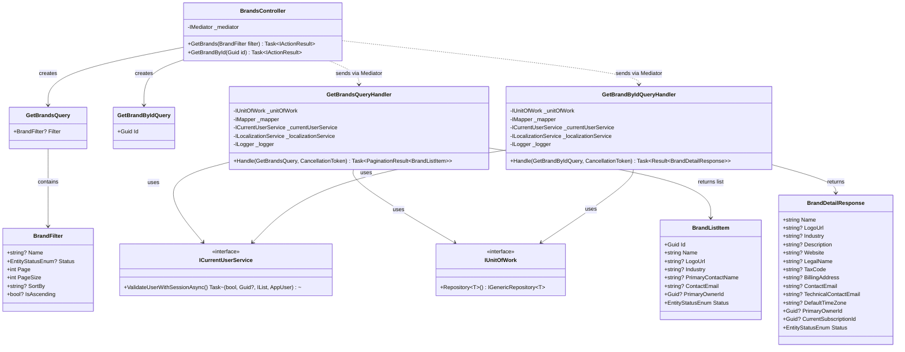
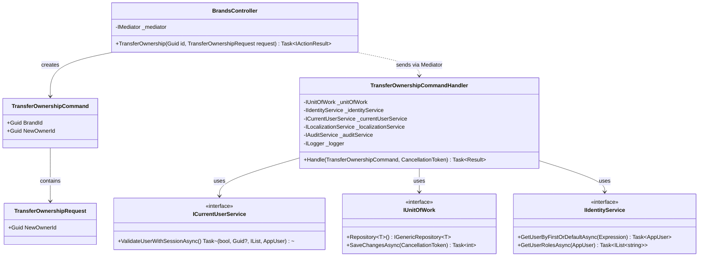
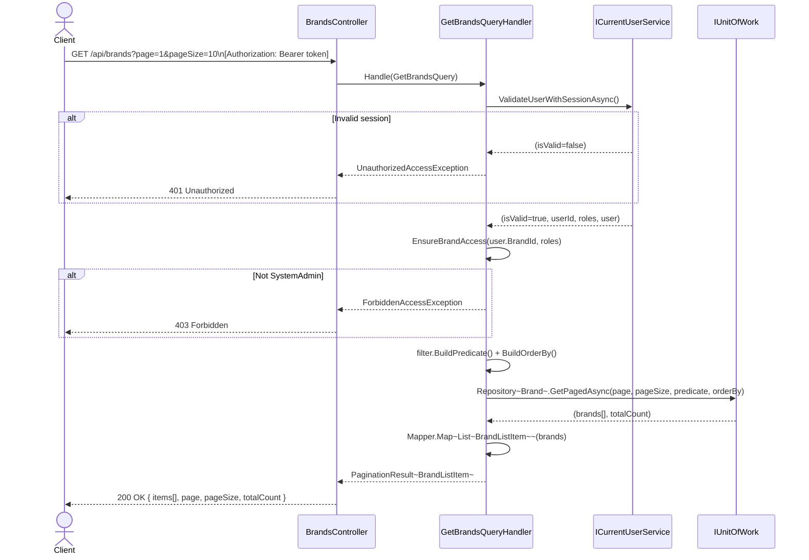
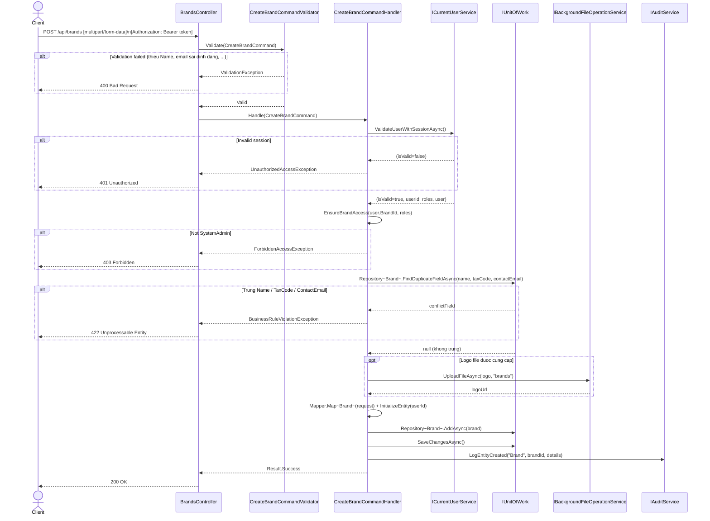
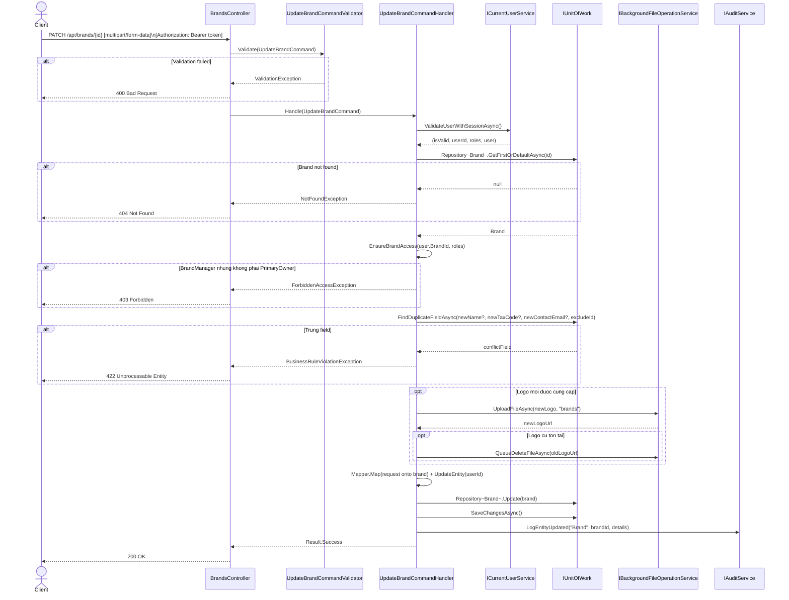
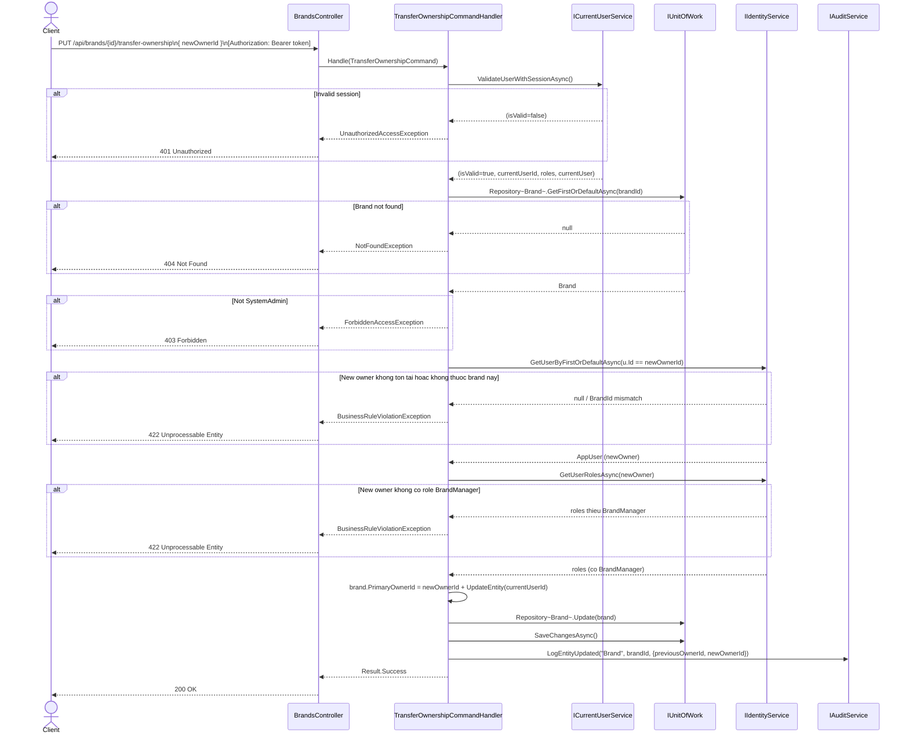

# 3.5 Brand Management – Software Design

> **Screens:** #7 Brand Mgmt List · #8 Create/Edit Brand · #9 Brand Detail View  
> **Roles:** SystemAdmin (all operations) · BrandManager (read own brand, update nếu là PrimaryOwner)  
> **Endpoints:** `GET /api/brands` · `GET /api/brands/{id}` · `POST /api/brands` · `PATCH /api/brands/{id}` · `DELETE /api/brands/{id}` · `PUT /api/brands/{id}/toggle-status` · `PUT /api/brands/{id}/transfer-ownership`

---

## 3.5.1 Class Diagram – Query Side (Read)

> Nhóm này gồm `GetBrandsQueryHandler` và `GetBrandByIdQueryHandler`. Cả hai đều implement `IRequestHandler<TQuery, TResult>` từ MediatR (NuGet), không thể hiện trong diagram.

---

## 3.5.2 Class Diagram – Command Side (Write)

```mermaid
classDiagram
    class BrandsController {
        -IMediator _mediator
        +CreateBrand(BrandRequest request) Task~IActionResult~
        +UpdateBrand(Guid id, BrandRequest request) Task~IActionResult~
        +DeleteBrand(Guid id) Task~IActionResult~
        +ToggleBrandStatus(Guid id) Task~IActionResult~
    }

    class BrandRequest {
        +string? Name
        +IFormFile? Logo
        +string? Description
        +string? Website
        +string? Industry
        +string? LegalName
        +string? TaxCode
        +string? BillingAddress
        +string? ContactEmail
        +string? ContactPhone
        +string? PrimaryContactName
        +string? TechnicalContactEmail
        +string? DefaultTimeZone
    }

    class CreateBrandCommand {
        +BrandRequest Request
    }

    class UpdateBrandCommand {
        +Guid Id
        +BrandRequest Request
    }

    class DeleteBrandCommand {
        +Guid Id
    }

    class ToggleBrandStatusCommand {
        +Guid Id
    }

    class CreateBrandCommandValidator {
        #ILocalizationService LocalizationService
        +Validate(CreateBrandCommand) ValidationResult
    }

    class UpdateBrandCommandValidator {
        #ILocalizationService LocalizationService
        +Validate(UpdateBrandCommand) ValidationResult
    }

    class CreateBrandCommandHandler {
        -IUnitOfWork _unitOfWork
        -IMapper _mapper
        -ICurrentUserService _currentUserService
        -ILocalizationService _localizationService
        -IAuditService _auditService
        -IBackgroundFileOperationService _fileOperationService
        -ILogger _logger
        +Handle(CreateBrandCommand, CancellationToken) Task~Result~
    }

    class UpdateBrandCommandHandler {
        -IUnitOfWork _unitOfWork
        -IMapper _mapper
        -ICurrentUserService _currentUserService
        -ILocalizationService _localizationService
        -IAuditService _auditService
        -IBackgroundFileOperationService _fileOperationService
        -ILogger _logger
        +Handle(UpdateBrandCommand, CancellationToken) Task~Result~
    }

    class DeleteBrandCommandHandler {
        -IUnitOfWork _unitOfWork
        -ICurrentUserService _currentUserService
        -ILocalizationService _localizationService
        -IAuditService _auditService
        -IBackgroundFileOperationService _fileOperationService
        -ILogger _logger
        +Handle(DeleteBrandCommand, CancellationToken) Task~Result~
    }

    class ToggleBrandStatusCommandHandler {
        -IUnitOfWork _unitOfWork
        -ICurrentUserService _currentUserService
        -ILocalizationService _localizationService
        -IAuditService _auditService
        -ILogger _logger
        +Handle(ToggleBrandStatusCommand, CancellationToken) Task~Result~
    }

    class IBackgroundFileOperationService {
        <<interface>>
        +UploadFileAsync(IFormFile, string, CancellationToken) Task~string~
        +QueueDeleteFileAsync(string) void
    }

    class IAuditService {
        <<interface>>
        +LogEntityCreated(string, string, object, bool) void
        +LogEntityUpdated(string, string, object, bool) void
        +LogEntityDeleted(string, string, object, bool) void
        +LogEntityToggleStatus(string, string, object, bool) void
    }

    class ICurrentUserService {
        <<interface>>
        +ValidateUserWithSessionAsync() Task~(bool, Guid?, IList, AppUser)~
    }

    class IUnitOfWork {
        <<interface>>
        +Repository~T~() IGenericRepository~T~
        +SaveChangesAsync(CancellationToken) Task~int~
    }

    BrandsController --> CreateBrandCommand : creates
    BrandsController --> UpdateBrandCommand : creates
    BrandsController --> DeleteBrandCommand : creates
    BrandsController --> ToggleBrandStatusCommand : creates
    BrandsController ..> CreateBrandCommandHandler : sends via Mediator
    BrandsController ..> UpdateBrandCommandHandler : sends via Mediator
    BrandsController ..> DeleteBrandCommandHandler : sends via Mediator
    BrandsController ..> ToggleBrandStatusCommandHandler : sends via Mediator
    CreateBrandCommand --> BrandRequest : contains
    UpdateBrandCommand --> BrandRequest : contains
    CreateBrandCommandValidator ..> CreateBrandCommand : validates
    UpdateBrandCommandValidator ..> UpdateBrandCommand : validates
    CreateBrandCommandHandler --> ICurrentUserService : uses
    CreateBrandCommandHandler --> IUnitOfWork : uses
    CreateBrandCommandHandler --> IBackgroundFileOperationService : uses
    CreateBrandCommandHandler --> IAuditService : uses
    UpdateBrandCommandHandler --> ICurrentUserService : uses
    UpdateBrandCommandHandler --> IUnitOfWork : uses
    UpdateBrandCommandHandler --> IBackgroundFileOperationService : uses
    UpdateBrandCommandHandler --> IAuditService : uses
    DeleteBrandCommandHandler --> ICurrentUserService : uses
    DeleteBrandCommandHandler --> IUnitOfWork : uses
    DeleteBrandCommandHandler --> IBackgroundFileOperationService : uses
    DeleteBrandCommandHandler --> IAuditService : uses
    ToggleBrandStatusCommandHandler --> ICurrentUserService : uses
    ToggleBrandStatusCommandHandler --> IUnitOfWork : uses
    ToggleBrandStatusCommandHandler --> IAuditService : uses
```

> Nhóm này gồm `CreateBrandCommandHandler`, `UpdateBrandCommandHandler`, `DeleteBrandCommandHandler`, `ToggleBrandStatusCommandHandler`. Tất cả implement `IRequestHandler<TCommand, Result>` từ MediatR (NuGet), không thể hiện trong diagram.

---

## 3.5.3 Class Diagram – Special Operations

> `TransferOwnershipCommandHandler` implement `IRequestHandler<TransferOwnershipCommand, Result>` từ MediatR (NuGet), không thể hiện trong diagram.

---

## 3.5.4 Sequence Diagram – Get Brands List

---

## 3.5.5 Sequence Diagram – Create Brand

---

## 3.5.6 Sequence Diagram – Update Brand

---

## 3.5.7 Sequence Diagram – Delete Brand

```mermaid
sequenceDiagram
    actor Client
    participant BrandsController
    participant DeleteBrandCommandHandler
    participant ICurrentUserService
    participant IUnitOfWork
    participant IBackgroundFileOperationService
    participant IAuditService

    Client->>BrandsController: DELETE /api/brands/{id}\n[Authorization: Bearer token]
    BrandsController->>DeleteBrandCommandHandler: Handle(DeleteBrandCommand)

    DeleteBrandCommandHandler->>ICurrentUserService: ValidateUserWithSessionAsync()
    ICurrentUserService-->>DeleteBrandCommandHandler: (isValid, userId, roles, user)

    DeleteBrandCommandHandler->>IUnitOfWork: Repository~Brand~.GetByIdAsync(id)
    alt Brand not found
        IUnitOfWork-->>DeleteBrandCommandHandler: null
        DeleteBrandCommandHandler-->>BrandsController: NotFoundException
        BrandsController-->>Client: 404 Not Found
    end
    IUnitOfWork-->>DeleteBrandCommandHandler: Brand

    DeleteBrandCommandHandler->>DeleteBrandCommandHandler: EnsureBrandAccess(user.BrandId, roles)
    alt Not SystemAdmin
        DeleteBrandCommandHandler-->>BrandsController: ForbiddenAccessException
        BrandsController-->>Client: 403 Forbidden
    end

    DeleteBrandCommandHandler->>IUnitOfWork: Repository~Store~.AnyAsync(s.BrandId == id)
    alt Con Store lien ket
        IUnitOfWork-->>DeleteBrandCommandHandler: true
        DeleteBrandCommandHandler-->>BrandsController: BusinessRuleViolationException
        BrandsController-->>Client: 422 Unprocessable Entity
    end

    DeleteBrandCommandHandler->>IUnitOfWork: Repository~BrandSubscription~.AnyAsync(s.BrandId == id)
    alt Con BrandSubscription lien ket
        IUnitOfWork-->>DeleteBrandCommandHandler: true
        DeleteBrandCommandHandler-->>BrandsController: BusinessRuleViolationException
        BrandsController-->>Client: 422 Unprocessable Entity
    end

    DeleteBrandCommandHandler->>IUnitOfWork: Repository~Brand~.SoftDelete(brand) + UpdateEntity(userId)
    DeleteBrandCommandHandler->>IUnitOfWork: SaveChangesAsync()

    opt Logo file ton tai
        DeleteBrandCommandHandler->>IBackgroundFileOperationService: QueueDeleteFileAsync(brand.LogoUrl)
    end

    DeleteBrandCommandHandler->>IAuditService: LogEntityDeleted("Brand", brandId, details)
    DeleteBrandCommandHandler-->>BrandsController: Result.Success
    BrandsController-->>Client: 200 OK
```

---

## 3.5.8 Sequence Diagram – Transfer Ownership

