```mermaid
classDiagram
direction TB

%% ══════════════════════════════════════════════════════
%% DOMAIN LAYER
%% ══════════════════════════════════════════════════════

class BaseEntity {
  +Guid Id
  +DateTime CreatedAt
  +Guid CreatedBy
  +DateTime UpdatedAt
  +bool IsDeleted
  +EntityStatusEnum Status
}

class Brand {
  +string Name
  +string LegalName
  +string TaxCode
  +string ContactEmail
  +string DefaultTimeZone
  +Guid PrimaryOwnerId
}

class Store {
  +Guid BrandId
  +string Name
  +string Address
  +string TimeZone
  +int MaxCapacity
}

class Space {
  +Guid StoreId
  +string Name
  +SpaceTypeEnum Type
  +int MaxOccupancy
  +int CriticalQueueThreshold
  +string IoTDeviceId
}

class Mood {
  +MoodTypeEnum MoodType
  +string Name
  +int MinBpm
  +int MaxBpm
  +string Genre
  +int EnergyLevel
}

class Playlist {
  +Guid StoreId
  +Guid MoodId
  +string Name
  +bool IsDefault
  +string HlsUrl
  +int TotalDurationSeconds
  +TranscodeStatusEnum TranscodeStatus
  +int TranscodeVersion
}

class Track {
  +Guid BrandId
  +Guid MoodId
  +string Title
  +string Artist
  +int Bpm
  +string AudioUrl
  +int DurationSec
}

class PlaylistTrack {
  +Guid PlaylistId
  +Guid TrackId
  +int OrderIndex
}

class SpaceMusicState {
  +Guid SpaceId
  +Guid StoreId
  +Guid BrandId
  +Guid CurrentPlaylistId
  +DateTime StartedAtUtc
  +DateTime ExpectedEndAtUtc
  +string CurrentMoodTag
  +bool IsManualOverride
  +OverrideModeEnum OverrideMode
  +bool IsPaused
}

class ContextHistory {
  +long Id
  +Guid SpaceId
  +Guid MoodId
  +DateTime MeasuredAt
  +float AvgTemperature
  +int CrowdDensity
}

class StoreConfig {
  +Guid StoreId
  +string Key
  +string Value
  +string Category
}

class AppUser {
  +string FirstName
  +string LastName
  +Guid BrandId
  +Guid StoreId
  +EntityStatusEnum Status
}

class BrandGlobalConfig {
  +Guid BrandId
  +Guid DefaultMoodId
  +TimeOnly OpenTime
  +TimeOnly CloseTime
  +int CrossfadeSec
}

class SystemConfig {
  +string Key
  +string Value
  +string ConfigGroup
}

%% Domain inheritance
BaseEntity <|-- Brand
BaseEntity <|-- Store
BaseEntity <|-- Space
BaseEntity <|-- Mood
BaseEntity <|-- Playlist
BaseEntity <|-- Track
BaseEntity <|-- PlaylistTrack
BaseEntity <|-- SpaceMusicState
BaseEntity <|-- StoreConfig
BaseEntity <|-- BrandGlobalConfig
BaseEntity <|-- SystemConfig

%% Domain associations
Brand "1" --> "many" Store : has
Brand "1" --> "many" Track : owns
Store "1" --> "many" Space : contains
Store "1" --> "many" Playlist : has
Store "1" --> "many" StoreConfig : configured by
Space "1" --> "1" SpaceMusicState : tracks state
Space "1" --> "many" ContextHistory : logs
Playlist "1" --> "many" PlaylistTrack : contains
Track "1" --> "many" PlaylistTrack : in
Mood "1" --> "many" Playlist : categorizes
Mood "1" --> "many" Track : categorizes
Brand "1" --> "1" BrandGlobalConfig : has
Brand "1" --> "many" AppUser : manages

%% ══════════════════════════════════════════════════════
%% APPLICATION LAYER — Interfaces
%% ══════════════════════════════════════════════════════

class IFuzzyLogicEngine {
  <<interface>>
  +Analyze(payload, thresholds) FuzzyAnalysisResult
}

class ISlidingWindowAggregator {
  <<interface>>
  +AggregateAsync(deviceId, minutes) SlidingWindowResult
}

class IConfigResolverService {
  <<interface>>
  +GetIntAsync(spaceId, storeId, key, default) int
  +GetDecimalAsync(spaceId, storeId, key, default) decimal
}

class ITelemetryRepository {
  <<interface>>
  +GetLatestAsync(deviceId) IotTelemetryPayload
  +GetLastNMinutesAsync(deviceId, minutes) List
}

class IMusicRepository {
  <<interface>>
  +GetHlsPlaylistAsync(mood, brandId, storeId, exclude) HlsPlaylistInfo
}

class ISpaceMusicStateRepository {
  <<interface>>
  +GetBySpaceIdAsync(spaceId) SpaceMusicState
  +UpsertAsync(state) void
  +GetExpiredOrUnstartedAsync(buffer) List
}

class IContextHistoryRepository {
  <<interface>>
  +AddAsync(history) void
}

class ISignalRMusicService {
  <<interface>>
  +PushPlayStreamAsync(spaceId, playlist, event) void
  +PushStopPlaybackAsync(spaceId, reason) void
  +PushManualPlayStreamAsync(spaceId, playlist, ...) void
  +PushSpaceStateSyncAsync(spaceId, state) void
}

class IHlsUrlBuilderService {
  <<interface>>
  +BuildUrl(rawPathOrUrl) string
  +CloudFrontDomain string
}

class IPlaybackHistoryService {
  <<interface>>
  +LogPlaybackStarted(spaceId, playlistId, trigger) void
}

class IUnitOfWork {
  <<interface>>
  +Repository~T~() IGenericRepository
  +SaveChangesAsync() int
}

%% ══════════════════════════════════════════════════════
%% APPLICATION LAYER — Services
%% ══════════════════════════════════════════════════════

class FuzzyLogicEngine {
  -ILogger logger
  +Analyze(payload, thresholds) FuzzyAnalysisResult
  -FuzzifyPressure(count, thresholds) FuzzyPressure
  -FuzzifyStress(temp, thresholds) FuzzyStress
  -FuzzifyDensity(wifi, thresholds) FuzzyDensity
  -InferMood(pressure, stress, density) CamsMood
}

class SlidingWindowAggregator {
  -ITelemetryRepository telemetryRepo
  +AggregateAsync(deviceId, minutes) SlidingWindowResult
}

class ConfigResolverService {
  -IUnitOfWork unitOfWork
  +GetIntAsync(...) int
  +GetDecimalAsync(...) decimal
}

%% ══════════════════════════════════════════════════════
%% APPLICATION LAYER — Command Handlers (CAMS)
%% ══════════════════════════════════════════════════════

class AnalyzeSpaceContextCommandHandler {
  -ISlidingWindowAggregator windowAggregator
  -IFuzzyLogicEngine fuzzyEngine
  -IConfigResolverService configResolver
  -IContextHistoryRepository historyRepo
  -IMediator mediator
  +Handle(command) void
}

class EvaluateAndTransitionPlaylistCommandHandler {
  -ISlidingWindowAggregator windowAggregator
  -IFuzzyLogicEngine fuzzyEngine
  -IConfigResolverService configResolver
  -ISpaceMusicStateRepository stateRepo
  -IContextHistoryRepository historyRepo
  -IMediator mediator
  +Handle(command) void
}

class MoodChangedDomainEventHandler {
  -IMediator mediator
  +Handle(event) void
}

class StartSpacePlaybackCommandHandler {
  -IMusicRepository musicRepo
  -ISpaceMusicStateRepository stateRepo
  -ISignalRMusicService signalRService
  -IHlsUrlBuilderService hlsUrlBuilder
  -IPlaybackHistoryService playbackHistoryService
  +Handle(command) void
}

class OverrideSpaceMoodCommandHandler {
  -IMusicRepository musicRepo
  -ISpaceMusicStateRepository stateRepo
  -ISignalRMusicService signalRService
  +Handle(command) void
}

%% Interface implementations (Application)
IFuzzyLogicEngine <|.. FuzzyLogicEngine : implements
ISlidingWindowAggregator <|.. SlidingWindowAggregator : implements
IConfigResolverService <|.. ConfigResolverService : implements

%% Application dependencies
AnalyzeSpaceContextCommandHandler --> ISlidingWindowAggregator
AnalyzeSpaceContextCommandHandler --> IFuzzyLogicEngine
AnalyzeSpaceContextCommandHandler --> IConfigResolverService
EvaluateAndTransitionPlaylistCommandHandler --> ISlidingWindowAggregator
EvaluateAndTransitionPlaylistCommandHandler --> IFuzzyLogicEngine
MoodChangedDomainEventHandler ..> StartSpacePlaybackCommandHandler : sends command
StartSpacePlaybackCommandHandler --> IMusicRepository
StartSpacePlaybackCommandHandler --> ISpaceMusicStateRepository
StartSpacePlaybackCommandHandler --> ISignalRMusicService
StartSpacePlaybackCommandHandler --> IHlsUrlBuilderService
SlidingWindowAggregator --> ITelemetryRepository

%% ══════════════════════════════════════════════════════
%% INFRASTRUCTURE LAYER — Repositories
%% ══════════════════════════════════════════════════════

class GenericRepository~T~ {
  -LogAICAMSDbContext db
  +FindAsync(predicate) List
  +FirstOrDefaultAsync(predicate) T
  +AddAsync(entity) void
  +Update(entity) void
}

class UnitOfWork {
  -LogAICAMSDbContext db
  +Repository~T~() IGenericRepository
  +SaveChangesAsync() int
}

class MusicRepository {
  -LogAICAMSDbContext db
  +GetHlsPlaylistAsync(mood, storeId, exclude) HlsPlaylistInfo
  -SelectRoundRobin(candidates, excludeId) Playlist
}

class SpaceMusicStateRepository {
  -LogAICAMSDbContext db
  +GetBySpaceIdAsync(spaceId) SpaceMusicState
  +UpsertAsync(state) void
  +GetExpiredOrUnstartedAsync(buffer) List
}

class FirestoreTelemetryRepository {
  -FirestoreDb firestoreDb
  -FirestoreOptions opts
  +GetLatestAsync(deviceId) IotTelemetryPayload
  +GetLastNMinutesAsync(deviceId, minutes) List
  -MapDocument(doc, deviceId) IotTelemetryPayload
}

class MockTelemetryRepository {
  -MockPayloads IotTelemetryPayload[]
  +GetLatestAsync(deviceId) IotTelemetryPayload
  +GetLastNMinutesAsync(deviceId, minutes) List
}

class ContextHistoryRepository {
  -LogAICAMSDbContext db
  +AddAsync(history) void
}

%% Infrastructure interface implementations
IUnitOfWork <|.. UnitOfWork : implements
IMusicRepository <|.. MusicRepository : implements
ISpaceMusicStateRepository <|.. SpaceMusicStateRepository : implements
ITelemetryRepository <|.. FirestoreTelemetryRepository : implements (prod)
ITelemetryRepository <|.. MockTelemetryRepository : implements (dev)
IContextHistoryRepository <|.. ContextHistoryRepository : implements

%% ══════════════════════════════════════════════════════
%% INFRASTRUCTURE LAYER — Services
%% ══════════════════════════════════════════════════════

class SignalRMusicService {
  -IHubContext~StoreHub~ hubContext
  +PushPlayStreamAsync(spaceId, playlist, event) void
  +PushStopPlaybackAsync(spaceId, reason) void
  +PushManualPlayStreamAsync(...) void
}

class HlsUrlBuilderService {
  -AwsCdnOptions cdnOptions
  +BuildUrl(rawPathOrUrl) string
  +CloudFrontDomain string
}

class MediaConvertService {
  -AmazonElasticTranscoderClient client
  +SubmitJobAsync(playlistId) string
  +GetJobStatusAsync(jobId) TranscodeStatus
}

class PlaybackHistoryService {
  +LogPlaybackStarted(spaceId, playlistId, trigger) void
}

class TokenService {
  +GenerateAccessToken(user, roles) string
  +GenerateRefreshToken() string
  +ValidateToken(token) ClaimsPrincipal
}

%% Interface implementations (Infrastructure services)
ISignalRMusicService <|.. SignalRMusicService : implements
IHlsUrlBuilderService <|.. HlsUrlBuilderService : implements
IPlaybackHistoryService <|.. PlaybackHistoryService : implements

%% ══════════════════════════════════════════════════════
%% INFRASTRUCTURE LAYER — Workers & Jobs
%% ══════════════════════════════════════════════════════

class ContextAnalysisWorker {
  <<BackgroundService>>
  -IServiceScopeFactory scopeFactory
  -AnalysisInterval = 60s
  +ExecuteAsync(token) void
  -RunCycleAsync() void
}

class PlaylistTransitionJob {
  <<HangfireJob>>
  -IServiceProvider serviceProvider
  -TransitionBufferSeconds = 30
  +ExecuteAsync() void
  -ClearExpiredOverridesAsync() void
}

class PlaylistTranscodeJob {
  <<HangfireJob>>
  +ExecuteAsync(playlistId, requestedAt) void
}

class PlaylistTranscodeStatusJob {
  <<HangfireJob>>
  +ExecuteAsync(playlistId, jobId) void
}

class AuditLogJob {
  <<HangfireJob>>
  +ExecuteAsync(payload) void
}

%% Worker dependencies
ContextAnalysisWorker ..> AnalyzeSpaceContextCommandHandler : dispatches
PlaylistTransitionJob ..> EvaluateAndTransitionPlaylistCommandHandler : dispatches

%% ══════════════════════════════════════════════════════
%% API LAYER — Controllers
%% ══════════════════════════════════════════════════════

class CamsController {
  <<ApiController>>
  +TriggerAnalysis(spaceId, request) IActionResult
  +ForceTransition(spaceId, request) IActionResult
  +GetCurrentMood(spaceId) IActionResult
}

class PlaylistsController {
  <<ApiController>>
  +Create(request) IActionResult
  +Update(id, request) IActionResult
  +Delete(id) IActionResult
  +RequestTranscode(id) IActionResult
}

class BrandsController {
  <<ApiController>>
  +GetAll() IActionResult
  +Create(request) IActionResult
  +Update(id, request) IActionResult
}

class StoresController {
  <<ApiController>>
  +GetAll(brandId) IActionResult
  +Create(request) IActionResult
}

class SpacesController {
  <<ApiController>>
  +GetAll(storeId) IActionResult
  +Create(request) IActionResult
  +GetState(spaceId) IActionResult
}

class AuthController {
  <<ApiController>>
  +Login(request) IActionResult
  +RefreshToken() IActionResult
  +Logout() IActionResult
}

class TracksController {
  <<ApiController>>
  +GetAll(brandId, moodId) IActionResult
  +Upload(request) IActionResult
}

%% API → Application
CamsController ..> AnalyzeSpaceContextCommandHandler : sends via IMediator
CamsController ..> EvaluateAndTransitionPlaylistCommandHandler : sends via IMediator
PlaylistsController ..> PlaylistTranscodeJob : triggers via IMediator
```

# CAMS — Class Diagram (Full Architecture)

## 3.1.1 Class Diagram

Biểu đồ lớp toàn dự án Log.AI-CAMS theo kiến trúc Clean Architecture 4 layer:
**Domain → Application → Infrastructure → API**

---

---

## Layer Summary

| Layer | Thành phần | Số lượng |
|---|---|---|
| **Domain** | Entities (Brand, Store, Space, Playlist, Track, Mood, ...) | 25 classes |
| **Application** | Interfaces, Services, Command/Query Handlers | 30+ interfaces, 3 services, 7 CAMS handlers |
| **Infrastructure** | Repositories, Services, Workers, Jobs | 6 repos, 12 services, 1 worker, 8 jobs |
| **API** | Controllers | 10 controllers |

## Quan hệ chính

| Quan hệ | Ký hiệu Mermaid | Ý nghĩa |
|---|---|---|
| Kế thừa (inheritance) | `<\|--` | `BaseEntity <\|-- Brand` |
| Implement interface | `<\|..` | `MusicRepository ..\|> IMusicRepository` |
| Association | `-->` | `Brand --> Store` |
| Dependency (sử dụng) | `..>` | `CamsController ..> Handler` |
| Composition | `*--` | `Playlist *-- PlaylistTrack` |
