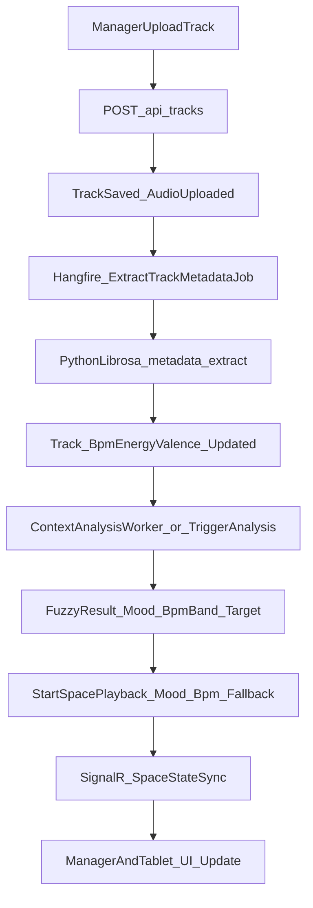
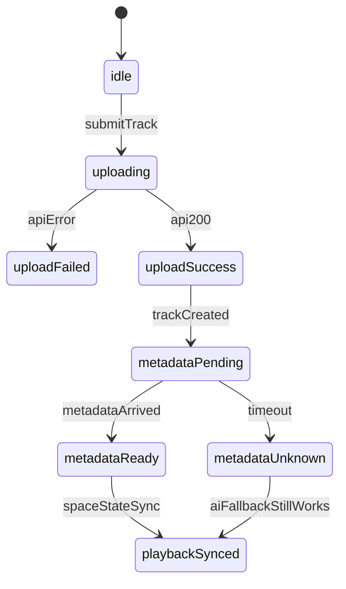

# FE Guide: Tu Extract Metadata den Refactor Fuzzy Logic AI

Tai lieu nay danh cho team Frontend de implement tron ven luong CAMS moi:

1. Manager upload track (manual/Suno).
2. Backend extract metadata bang Python `librosa` (async).
3. Fuzzy engine phan tich telemetry va quyet dinh mood + BPM band.
4. Queue AI refill theo mood + BPM + fallback.
5. Realtime sync qua SignalR de FE cap nhat trang thai.

Tai lieu lien quan:

- `docs/cams/SDD_TRACK_METADATA_PYTHON_SERVICE.md`
- `docs/cams/SDD_BPM_BASED_AI_QUEUE.md`
- `docs/cams-engine/FUZZYLOGIC_MUSIC_SELECTION_EXPLAINED.md`
- `docs/cams/SIGNALR_STOREHUB.md`
- `docs/cams/API_CAMS.md`
- `docs/tracks/API_Tracks.md`

---

## 1) End-to-End Flow (goc nhin FE)



**Diem quan trong:** metadata extraction la bat dong bo. FE khong duoc gia dinh `bpm` co ngay sau khi upload thanh cong.

---

## 2) Contract Track Metadata (manual upload va Suno-generated track)

## 2.1 API tao track

- Endpoint: `POST /api/tracks` (`multipart/form-data`)
- Response thanh cong: `isSuccess=true` (track da duoc tao)
- Sau do backend moi enqueue `ExtractTrackMetadataJob`

## 2.2 Cac field FE can su dung

Track payload can map day du cac field:

- `provider` (vd: `Custom`, `Suno`)
- `isAiGenerated`
- `sunoClipId`
- `generationPrompt`
- `generatedAt`
- `bpm`
- `energyLevel`
- `valence`
- `audioUrl` / `hlsUrl` / `transcodeStatus` (neu co)

## 2.3 Metadata state tren FE (de render badge/trang thai)

De xuat state machine don gian:

- `metadataPending`: vua tao track, chua co metadata dung (`bpm` null/0, `energyLevel` null, `valence` null)
- `metadataReady`: co du bo metadata co y nghia
- `metadataUnknown`: qua thoi gian timeout van chua co metadata

De xuat timeout FE: `30-120s` tuy moi truong (local/EC2).

---

## 3) Fuzzy Logic Refactor: FE can thay doi gi

Sau refactor, logic chon nhac khong con la mood-only:

1. Fuzzy engine tra ve `Mood` + `RecommendedBpmMin/Max/Target`
2. AI queue selector loc theo BPM band
3. Neu pool BPM qua nho, backend fallback ve mood-only de giu do dai queue

He qua cho FE:

- Khong mo ta AI la "random thuần"
- Nen hien thi explainability khi co du lieu:
  - rule fired
  - mood
  - bpm band
  - fallback co duoc dung hay khong

Goi y UI text:

- `AI dang phat mood Focus, BPM 85-105`
- `Da dung fallback mood-only de giu queue on dinh`

---

## 4) Realtime First: uu tien SpaceStateSync

Realtime su dung `StoreHub` (`/hubs/store`), event can quan tam:

- `PlayStream`
- `PlaybackStateChanged`
- `SpaceStateSync` (source of truth)
- `StopPlayback`

Nguyen tac FE:

1. Xu ly hanh dong tuc thoi tu `PlaybackStateChanged` (pause/resume/seek/skip)
2. Luon reconcile UI bang `SpaceStateSync` ngay sau do
3. Khi reconnect:
   - rejoin group
   - goi `GET /api/cams/spaces/{spaceId}/state` (hoac route theo device session) de hard-sync

Chi tiet payload va enum: xem `docs/cams/SIGNALR_STOREHUB.md`.

---

## 5) De xuat FE Types (TypeScript)

```ts
export type TrackMetadataStatus =
  | 'metadataPending'
  | 'metadataReady'
  | 'metadataUnknown';

export interface TrackVM {
  id: string;
  title: string;
  artist?: string | null;
  provider?: number | null;
  isAiGenerated?: boolean | null;
  sunoClipId?: string | null;
  generationPrompt?: string | null;
  generatedAt?: string | null;
  bpm?: number | null;
  energyLevel?: number | null;
  valence?: number | null;
  metadataStatus: TrackMetadataStatus;
}

export interface SpacePlaybackVM {
  spaceId: string;
  currentPlaylistId?: string | null;
  currentPlaylistName?: string | null;
  moodName?: string | null;
  isManualOverride: boolean;
  startedAtUtc?: string | null;
  isPaused: boolean;
  pausePositionSeconds?: number | null;
  pendingPlaylistId?: string | null;
  pendingOverrideReason?: string | null;
  seekOffsetSeconds?: number | null;
}
```

---

## 6) FE State Machine (de khong block UX)



Muc tieu: track van co the tham gia luong playback (qua fallback) du metadata den cham.

---

## 7) API + Realtime Integration Checklist (cho FE implement)

1. **Upload Track**
   - Goi `POST /api/tracks`
   - Show toast thanh cong ngay khi API 200/201
   - Khong cho metadata xong moi render

2. **Track List / Track Detail**
   - Render null-safe cho `bpm`, `energyLevel`, `valence`
   - Co badge metadata status
   - Co filter theo `provider`, `isAiGenerated` neu can

3. **Space Playback Screen**
   - Subscribe SignalR StoreHub
   - `PlaybackStateChanged` de update ngay
   - `SpaceStateSync` de overwrite lai state chinh xac

4. **Explainability Panel (khuyen nghi)**
   - Hien mood hien tai, BPM band de manager hieu AI dang lam gi
   - Hien thong bao fallback khi queue duoc lap day nho mood-only

5. **Reconnect Strategy**
   - Retry connect hub
   - Rejoin group
   - Re-fetch `GET state` de tinh lai offset dung

---

## 8) QA Scenarios bat buoc cho FE

1. **Upload track thanh cong, metadata den sau**
   - UI co track ngay
   - Metadata update muon van cap nhat dung item, khong reload full page

2. **Trigger analysis + AI refill**
   - UI nhan `SpaceStateSync`
   - Queue/now playing cap nhat dung theo mood moi

3. **Khong du track co BPM**
   - Backend fallback mood-only
   - FE khong hien loi "AI failed" neu van co queue phat

4. **Reconnect trong luc dang phat**
   - FE khoi phuc dung trang thai pause/resume/offset
   - Khong bi reset ve 0s neu state da co `startedAtUtc`

---

## 9) Suno AI Integration Readiness (cho FE)

He thong da co san cac field o level `Track` de FE dung ngay:

- `provider`
- `isAiGenerated`
- `sunoClipId`
- `generationPrompt`
- `generatedAt`

Khi backend mo API generate nhac tu Suno:

- FE chi can them buoc "tao track tu prompt"
- Phan sau van giong manual upload:
  - metadata extraction
  - fuzzy selection
  - realtime playback sync

Noi cach khac, FE co the tai su dung 80-90% luong da implement tu tai lieu nay.

---

## 10) Definition of Done (Frontend)

Task duoc xem la done khi:

- Track upload khong block boi metadata extraction
- Metadata badge/status hoat dong dung tren list + detail
- Space playback man hinh on dinh voi `SpaceStateSync` la source of truth
- Reconnect khong lam sai offset/playback state
- QA pass 4 scenario o muc 8
