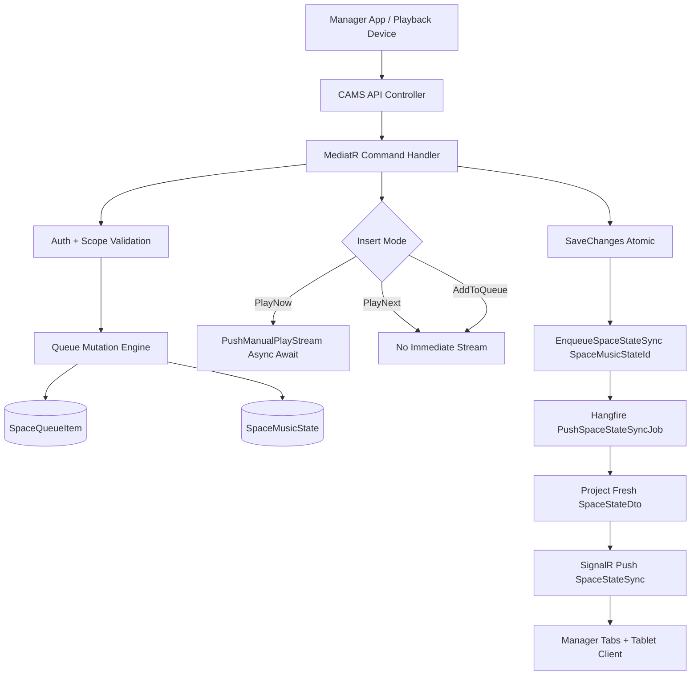
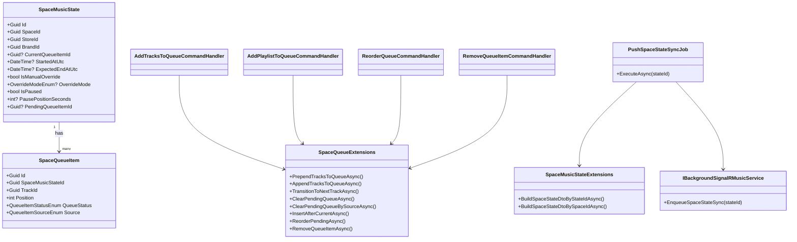
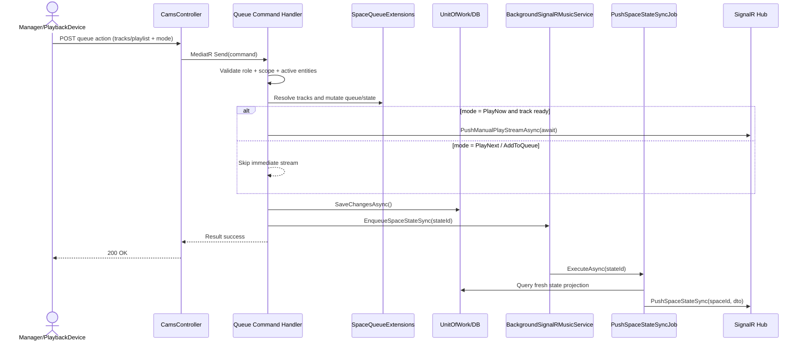

# Plan: Hybrid Queue Streaming (Manager + Device)

## 1. Objective

Thiết kế và triển khai queue control theo trải nghiệm app streaming (Spotify/Soundtrack style) cho cả:

- PlaybackDevice
- StoreManager
- BrandManager

Phạm vi gồm:

- Add 1 track hoặc nhiều track vào queue
- Add playlist vào queue
- 3 mode xử lý: PlayNow, PlayNext, AddToQueue
- Reorder queue
- Remove queue item
- Đồng bộ state qua background SignalR sync theo SpaceMusicStateId

## 2. Scope And Principles

1. Queue-first làm source of truth:

- `SpaceMusicState` giữ trạng thái playback hiện tại.
- `SpaceQueueItem` giữ hàng đợi pending/playing/played/skipped.

2. Priority rule:

- Track của Manager/Device (`Source=Manager`) có độ ưu tiên cao hơn AI theo policy config.

3. Request-path performance:

- Chỉ `PlayNow` mới push stream trực tiếp (await) nếu track sẵn sàng.
- State sync dùng background enqueue.

4. Compatibility:

- Reuse auth/context flow hiện tại (device context + manager ownership checks).
- Reuse queue extension methods đã có và mở rộng thêm insertion/reorder/remove primitives.

## 3. API Contract Draft

### 3.1 Queue Actions

- `POST /api/cams/spaces/{spaceId}/queue/tracks`
- `POST /api/cams/spaces/{spaceId}/queue/playlist`
- `PATCH /api/cams/spaces/{spaceId}/queue/reorder`
- `DELETE /api/cams/spaces/{spaceId}/queue/{queueItemId}`
- `GET /api/cams/spaces/{spaceId}/queue`

### 3.2 Roles

- Mutate queue: `BrandManager`, `StoreManager`, `PlaybackDevice`
- Read queue/state: giữ tương thích với API CAMS hiện tại

### 3.3 Queue Insert Modes

- `PlayNow`
- `PlayNext`
- `AddToQueue`

## 4. Core Behaviors

### 4.1 PlayNow

- Chèn list track vào đầu pending queue.
- Chuyển trạng thái track hiện tại từ `Playing` sang `Played`.
- Transition ngay sang track mới đầu tiên.
- Nếu track ready: push stream ngay đến clients.
- Enqueue background state sync.

### 4.2 PlayNext

- Chèn list track ngay sau current playing item.
- Không ngắt track hiện tại.
- Khi track hiện tại kết thúc, track mới phát ngay tiếp theo.
- Enqueue background state sync.

### 4.3 AddToQueue

- Chèn xuống cuối block queue của manager (hoặc tail theo policy).
- Không ảnh hưởng current playing item.
- Enqueue background state sync.

### 4.4 Reorder / Remove

- Reorder chỉ thao tác trên pending items hợp lệ.
- Remove item sẽ normalize lại `Position`.
- Nếu remove đúng current item thì trigger transition logic an toàn.

## 5. AI Policy Hooks (StoreConfig Key-Value)

Triển khai hook backend trước, tuning giá trị thực tế triển khai sau:

- `Cams:AiSlidingWindowSize` (int)
- `Cams:IsAiClearManagerTracks` (bool)
- `Cams:IsAiPriorityInsert` (bool)

Matrix áp dụng:

- Clear=true: AI clear toàn bộ pending rồi insert mới.
- Clear=false + Priority=true: AI clear pending AI, sau đó insert AI lên đầu.
- Clear=false + Priority=false: AI clear pending AI, insert AI xuống sau manager block.

## 6. Implementation Phases

1. API DTO + command contracts cho queue actions.
2. Handler auth/context reuse cho manager + playback device.
3. Mở rộng queue extensions (insert after current, reorder, remove, normalize).
4. Implement handlers add tracks/add playlist/reorder/remove.
5. Wire realtime: awaited stream cho PlayNow, background state sync cho mọi mutate.
6. Cắm config hooks cho AI behavior matrix.
7. Bổ sung/refine background sliding-window refill job.
8. Bổ sung unit/integration tests và docs.

## 7. Data Flow

## 8. Class Diagram

## 9. Sequence Diagram (Queue Mutation)

## 10. Mixer & queue end behavior (SpaceMusicState)

- `volumePercent`, `isMuted`, `queueEndBehavior` lưu trên `SpaceMusicState`; client đọc từ `GET .../state` và mỗi lần `SpaceStateSync`.
- `PATCH /api/cams/spaces/.../state/audio` chỉnh mixer + tùy chọn `queueEndBehavior`; sau commit server **chỉ** `EnqueueSpaceStateSync` — **không** raise `SpaceMusicStatePlaybackChangedDomainEvent` (tránh reschedule watchdog không cần thiết).
- Bài kế trong luồng phát: **tuần tự theo `Position`** trên toàn queue; kết thúc tự nhiên / watchdog: **Stop | RepeatAll | RepeatOne** (chi tiết: `API_CAMS.md`, `SIGNALR_STOREHUB.md`, `SpaceQueueExtensions`).

## 11. Validation Checklist

1. Build pass cho solution.
2. Unit tests cho position invariants sau PlayNow/PlayNext/Add/Reorder/Remove.
3. Handler tests cho 3 role-paths: PlaybackDevice, StoreManager, BrandManager.
4. API integration tests cho add track single/multi + add playlist.
5. Background state sync xác nhận không dùng snapshot DTO cũ.
6. Sequence thực tế: PlayNow phát ngay, các mode còn lại không chặn request path.
