# 3.11 CAMS (Context-Aware Music System) - Software Design

> **Module:** CAMS AI Engine — Fuzzy Logic · Sliding Window · Playlist Transition · Manual Override · Playback Control  
> **Roles:**
>
> - Debug/Read (`TriggerAnalysis`, `ForceTransition`, `GetCurrentMood`, `GetSpaceState`): any authenticated user
> - Write (`OverrideSpaceMood`, `CancelSpaceOverride`, `SendPlaybackCommand`): `BrandManager` · `StoreManager`
>
> **Endpoints:**
>
> - `POST /api/cams/trigger-analysis/{spaceId}`
> - `POST /api/cams/force-transition/{spaceId}`
> - `GET  /api/cams/space/{spaceId}/mood`
> - `POST /api/cams/spaces/{spaceId}/override`
> - `DELETE /api/cams/spaces/{spaceId}/override`
> - `POST /api/cams/spaces/{spaceId}/playback`
> - `PATCH /api/cams/spaces/{spaceId}/state/audio`
> - `GET  /api/cams/spaces/{spaceId}/state`
> - `GET  /api/cams/spaces/{spaceId}/queue`
> - `POST /api/cams/spaces/{spaceId}/queue/tracks`
> - `POST /api/cams/spaces/{spaceId}/queue/playlist`
> - `PATCH /api/cams/spaces/{spaceId}/queue/reorder`
> - `DELETE /api/cams/spaces/{spaceId}/queue`
> - `DELETE /api/cams/spaces/{spaceId}/queue/all`
> - `GET  /api/cams/spaces/{spaceId}/pair-device`
> - `POST /api/cams/spaces/{spaceId}/pair-code`
> - `DELETE /api/cams/spaces/{spaceId}/pair-code`
> - `DELETE /api/cams/spaces/{spaceId}/unpair`

---

## 3.11.1 Class Diagram - Core Domain Services

> Pure stateless services injected into command handlers.  
> `FuzzyLogicEngine` and `SlidingWindowAggregator` are registered as **Singleton** (stateless).  
> `ConfigResolverService` is **Scoped** (uses IUnitOfWork).  
> `HlsUrlBuilderService` is **Singleton** (reads AwsCdnOptions from appsettings).

```mermaid
classDiagram
    class IFuzzyLogicEngine {
        <<interface>>
        +Analyze(IotTelemetryPayload, FuzzyThresholds) FuzzyAnalysisResult
    }

    class FuzzyLogicEngine {
        -ILogger _logger
        +Analyze(IotTelemetryPayload, FuzzyThresholds) FuzzyAnalysisResult
        -FuzzifyPressure(peopleCount, thresholds) FuzzyPressure
        -FuzzifyStress(temperature, thresholds) FuzzyStress
        -FuzzifyDensity(wifiCount, thresholds) FuzzyDensity
        -InferMood(pressure, stress, density) CamsMood
    }

    class FuzzyThresholds {
        +int PressureLowMax
        +int PressureCriticalMin
        +decimal StressComfortableMax
        +decimal StressHighMin
        +decimal DensitySparseMax
        +decimal DensityCrowdedMin
        +int SpaceCapacity
        +decimal DefaultDensityRatioWhenNull
    }

    class FuzzyAnalysisResult {
        +CamsMood TargetMood
        +FuzzyPressure Pressure
        +FuzzyStress Stress
        +FuzzyDensity Density
        +string TriggeredRule
        +string Reason
        +decimal DensityRatioUsed
        +bool WifiCountWasNull
        +DateTime AnalyzedAtUtc
    }

    class ISlidingWindowAggregator {
        <<interface>>
        +AggregateAsync(iotDeviceId, windowMinutes, ct) Task~SlidingWindowResult~
    }

    class SlidingWindowAggregator {
        -ITelemetryRepository _telemetryRepo
        -ILogger _logger
        +AggregateAsync(iotDeviceId, windowMinutes, ct) Task~SlidingWindowResult~
        +Aggregate(readings) IotTelemetryPayload
        +MedianInt(sorted) int
    }

    class SlidingWindowResult {
        +IotTelemetryPayload AggregatedPayload
        +int SampleCount
        +DateTime WindowStartUtc
        +DateTime WindowEndUtc
        +bool IsSmoothed
    }

    class IConfigResolverService {
        <<interface>>
        +GetIntAsync(spaceId, storeId, key, default, ct) Task~int~
        +GetDecimalAsync(spaceId, storeId, key, default, ct) Task~decimal~
        +GetDoubleAsync(spaceId, storeId, key, default, ct) Task~double~
    }

    class ConfigResolverService {
        -IUnitOfWork _unitOfWork
        -ILogger _logger
        +GetDoubleAsync(spaceId, storeId, key, default, ct) Task~double~
        +GetIntAsync(spaceId, storeId, key, default, ct) Task~int~
        +GetDecimalAsync(spaceId, storeId, key, default, ct) Task~decimal~
    }

    class IHlsUrlBuilderService {
        <<interface>>
        +BuildUrl(rawPathOrUrl) string
        +CloudFrontDomain string
    }

    class HlsUrlBuilderService {
        -AwsCdnOptions _cdn
        -ILogger _logger
        +BuildUrl(rawPathOrUrl) string
        +CloudFrontDomain string
    }

    class ISignalRMusicService {
        <<interface>>
        +PushPlayStreamAsync(spaceId, playlist, domainEvent, ct) Task
        +PushStopPlaybackAsync(spaceId, reason, ct) Task
        +PushManualPlayStreamAsync(spaceId, playlist, rule, reason, isManual, transitionType, ct) Task
        +PushSpaceStateSyncAsync(spaceId, state, ct) Task
        +PushPlaybackStateChangedAsync(spaceId, dto, ct) Task
    }

    FuzzyLogicEngine ..|> IFuzzyLogicEngine
    FuzzyLogicEngine --> FuzzyThresholds : uses
    FuzzyLogicEngine --> FuzzyAnalysisResult : returns

    SlidingWindowAggregator ..|> ISlidingWindowAggregator
    SlidingWindowAggregator --> SlidingWindowResult : returns

    ConfigResolverService ..|> IConfigResolverService

    HlsUrlBuilderService ..|> IHlsUrlBuilderService
```

---

## 3.11.2 Class Diagram - Query Side

> `GetActiveSpacesForCamsQueryHandler` is called by **Hangfire** (`PlaylistTransitionJob`), not the API directly.

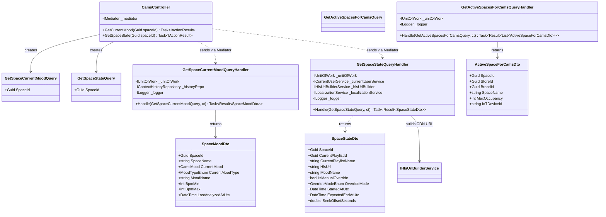
```mermaid
classDiagram
    class CamsController {
        -IMediator _mediator
        +GetCurrentMood(Guid spaceId) Task~IActionResult~
        +GetSpaceState(Guid spaceId) Task~IActionResult~
    }

    class GetSpaceCurrentMoodQuery {
        +Guid SpaceId
    }

    class GetSpaceStateQuery {
        +Guid SpaceId
    }

    class GetActiveSpacesForCamsQuery

    class GetSpaceCurrentMoodQueryHandler {
        -IUnitOfWork _unitOfWork
        -IContextHistoryRepository _historyRepo
        -ILogger _logger
        +Handle(GetSpaceCurrentMoodQuery, ct) Task~Result~SpaceMoodDto~~
    }

    class GetSpaceStateQueryHandler {
        -IUnitOfWork _unitOfWork
        -ICurrentUserService _currentUserService
        -IHlsUrlBuilderService _hlsUrlBuilder
        -ILocalizationService _localizationService
        -ILogger _logger
        +Handle(GetSpaceStateQuery, ct) Task~Result~SpaceStateDto~~
    }

    class GetActiveSpacesForCamsQueryHandler {
        -IUnitOfWork _unitOfWork
        -ILogger _logger
        +Handle(GetActiveSpacesForCamsQuery, ct) Task~Result~List~ActiveSpaceForCamsDto~~~
    }

    class SpaceMoodDto {
        +Guid SpaceId
        +string SpaceName
        +CamsMood CurrentMood
        +MoodTypeEnum CurrentMoodType
        +string MoodName
        +int BpmMin
        +int BpmMax
        +DateTime LastAnalyzedAtUtc
    }

    class SpaceStateDto {
        +Guid SpaceId
        +Guid CurrentPlaylistId
        +string CurrentPlaylistName
        +string HlsUrl
        +string MoodName
        +bool IsManualOverride
        +OverrideModeEnum OverrideMode
        +DateTime StartedAtUtc
        +DateTime ExpectedEndAtUtc
        +double SeekOffsetSeconds
    }

    class ActiveSpaceForCamsDto {
        +Guid SpaceId
        +Guid StoreId
        +Guid BrandId
        +string SpaceName
        +int MaxOccupancy
        +string IoTDeviceId
    }

    CamsController --> GetSpaceCurrentMoodQuery : creates
    CamsController --> GetSpaceStateQuery : creates
    CamsController ..> GetSpaceCurrentMoodQueryHandler : sends via Mediator
    CamsController ..> GetSpaceStateQueryHandler : sends via Mediator

    GetSpaceCurrentMoodQueryHandler --> SpaceMoodDto : returns
    GetSpaceStateQueryHandler --> SpaceStateDto : returns
    GetSpaceStateQueryHandler --> IHlsUrlBuilderService : builds CDN URL
    GetActiveSpacesForCamsQueryHandler --> ActiveSpaceForCamsDto : returns
```

---

## 3.11.3 Class Diagram - Command Side

### Part A — Commands and DTOs

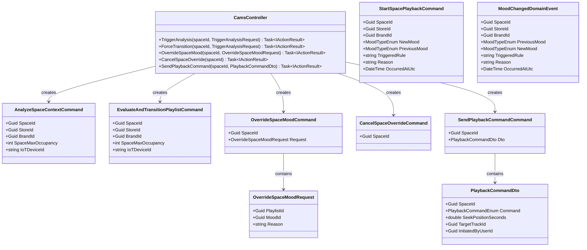
```mermaid
classDiagram
    class CamsController {
        +TriggerAnalysis(spaceId, TriggerAnalysisRequest) Task~IActionResult~
        +ForceTransition(spaceId, TriggerAnalysisRequest) Task~IActionResult~
        +OverrideSpaceMood(spaceId, OverrideSpaceMoodRequest) Task~IActionResult~
        +CancelSpaceOverride(spaceId) Task~IActionResult~
        +SendPlaybackCommand(spaceId, PlaybackCommandDto) Task~IActionResult~
    }

    class AnalyzeSpaceContextCommand {
        +Guid SpaceId
        +Guid StoreId
        +Guid BrandId
        +int SpaceMaxOccupancy
        +string IoTDeviceId
    }

    class EvaluateAndTransitionPlaylistCommand {
        +Guid SpaceId
        +Guid StoreId
        +Guid BrandId
        +int SpaceMaxOccupancy
        +string IoTDeviceId
    }

    class OverrideSpaceMoodCommand {
        +Guid SpaceId
        +OverrideSpaceMoodRequest Request
    }

    class CancelSpaceOverrideCommand {
        +Guid SpaceId
    }

    class SendPlaybackCommandCommand {
        +Guid SpaceId
        +PlaybackCommandDto Dto
    }

    class StartSpacePlaybackCommand {
        +Guid SpaceId
        +Guid StoreId
        +Guid BrandId
        +MoodTypeEnum NewMood
        +MoodTypeEnum PreviousMood
        +string TriggeredRule
        +string Reason
        +DateTime OccurredAtUtc
    }

    class OverrideSpaceMoodRequest {
        +Guid PlaylistId
        +Guid MoodId
        +string Reason
    }

    class PlaybackCommandDto {
        +Guid SpaceId
        +PlaybackCommandEnum Command
        +double SeekPositionSeconds
        +Guid TargetTrackId
        +Guid InitiatedByUserId
    }

    class MoodChangedDomainEvent {
        +Guid SpaceId
        +Guid StoreId
        +Guid BrandId
        +MoodTypeEnum PreviousMood
        +MoodTypeEnum NewMood
        +string TriggeredRule
        +string Reason
        +DateTime OccurredAtUtc
    }

    CamsController --> AnalyzeSpaceContextCommand : creates
    CamsController --> EvaluateAndTransitionPlaylistCommand : creates
    CamsController --> OverrideSpaceMoodCommand : creates
    CamsController --> CancelSpaceOverrideCommand : creates
    CamsController --> SendPlaybackCommandCommand : creates

    OverrideSpaceMoodCommand --> OverrideSpaceMoodRequest : contains
    SendPlaybackCommandCommand --> PlaybackCommandDto : contains
```

### Part B — Handler Dependencies

```mermaid
classDiagram
    class AnalyzeSpaceContextCommandHandler {
        -IUnitOfWork _unitOfWork
        -ISlidingWindowAggregator _windowAggregator
        -IContextHistoryRepository _historyRepo
        -IFuzzyLogicEngine _fuzzyEngine
        -IConfigResolverService _configResolver
        -IMediator _mediator
        -ISpaceMusicStateRepository _stateRepo
        -ILogger _logger
        +Handle(AnalyzeSpaceContextCommand, ct) Task~Result~ContextAnalysisDto~~
    }

    class EvaluateAndTransitionPlaylistCommandHandler {
        -IUnitOfWork _unitOfWork
        -ISlidingWindowAggregator _windowAggregator
        -IContextHistoryRepository _historyRepo
        -IFuzzyLogicEngine _fuzzyEngine
        -IConfigResolverService _configResolver
        -ISpaceMusicStateRepository _stateRepo
        -IMediator _mediator
        -ILogger _logger
        +Handle(EvaluateAndTransitionPlaylistCommand, ct) Task
    }

    class MoodChangedDomainEventHandler {
        -IMediator _mediator
        -ILogger _logger
        +Handle(MoodChangedDomainEvent, ct) Task
    }

    class StartSpacePlaybackCommandHandler {
        -IMusicRepository _musicRepo
        -ISpaceMusicStateRepository _stateRepo
        -ISignalRMusicService _signalRService
        -IHlsUrlBuilderService _hlsUrlBuilder
        -IPlaybackHistoryService _playbackHistoryService
        -ILogger _logger
        +Handle(StartSpacePlaybackCommand, ct) Task
    }

    class OverrideSpaceMoodCommandHandler {
        -IUnitOfWork _unitOfWork
        -ICurrentUserService _currentUserService
        -ISpaceMusicStateRepository _stateRepo
        -IMusicRepository _musicRepo
        -ISignalRMusicService _signalRService
        -IHlsUrlBuilderService _hlsUrlBuilder
        -IBackgroundTranscodeService _transcodeService
        -ILocalizationService _localizationService
        -IAuditService _auditService
        -IPlaybackHistoryService _playbackHistoryService
        -ILogger _logger
        +Handle(OverrideSpaceMoodCommand, ct) Task~Result~SpaceOverrideResponse~~
    }

    class CancelSpaceOverrideCommandHandler {
        -IUnitOfWork _unitOfWork
        -ICurrentUserService _currentUserService
        -ISpaceMusicStateRepository _stateRepo
        -ISignalRMusicService _signalRService
        -ILocalizationService _localizationService
        -IAuditService _auditService
        -ILogger _logger
        +Handle(CancelSpaceOverrideCommand, ct) Task~Result~
    }

    class SendPlaybackCommandCommandHandler {
        -IUnitOfWork _unitOfWork
        -ICurrentUserService _currentUserService
        -ISignalRMusicService _signalRService
        -ILocalizationService _localizationService
        -ILogger _logger
        +Handle(SendPlaybackCommandCommand, ct) Task~Result~
    }

    AnalyzeSpaceContextCommandHandler --> ISlidingWindowAggregator : aggregate telemetry
    AnalyzeSpaceContextCommandHandler --> IConfigResolverService : resolve thresholds
    AnalyzeSpaceContextCommandHandler --> IFuzzyLogicEngine : analyze context
    AnalyzeSpaceContextCommandHandler --> IContextHistoryRepository : persist history
    AnalyzeSpaceContextCommandHandler --> ISpaceMusicStateRepository : read override flag

    EvaluateAndTransitionPlaylistCommandHandler --> ISlidingWindowAggregator : aggregate telemetry
    EvaluateAndTransitionPlaylistCommandHandler --> IConfigResolverService : resolve thresholds
    EvaluateAndTransitionPlaylistCommandHandler --> IFuzzyLogicEngine : analyze context
    EvaluateAndTransitionPlaylistCommandHandler --> IContextHistoryRepository : persist history

    MoodChangedDomainEventHandler --> StartSpacePlaybackCommandHandler : sends command via Mediator

    StartSpacePlaybackCommandHandler --> IMusicRepository : select HLS playlist
    StartSpacePlaybackCommandHandler --> IHlsUrlBuilderService : build CDN URL
    StartSpacePlaybackCommandHandler --> ISpaceMusicStateRepository : upsert state
    StartSpacePlaybackCommandHandler --> ISignalRMusicService : push PlayStream

    OverrideSpaceMoodCommandHandler --> IPlaybackHistoryRepository : mood cooldown filter
    OverrideSpaceMoodCommandHandler --> IGenericRepository~Track~ : resolve source tracks
    OverrideSpaceMoodCommandHandler --> IGenericRepository~PlaylistTrack~ : resolve playlist tracks
    OverrideSpaceMoodCommandHandler --> IGenericRepository~SpaceQueueItem~ : clear/prepend/transition queue
    OverrideSpaceMoodCommandHandler --> IGenericRepository~SpaceMusicState~ : upsert state
    OverrideSpaceMoodCommandHandler --> IAuditService : log override success/failure
    OverrideSpaceMoodCommandHandler --> ISignalRMusicService : push SpaceStateSync

    CancelSpaceOverrideCommandHandler --> ISpaceMusicStateRepository : clear override fields
    CancelSpaceOverrideCommandHandler --> ISignalRMusicService : push SpaceStateSync

    SendPlaybackCommandCommandHandler --> ISignalRMusicService : push PlaybackStateChanged
```

---

## 3.11.4 Sequence Diagram - Trigger Fuzzy Analysis (AnalyzeSpaceContext)

> Chạy một chu kỳ AI đầy đủ: **SlidingWindow → ConfigResolver → FuzzyEngine → ContextHistory → MoodChangedEvent**.  
> Nếu `IsManualOverride = true`: lưu history nhưng **không** publish event.  
> Nếu mood không đổi: không publish event, trả về kết quả tức thì.

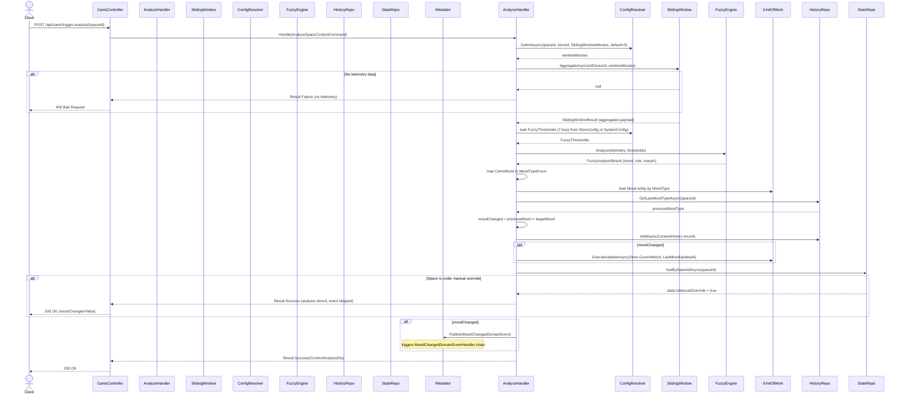
```mermaid
sequenceDiagram
    actor Client
    participant CamsController
    participant AnalyzeSpaceContextCommandHandler as AnalyzeHandler
    participant ISlidingWindowAggregator as SlidingWindow
    participant IConfigResolverService as ConfigResolver
    participant IFuzzyLogicEngine as FuzzyEngine
    participant IContextHistoryRepository as HistoryRepo
    participant ISpaceMusicStateRepository as StateRepo
    participant IMediator

    Client->>CamsController: POST /api/cams/trigger-analysis/{spaceId}
    CamsController->>AnalyzeHandler: Handle(AnalyzeSpaceContextCommand)

    AnalyzeHandler->>ConfigResolver: GetIntAsync(spaceId, storeId, SlidingWindowMinutes, default=5)
    ConfigResolver-->>AnalyzeHandler: windowMinutes

    AnalyzeHandler->>SlidingWindow: AggregateAsync(iotDeviceId, windowMinutes)
    alt No telemetry data
        SlidingWindow-->>AnalyzeHandler: null
        AnalyzeHandler-->>CamsController: Result.Failure (no telemetry)
        CamsController-->>Client: 400 Bad Request
    end

    SlidingWindow-->>AnalyzeHandler: SlidingWindowResult (aggregated payload)

    AnalyzeHandler->>ConfigResolver: load FuzzyThresholds (7 keys from StoreConfig or SystemConfig)
    ConfigResolver-->>AnalyzeHandler: FuzzyThresholds

    AnalyzeHandler->>FuzzyEngine: Analyze(telemetry, thresholds)
    FuzzyEngine-->>AnalyzeHandler: FuzzyAnalysisResult (mood, rule, reason)

    AnalyzeHandler->>AnalyzeHandler: map CamsMood to MoodTypeEnum
    AnalyzeHandler->>IUnitOfWork: load Mood entity by MoodType

    AnalyzeHandler->>HistoryRepo: GetLastMoodTypeAsync(spaceId)
    HistoryRepo-->>AnalyzeHandler: previousMoodType
    AnalyzeHandler->>AnalyzeHandler: moodChanged = previousMood != targetMood

    AnalyzeHandler->>HistoryRepo: AddAsync(ContextHistory record)

    opt moodChanged
        AnalyzeHandler->>IUnitOfWork: ExecuteUpdateAsync(Store.CurrentMood, LastMoodUpdateAt)
    end

    AnalyzeHandler->>StateRepo: GetBySpaceIdAsync(spaceId)
    alt Space is under manual override
        StateRepo-->>AnalyzeHandler: state.IsManualOverride = true
        AnalyzeHandler-->>CamsController: Result.Success (analysis stored, event skipped)
        CamsController-->>Client: 200 OK (moodChanged=false)
    end

    alt moodChanged
        AnalyzeHandler->>IMediator: Publish(MoodChangedDomainEvent)
        note over IMediator: triggers MoodChangedDomainEventHandler chain
    end

    AnalyzeHandler-->>CamsController: Result.Success(ContextAnalysisDto)
    CamsController-->>Client: 200 OK
```

---

## 3.11.5 Sequence Diagram - ConfigResolver Hierarchical Lookup

> Thứ tự ưu tiên: **StoreConfig (Level 2) → SystemConfig (Level 3) → Hardcoded default (Level 4)**.  
> Level 1 (Space fields như MaxOccupancy) được handler truyền trực tiếp vào FuzzyThresholds.

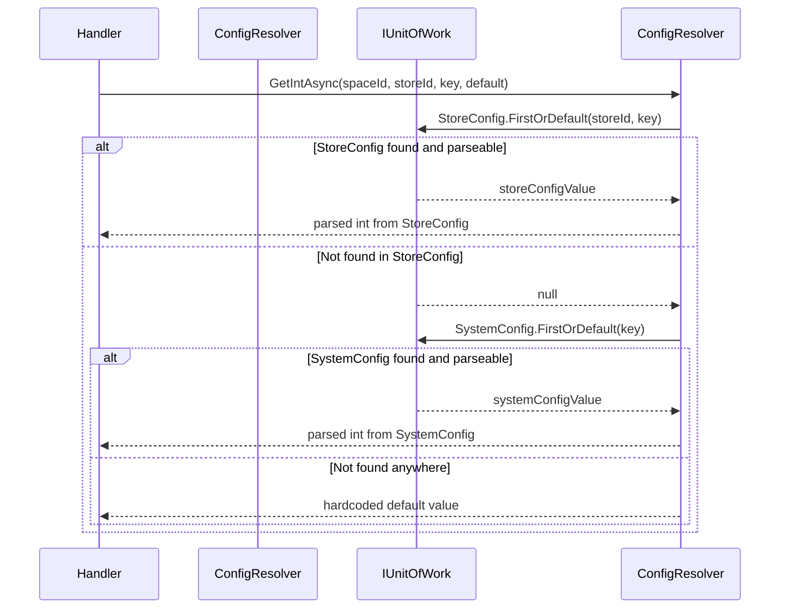
```mermaid
sequenceDiagram
    participant Handler
    participant IConfigResolverService as ConfigResolver
    participant IUnitOfWork

    Handler->>ConfigResolver: GetIntAsync(spaceId, storeId, key, default)

    ConfigResolver->>IUnitOfWork: StoreConfig.FirstOrDefault(storeId, key)
    alt StoreConfig found and parseable
        IUnitOfWork-->>ConfigResolver: storeConfigValue
        ConfigResolver-->>Handler: parsed int from StoreConfig
    else Not found in StoreConfig
        IUnitOfWork-->>ConfigResolver: null
        ConfigResolver->>IUnitOfWork: SystemConfig.FirstOrDefault(key)
        alt SystemConfig found and parseable
            IUnitOfWork-->>ConfigResolver: systemConfigValue
            ConfigResolver-->>Handler: parsed int from SystemConfig
        else Not found anywhere
            ConfigResolver-->>Handler: hardcoded default value
        end
    end
```

---

## 3.11.6 Sequence Diagram - SlidingWindowAggregator

> Chống hiệu ứng flapping: dùng **Median** cho PeopleCount và WifiDeviceCount (spike-resistant), **Average** cho Temperature/Humidity.  
> Fallback về latest reading nếu window rỗng.

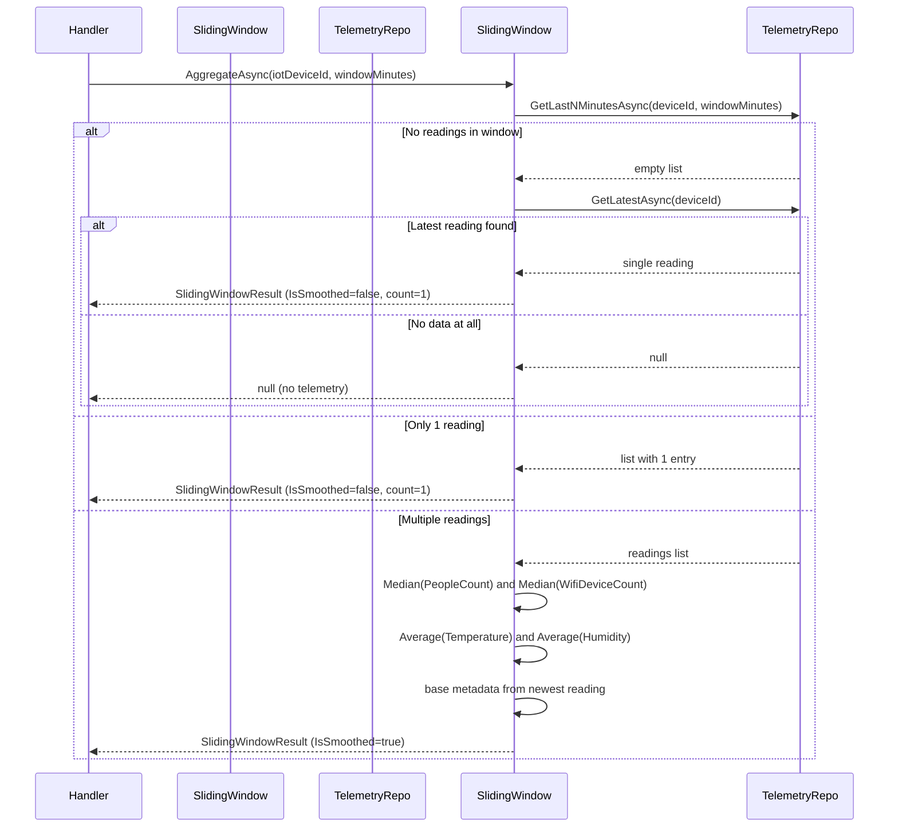
```mermaid
sequenceDiagram
    participant Handler
    participant SlidingWindowAggregator as SlidingWindow
    participant ITelemetryRepository as TelemetryRepo

    Handler->>SlidingWindow: AggregateAsync(iotDeviceId, windowMinutes)

    SlidingWindow->>TelemetryRepo: GetLastNMinutesAsync(deviceId, windowMinutes)
    alt No readings in window
        TelemetryRepo-->>SlidingWindow: empty list
        SlidingWindow->>TelemetryRepo: GetLatestAsync(deviceId)
        alt Latest reading found
            TelemetryRepo-->>SlidingWindow: single reading
            SlidingWindow-->>Handler: SlidingWindowResult (IsSmoothed=false, count=1)
        else No data at all
            TelemetryRepo-->>SlidingWindow: null
            SlidingWindow-->>Handler: null (no telemetry)
        end
    else Only 1 reading
        TelemetryRepo-->>SlidingWindow: list with 1 entry
        SlidingWindow-->>Handler: SlidingWindowResult (IsSmoothed=false, count=1)
    else Multiple readings
        TelemetryRepo-->>SlidingWindow: readings list
        SlidingWindow->>SlidingWindow: Median(PeopleCount) and Median(WifiDeviceCount)
        SlidingWindow->>SlidingWindow: Average(Temperature) and Average(Humidity)
        SlidingWindow->>SlidingWindow: base metadata from newest reading
        SlidingWindow-->>Handler: SlidingWindowResult (IsSmoothed=true)
    end
```

---

## 3.11.7 Sequence Diagram - FuzzyLogicEngine Analysis

> Ba bước: **Fuzzification → Rule Inference (priority order) → Defuzzification**.  
> First-match-wins (Mamdani-style crisp output).

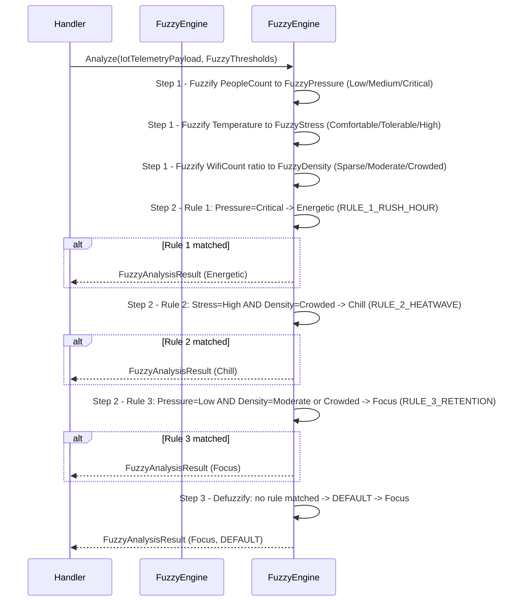
```mermaid
sequenceDiagram
    participant Handler
    participant IFuzzyLogicEngine as FuzzyEngine

    Handler->>FuzzyEngine: Analyze(IotTelemetryPayload, FuzzyThresholds)

    FuzzyEngine->>FuzzyEngine: Step 1 - Fuzzify PeopleCount to FuzzyPressure (Low/Medium/Critical)
    FuzzyEngine->>FuzzyEngine: Step 1 - Fuzzify Temperature to FuzzyStress (Comfortable/Tolerable/High)
    FuzzyEngine->>FuzzyEngine: Step 1 - Fuzzify WifiCount ratio to FuzzyDensity (Sparse/Moderate/Crowded)

    FuzzyEngine->>FuzzyEngine: Step 2 - Rule 1: Pressure=Critical -> Energetic (RULE_1_RUSH_HOUR)
    alt Rule 1 matched
        FuzzyEngine-->>Handler: FuzzyAnalysisResult (Energetic)
    end

    FuzzyEngine->>FuzzyEngine: Step 2 - Rule 2: Stress=High AND Density=Crowded -> Chill (RULE_2_HEATWAVE)
    alt Rule 2 matched
        FuzzyEngine-->>Handler: FuzzyAnalysisResult (Chill)
    end

    FuzzyEngine->>FuzzyEngine: Step 2 - Rule 3: Pressure=Low AND Density=Moderate or Crowded -> Focus (RULE_3_RETENTION)
    alt Rule 3 matched
        FuzzyEngine-->>Handler: FuzzyAnalysisResult (Focus)
    end

    FuzzyEngine->>FuzzyEngine: Step 3 - Defuzzify: no rule matched -> DEFAULT -> Focus
    FuzzyEngine-->>Handler: FuzzyAnalysisResult (Focus, DEFAULT)
```

---

## 3.11.8 Sequence Diagram - MoodChanged Event Chain (EDD)

> EDD chain: `MoodChangedDomainEvent` → `MoodChangedDomainEventHandler` → `StartSpacePlaybackCommand` → **HLS select → CDN URL → SignalR**.  
> Round-robin: `excludePlaylistId = currentState.CurrentPlaylistId`.

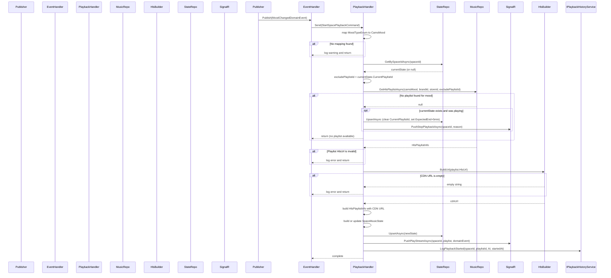
```mermaid
sequenceDiagram
    participant AnalyzeHandler as Publisher
    participant MoodChangedDomainEventHandler as EventHandler
    participant StartSpacePlaybackCommandHandler as PlaybackHandler
    participant IMusicRepository as MusicRepo
    participant IHlsUrlBuilderService as HlsBuilder
    participant ISpaceMusicStateRepository as StateRepo
    participant ISignalRMusicService as SignalR

    Publisher->>EventHandler: Publish(MoodChangedDomainEvent)

    EventHandler->>PlaybackHandler: Send(StartSpacePlaybackCommand)

    PlaybackHandler->>PlaybackHandler: map MoodTypeEnum to CamsMood
    alt No mapping found
        PlaybackHandler-->>EventHandler: log warning and return
    end

    PlaybackHandler->>StateRepo: GetBySpaceIdAsync(spaceId)
    StateRepo-->>PlaybackHandler: currentState (or null)
    PlaybackHandler->>PlaybackHandler: excludePlaylistId = currentState.CurrentPlaylistId

    PlaybackHandler->>MusicRepo: GetHlsPlaylistAsync(camsMood, brandId, storeId, excludePlaylistId)
    alt No playlist found for mood
        MusicRepo-->>PlaybackHandler: null
        opt currentState exists and was playing
            PlaybackHandler->>StateRepo: UpsertAsync (clear CurrentPlaylistId, set ExpectedEnd+5min)
            PlaybackHandler->>SignalR: PushStopPlaybackAsync(spaceId, reason)
        end
        PlaybackHandler-->>EventHandler: return (no playlist available)
    end

    MusicRepo-->>PlaybackHandler: HlsPlaylistInfo
    alt Playlist HlsUrl is invalid
        PlaybackHandler-->>EventHandler: log error and return
    end

    PlaybackHandler->>HlsBuilder: BuildUrl(playlist.HlsUrl)
    alt CDN URL is empty
        HlsBuilder-->>PlaybackHandler: empty string
        PlaybackHandler-->>EventHandler: log error and return
    end

    HlsBuilder-->>PlaybackHandler: cdnUrl
    PlaybackHandler->>PlaybackHandler: build HlsPlaylistInfo with CDN URL
    PlaybackHandler->>PlaybackHandler: build or update SpaceMusicState
    PlaybackHandler->>StateRepo: UpsertAsync(newState)

    PlaybackHandler->>SignalR: PushPlayStreamAsync(spaceId, playlist, domainEvent)

    PlaybackHandler->>IPlaybackHistoryService: LogPlaybackStarted(spaceId, playlistId, AI, startedAt)
    PlaybackHandler-->>EventHandler: complete
```

---

## 3.11.9 Sequence Diagram - Force Playlist Transition (EvaluateAndTransitionPlaylist)

> Luôn publish `MoodChangedDomainEvent` **bất kể mood có đổi hay không** (playlist đã kết thúc → phải play tiếp).  
> Fallback: nếu không có telemetry IoT, dùng mood cuối cùng trong `SpaceMusicState`.

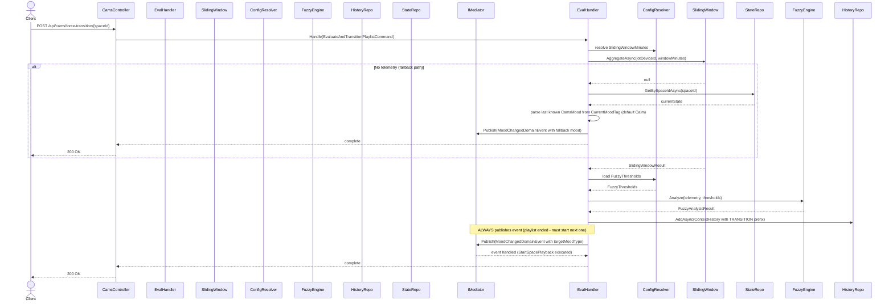
```mermaid
sequenceDiagram
    actor Client
    participant CamsController
    participant EvaluateAndTransitionPlaylistCommandHandler as EvalHandler
    participant ISlidingWindowAggregator as SlidingWindow
    participant IConfigResolverService as ConfigResolver
    participant IFuzzyLogicEngine as FuzzyEngine
    participant IContextHistoryRepository as HistoryRepo
    participant ISpaceMusicStateRepository as StateRepo
    participant IMediator

    Client->>CamsController: POST /api/cams/force-transition/{spaceId}
    CamsController->>EvalHandler: Handle(EvaluateAndTransitionPlaylistCommand)

    EvalHandler->>ConfigResolver: resolve SlidingWindowMinutes
    EvalHandler->>SlidingWindow: AggregateAsync(iotDeviceId, windowMinutes)

    alt No telemetry (fallback path)
        SlidingWindow-->>EvalHandler: null
        EvalHandler->>StateRepo: GetBySpaceIdAsync(spaceId)
        StateRepo-->>EvalHandler: currentState
        EvalHandler->>EvalHandler: parse last known CamsMood from CurrentMoodTag (default Calm)
        EvalHandler->>IMediator: Publish(MoodChangedDomainEvent with fallback mood)
        EvalHandler-->>CamsController: complete
        CamsController-->>Client: 200 OK
    end

    SlidingWindow-->>EvalHandler: SlidingWindowResult

    EvalHandler->>ConfigResolver: load FuzzyThresholds
    ConfigResolver-->>EvalHandler: FuzzyThresholds

    EvalHandler->>FuzzyEngine: Analyze(telemetry, thresholds)
    FuzzyEngine-->>EvalHandler: FuzzyAnalysisResult

    EvalHandler->>HistoryRepo: AddAsync(ContextHistory with TRANSITION prefix)

    note over EvalHandler,IMediator: ALWAYS publishes event (playlist ended - must start next one)
    EvalHandler->>IMediator: Publish(MoodChangedDomainEvent with targetMoodType)

    IMediator-->>EvalHandler: event handled (StartSpacePlayback executed)
    EvalHandler-->>CamsController: complete
    CamsController-->>Client: 200 OK
```

---

## 3.11.10 Sequence Diagram - Override Space Mood

> Queue-first override (latest): request phải chọn đúng 1 nguồn trong `trackIds | playlistId | moodId`.
> Hệ thống luôn prepend danh sách track override lên đầu queue và luôn chuyển bài ngay.
> Response chỉ trả ACK `spaceId`; client lấy state chi tiết qua GetSpaceState + SignalR.

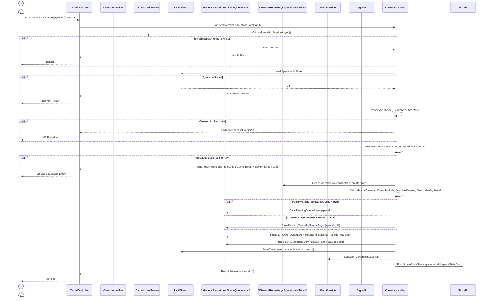
```mermaid
sequenceDiagram
    actor Client
    participant CamsController
    participant OverrideSpaceMoodCommandHandler as OverrideHandler
    participant ICurrentUserService
    participant IUnitOfWork
    participant QueueRepo as "IGenericRepository<SpaceQueueItem>"
    participant StateRepo as "IGenericRepository<SpaceMusicState>"
    participant IAuditService
    participant ISignalRMusicService as SignalR

    Client->>CamsController: POST /api/cams/spaces/{spaceId}/override
    CamsController->>OverrideHandler: Handle(OverrideSpaceMoodCommand)

    OverrideHandler->>ICurrentUserService: ValidateUserWithSessionAsync()
    alt Invalid session or not BM/SM
        ICurrentUserService-->>OverrideHandler: unauthorized
        OverrideHandler-->>CamsController: 401 or 403
        CamsController-->>Client: 401/403
    end

    OverrideHandler->>IUnitOfWork: Load Space with Store
    alt Space not found
        IUnitOfWork-->>OverrideHandler: null
        OverrideHandler-->>CamsController: NotFoundException
        CamsController-->>Client: 404 Not Found
    end

    OverrideHandler->>OverrideHandler: ownership check (BM brand or SM store)
    alt Ownership check fails
        OverrideHandler-->>CamsController: ForbiddenAccessException
        CamsController-->>Client: 403 Forbidden
    end

    OverrideHandler->>OverrideHandler: ResolveSourceTrackIds(trackIds|playlistId|moodId)
    alt Resolved track list is empty
        OverrideHandler-->>CamsController: BusinessRuleViolationException(Cams_Error_NoOverrideProvided)
        CamsController-->>Client: 422 Unprocessable Entity
    end

    OverrideHandler->>StateRepo: GetBySpaceIdAsync(spaceId) or create state
    OverrideHandler->>OverrideHandler: Set IsManualOverride, OverrideMode, OverrideReason, OverriddenByUserId

    alt isClearManagerSelectedQueues = true
        OverrideHandler->>QueueRepo: ClearPendingQueueAsync(spaceId)
    else isClearManagerSelectedQueues = false
        OverrideHandler->>QueueRepo: ClearPendingQueueBySourceAsync(spaceId, AI)
    end

    OverrideHandler->>QueueRepo: PrependTracksToQueueAsync(spaceId, selectedTrackIds, Manager)
    OverrideHandler->>QueueRepo: TransitionToNextTrackAsync(stateRepo, spaceId, state)

    OverrideHandler->>IUnitOfWork: SaveChangesAsync (single atomic commit)
    OverrideHandler->>IAuditService: LogOverrideApplied(success)
    OverrideHandler->>SignalR: PushSpaceStateSyncAsync(spaceId, spaceStateDto)
    OverrideHandler-->>CamsController: Result.Success({ spaceId })
    CamsController-->>Client: 200 OK
```

---

## 3.11.11 Sequence Diagram - Cancel Space Override

> Xóa trường override trên `SpaceMusicState` để Hangfire `PlaylistTransitionJob` tiếp tục lịch AI bình thường.  
> Trả `422` nếu không có override đang active.

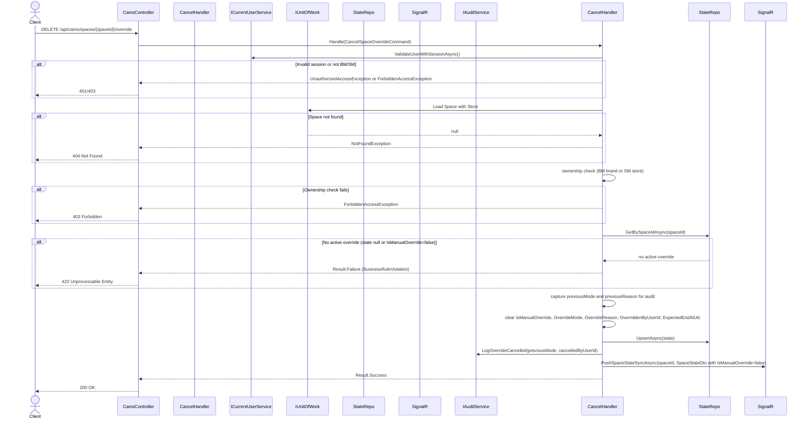
```mermaid
sequenceDiagram
    actor Client
    participant CamsController
    participant CancelSpaceOverrideCommandHandler as CancelHandler
    participant ICurrentUserService
    participant IUnitOfWork
    participant ISpaceMusicStateRepository as StateRepo
    participant ISignalRMusicService as SignalR
    participant IAuditService

    Client->>CamsController: DELETE /api/cams/spaces/{spaceId}/override
    CamsController->>CancelHandler: Handle(CancelSpaceOverrideCommand)

    CancelHandler->>ICurrentUserService: ValidateUserWithSessionAsync()
    alt Invalid session or not BM/SM
        CancelHandler-->>CamsController: UnauthorizedAccessException or ForbiddenAccessException
        CamsController-->>Client: 401/403
    end

    CancelHandler->>IUnitOfWork: Load Space with Store
    alt Space not found
        IUnitOfWork-->>CancelHandler: null
        CancelHandler-->>CamsController: NotFoundException
        CamsController-->>Client: 404 Not Found
    end

    CancelHandler->>CancelHandler: ownership check (BM brand or SM store)
    alt Ownership check fails
        CancelHandler-->>CamsController: ForbiddenAccessException
        CamsController-->>Client: 403 Forbidden
    end

    CancelHandler->>StateRepo: GetBySpaceIdAsync(spaceId)
    alt No active override (state null or IsManualOverride=false)
        StateRepo-->>CancelHandler: no active override
        CancelHandler-->>CamsController: Result.Failure (BusinessRuleViolation)
        CamsController-->>Client: 422 Unprocessable Entity
    end

    CancelHandler->>CancelHandler: capture previousMode and previousReason for audit
    CancelHandler->>CancelHandler: clear IsManualOverride, OverrideMode, OverrideReason, OverriddenByUserId, ExpectedEndAtUtc
    CancelHandler->>StateRepo: UpsertAsync(state)

    CancelHandler->>IAuditService: LogOverrideCancelled(previousMode, cancelledByUserId)

    CancelHandler->>SignalR: PushSpaceStateSyncAsync(spaceId, SpaceStateDto with IsManualOverride=false)
    CancelHandler-->>CamsController: Result.Success
    CamsController-->>Client: 200 OK
```

---

## 3.11.12 Sequence Diagram - Send Playback Command (Pause / Resume / Seek / Skip)

> Áp dụng thay đổi trạng thái vào `SpaceMusicState` (DB sync), sau đó relay qua SignalR cho tất cả connections.  
> `SkipNext/SkipPrevious/SkipToTrack` tính toán `SeekOffsetSeconds` phía server để tất cả clients seek đồng bộ.

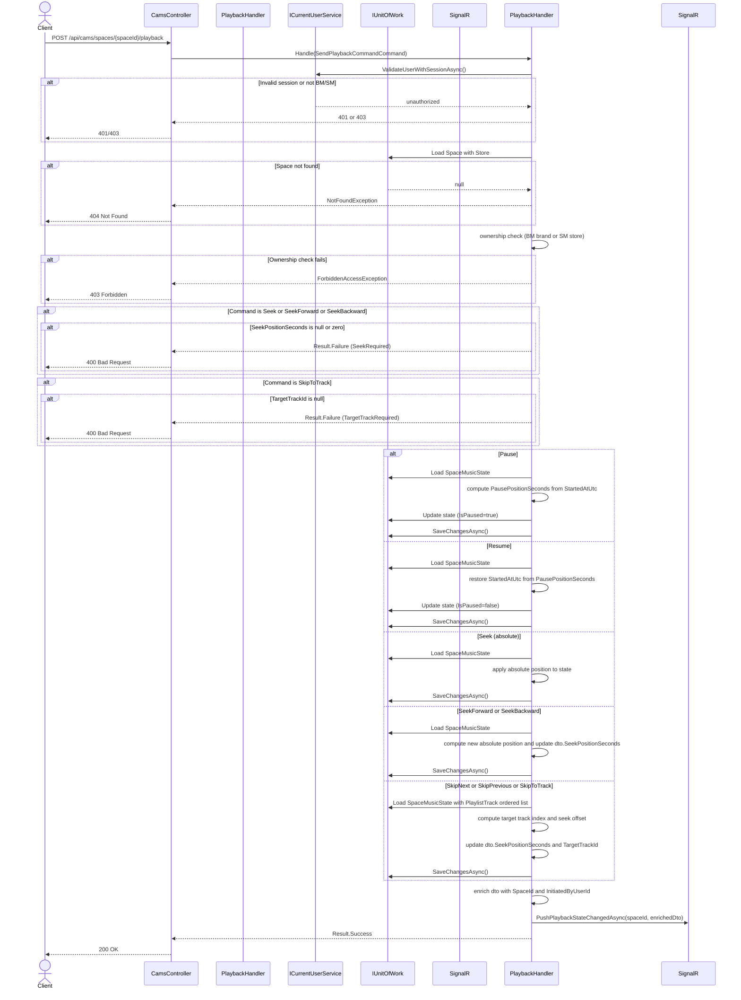
```mermaid
sequenceDiagram
    actor Client
    participant CamsController
    participant SendPlaybackCommandCommandHandler as PlaybackHandler
    participant ICurrentUserService
    participant IUnitOfWork
    participant ISignalRMusicService as SignalR

    Client->>CamsController: POST /api/cams/spaces/{spaceId}/playback
    CamsController->>PlaybackHandler: Handle(SendPlaybackCommandCommand)

    PlaybackHandler->>ICurrentUserService: ValidateUserWithSessionAsync()
    alt Invalid session or not BM/SM
        ICurrentUserService-->>PlaybackHandler: unauthorized
        PlaybackHandler-->>CamsController: 401 or 403
        CamsController-->>Client: 401/403
    end

    PlaybackHandler->>IUnitOfWork: Load Space with Store
    alt Space not found
        IUnitOfWork-->>PlaybackHandler: null
        PlaybackHandler-->>CamsController: NotFoundException
        CamsController-->>Client: 404 Not Found
    end

    PlaybackHandler->>PlaybackHandler: ownership check (BM brand or SM store)
    alt Ownership check fails
        PlaybackHandler-->>CamsController: ForbiddenAccessException
        CamsController-->>Client: 403 Forbidden
    end

    alt Command is Seek or SeekForward or SeekBackward
        alt SeekPositionSeconds is null or zero
            PlaybackHandler-->>CamsController: Result.Failure (SeekRequired)
            CamsController-->>Client: 400 Bad Request
        end
    end

    alt Command is SkipToTrack
        alt TargetTrackId is null
            PlaybackHandler-->>CamsController: Result.Failure (TargetTrackRequired)
            CamsController-->>Client: 400 Bad Request
        end
    end

    alt Pause
        PlaybackHandler->>IUnitOfWork: Load SpaceMusicState
        PlaybackHandler->>PlaybackHandler: compute PausePositionSeconds from StartedAtUtc
        PlaybackHandler->>IUnitOfWork: Update state (IsPaused=true)
        PlaybackHandler->>IUnitOfWork: SaveChangesAsync()
    else Resume
        PlaybackHandler->>IUnitOfWork: Load SpaceMusicState
        PlaybackHandler->>PlaybackHandler: restore StartedAtUtc from PausePositionSeconds
        PlaybackHandler->>IUnitOfWork: Update state (IsPaused=false)
        PlaybackHandler->>IUnitOfWork: SaveChangesAsync()
    else Seek (absolute)
        PlaybackHandler->>IUnitOfWork: Load SpaceMusicState
        PlaybackHandler->>PlaybackHandler: apply absolute position to state
        PlaybackHandler->>IUnitOfWork: SaveChangesAsync()
    else SeekForward or SeekBackward
        PlaybackHandler->>IUnitOfWork: Load SpaceMusicState
        PlaybackHandler->>PlaybackHandler: compute new absolute position and update dto.SeekPositionSeconds
        PlaybackHandler->>IUnitOfWork: SaveChangesAsync()
    else SkipNext or SkipPrevious or SkipToTrack
        PlaybackHandler->>IUnitOfWork: Load SpaceMusicState with PlaylistTrack ordered list
        PlaybackHandler->>PlaybackHandler: compute target track index and seek offset
        PlaybackHandler->>PlaybackHandler: update dto.SeekPositionSeconds and TargetTrackId
        PlaybackHandler->>IUnitOfWork: SaveChangesAsync()
    end

    PlaybackHandler->>PlaybackHandler: enrich dto with SpaceId and InitiatedByUserId
    PlaybackHandler->>SignalR: PushPlaybackStateChangedAsync(spaceId, enrichedDto)

    PlaybackHandler-->>CamsController: Result.Success
    CamsController-->>Client: 200 OK
```

---

## 3.11.13 Sequence Diagram - Get Space State (Tablet Reconnect)

> Trả về snapshot playback hiện tại để tablet React Native gọi `seekTo(SeekOffsetSeconds)` sau reconnect.  
> `SeekOffsetSeconds` được wrap trong `TotalDurationSeconds` để tránh overflow khi HLS loop.

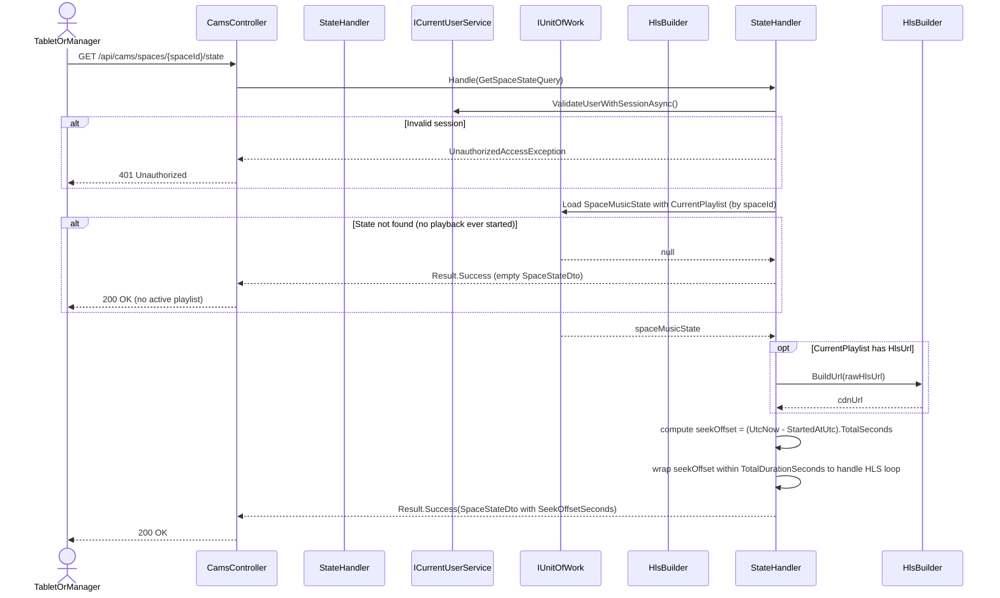
```mermaid
sequenceDiagram
    actor TabletOrManager
    participant CamsController
    participant GetSpaceStateQueryHandler as StateHandler
    participant ICurrentUserService
    participant IUnitOfWork
    participant IHlsUrlBuilderService as HlsBuilder

    TabletOrManager->>CamsController: GET /api/cams/spaces/{spaceId}/state
    CamsController->>StateHandler: Handle(GetSpaceStateQuery)

    StateHandler->>ICurrentUserService: ValidateUserWithSessionAsync()
    alt Invalid session
        StateHandler-->>CamsController: UnauthorizedAccessException
        CamsController-->>TabletOrManager: 401 Unauthorized
    end

    StateHandler->>IUnitOfWork: Load SpaceMusicState with CurrentPlaylist (by spaceId)
    alt State not found (no playback ever started)
        IUnitOfWork-->>StateHandler: null
        StateHandler-->>CamsController: Result.Success (empty SpaceStateDto)
        CamsController-->>TabletOrManager: 200 OK (no active playlist)
    end

    IUnitOfWork-->>StateHandler: spaceMusicState

    opt CurrentPlaylist has HlsUrl
        StateHandler->>HlsBuilder: BuildUrl(rawHlsUrl)
        HlsBuilder-->>StateHandler: cdnUrl
    end

    StateHandler->>StateHandler: compute seekOffset = (UtcNow - StartedAtUtc).TotalSeconds
    StateHandler->>StateHandler: wrap seekOffset within TotalDurationSeconds to handle HLS loop

    StateHandler-->>CamsController: Result.Success(SpaceStateDto with SeekOffsetSeconds)
    CamsController-->>TabletOrManager: 200 OK
```

---

## 3.11.14 Sequence Diagram - Get Current Mood

> Đọc `ContextHistory` gần nhất, resolve Mood entity, trả `SpaceMoodDto`.  
> Pure read — không có side effects.

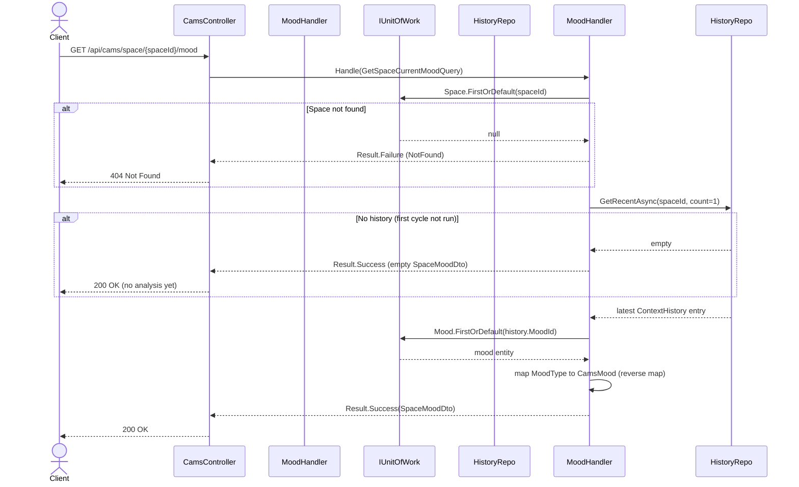
```mermaid
sequenceDiagram
    actor Client
    participant CamsController
    participant GetSpaceCurrentMoodQueryHandler as MoodHandler
    participant IUnitOfWork
    participant IContextHistoryRepository as HistoryRepo

    Client->>CamsController: GET /api/cams/space/{spaceId}/mood
    CamsController->>MoodHandler: Handle(GetSpaceCurrentMoodQuery)

    MoodHandler->>IUnitOfWork: Space.FirstOrDefault(spaceId)
    alt Space not found
        IUnitOfWork-->>MoodHandler: null
        MoodHandler-->>CamsController: Result.Failure (NotFound)
        CamsController-->>Client: 404 Not Found
    end

    MoodHandler->>HistoryRepo: GetRecentAsync(spaceId, count=1)
    alt No history (first cycle not run)
        HistoryRepo-->>MoodHandler: empty
        MoodHandler-->>CamsController: Result.Success (empty SpaceMoodDto)
        CamsController-->>Client: 200 OK (no analysis yet)
    end

    HistoryRepo-->>MoodHandler: latest ContextHistory entry
    MoodHandler->>IUnitOfWork: Mood.FirstOrDefault(history.MoodId)
    IUnitOfWork-->>MoodHandler: mood entity

    MoodHandler->>MoodHandler: map MoodType to CamsMood (reverse map)
    MoodHandler-->>CamsController: Result.Success(SpaceMoodDto)
    CamsController-->>Client: 200 OK
```

---

## 3.11.15 Notes for Implementation Accuracy

1. **EDD (Event-Driven Design) chain**: `AnalyzeHandler`/`EvaluateHandler` only publish `MoodChangedDomainEvent`; all side-effects (playlist selection, SignalR push, state persistence) live exclusively in `MoodChangedDomainEventHandler` → `StartSpacePlaybackCommandHandler`.

2. **Manual override bypass**: `AnalyzeSpaceContextCommandHandler` stores `ContextHistory` (telemetry is never lost) but **skips** the domain event when `IsManualOverride = true`. `EvaluateAndTransitionPlaylistCommandHandler` (Hangfire) also skips if override is active (checked in `PlaylistTransitionJob` before calling the command).

3. **EvaluateAndTransition always publishes**: Unlike `Analyze` (skips if mood unchanged), `Evaluate` **always** publishes the event because the playlist has ended and a new one must start regardless of mood.

4. **Fallback on no telemetry (Evaluate)**: Uses `currentState.CurrentMoodTag` to parse the last known `CamsMood`; falls back to `Calm` (Chill). Prevents Hangfire from getting stuck in an infinite loop.

5. **ConfigResolver hierarchy**: Space-level values (MaxOccupancy, CriticalQueueThreshold) are passed directly by the handler. Only config keys (`Fuzzy:*`, `Cams:*`) go through the 3-level resolver (StoreConfig → SystemConfig → default).

6. **HlsUrlBuilderService**: Handles 4 input formats (relative key, S3 virtual-hosted, S3 path-style, already CloudFront). Registered as Singleton; reads `AwsCdnOptions` from `appsettings`.

7. **SlidingWindowAggregator**: Registered as Singleton (stateless). Uses **Median** for PeopleCount/WiFi (spike-resistant) and **Average** for Temperature/Humidity. The anti-flapping mechanism prevents single-minute crowd spikes from changing the music mood.

8. **FuzzyLogicEngine rules (priority order)**:
   - `RULE_1_RUSH_HOUR`: Pressure=Critical → Energetic (highest priority — revenue protection)
   - `RULE_2_HEATWAVE`: Stress=High AND Density=Crowded → Chill (psychological cooling)
   - `RULE_3_RETENTION`: Pressure=Low AND Density=Moderate/Crowded → Focus (dwell time)
   - `DEFAULT`: → Focus (safe neutral state)

9. **SendPlaybackCommand server-side seek**: For `SeekForward`, `SeekBackward`, `SkipNext`, `SkipPrevious`, `SkipToTrack` — the server computes the absolute `SeekPositionSeconds` and overwrites `dto.SeekPositionSeconds` before relaying via SignalR, ensuring all connected clients (tablet + manager tabs) seek to the exact same position.

10. **SpaceMusicState.SeekOffsetSeconds**: Computed on-demand in `GetSpaceStateQueryHandler` as `(UtcNow - StartedAtUtc) % TotalDurationSeconds`. Not stored in DB — always fresh on request.

11. **DirectPlaylist Override — Pending flow**: If the playlist has not been transcoded yet (`TranscodeStatus != Ready`), the handler sets `PendingPlaylistId` on `SpaceMusicState` and calls `CancelScheduledAndRequestImmediate` which invalidates any in-flight debounced transcode and enqueues an immediate one. When `PlaylistTranscodeStatusJob` marks the job as Ready, it reads `PendingPlaylistId` and auto-pushes the stream.

---

## 3.11.16 Data Flow Diagram — Context (Level 0)

> Shows the full CAMS system boundary. The AI Engine is the central process; it consumes IoT telemetry, manager commands, and Hangfire triggers, then drives real-time music playback across all spaces.

**Notation:**

- **Rectangle `[ ]`** — External Entity
- **Rounded rectangle `( )`** — Process / System
- **Cylinder `[( )]`** — Data Store
- **Arrow `-->|label|`** — Named data flow

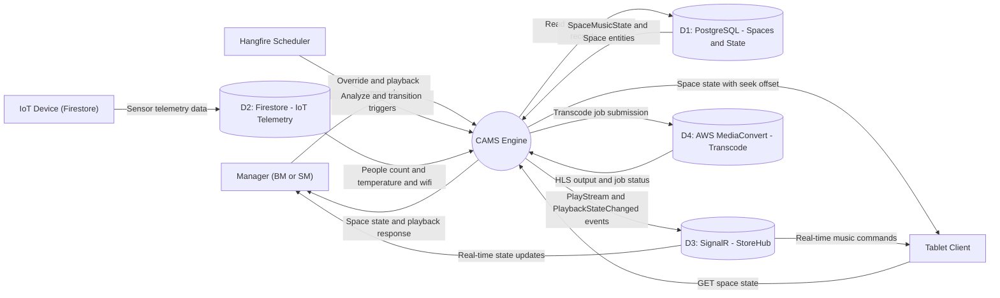
```mermaid
graph LR
    MGR["Manager (BM or SM)"]
    TAB["Tablet Client"]
    IOT["IoT Device (Firestore)"]
    HF["Hangfire Scheduler"]

    CAMS(("CAMS Engine"))

    DB[("D1: PostgreSQL - Spaces and State")]
    FST[("D2: Firestore - IoT Telemetry")]
    SIG[("D3: SignalR - StoreHub")]
    MC[("D4: AWS MediaConvert - Transcode")]

    MGR -->|"Override and playback commands"| CAMS
    TAB -->|"GET space state"| CAMS
    IOT -->|"Sensor telemetry data"| FST
    HF -->|"Analyze and transition triggers"| CAMS
    FST -->|"People count and temperature and wifi"| CAMS
    CAMS -->|"Space state and playback response"| MGR
    CAMS -->|"Space state with seek offset"| TAB
    CAMS -->|"Read and write state records"| DB
    DB -->|"SpaceMusicState and Space entities"| CAMS
    CAMS -->|"PlayStream and PlaybackStateChanged events"| SIG
    SIG -->|"Real-time music commands"| TAB
    SIG -->|"Real-time state updates"| MGR
    CAMS -->|"Transcode job submission"| MC
    MC -->|"HLS output and job status"| CAMS
```

---

## 3.11.17 Data Flow Diagram — Override Space Music

> Corresponds to `POST /api/cams/spaces/{spaceId}/override`. Queue-first flow: Resolves tracks from the selected source, clears queues if requested, prepends new tracks, and forces an immediate transition.

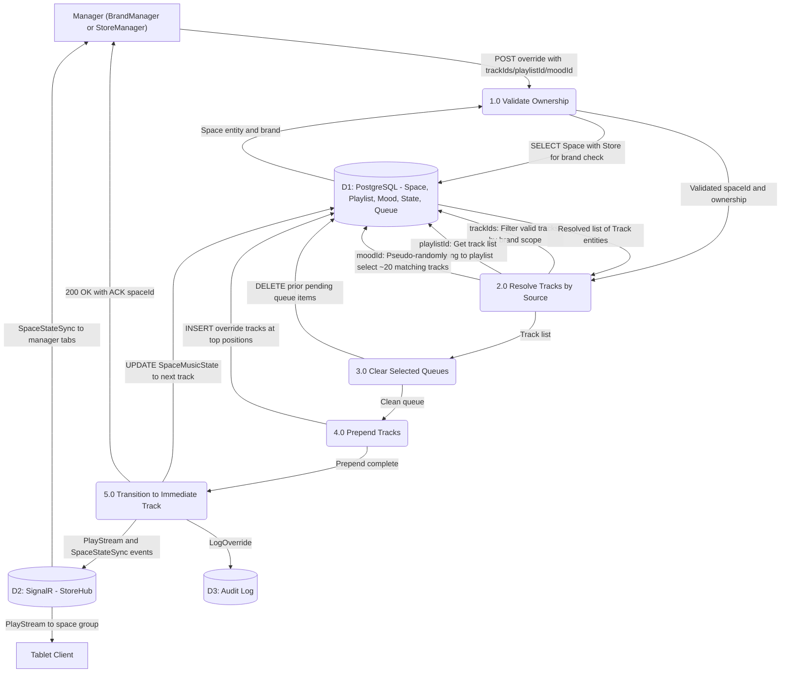
```mermaid
graph TB
    MGR["Manager (BrandManager or StoreManager)"]
    TAB["Tablet Client"]

    P1("1.0 Validate Ownership")
    P2("2.0 Resolve Tracks by Source")
    P3("3.0 Clear Selected Queues")
    P4("4.0 Prepend Tracks")
    P5("5.0 Transition to Immediate Track")

    DB[("D1: PostgreSQL - Space, Playlist, Mood, State, Queue")]
    SIG[("D2: SignalR - StoreHub")]
    AUDIT[("D3: Audit Log")]

    MGR -->|"POST override with trackIds/playlistId/moodId"| P1
    P1 -->|"SELECT Space with Store for brand check"| DB
    DB -->|"Space entity and brand"| P1
    P1 -->|"Validated spaceId and ownership"| P2

    P2 -->|"trackIds: Filter valid tracks by brand scope"| DB
    P2 -->|"playlistId: Get track list belonging to playlist"| DB
    P2 -->|"moodId: Pseudo-randomly select ~20 matching tracks"| DB
    DB -->|"Resolved list of Track entities"| P2
    P2 -->|"Track list"| P3

    P3 -->|"DELETE prior pending queue items"| DB
    P3 -->|"Clean queue"| P4

    P4 -->|"INSERT override tracks at top positions"| DB
    P4 -->|"Prepend complete"| P5

    P5 -->|"UPDATE SpaceMusicState to next track"| DB
    P5 -->|"LogOverride"| AUDIT
    P5 -->|"PlayStream and SpaceStateSync events"| SIG
    SIG -->|"PlayStream to space group"| TAB
    SIG -->|"SpaceStateSync to manager tabs"| MGR
    P5 -->|"200 OK with ACK spaceId"| MGR
```

---

## 3.11.18 Data Flow Diagram — Cancel Space Override

> Corresponds to `DELETE /api/cams/spaces/{spaceId}/override`. Clears manual override fields and notifies all connected clients via SignalR. Hangfire AI scheduling automatically resumes within ~60 seconds.

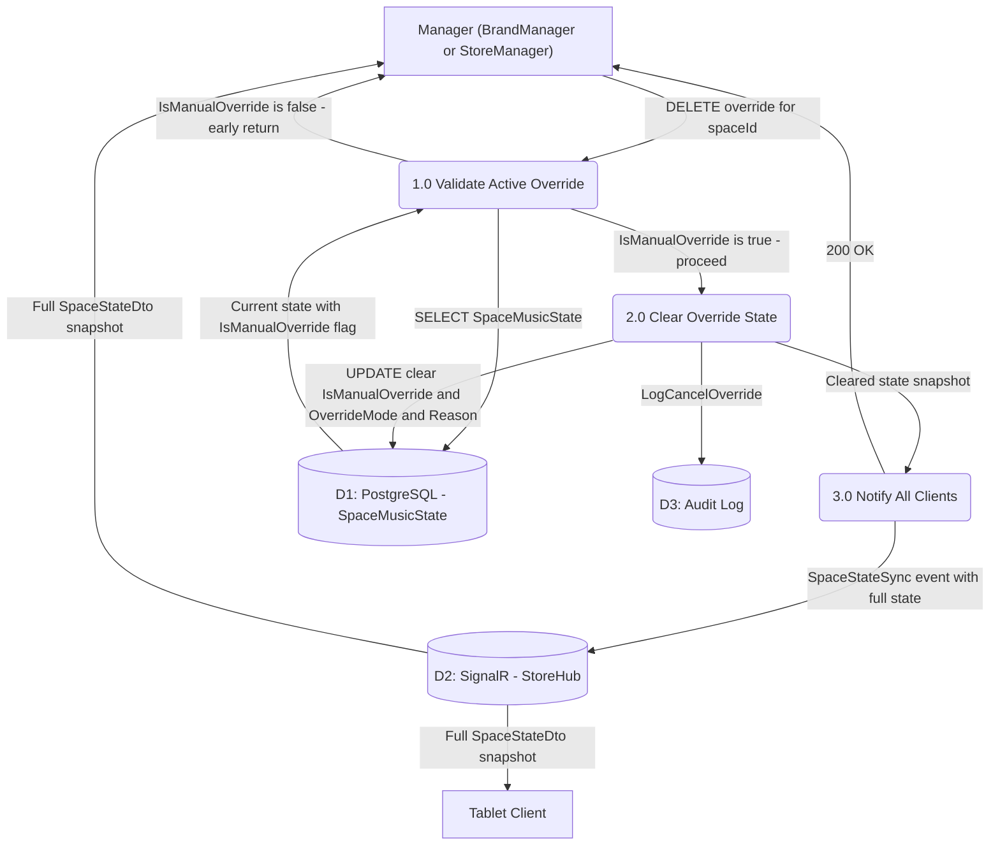
```mermaid
graph TB
    MGR["Manager (BrandManager or StoreManager)"]
    TAB["Tablet Client"]

    P1("1.0 Validate Active Override")
    P2("2.0 Clear Override State")
    P3("3.0 Notify All Clients")

    DB[("D1: PostgreSQL - SpaceMusicState")]
    SIG[("D2: SignalR - StoreHub")]
    AUDIT[("D3: Audit Log")]

    MGR -->|"DELETE override for spaceId"| P1
    P1 -->|"SELECT SpaceMusicState"| DB
    DB -->|"Current state with IsManualOverride flag"| P1
    P1 -->|"IsManualOverride is true - proceed"| P2
    P1 -->|"IsManualOverride is false - early return"| MGR

    P2 -->|"UPDATE clear IsManualOverride and OverrideMode and Reason"| DB
    P2 -->|"LogCancelOverride"| AUDIT
    P2 -->|"Cleared state snapshot"| P3

    P3 -->|"SpaceStateSync event with full state"| SIG
    SIG -->|"Full SpaceStateDto snapshot"| TAB
    SIG -->|"Full SpaceStateDto snapshot"| MGR
    P3 -->|"200 OK"| MGR
```

---

## 3.11.19 Data Flow Diagram — Send Playback Command

> Corresponds to `POST /api/cams/spaces/{spaceId}/playback`. The server computes absolute seek offsets for all skip and seek commands before relaying to clients, ensuring all connected devices (tablet + manager tabs) are synchronized.

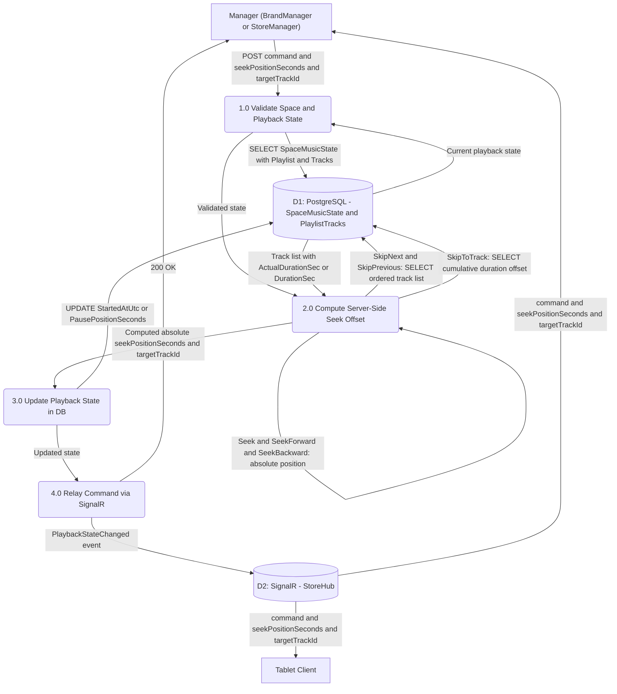
```mermaid
graph TB
    MGR["Manager (BrandManager or StoreManager)"]
    TAB["Tablet Client"]

    P1("1.0 Validate Space and Playback State")
    P2("2.0 Compute Server-Side Seek Offset")
    P3("3.0 Update Playback State in DB")
    P4("4.0 Relay Command via SignalR")

    DB[("D1: PostgreSQL - SpaceMusicState and PlaylistTracks")]
    SIG[("D2: SignalR - StoreHub")]

    MGR -->|"POST command and seekPositionSeconds and targetTrackId"| P1
    P1 -->|"SELECT SpaceMusicState with Playlist and Tracks"| DB
    DB -->|"Current playback state"| P1
    P1 -->|"Validated state"| P2

    P2 -->|"Pause: compute elapsed seconds since StartedAtUtc"| P2
    P2 -->|"Resume: shift StartedAtUtc by pause duration"| P2
    P2 -->|"Seek and SeekForward and SeekBackward: absolute position"| P2
    P2 -->|"SkipNext and SkipPrevious: SELECT ordered track list"| DB
    P2 -->|"SkipToTrack: SELECT cumulative duration offset"| DB
    DB -->|"Track list with ActualDurationSec or DurationSec"| P2
    P2 -->|"Computed absolute seekPositionSeconds and targetTrackId"| P3

    P3 -->|"UPDATE StartedAtUtc or PausePositionSeconds"| DB
    P3 -->|"Updated state"| P4

    P4 -->|"PlaybackStateChanged event"| SIG
    SIG -->|"command and seekPositionSeconds and targetTrackId"| TAB
    SIG -->|"command and seekPositionSeconds and targetTrackId"| MGR
    P4 -->|"200 OK"| MGR
```

---

## 3.11.20 Data Flow Diagram — Get Space State

> Corresponds to `GET /api/cams/spaces/{spaceId}/state`. Used by tablets on reconnect and managers on page load. `SeekOffsetSeconds` is computed on-demand (not stored); `hlsUrl` is always the CloudFront CDN URL (not raw S3 key).

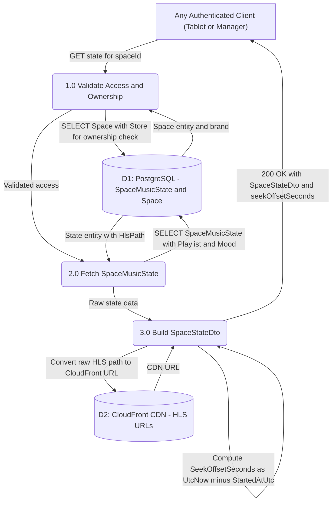
```mermaid
graph TB
    CLIENT["Any Authenticated Client (Tablet or Manager)"]

    P1("1.0 Validate Access and Ownership")
    P2("2.0 Fetch SpaceMusicState")
    P3("3.0 Build SpaceStateDto")

    DB[("D1: PostgreSQL - SpaceMusicState and Space")]
    CDN[("D2: CloudFront CDN - HLS URLs")]

    CLIENT -->|"GET state for spaceId"| P1
    P1 -->|"SELECT Space with Store for ownership check"| DB
    DB -->|"Space entity and brand"| P1
    P1 -->|"Validated access"| P2

    P2 -->|"SELECT SpaceMusicState with Playlist and Mood"| DB
    DB -->|"State entity with HlsPath"| P2
    P2 -->|"Raw state data"| P3

    P3 -->|"Convert raw HLS path to CloudFront URL"| CDN
    CDN -->|"CDN URL"| P3
    P3 -->|"Compute SeekOffsetSeconds as UtcNow minus StartedAtUtc"| P3
    P3 -->|"200 OK with SpaceStateDto and seekOffsetSeconds"| CLIENT
```
