# 3.10 Playlist Management - Software Design

> **Screens:** CMS Playlist List · Create/Edit Playlist · Playlist Detail  
> **Roles:**
>
> - Read (`GetPlaylists`, `GetPlaylistById`): `SystemAdmin` · `BrandManager` · `StoreManager`
> - Write (`Create/Update/Delete/ToggleStatus/AddTracks/RemoveTracks/Retranscode`): **`BrandManager`** · **`StoreManager`**
>   **Endpoints:** `GET /api/playlists` · `GET /api/playlists/{id}` · `POST /api/playlists` · `PUT /api/playlists/{id}` · `DELETE /api/playlists/{id}` · `PUT /api/playlists/{id}/toggle-status` · `POST /api/playlists/{id}/tracks` · `DELETE /api/playlists/{id}/tracks/{trackId}` · `POST /api/playlists/{id}/retranscode`

---

## 3.10.1 Class Diagram - Query Side (Read)

> `GetPlaylistsQueryHandler` and `GetPlaylistByIdQueryHandler` implement `IRequestHandler<,>` (MediatR) — hidden for readability.  
> Ownership on `Playlist` is derived via `playlist.Store?.BrandId` (no direct `BrandId` column on `Playlist`).  
> `GetPlaylistsQueryHandler`: BM forces `filter.BrandId = user.BrandId`; SM forces `filter.StoreId = user.StoreId` **and** `filter.BrandId = user.BrandId`.  
> `GetPlaylistByIdQueryHandler`: loads `PlaylistTracks → Track`, `Mood`, `Store`; computes `SeekOffsetSeconds` per track after mapping.

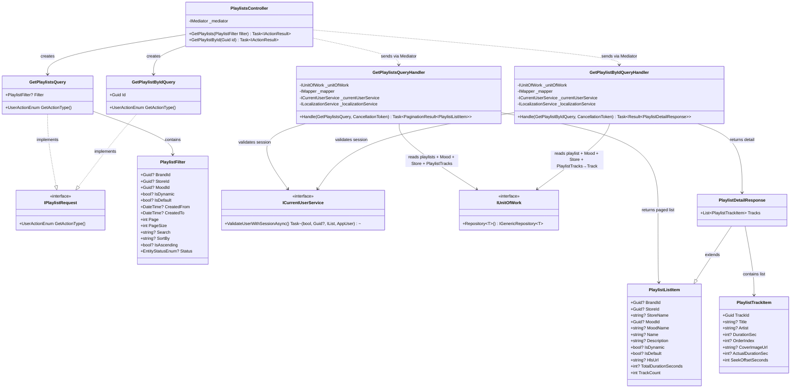

---

## 3.10.2 Class Diagram - Command Side (Write)

> Write authorization: `BrandManager` **or** `StoreManager` (both roles can write).  
> Ownership is checked via `playlist.Store?.BrandId == user.BrandId` (BM) or `playlist.StoreId == user.StoreId` (SM).  
> `PlaylistRequest` is shared for Create/Update; `SharedPlaylistRequestValidator` switches with `isPartialUpdate`.

### Part A - Commands, DTOs, Validators

```mermaid
classDiagram
    class PlaylistsController {
        -IMediator _mediator
        +CreatePlaylist(PlaylistRequest request) Task~IActionResult~
        +UpdatePlaylist(Guid id, PlaylistRequest request) Task~IActionResult~
        +DeletePlaylist(Guid id) Task~IActionResult~
        +TogglePlaylistStatus(Guid id) Task~IActionResult~
        +AddTracksToPlaylist(Guid id, AddTracksToPlaylistRequest request) Task~IActionResult~
        +RemoveTrackFromPlaylist(Guid id, Guid trackId) Task~IActionResult~
        +RetranscodePlaylist(Guid id) Task~IActionResult~
    }

    class IPlaylistRequest {
        <<interface>>
        +UserActionEnum GetActionType()
    }

    class CreatePlaylistCommand {
        +PlaylistRequest Request
        +UserActionEnum GetActionType()
    }

    class UpdatePlaylistCommand {
        +Guid Id
        +PlaylistRequest Request
        +UserActionEnum GetActionType()
    }

    class DeletePlaylistCommand {
        +Guid Id
        +UserActionEnum GetActionType()
    }

    class TogglePlaylistStatusCommand {
        +Guid Id
        +UserActionEnum GetActionType()
    }

    class AddTracksToPlaylistCommand {
        +Guid PlaylistId
        +AddTracksToPlaylistRequest Request
        +UserActionEnum GetActionType()
    }

    class RemoveTrackFromPlaylistCommand {
        +Guid PlaylistId
        +Guid TrackId
        +UserActionEnum GetActionType()
    }

    class RetranscodePlaylistCommand {
        +Guid Id
        +UserActionEnum GetActionType()
    }

    class PlaylistRequest {
        +string? Name
        +Guid? MoodId
        +Guid? StoreId
        +string? Description
        +bool? IsDynamic
        +bool? IsDefault
        +string? HlsUrl
        +int? TotalDurationSeconds
        +List~Guid~? TrackIds
    }

    class AddTracksToPlaylistRequest {
        +List~Guid~ TrackIds
    }

    class SharedPlaylistRequestValidator {
        +SharedPlaylistRequestValidator(ILocalizationService, bool isPartialUpdate)
    }

    class CreatePlaylistCommandValidator {
        +Validate(CreatePlaylistCommand) ValidationResult
    }

    class UpdatePlaylistCommandValidator {
        +Validate(UpdatePlaylistCommand) ValidationResult
    }

    PlaylistsController --> CreatePlaylistCommand : creates
    PlaylistsController --> UpdatePlaylistCommand : creates
    PlaylistsController --> DeletePlaylistCommand : creates
    PlaylistsController --> TogglePlaylistStatusCommand : creates
    PlaylistsController --> AddTracksToPlaylistCommand : creates
    PlaylistsController --> RemoveTrackFromPlaylistCommand : creates
    PlaylistsController --> RetranscodePlaylistCommand : creates

    CreatePlaylistCommand ..|> IPlaylistRequest : implements
    UpdatePlaylistCommand ..|> IPlaylistRequest : implements
    DeletePlaylistCommand ..|> IPlaylistRequest : implements
    TogglePlaylistStatusCommand ..|> IPlaylistRequest : implements
    AddTracksToPlaylistCommand ..|> IPlaylistRequest : implements
    RemoveTrackFromPlaylistCommand ..|> IPlaylistRequest : implements
    RetranscodePlaylistCommand ..|> IPlaylistRequest : implements

    CreatePlaylistCommand --> PlaylistRequest : contains
    UpdatePlaylistCommand --> PlaylistRequest : contains
    AddTracksToPlaylistCommand --> AddTracksToPlaylistRequest : contains

    CreatePlaylistCommandValidator ..> SharedPlaylistRequestValidator : isPartialUpdate=false
    UpdatePlaylistCommandValidator ..> SharedPlaylistRequestValidator : isPartialUpdate=true
```

### Part B - Handler Dependencies

```mermaid
classDiagram
    class CreatePlaylistCommandHandler {
        -IUnitOfWork _unitOfWork
        -IMapper _mapper
        -ICurrentUserService _currentUserService
        -ILocalizationService _localizationService
        -IAuditService _auditService
        -IBackgroundTranscodeService _transcodeService
        -ILogger _logger
        +Handle(CreatePlaylistCommand, CancellationToken) Task~Result~
    }

    class UpdatePlaylistCommandHandler {
        -IUnitOfWork _unitOfWork
        -IMapper _mapper
        -ICurrentUserService _currentUserService
        -ILocalizationService _localizationService
        -IAuditService _auditService
        -IServiceScopeFactory _scopeFactory
        +Handle(UpdatePlaylistCommand, CancellationToken) Task~Result~
    }

    class DeletePlaylistCommandHandler {
        -IUnitOfWork _unitOfWork
        -ICurrentUserService _currentUserService
        -ILocalizationService _localizationService
        -IAuditService _auditService
        -IBackgroundTranscodeService _transcodeService
        +Handle(DeletePlaylistCommand, CancellationToken) Task~Result~
    }

    class TogglePlaylistStatusCommandHandler {
        -IUnitOfWork _unitOfWork
        -ICurrentUserService _currentUserService
        -ILocalizationService _localizationService
        -IAuditService _auditService
        +Handle(TogglePlaylistStatusCommand, CancellationToken) Task~Result~
    }

    class AddTracksToPlaylistCommandHandler {
        -IUnitOfWork _unitOfWork
        -ICurrentUserService _currentUserService
        -ILocalizationService _localizationService
        -IAuditService _auditService
        -IServiceScopeFactory _scopeFactory
        -IBackgroundTranscodeService _transcodeService
        +Handle(AddTracksToPlaylistCommand, CancellationToken) Task~Result~
    }

    class RemoveTrackFromPlaylistCommandHandler {
        -IUnitOfWork _unitOfWork
        -ICurrentUserService _currentUserService
        -ILocalizationService _localizationService
        -IAuditService _auditService
        -IServiceScopeFactory _scopeFactory
        -IBackgroundTranscodeService _transcodeService
        +Handle(RemoveTrackFromPlaylistCommand, CancellationToken) Task~Result~
    }

    class RetranscodePlaylistCommandHandler {
        -IUnitOfWork _unitOfWork
        -ICurrentUserService _currentUserService
        -ILocalizationService _localizationService
        -IBackgroundTranscodeService _transcodeService
        +Handle(RetranscodePlaylistCommand, CancellationToken) Task~Result~
    }

    class IBackgroundTranscodeService {
        <<interface>>
        +RequestTranscode(Guid playlistId, Guid storeId, bool immediate) void
        +EnqueueS3FolderCleanup(Guid playlistId, Guid storeId) void
    }

    class IAuditService {
        <<interface>>
        +LogEntityCreate(...) void
        +LogEntityUpdate(...) void
        +LogEntityDelete(...) void
        +LogEntityToggleStatus(...) void
    }

    class PlaylistTrackOrderHelper {
        <<static>>
        +ReindexOrderInBackground(IServiceScopeFactory, Guid playlistId) void
    }

    class PlaylistActiveStreamGuard {
        <<static>>
        +ThrowIfStreamingAsync(Guid playlistId, IUnitOfWork, ILocalizationService, CancellationToken) Task
    }

    CreatePlaylistCommandHandler --> IBackgroundTranscodeService : RequestTranscode (debounced)
    CreatePlaylistCommandHandler --> IAuditService : audit create

    UpdatePlaylistCommandHandler --> PlaylistTrackOrderHelper : ReindexOrderInBackground
    UpdatePlaylistCommandHandler --> IAuditService : audit update

    DeletePlaylistCommandHandler --> IBackgroundTranscodeService : EnqueueS3FolderCleanup
    DeletePlaylistCommandHandler --> IAuditService : audit delete

    TogglePlaylistStatusCommandHandler --> IAuditService : audit toggle

    AddTracksToPlaylistCommandHandler --> PlaylistActiveStreamGuard : guard streaming check
    AddTracksToPlaylistCommandHandler --> PlaylistTrackOrderHelper : ReindexOrderInBackground
    AddTracksToPlaylistCommandHandler --> IBackgroundTranscodeService : RequestTranscode (debounced)
    AddTracksToPlaylistCommandHandler --> IAuditService : audit update

    RemoveTrackFromPlaylistCommandHandler --> PlaylistActiveStreamGuard : guard streaming check
    RemoveTrackFromPlaylistCommandHandler --> PlaylistTrackOrderHelper : ReindexOrderInBackground
    RemoveTrackFromPlaylistCommandHandler --> IBackgroundTranscodeService : RequestTranscode (debounced)
    RemoveTrackFromPlaylistCommandHandler --> IAuditService : audit update

    RetranscodePlaylistCommandHandler --> IBackgroundTranscodeService : RequestTranscode (immediate)
```

---

## 3.10.3 Sequence Diagram - Get Playlists

> Read allowed for `SystemAdmin`, `BrandManager`, `StoreManager`.  
> BM: handler forces `filter.BrandId = user.BrandId`. SM: forces both `filter.StoreId = user.StoreId` and `filter.BrandId = user.BrandId`.  
> Includes: `Mood`, `Store`, `PlaylistTracks` (for `TrackCount`).

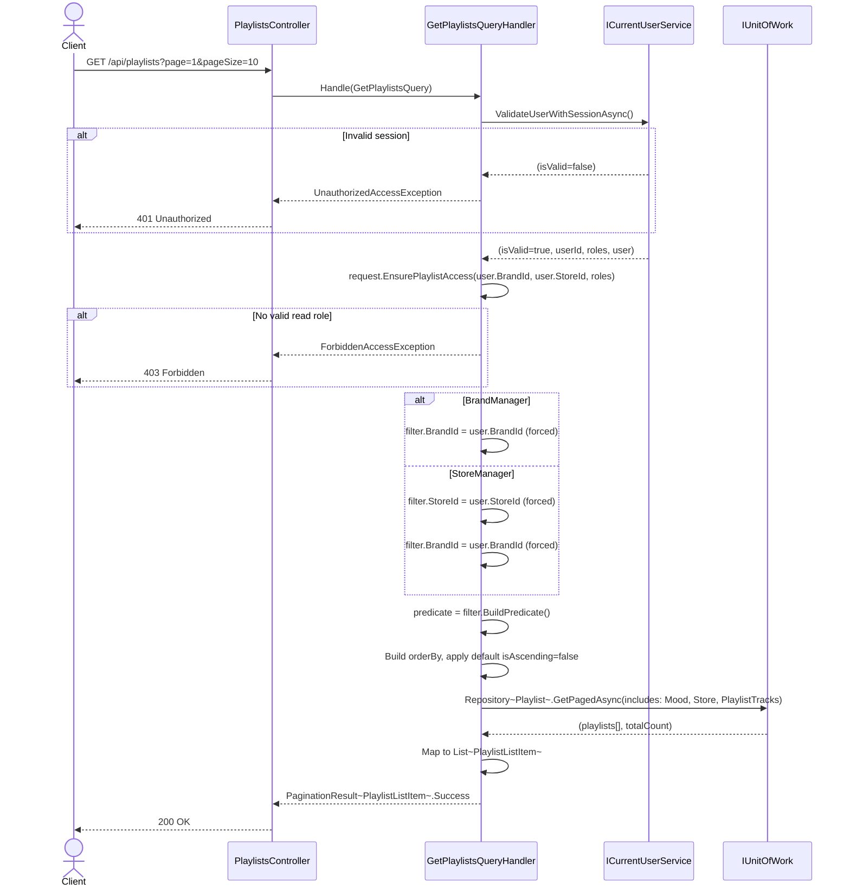

---

## 3.10.4 Sequence Diagram - Get Playlist By Id

> Loaded with full graph: `PlaylistTracks → Track`, `Mood`, `Store`.  
> BM ownership: `playlist.Store?.BrandId == user.BrandId`. SM ownership: `playlist.StoreId == user.StoreId`.  
> `SeekOffsetSeconds` is computed post-mapping using `ActualDurationSec` (MediaConvert) with fallback to `DurationSec`.

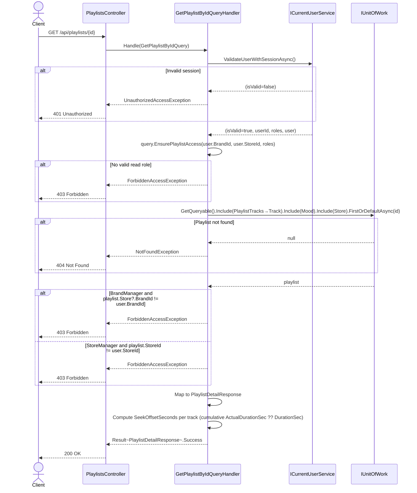

---

## 3.10.5 Sequence Diagram - Create Playlist

> Write allowed for `BrandManager` **and** `StoreManager`.  
> `StoreManager`: `StoreId` auto-resolved from `user.StoreId`; `BrandId` resolved from `Store.BrandId`.  
> `BrandManager`: must provide `StoreId` in request body; handler verifies `Store.BrandId == user.BrandId`.  
> Initial `TrackIds` are validated (must belong to same brand) and atomically inserted as `PlaylistTrack` rows.  
> Transcode is triggered (debounced 5 min) only when initial tracks are provided.

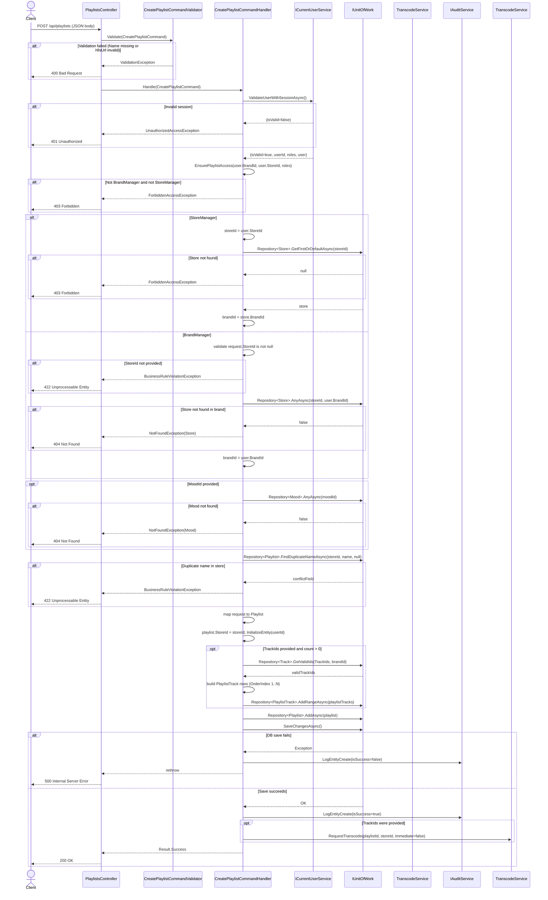

---

## 3.10.6 Sequence Diagram - Update Playlist

> BM/SM write roles; ownership derived from `playlist.Store?.BrandId` (BM) or `playlist.StoreId` (SM).  
> `TrackIds = null` → skip track management. `TrackIds = []` → remove all tracks.  
> Any track list change triggers background reindex via `PlaylistTrackOrderHelper`.

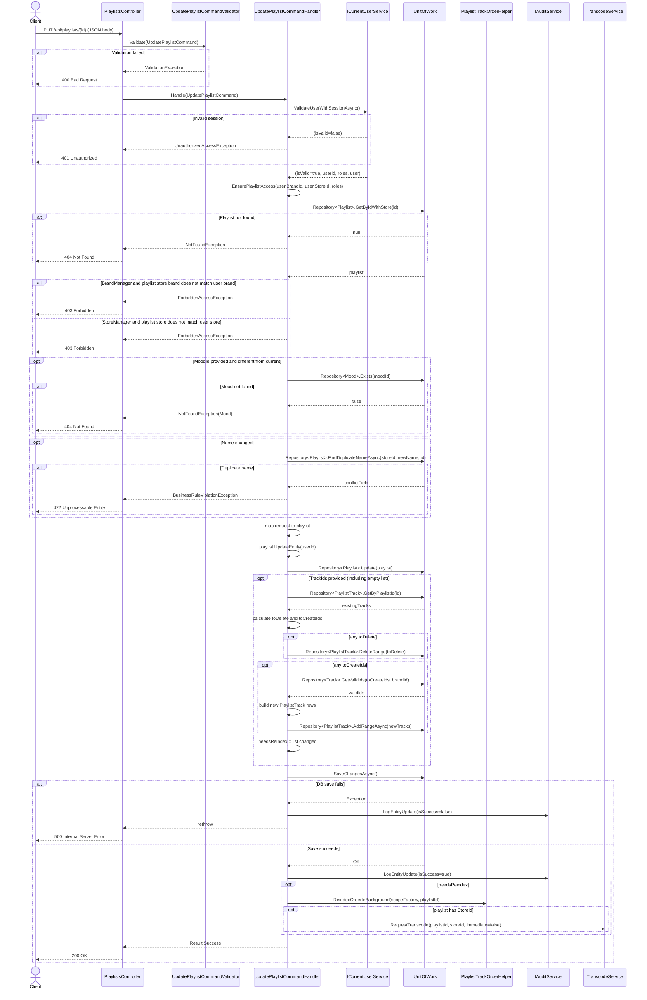

---

## 3.10.7 Sequence Diagram - Delete Playlist

> Soft-delete only.  
> Business rule: cannot delete a playlist that is **currently streaming** — checked via `SpaceMusicStates.CurrentPlaylistId`.  
> On success: S3 folder cleanup is enqueued via `IBackgroundTranscodeService.EnqueueS3FolderCleanup`.

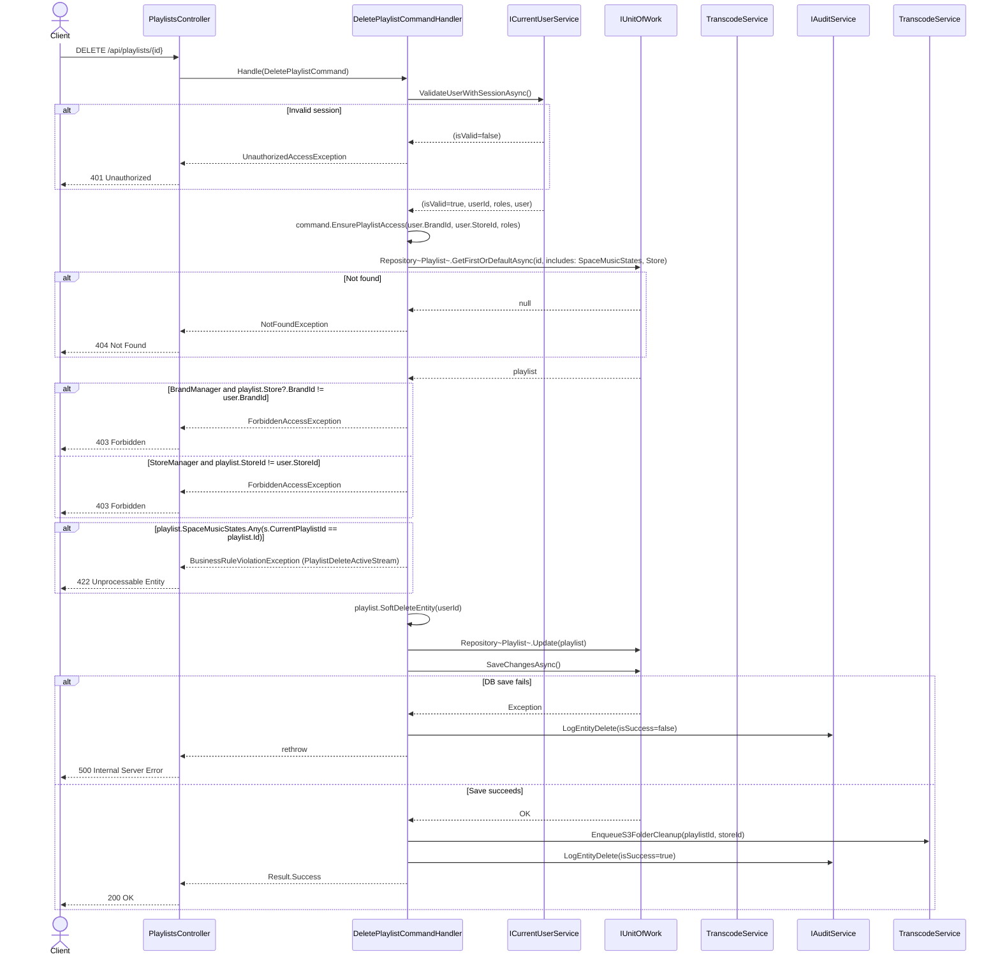

---

## 3.10.8 Sequence Diagram - Toggle Playlist Status

> `BrandManager` and `StoreManager` both allowed.  
> Binary toggle: `Active ↔ Inactive`. Previous status captured for audit log.

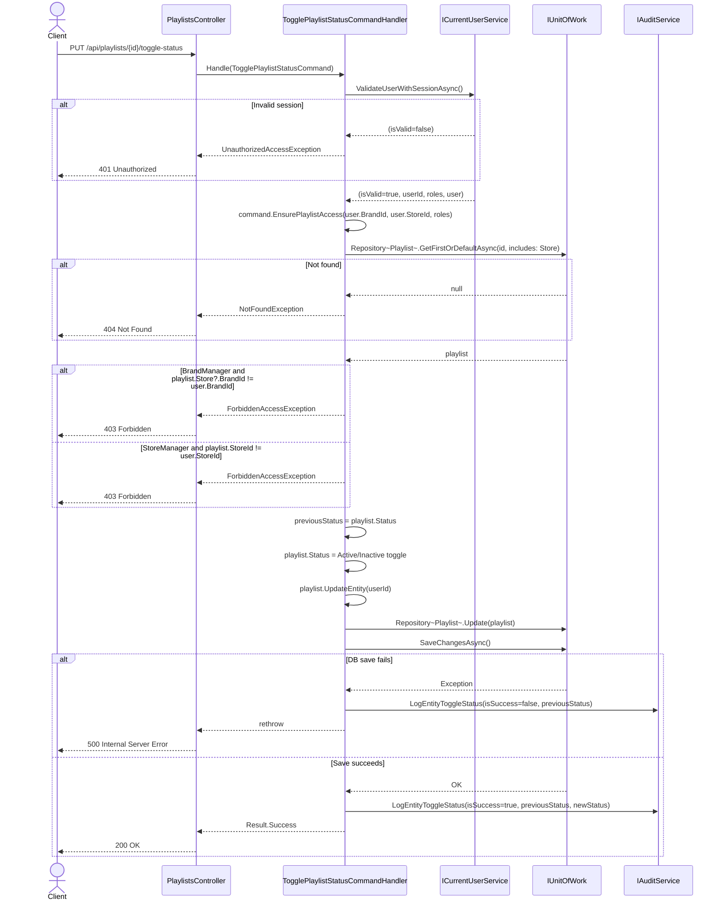

---

## 3.10.9 Sequence Diagram - Add Tracks To Playlist

> BM/SM write roles.  
> Duplicate tracks (already in playlist) are silently skipped (counted as `skippedCount`).  
> Guard: cannot add tracks to a playlist that is currently streaming (`PlaylistActiveStreamGuard`).  
> New rows appended after current max `OrderIndex`; background reindex normalises ordering.  
> Transcode re-triggered (debounced 5 min) after successful save.

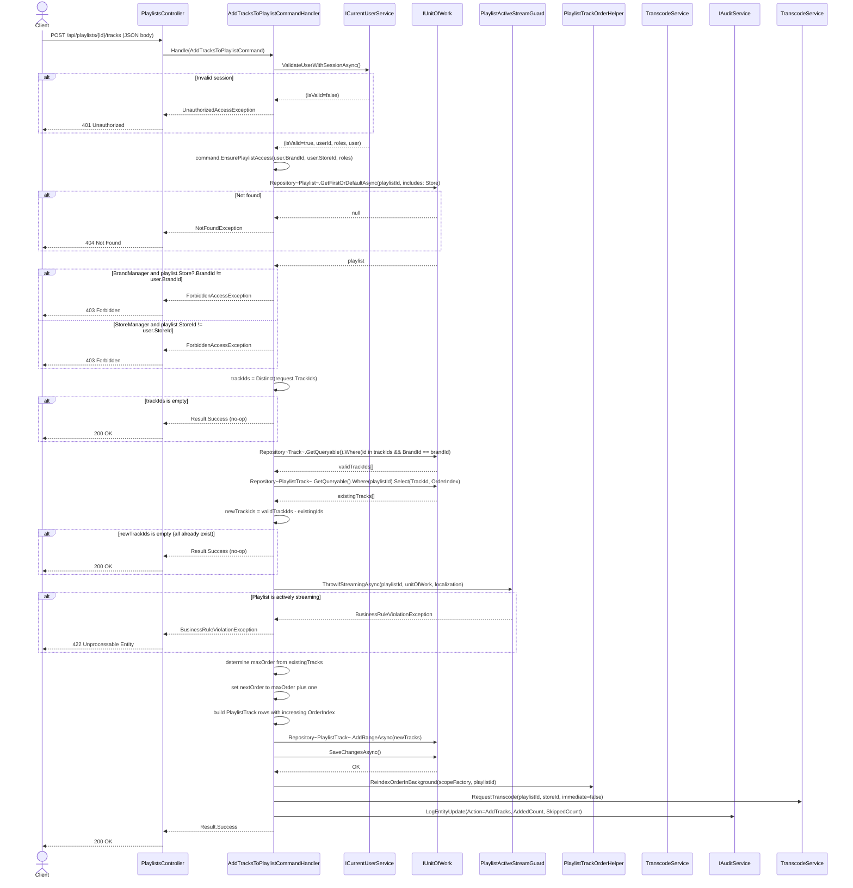

---

## 3.10.10 Sequence Diagram - Remove Track From Playlist

> BM/SM write roles.  
> Guard: cannot remove tracks from a playlist that is currently streaming.  
> If the `PlaylistTrack` row is not found, operation is silently ignored (idempotent).  
> Transcode re-triggered (debounced 5 min) after successful removal.

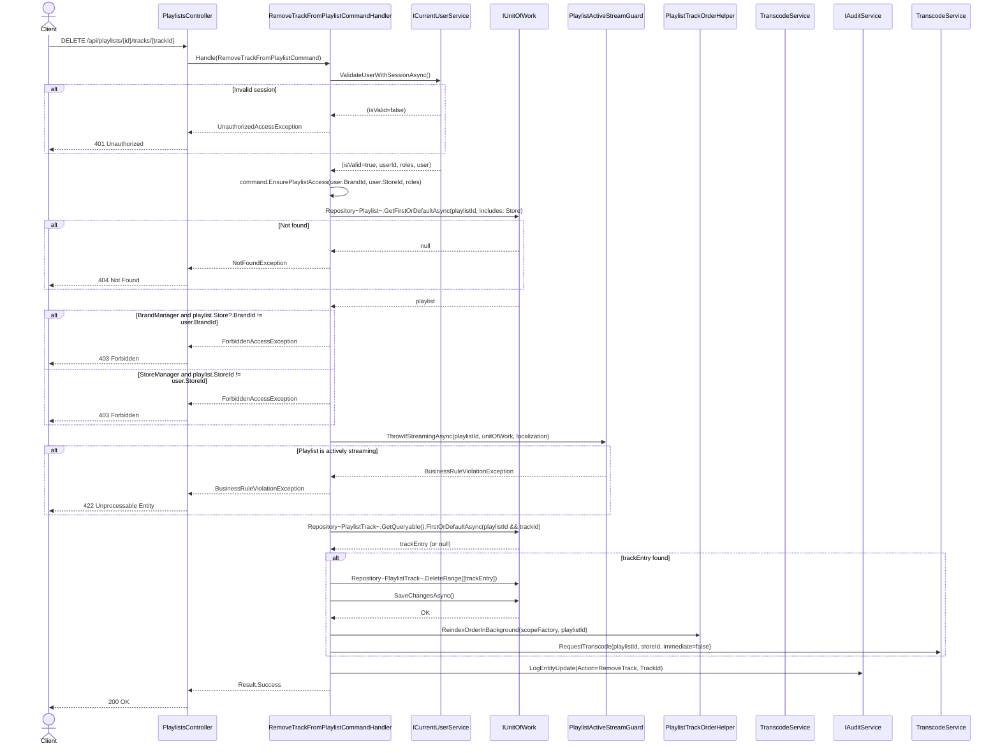

---

## 3.10.11 Sequence Diagram - Retranscode Playlist (API)

> BM/SM write roles.  
> Calls `IBackgroundTranscodeService.RequestTranscode(..., immediate=true)` and returns `202 Accepted` when enqueued.

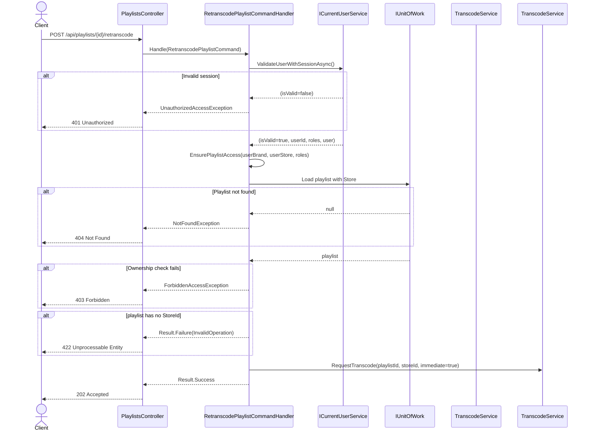

---

## 3.10.12 Sequence Diagram - Transcode Orchestration (Debounce + MediaConvert)

> This sequence describes the internal flow triggered by `RequestTranscode`.  
> Debounce key is `Playlist.TranscodeRequestedAt` stamped by `BackgroundTranscodeService` and checked in `PlaylistTranscodeJob`.

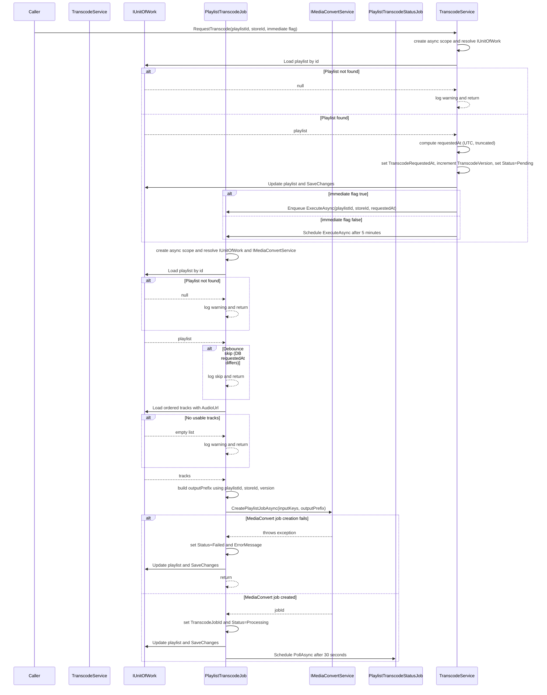

---

## 3.10.12 Notes for Implementation Accuracy

1. **No `BrandId` column on `Playlist`**: Brand ownership is always resolved via the `Store` navigation property (`playlist.Store?.BrandId`). All command handlers load `includes: Store` for ownership checks.
2. **Write roles are BM + SM**: Unlike `Track` (BrandManager-only write), Playlist write endpoints are accessible to both `BrandManager` and `StoreManager`.
3. **StoreId resolution on Create**: `StoreManager` auto-gets `StoreId` from `user.StoreId`; `BrandManager` must supply `StoreId` in the request body, which is then validated against the brand boundary.
4. **Track ownership on add**: Tracks added to a playlist are validated to belong to the same brand (`Track.BrandId == brandId`) to prevent cross-brand contamination.
5. **Active streaming guard**: `AddTracksToPlaylist` and `RemoveTrackFromPlaylist` check `PlaylistActiveStreamGuard.ThrowIfStreamingAsync` to prevent modification of a currently-streaming playlist.
6. **Delete business rule**: A playlist cannot be soft-deleted if any `SpaceMusicState` currently references it as `CurrentPlaylistId` (playing/paused).
7. **Background reindex**: Any track list change (add/remove/update) triggers `PlaylistTrackOrderHelper.ReindexOrderInBackground` to normalise `OrderIndex` values in a scoped background task.
8. **Transcode scheduling**: Track additions/removals use a debounced 5-minute transcode (`immediate=false`); `RetranscodePlaylist` forces an immediate job (`immediate=true`).
9. **S3 cleanup on delete**: `DeletePlaylistCommandHandler` enqueues `EnqueueS3FolderCleanup` **only after** successful soft-delete commit to clean up all HLS/transcode outputs.
10. **`SeekOffsetSeconds` computation**: `GetPlaylistByIdQueryHandler` computes cumulative HLS seek offsets post-mapping, preferring `ActualDurationSec` (from MediaConvert) and falling back to metadata `DurationSec`.
11. **`TrackIds` on Update semantics**: `null` = do not modify tracks; `[]` = remove all tracks; `[id1, id2]` = set exact desired track list (diff-based add/remove).

---

## 3.10.13 Data Flow Diagram — Context (Level 0)

> Shows the Playlist Management system boundary. Both `BrandManager` and `StoreManager` have full write access (unlike Track, which is `BrandManager`-only). Transcode scheduling is a key side-effect data flow unique to this module.

**Notation:**

- **Rectangle `[ ]`** — External Entity
- **Rounded rectangle `( )`** — Process / System
- **Cylinder `[( )]`** — Data Store
- **Arrow `-->|label|`** — Named data flow

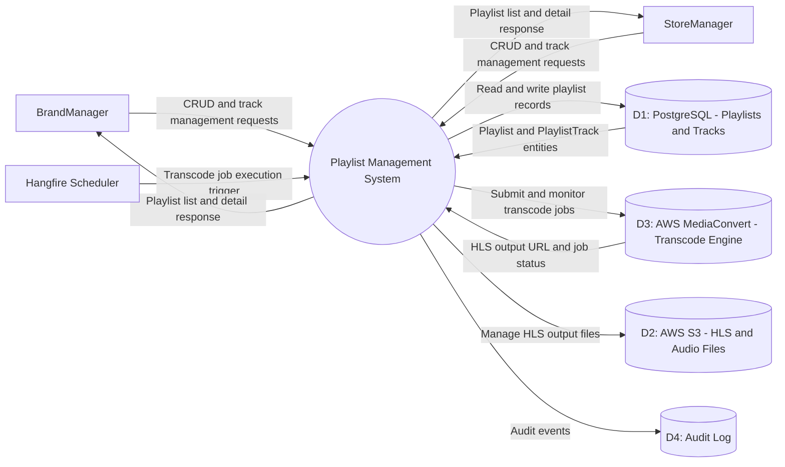

---

## 3.10.14 Data Flow Diagram — Level 1

> Decomposes the Playlist Management system into eight core processes. Processes 5–7 (Add Tracks, Remove Track, Retranscode) all interact with the Hangfire job queue for transcode scheduling.

```mermaid
graph TB
    MGR["BrandManager or StoreManager"]
    HF["Hangfire Scheduler"]

    P1("1.0 Query Playlists")
    P2("2.0 Create Playlist")
    P3("3.0 Update Playlist")
    P4("4.0 Delete Playlist")
    P5("5.0 Add Tracks to Playlist")
    P6("6.0 Remove Track from Playlist")
    P7("7.0 Retranscode Playlist")
    P8("8.0 Toggle Status")

    DB[("D1: PostgreSQL - Playlists and Tracks")]
    S3[("D2: AWS S3 - HLS Files")]
    JOB[("D3: Hangfire - Job Queue")]
    AUDIT[("D4: Audit Log")]

    MGR -->|"GET filter or playlistId"| P1
    P1 -->|"Paginated list or detail"| MGR
    P1 -->|"SELECT playlists with track count"| DB
    DB -->|"Playlist rows"| P1

    MGR -->|"POST PlaylistRequest with optional trackIds"| P2
    P2 -->|"Validate store and brand and mood"| DB
    P2 -->|"INSERT Playlist and PlaylistTrack rows"| DB
    P2 -->|"Queue debounced transcode job"| JOB
    P2 -->|"LogCreate"| AUDIT
    P2 -->|"playlistId result"| MGR

    MGR -->|"PUT PlaylistRequest with optional trackIds"| P3
    P3 -->|"SELECT and verify brand ownership"| DB
    DB -->|"Existing playlist entity"| P3
    P3 -->|"Diff and update PlaylistTrack list"| DB
    P3 -->|"Queue debounced transcode on track change"| JOB
    P3 -->|"LogUpdate"| AUDIT
    P3 -->|"Success result"| MGR

    MGR -->|"DELETE playlistId"| P4
    P4 -->|"Check active streaming in SpaceMusicState"| DB
    DB -->|"Streaming guard result"| P4
    P4 -->|"SOFT DELETE playlist"| DB
    P4 -->|"Delete HLS output folder"| S3
    P4 -->|"LogDelete"| AUDIT
    P4 -->|"Success result"| MGR

    MGR -->|"POST add trackIds to playlist"| P5
    P5 -->|"Validate brand ownership and streaming guard"| DB
    P5 -->|"INSERT new PlaylistTrack rows"| DB
    P5 -->|"Queue debounced transcode"| JOB
    P5 -->|"Success result"| MGR

    MGR -->|"DELETE trackId from playlist"| P6
    P6 -->|"Validate streaming guard"| DB
    P6 -->|"DELETE PlaylistTrack row"| DB
    P6 -->|"Queue debounced transcode"| JOB
    P6 -->|"Success result"| MGR

    MGR -->|"POST retranscode playlistId"| P7
    HF -->|"Scheduled job execution"| P7
    P7 -->|"SELECT playlist with store"| DB
    P7 -->|"Queue immediate transcode job"| JOB
    P7 -->|"UPDATE TranscodeStatus and HlsUrl"| DB
    P7 -->|"Store HLS output files"| S3
    P7 -->|"Success result"| MGR

    MGR -->|"PUT toggle playlistId"| P8
    P8 -->|"UPDATE status"| DB
    P8 -->|"LogToggleStatus"| AUDIT
    P8 -->|"Success result"| MGR
```
