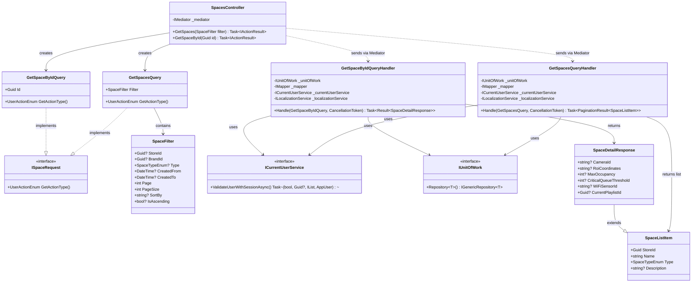
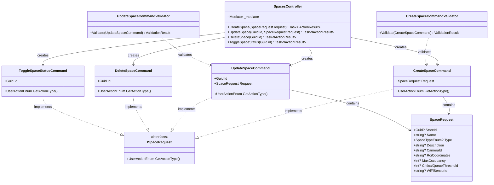
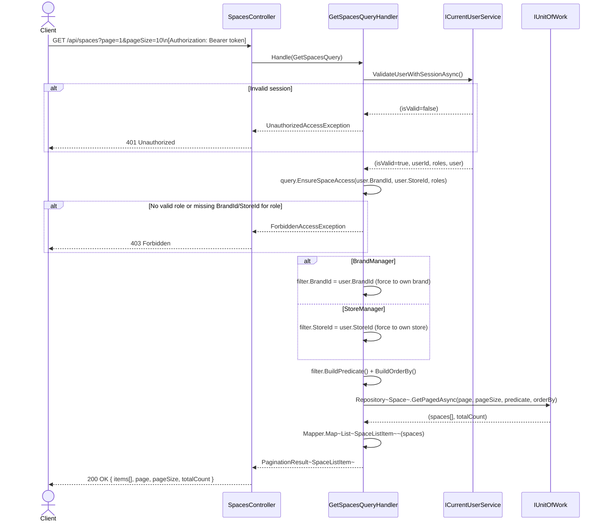
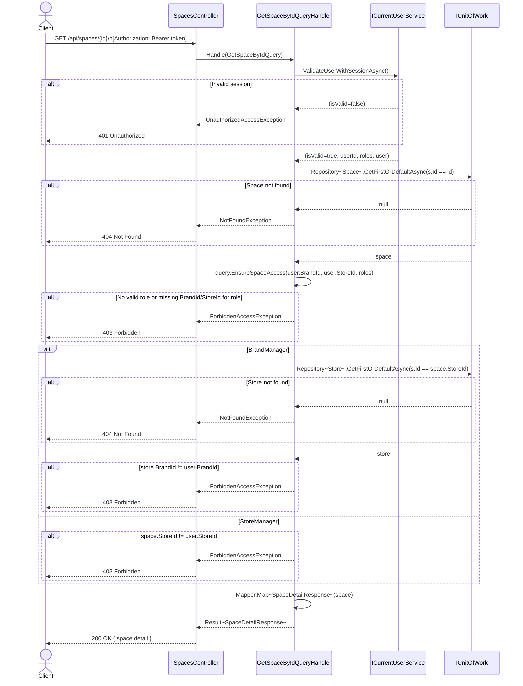
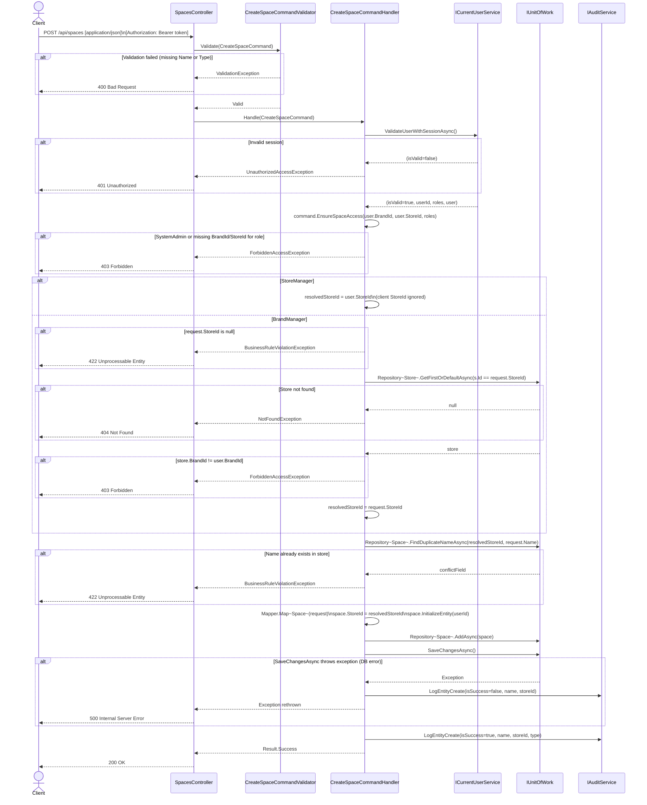
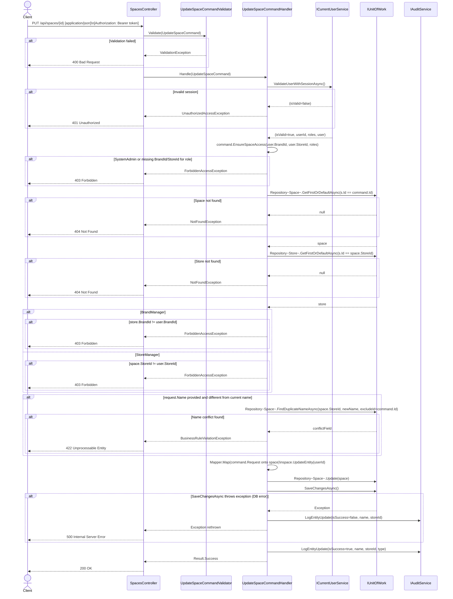
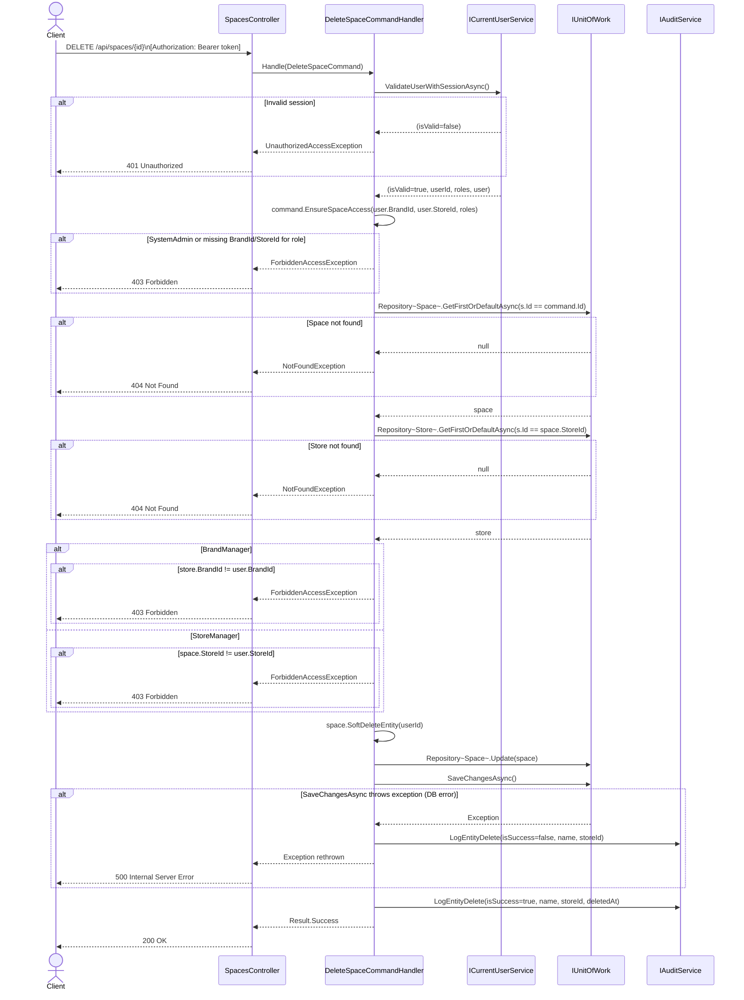
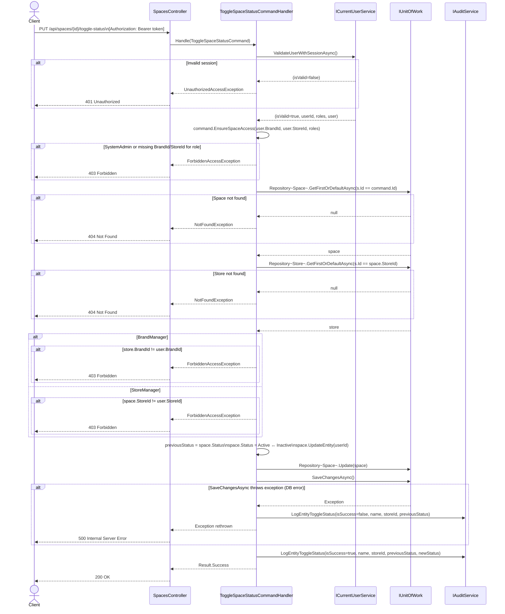

# 3.8 Space Management – Software Design

> **Screens:** #19 Space Mgmt List · #20 Create/Edit Space · #21 Space Detail  
> **Roles:**
>
> - Read (GetSpaces, GetSpaceById): SystemAdmin · BrandManager · StoreManager
> - Write (Create/Update/Delete/Toggle): **BrandManager and StoreManager only — SystemAdmin is explicitly excluded**  
>   **Endpoints:** `GET /api/spaces` · `GET /api/spaces/{id}` · `POST /api/spaces` · `PUT /api/spaces/{id}` · `DELETE /api/spaces/{id}` · `PUT /api/spaces/{id}/toggle-status`

---

## 3.8.1 Class Diagram – Query Side (Read)

> `GetSpacesQueryHandler` and `GetSpaceByIdQueryHandler` both implement `IRequestHandler<TQuery, TResult>` from MediatR (NuGet) — not shown in diagram.  
> `ISpaceRequest` only carries `GetActionType()` — no `GetTargetBrandId/StoreId` (simpler than `IUserRequest`).  
> Access scoping is applied directly in the handler: BrandManager → `filter.BrandId = user.BrandId`; StoreManager → `filter.StoreId = user.StoreId`.

---

## 3.8.2 Class Diagram – Command Side (Write)

> All handlers implement `IRequestHandler<TCommand, Result>` from MediatR (NuGet) — not shown.  
> `SpaceRequest` is a **shared DTO** used for both Create and Update (all fields nullable for partial-update semantics).  
> `DeleteSpaceCommand` and `ToggleSpaceStatusCommand` have no validator — they carry only `Guid Id`.  
> Diagram split into Part A (Commands, DTOs, Validators) and Part B (Handler Dependencies).

### Part A – Commands, DTOs & Validators

### Part B – Handler Dependencies

```mermaid
classDiagram
    class CreateSpaceCommandHandler {
        -IUnitOfWork _unitOfWork
        -IMapper _mapper
        -ICurrentUserService _currentUserService
        -ILocalizationService _localizationService
        -IAuditService _auditService
        +Handle(CreateSpaceCommand, CancellationToken) Task~Result~
    }

    class UpdateSpaceCommandHandler {
        -IUnitOfWork _unitOfWork
        -IMapper _mapper
        -ICurrentUserService _currentUserService
        -ILocalizationService _localizationService
        -IAuditService _auditService
        +Handle(UpdateSpaceCommand, CancellationToken) Task~Result~
    }

    class DeleteSpaceCommandHandler {
        -IUnitOfWork _unitOfWork
        -ICurrentUserService _currentUserService
        -ILocalizationService _localizationService
        -IAuditService _auditService
        +Handle(DeleteSpaceCommand, CancellationToken) Task~Result~
    }

    class ToggleSpaceStatusCommandHandler {
        -IUnitOfWork _unitOfWork
        -ICurrentUserService _currentUserService
        -ILocalizationService _localizationService
        -IAuditService _auditService
        +Handle(ToggleSpaceStatusCommand, CancellationToken) Task~Result~
    }

    class IUnitOfWork {
        <<interface>>
        +Repository~T~() IGenericRepository~T~
        +SaveChangesAsync(CancellationToken) Task~int~
    }

    class ICurrentUserService {
        <<interface>>
        +ValidateUserWithSessionAsync() Task~(bool, Guid?, IList, AppUser)~
        +IpAddress string
        +UserAgent string
    }

    class IAuditService {
        <<interface>>
        +LogEntityCreate(string, string, object, bool, Guid?, string, string) void
        +LogEntityUpdate(string, string, object, bool, Guid?, string, string) void
        +LogEntityDelete(string, string, object, bool, Guid?, string, string) void
        +LogEntityToggleStatus(string, string, object, bool, Guid?, string, string) void
    }

    CreateSpaceCommandHandler --> IUnitOfWork : uses
    CreateSpaceCommandHandler --> ICurrentUserService : uses
    CreateSpaceCommandHandler --> IAuditService : uses
    UpdateSpaceCommandHandler --> IUnitOfWork : uses
    UpdateSpaceCommandHandler --> ICurrentUserService : uses
    UpdateSpaceCommandHandler --> IAuditService : uses
    DeleteSpaceCommandHandler --> IUnitOfWork : uses
    DeleteSpaceCommandHandler --> ICurrentUserService : uses
    DeleteSpaceCommandHandler --> IAuditService : uses
    ToggleSpaceStatusCommandHandler --> IUnitOfWork : uses
    ToggleSpaceStatusCommandHandler --> ICurrentUserService : uses
    ToggleSpaceStatusCommandHandler --> IAuditService : uses
```

---

## 3.8.3 Sequence Diagram – Get Spaces List

> All 3 roles allowed. Handler forces scope: BrandManager → `filter.BrandId = user.BrandId`; StoreManager → `filter.StoreId = user.StoreId`.  
> Uses standard `Repository<Space>.GetPagedAsync()` with `BuildPredicate()` + `BuildOrderBy()` — no raw SQL.

---

## 3.8.4 Sequence Diagram – Get Space By ID

> All 3 roles allowed. Space is loaded first, then ownership is verified per-role.  
> SystemAdmin skips ownership check. BrandManager loads the parent store to verify brand. StoreManager checks `space.StoreId` directly.

---

## 3.8.5 Sequence Diagram – Create Space

> **SystemAdmin excluded** from write operations.  
> StoreManager: `space.StoreId` is always forced to `user.StoreId` — any client-supplied `StoreId` is ignored.  
> BrandManager: `request.StoreId` is required and must belong to their brand.  
> Uniqueness checked per-store: no two spaces in the same store may share a name.

---

## 3.8.6 Sequence Diagram – Update Space

> **SystemAdmin excluded.**  
> Space is loaded first, then the parent store is loaded to verify ownership.  
> Name uniqueness is checked **only if** the name is provided and actually changed.

---

## 3.8.7 Sequence Diagram – Delete Space

> **SystemAdmin excluded.** Soft-delete only (`SoftDeleteEntity`) — no physical row removal.  
> Same ownership verification pattern as Update (load space → load store → check by role).

---

## 3.8.8 Sequence Diagram – Toggle Space Status

> **SystemAdmin excluded.** Toggles `Status` between `Active` and `Inactive`.  
> `previousStatus` is captured before the toggle for the audit log entry.

