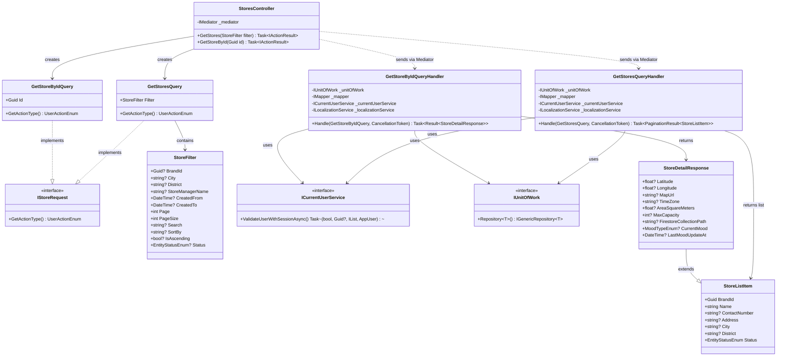
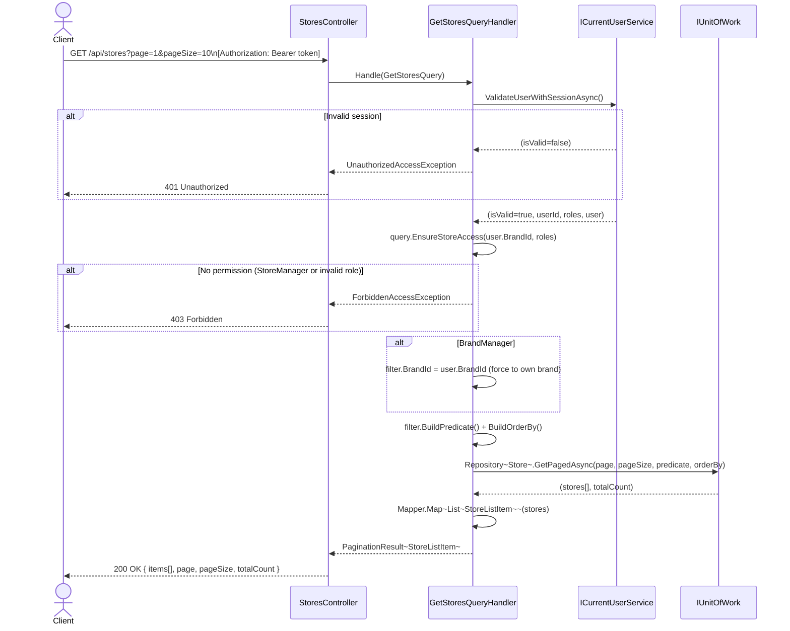
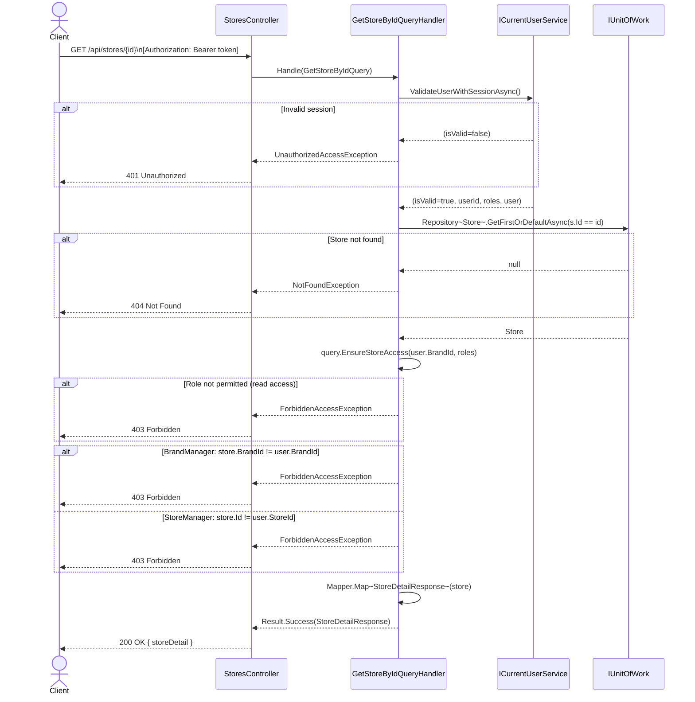
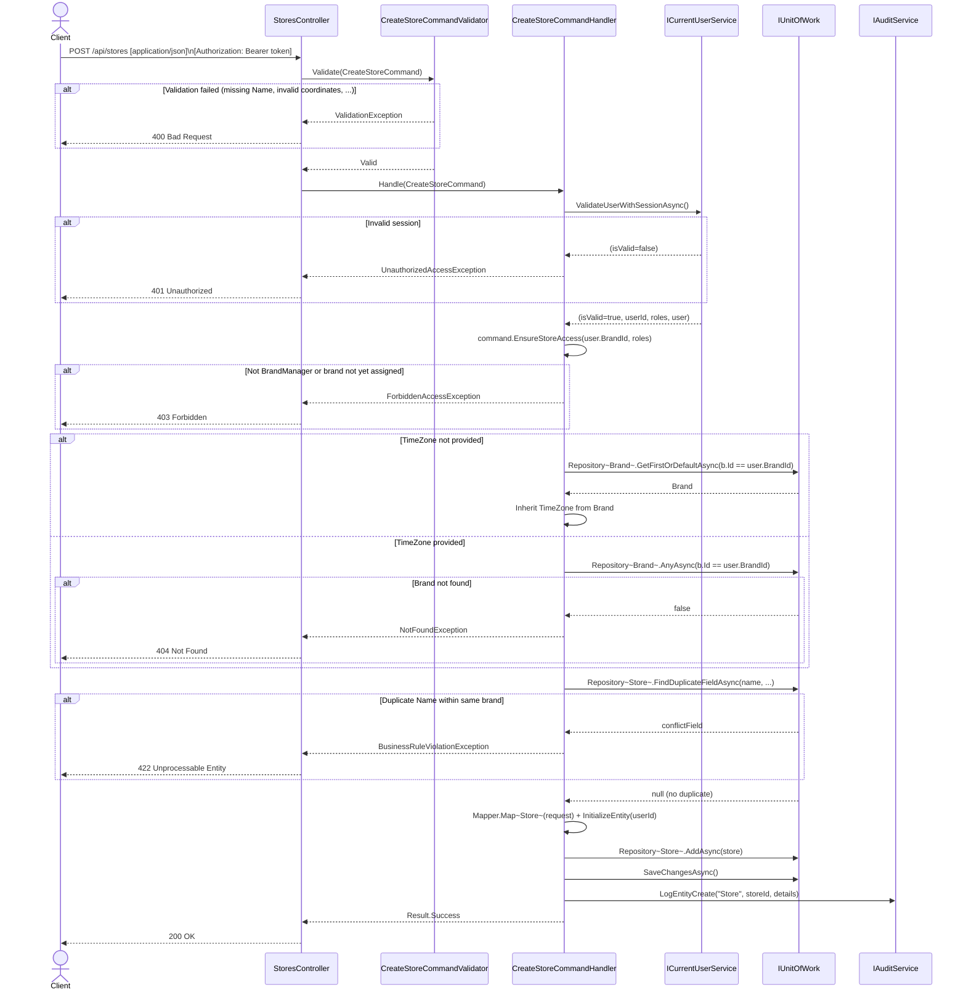
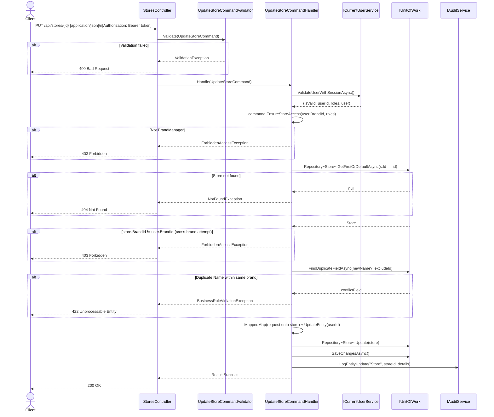
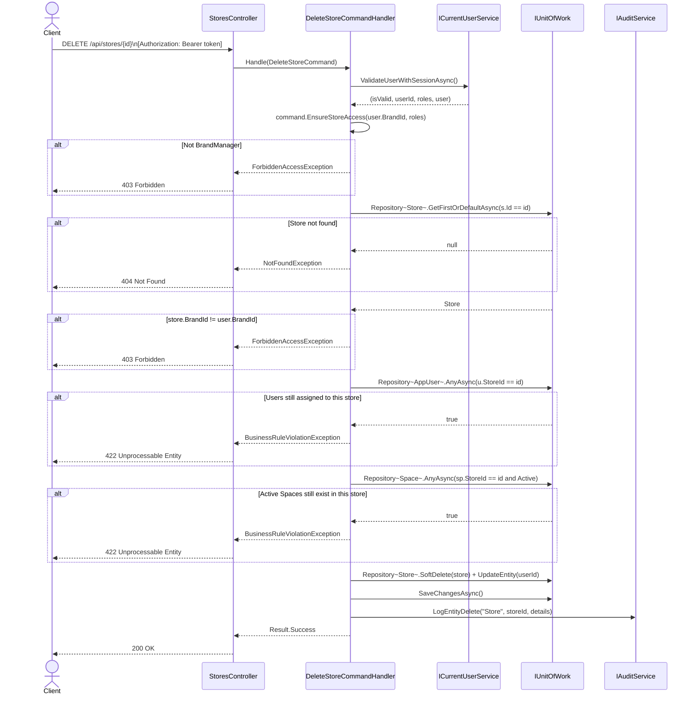

# 3.6 Store Management – Software Design

> **Screens:** #13 Store Mgmt List · #14 Create/Edit Store · #15 Store Detail  
> **Roles:** BrandManager (all write ops, own brand) · SystemAdmin (read-only) · StoreManager (read own store)  
> **Endpoints:** `GET /api/stores` · `GET /api/stores/{id}` · `POST /api/stores` · `PUT /api/stores/{id}` · `DELETE /api/stores/{id}` · `PUT /api/stores/{id}/toggle-status`

---

## 3.6.1 Class Diagram – Query Side (Read)

> Nhóm này gồm `GetStoresQueryHandler` và `GetStoreByIdQueryHandler`. Cả hai đều implement `IRequestHandler<TQuery, TResult>` từ MediatR (NuGet), không thể hiện trong diagram.

---

## 3.6.2 Class Diagram – Command Side (Write)

```mermaid
classDiagram
    class StoresController {
        -IMediator _mediator
        +CreateStore(StoreRequest request) Task~IActionResult~
        +UpdateStore(Guid id, StoreRequest request) Task~IActionResult~
        +DeleteStore(Guid id) Task~IActionResult~
        +ToggleStoreStatus(Guid id) Task~IActionResult~
    }

    class StoreRequest {
        +string? Name
        +string? Address
        +string? City
        +string? District
        +string? ContactNumber
        +float? Latitude
        +float? Longitude
        +string? MapUrl
        +string? TimeZone
        +float? AreaSquareMeters
        +int? MaxCapacity
    }

    class CreateStoreCommand {
        +StoreRequest Request
        +GetActionType() UserActionEnum
    }

    class UpdateStoreCommand {
        +Guid Id
        +StoreRequest Request
        +GetActionType() UserActionEnum
    }

    class DeleteStoreCommand {
        +Guid Id
        +GetActionType() UserActionEnum
    }

    class ToggleStoreStatusCommand {
        +Guid Id
        +GetActionType() UserActionEnum
    }

    class IStoreRequest {
        <<interface>>
        +GetActionType() UserActionEnum
    }

    class CreateStoreCommandValidator {
        #ILocalizationService LocalizationService
        +Validate(CreateStoreCommand) ValidationResult
    }

    class UpdateStoreCommandValidator {
        #ILocalizationService LocalizationService
        +Validate(UpdateStoreCommand) ValidationResult
    }

    class CreateStoreCommandHandler {
        -IUnitOfWork _unitOfWork
        -IMapper _mapper
        -ICurrentUserService _currentUserService
        -ILocalizationService _localizationService
        -IAuditService _auditService
        +Handle(CreateStoreCommand, CancellationToken) Task~Result~
    }

    class UpdateStoreCommandHandler {
        -IUnitOfWork _unitOfWork
        -IMapper _mapper
        -ICurrentUserService _currentUserService
        -ILocalizationService _localizationService
        -IAuditService _auditService
        -ILogger _logger
        +Handle(UpdateStoreCommand, CancellationToken) Task~Result~
    }

    class DeleteStoreCommandHandler {
        -IUnitOfWork _unitOfWork
        -ICurrentUserService _currentUserService
        -ILocalizationService _localizationService
        -IAuditService _auditService
        +Handle(DeleteStoreCommand, CancellationToken) Task~Result~
    }

    class ToggleStoreStatusCommandHandler {
        -IUnitOfWork _unitOfWork
        -ICurrentUserService _currentUserService
        -ILocalizationService _localizationService
        -IAuditService _auditService
        +Handle(ToggleStoreStatusCommand, CancellationToken) Task~Result~
    }

    class IAuditService {
        <<interface>>
        +LogEntityCreate(string, string, object, bool, Guid?, string, string) void
        +LogEntityUpdate(string, string, object, bool, Guid?, string, string) void
        +LogEntityDelete(string, string, object, bool, Guid?, string, string) void
        +LogEntityToggleStatus(string, string, object, bool, Guid?, string, string) void
    }

    class ICurrentUserService {
        <<interface>>
        +ValidateUserWithSessionAsync() Task~(bool, Guid?, IList, AppUser)~
        +IpAddress string
        +UserAgent string
    }

    class IUnitOfWork {
        <<interface>>
        +Repository~T~() IGenericRepository~T~
        +SaveChangesAsync(CancellationToken) Task~int~
    }

    StoresController --> CreateStoreCommand : creates
    StoresController --> UpdateStoreCommand : creates
    StoresController --> DeleteStoreCommand : creates
    StoresController --> ToggleStoreStatusCommand : creates
    StoresController ..> CreateStoreCommandHandler : sends via Mediator
    StoresController ..> UpdateStoreCommandHandler : sends via Mediator
    StoresController ..> DeleteStoreCommandHandler : sends via Mediator
    StoresController ..> ToggleStoreStatusCommandHandler : sends via Mediator
    CreateStoreCommand ..|> IStoreRequest : implements
    UpdateStoreCommand ..|> IStoreRequest : implements
    DeleteStoreCommand ..|> IStoreRequest : implements
    ToggleStoreStatusCommand ..|> IStoreRequest : implements
    CreateStoreCommand --> StoreRequest : contains
    UpdateStoreCommand --> StoreRequest : contains
    CreateStoreCommandValidator ..> CreateStoreCommand : validates
    UpdateStoreCommandValidator ..> UpdateStoreCommand : validates
    CreateStoreCommandHandler --> ICurrentUserService : uses
    CreateStoreCommandHandler --> IUnitOfWork : uses
    CreateStoreCommandHandler --> IAuditService : uses
    UpdateStoreCommandHandler --> ICurrentUserService : uses
    UpdateStoreCommandHandler --> IUnitOfWork : uses
    UpdateStoreCommandHandler --> IAuditService : uses
    DeleteStoreCommandHandler --> ICurrentUserService : uses
    DeleteStoreCommandHandler --> IUnitOfWork : uses
    DeleteStoreCommandHandler --> IAuditService : uses
    ToggleStoreStatusCommandHandler --> ICurrentUserService : uses
    ToggleStoreStatusCommandHandler --> IUnitOfWork : uses
    ToggleStoreStatusCommandHandler --> IAuditService : uses
```

> Nhóm này gồm `CreateStoreCommandHandler`, `UpdateStoreCommandHandler`, `DeleteStoreCommandHandler`, `ToggleStoreStatusCommandHandler`. Tất cả implement `IRequestHandler<TCommand, Result>` từ MediatR (NuGet), không thể hiện trong diagram.

---

## 3.6.3 Sequence Diagram – Get Stores List

---

## 3.6.4 Sequence Diagram – Get Store By ID

> Đáng vẽ riêng vì có 3 role paths khác nhau trong ownership check.

---

## 3.6.5 Sequence Diagram – Create Store

---

## 3.6.6 Sequence Diagram – Update Store

---

## 3.6.7 Sequence Diagram – Delete Store

