# 3.9 Track Management - Software Design

> **Screens:** CMS Track List · Create/Edit Track · Track Detail  
> **Roles:**
>
> - Read (`GetTracks`, `GetTrackById`): `SystemAdmin` · `BrandManager` · `StoreManager`
> - Write (`Create/Update/Delete/ToggleStatus`): **`BrandManager` only**
>   **Endpoints:** `GET /api/tracks` · `GET /api/tracks/{id}` · `POST /api/tracks` · `PUT /api/tracks/{id}` · `DELETE /api/tracks/{id}` · `PUT /api/tracks/{id}/toggle-status`

---

## 3.9.1 Class Diagram - Query Side (Read)

> `GetTracksQueryHandler` and `GetTrackByIdQueryHandler` implement `IRequestHandler<,>` (MediatR) - hidden for readability.  
> Read access is validated via `EnsureTrackAccess(...)`; for `BrandManager/StoreManager`, handler forces brand scope by setting `filter.BrandId = user.BrandId`.

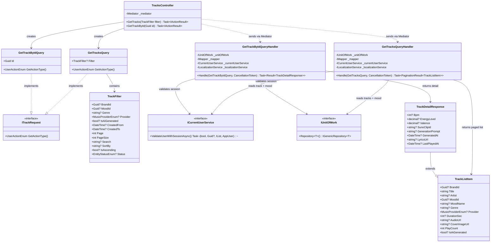

---

## 3.9.2 Class Diagram - Command Side (Write)

> Write authorization rule in `EnsureTrackAccess(...)`: only `BrandManager` with `BrandId`.  
> `TrackRequest` is shared for Create/Update; validator switches behavior with `isPartialUpdate`.

### Part A - Commands, DTOs, Validators

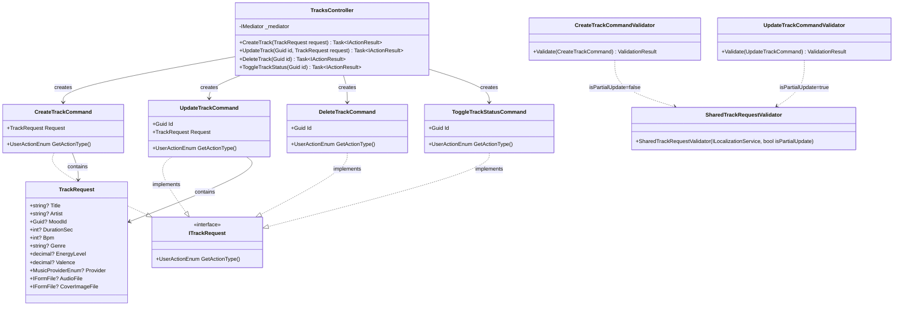

### Part B - Handler Dependencies

```mermaid
classDiagram
    class CreateTrackCommandHandler {
        -IUnitOfWork _unitOfWork
        -IMapper _mapper
        -ICurrentUserService _currentUserService
        -ILocalizationService _localizationService
        -IAuditService _auditService
        -IBackgroundFileOperationService _fileOperationService
        +Handle(CreateTrackCommand, CancellationToken) Task~Result~
    }

    class UpdateTrackCommandHandler {
        -IUnitOfWork _unitOfWork
        -IMapper _mapper
        -ICurrentUserService _currentUserService
        -ILocalizationService _localizationService
        -IAuditService _auditService
        -IBackgroundFileOperationService _fileOperationService
        +Handle(UpdateTrackCommand, CancellationToken) Task~Result~
    }

    class DeleteTrackCommandHandler {
        -IUnitOfWork _unitOfWork
        -ICurrentUserService _currentUserService
        -ILocalizationService _localizationService
        -IAuditService _auditService
        -IBackgroundFileOperationService _fileOperationService
        +Handle(DeleteTrackCommand, CancellationToken) Task~Result~
    }

    class ToggleTrackStatusCommandHandler {
        -IUnitOfWork _unitOfWork
        -ICurrentUserService _currentUserService
        -ILocalizationService _localizationService
        -IAuditService _auditService
        +Handle(ToggleTrackStatusCommand, CancellationToken) Task~Result~
    }

    class IBackgroundFileOperationService {
        <<interface>>
        +UploadFileAsync(IFormFile, string, CancellationToken) Task~string~
        +DeleteFileInBackground(string?) void
    }

    class IAuditService {
        <<interface>>
        +LogEntityCreate(...) void
        +LogEntityUpdate(...) void
        +LogEntityDelete(...) void
        +LogEntityToggleStatus(...) void
    }

    CreateTrackCommandHandler --> IBackgroundFileOperationService : upload + cleanup
    CreateTrackCommandHandler --> IAuditService : audit create

    UpdateTrackCommandHandler --> IBackgroundFileOperationService : replace + cleanup
    UpdateTrackCommandHandler --> IAuditService : audit update

    DeleteTrackCommandHandler --> IBackgroundFileOperationService : delete files after commit
    DeleteTrackCommandHandler --> IAuditService : audit delete

    ToggleTrackStatusCommandHandler --> IAuditService : audit toggle
```

---

## 3.9.3 Sequence Diagram - Get Tracks List

> Read allowed for `SystemAdmin`, `BrandManager`, `StoreManager`.  
> If caller is BM/SM, handler enforces brand boundary via `filter.BrandId = user.BrandId`.

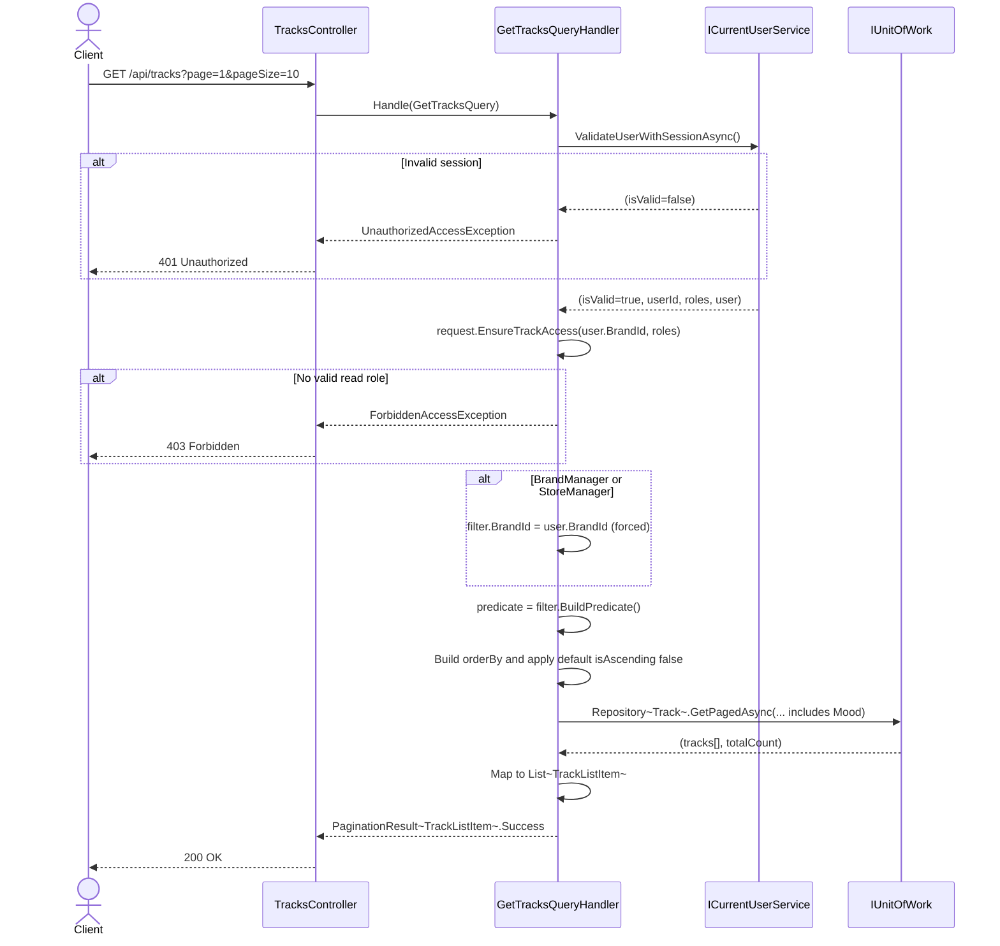

---

## 3.9.4 Sequence Diagram - Get Track By Id

> Track is loaded with `Mood` include.  
> BM/SM must satisfy ownership check: `track.BrandId == user.BrandId`; SA can read all.

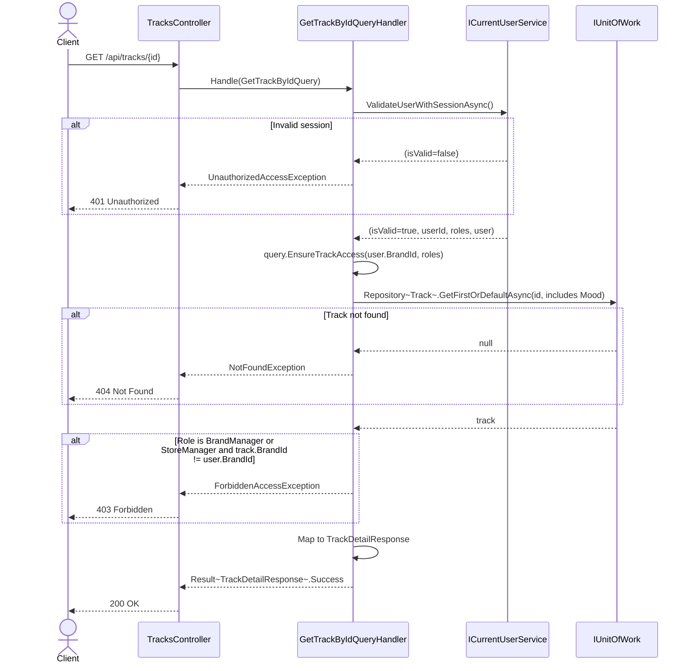

---

## 3.9.5 Sequence Diagram - Create Track (Manual Upload)

> Write action is `BrandManager` only.  
> Audio/Cover upload failures are **non-fatal**; DB failure triggers background cleanup for newly uploaded files.

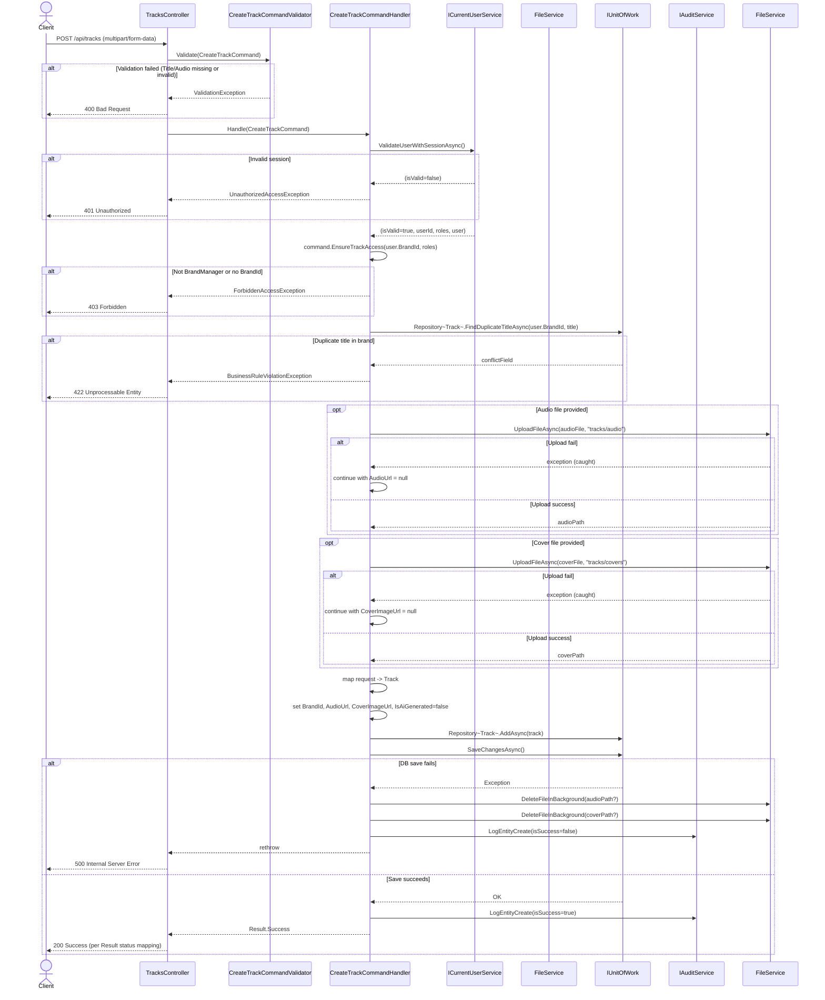

---

## 3.9.6 Sequence Diagram - Update Track

> `BrandManager` only + ownership check on existing entity.  
> New files are uploaded first; old files are deleted only **after successful DB commit**.

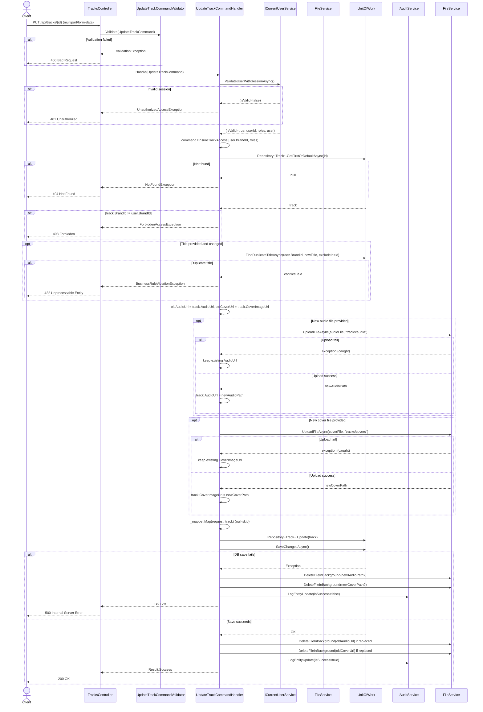

---

## 3.9.7 Sequence Diagram - Delete Track

> Soft-delete only.  
> Track cannot be deleted when referenced by any playlist (`PlaylistTracks.Count > 0`).

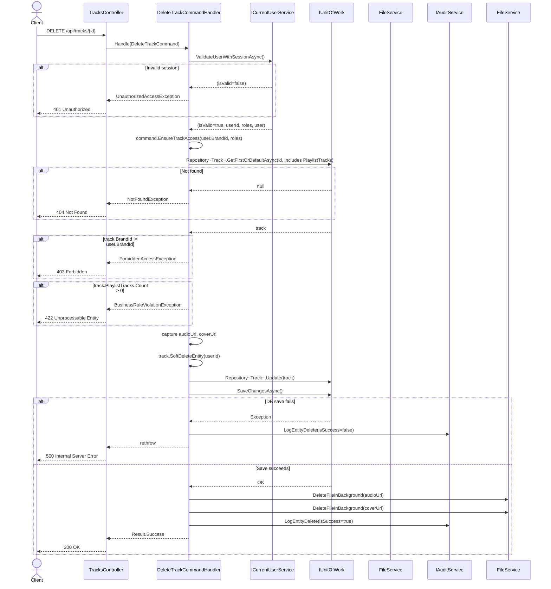

---

## 3.9.8 Sequence Diagram - Toggle Track Status

> `BrandManager` only.  
> Status transition is binary: `Active <-> Inactive`; previous status is captured for audit.

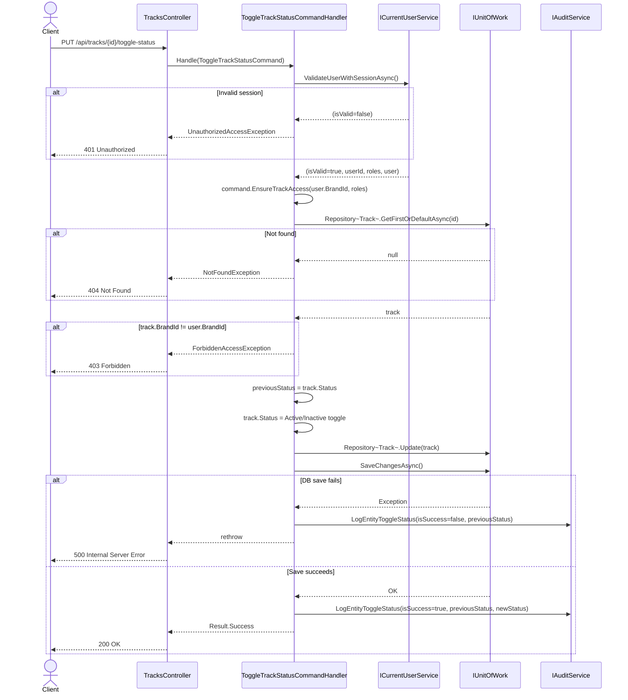

---

## 3.9.9 Notes for Implementation Accuracy

1. `StoreManager` is strictly read-only for Track module (query endpoints only).
2. Query handlers include `Mood` navigation to populate `MoodName` in DTO mapping.
3. `TrackRequest -> Track` AutoMapper profile uses null-skip (`ForAllMembers`) to support partial update semantics.
4. File URL values in response are converted by `FilePathUrlConverter` from stored path to accessible URL.
5. `DeleteTrack` executes business rule before soft-delete: any playlist reference blocks deletion.
6. File cleanup strategy is asymmetric by design:
   - Create: uploaded files are deleted only when DB commit fails.
   - Update: newly uploaded files are deleted when DB commit fails; old files are deleted only after successful commit.
   - Delete: files are deleted only after successful soft-delete commit.

---

## 3.9.10 Data Flow Diagram — Context (Level 0)

> Shows the Track Management system as a single boundary. External entities send/receive data; internal process decomposition is in Level 1.

**Notation:**

- **Rectangle `[ ]`** — External Entity (actor or external system)
- **Rounded rectangle `( )`** — Process / System
- **Cylinder `[( )]`** — Data Store
- **Arrow `-->|label|`** — Named data flow

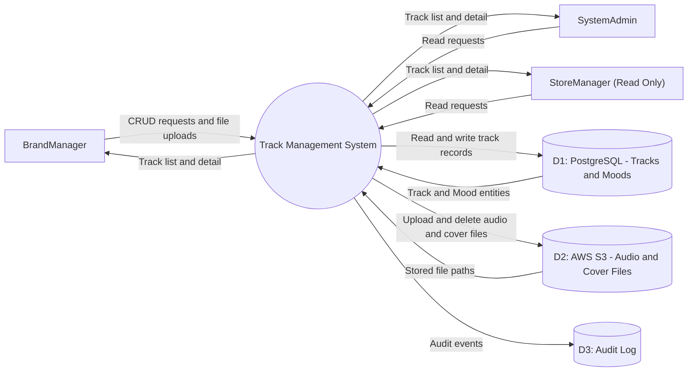

---

## 3.9.11 Data Flow Diagram — Level 1

> Decomposes the Track Management system into five core processes. Each process corresponds to one or more command/query handlers in `LogAICAMS.Application.Features.Tracks`.

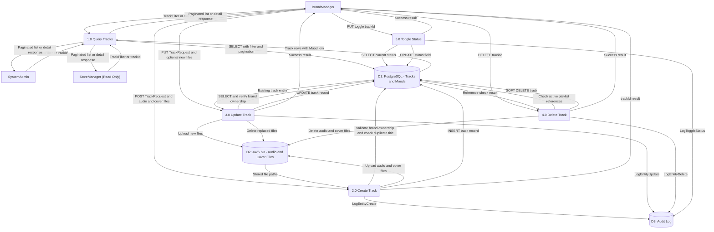
