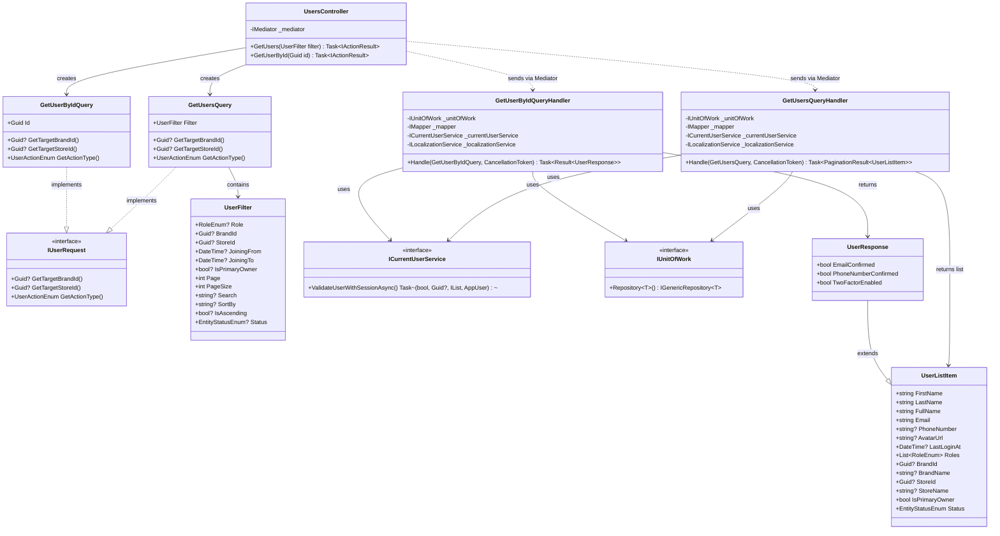
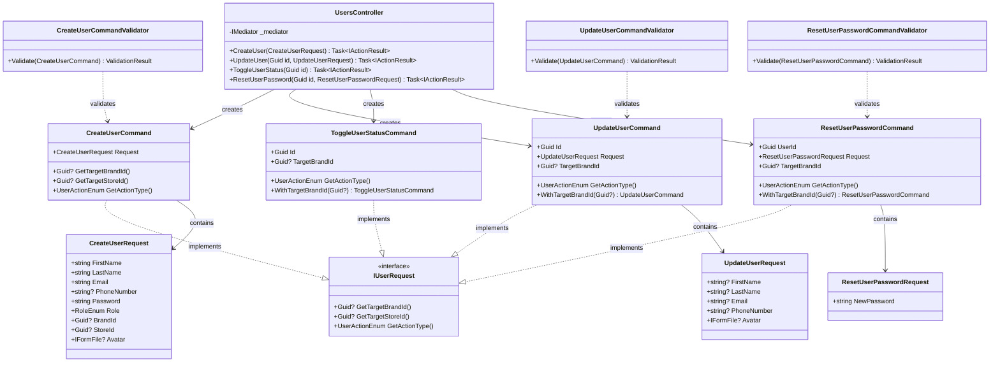
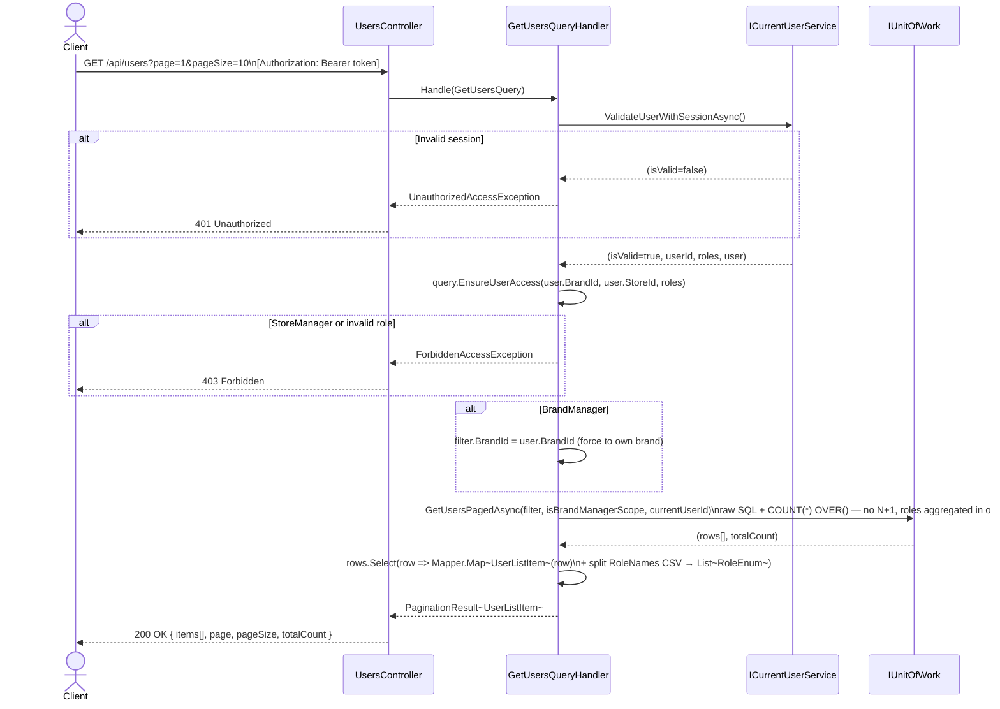
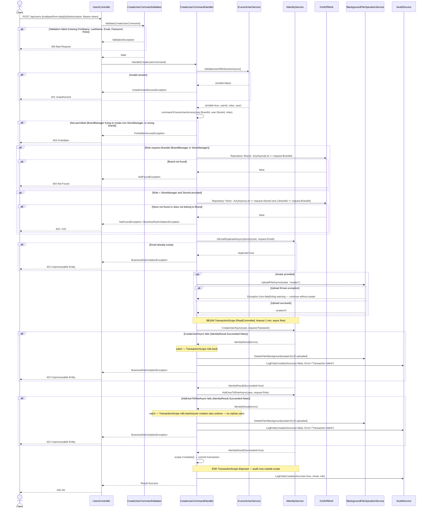
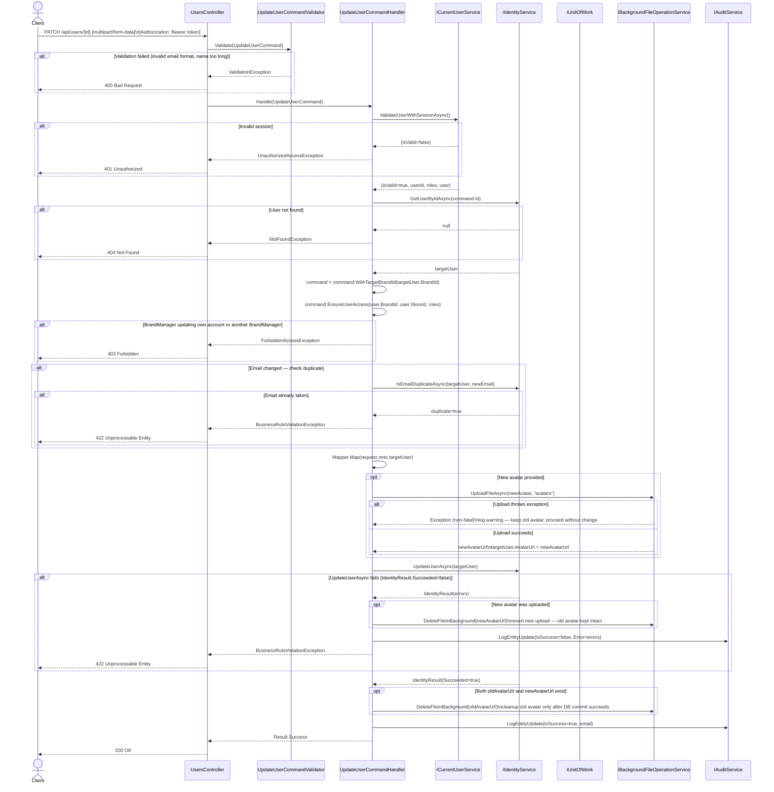
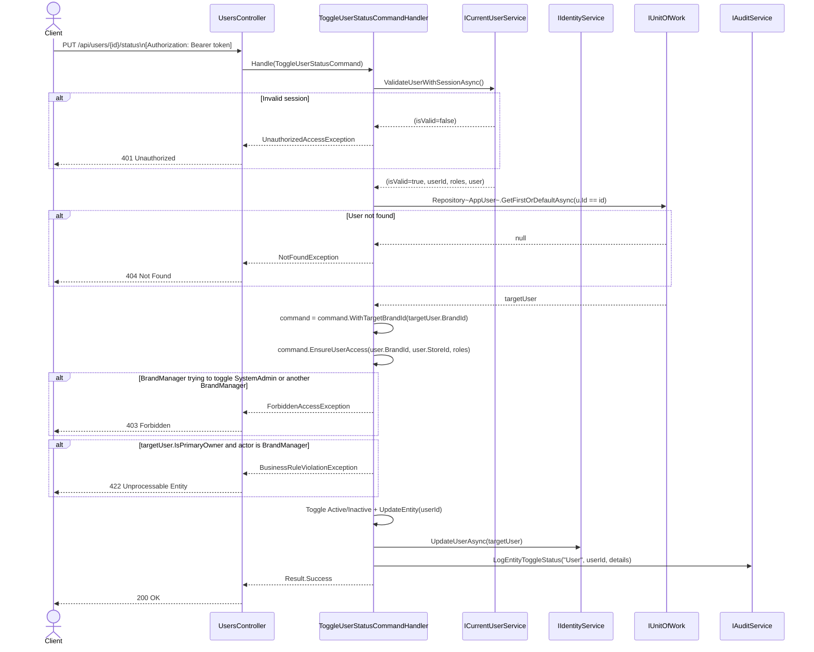
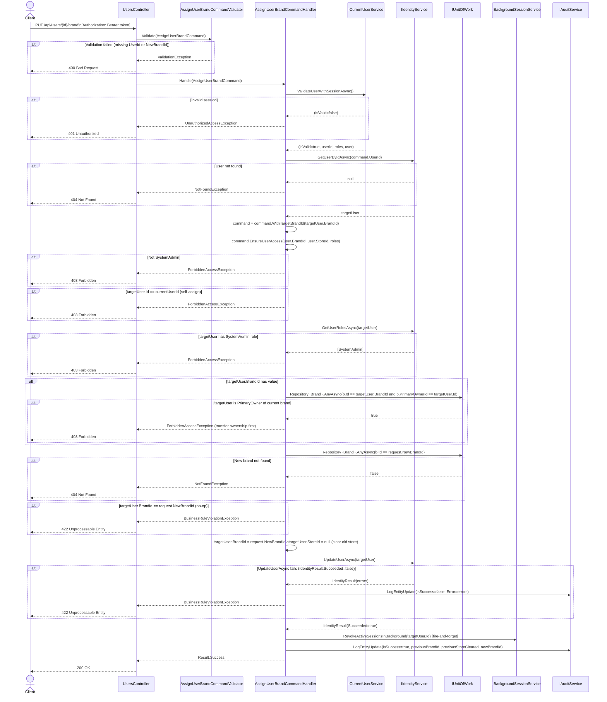
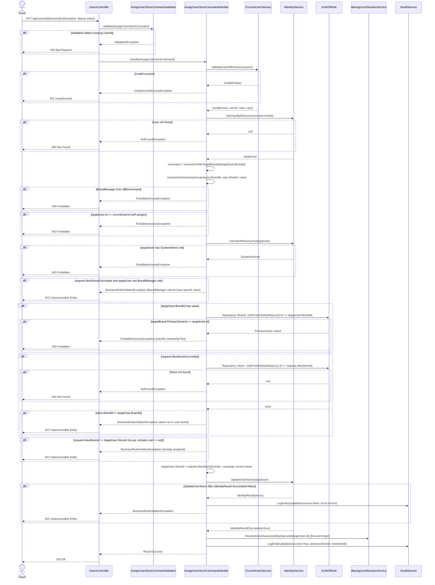

# 3.7 User Management – Software Design

> **Screens:** #16 User Mgmt List · #17 Create/Edit User · #18 User Detail  
> **Roles:** SystemAdmin (full access) · BrandManager (scoped to own brand, limited write) · StoreManager (no access — use `/api/auth/profile`)  
> **Endpoints:** `GET /api/users` · `GET /api/users/{id}` · `POST /api/users` · `PATCH /api/users/{id}` · `PUT /api/users/{id}/status` · `PUT /api/users/{id}/reset-password` · `PUT /api/users/{id}/brand` · `PUT /api/users/{id}/store`

---

## 3.7.1 Class Diagram – Query Side (Read)

> `GetUsersQueryHandler` and `GetUserByIdQueryHandler` both implement `IRequestHandler<TQuery, TResult>` from MediatR (NuGet) — not shown in diagram.

---

## 3.7.2 Class Diagram – Command Side (Write)

> All handlers implement `IRequestHandler<TCommand, Result>` from MediatR (NuGet) — not shown.  
> **`WithTargetBrandId()` pattern:** Update/Toggle/ResetPassword handlers first load the target user from DB, enrich the command with the target's `BrandId`, then call `EnsureUserAccess()` — so authorization is always evaluated against the target user's actual brand.  
> Diagram is split into two parts for readability: **Part A** covers commands, DTOs and validators; **Part B** covers handler dependencies.

### Part A – Commands, DTOs & Validators

### Part B – Handler Dependencies

```mermaid
classDiagram
    class CreateUserCommandHandler {
        -IIdentityService _identityService
        -ICurrentUserService _currentUserService
        -IUnitOfWork _unitOfWork
        -IMapper _mapper
        -IAuditService _auditService
        -IBackgroundFileOperationService _fileOperationService
        +Handle(CreateUserCommand, CancellationToken) Task~Result~
    }

    class UpdateUserCommandHandler {
        -IIdentityService _identityService
        -ICurrentUserService _currentUserService
        -IUnitOfWork _unitOfWork
        -IMapper _mapper
        -IAuditService _auditService
        -IBackgroundFileOperationService _fileOperationService
        +Handle(UpdateUserCommand, CancellationToken) Task~Result~
    }

    class ToggleUserStatusCommandHandler {
        -IIdentityService _identityService
        -ICurrentUserService _currentUserService
        -IUnitOfWork _unitOfWork
        -IAuditService _auditService
        +Handle(ToggleUserStatusCommand, CancellationToken) Task~Result~
    }

    class ResetUserPasswordCommandHandler {
        -IIdentityService _identityService
        -ICurrentUserService _currentUserService
        -IUnitOfWork _unitOfWork
        -IAuditService _auditService
        +Handle(ResetUserPasswordCommand, CancellationToken) Task~Result~
    }

    class IIdentityService {
        <<interface>>
        +CreateUserAsync(AppUser, string) Task~IdentityResult~
        +AddToRoleAsync(AppUser, string) Task~IdentityResult~
        +UpdateUserAsync(AppUser) Task~IdentityResult~
        +ResetPasswordAsync(AppUser, string, string) Task~IdentityResult~
        +GeneratePasswordResetTokenAsync(AppUser) Task~string~
    }

    class ICurrentUserService {
        <<interface>>
        +ValidateUserWithSessionAsync() Task~(bool, Guid?, IList, AppUser)~
    }

    class IUnitOfWork {
        <<interface>>
        +Repository~T~() IGenericRepository~T~
        +SaveChangesAsync(CancellationToken) Task~int~
    }

    class IBackgroundFileOperationService {
        <<interface>>
        +QueueAvatarUpload(Guid, IFormFile) void
        +QueueOldAvatarDelete(string) void
    }

    class IAuditService {
        <<interface>>
        +LogEntityCreate(string, string, object, bool, Guid?, string, string) void
        +LogEntityUpdate(string, string, object, bool, Guid?, string, string) void
        +LogEntityToggleStatus(string, string, object, bool, Guid?, string, string) void
    }

    CreateUserCommandHandler --> IIdentityService : uses
    CreateUserCommandHandler --> ICurrentUserService : uses
    CreateUserCommandHandler --> IUnitOfWork : uses
    CreateUserCommandHandler --> IBackgroundFileOperationService : uses
    CreateUserCommandHandler --> IAuditService : uses
    UpdateUserCommandHandler --> IIdentityService : uses
    UpdateUserCommandHandler --> ICurrentUserService : uses
    UpdateUserCommandHandler --> IUnitOfWork : uses
    UpdateUserCommandHandler --> IBackgroundFileOperationService : uses
    UpdateUserCommandHandler --> IAuditService : uses
    ToggleUserStatusCommandHandler --> IIdentityService : uses
    ToggleUserStatusCommandHandler --> ICurrentUserService : uses
    ToggleUserStatusCommandHandler --> IUnitOfWork : uses
    ToggleUserStatusCommandHandler --> IAuditService : uses
    ResetUserPasswordCommandHandler --> IIdentityService : uses
    ResetUserPasswordCommandHandler --> ICurrentUserService : uses
    ResetUserPasswordCommandHandler --> IUnitOfWork : uses
    ResetUserPasswordCommandHandler --> IAuditService : uses
```

---

## 3.7.3 Class Diagram – Special Operations (Assign Brand / Assign Store)

> `AssignUserBrandCommandHandler` and `AssignUserStoreCommandHandler` implement `IRequestHandler<TCommand, Result>` from MediatR (NuGet) — not shown.  
> Both handlers revoke all active sessions of the target user after a successful assignment (`IBackgroundSessionService`).

```mermaid
classDiagram
    class UsersController {
        -IMediator _mediator
        +AssignUserBrand(Guid id, AssignUserBrandRequest request) Task~IActionResult~
        +AssignUserStore(Guid id, AssignUserStoreRequest request) Task~IActionResult~
    }

    class AssignUserBrandRequest {
        +Guid NewBrandId
    }

    class AssignUserStoreRequest {
        +Guid? NewStoreId
    }

    class AssignUserBrandCommand {
        +Guid UserId
        +AssignUserBrandRequest Request
        +Guid? TargetBrandId
        +UserActionEnum GetActionType()
        +WithTargetBrandId(Guid?) AssignUserBrandCommand
    }

    class AssignUserStoreCommand {
        +Guid UserId
        +AssignUserStoreRequest Request
        +Guid? TargetBrandId
        +UserActionEnum GetActionType()
        +WithTargetBrandId(Guid?) AssignUserStoreCommand
    }

    class IUserRequest {
        <<interface>>
        +Guid? GetTargetBrandId()
        +Guid? GetTargetStoreId()
        +UserActionEnum GetActionType()
    }

    class AssignUserBrandCommandValidator {
        +Validate(AssignUserBrandCommand) ValidationResult
    }

    class AssignUserStoreCommandValidator {
        +Validate(AssignUserStoreCommand) ValidationResult
    }

    class AssignUserBrandCommandHandler {
        -IIdentityService _identityService
        -ICurrentUserService _currentUserService
        -IUnitOfWork _unitOfWork
        -ILocalizationService _localizationService
        -IAuditService _auditService
        -IBackgroundSessionService _sessionService
        -ILogger _logger
        +Handle(AssignUserBrandCommand, CancellationToken) Task~Result~
    }

    class AssignUserStoreCommandHandler {
        -IIdentityService _identityService
        -ICurrentUserService _currentUserService
        -IUnitOfWork _unitOfWork
        -ILocalizationService _localizationService
        -IAuditService _auditService
        -IBackgroundSessionService _sessionService
        -ILogger _logger
        +Handle(AssignUserStoreCommand, CancellationToken) Task~Result~
    }

    class IIdentityService {
        <<interface>>
        +UpdateUserAsync(AppUser) Task~IdentityResult~
    }

    class IBackgroundSessionService {
        <<interface>>
        +RevokeAllSessionsAsync(Guid userId) Task
    }

    class IAuditService {
        <<interface>>
        +LogEntityUpdate(string, string, object, bool, Guid?, string, string) void
    }

    UsersController --> AssignUserBrandCommand : creates
    UsersController --> AssignUserStoreCommand : creates
    UsersController ..> AssignUserBrandCommandHandler : sends via Mediator
    UsersController ..> AssignUserStoreCommandHandler : sends via Mediator
    AssignUserBrandCommand ..|> IUserRequest : implements
    AssignUserStoreCommand ..|> IUserRequest : implements
    AssignUserBrandCommand --> AssignUserBrandRequest : contains
    AssignUserStoreCommand --> AssignUserStoreRequest : contains
    AssignUserBrandCommandValidator ..> AssignUserBrandCommand : validates
    AssignUserStoreCommandValidator ..> AssignUserStoreCommand : validates
    AssignUserBrandCommandHandler --> IIdentityService : uses
    AssignUserBrandCommandHandler --> ICurrentUserService : uses
    AssignUserBrandCommandHandler --> IBackgroundSessionService : uses
    AssignUserBrandCommandHandler --> IAuditService : uses
    AssignUserStoreCommandHandler --> IIdentityService : uses
    AssignUserStoreCommandHandler --> ICurrentUserService : uses
    AssignUserStoreCommandHandler --> IBackgroundSessionService : uses
    AssignUserStoreCommandHandler --> IAuditService : uses
```

---

## 3.7.4 Sequence Diagram – Get Users List

---

## 3.7.5 Sequence Diagram – Create User

> Content-Type: `multipart/form-data` (avatar is optional `IFormFile`).  
> User identity is managed via `IIdentityService` (ASP.NET Identity), not directly through `IUnitOfWork`.  
> `CreateUserAsync` + `AddUserToRoleAsync` are wrapped in a **`TransactionScope` (ReadCommitted, async flow)** — if either fails the entire transaction rolls back (no orphan user).

---

## 3.7.6 Sequence Diagram – Update User

> Content-Type: `multipart/form-data` (avatar replacement is optional).  
> Uses `WithTargetBrandId()` pattern — authorization is evaluated against the target user's actual brand.  
> No `TransactionScope` — single `UpdateUserAsync` call. If it fails, the newly uploaded avatar is deleted immediately to prevent orphaned files.

---

## 3.7.7 Sequence Diagram – Toggle User Status

> Uses `WithTargetBrandId()` pattern. Guards: cannot toggle SystemAdmin or PrimaryOwner (by BrandManager). Sessions are revoked when user is deactivated.

---

## 3.7.8 Sequence Diagram – Assign User Brand

> **SystemAdmin only.** Changing brand clears the old store assignment. All active sessions of the target user are revoked in the background after the change.  
> Guards: cannot reassign self, cannot reassign a SystemAdmin account, cannot reassign a PrimaryOwner (transfer ownership first), no-op if already in the same brand.

---

## 3.7.9 Sequence Diagram – Assign User Store

> **SystemAdmin and BrandManager.** Assigns or unassigns a store from a user. Pass `null` for `NewStoreId` to remove the current assignment.  
> Guards: cannot reassign self, cannot modify SystemAdmin, BrandManager role cannot have a specific store, cannot reassign PrimaryOwner, store must belong to the same brand as target user, no-op if same store already assigned (including `null == null`).

